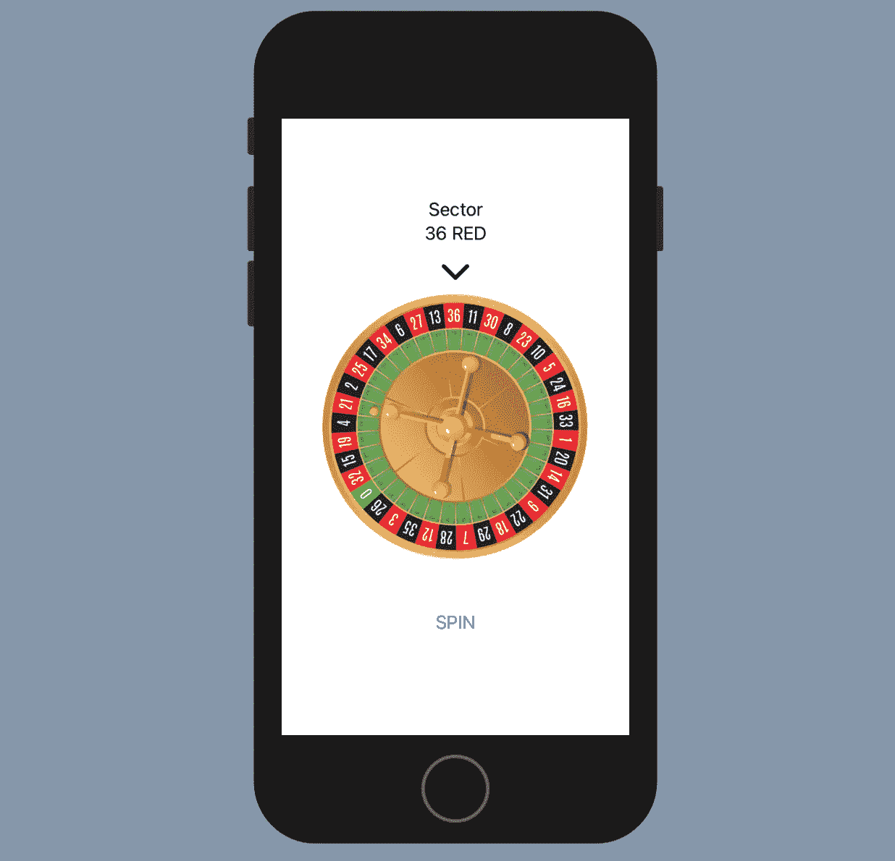

# 在 SwiftUI 中创建轮盘赌

> 原文：<https://medium.com/geekculture/creating-a-roulette-in-swiftui-5babb75bac65?source=collection_archive---------1----------------------->

在本文中，我们将在 SwiftUI 中创建一个欧洲轮盘赌。在这个过程中，我们将学习动画，结构，枚举和状态变量。

正如维基百科所说:

> “轮盘赌是一种赌场游戏，以法语单词命名，意思是小轮子。在游戏中，玩家可以选择对单个数字、各种数字组合、红色或黑色、是否…