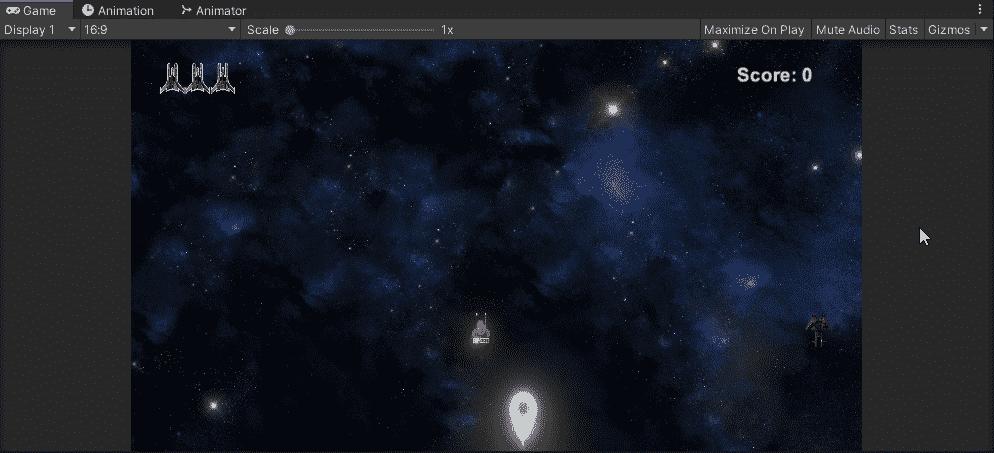
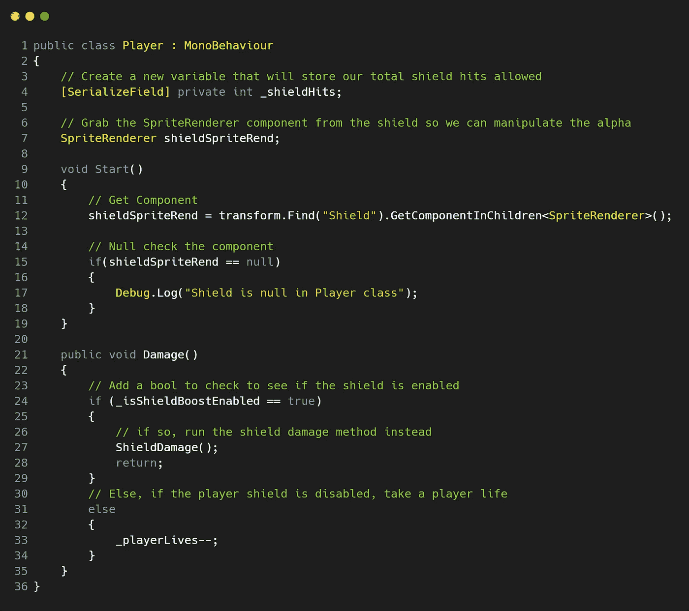
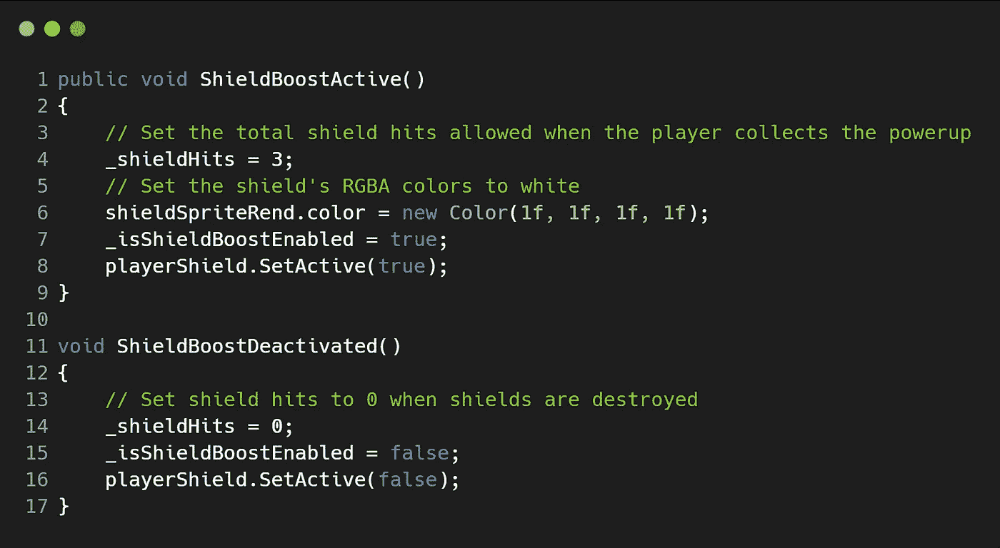
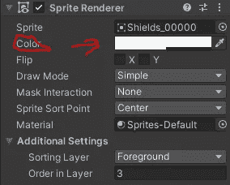
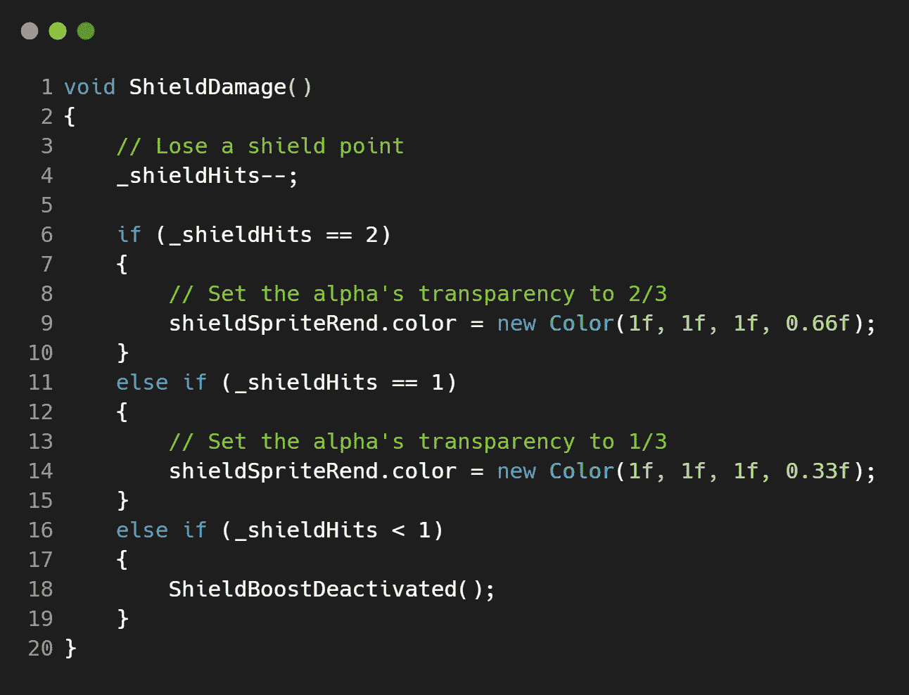

# 在 Unity 中使用精灵的 Alpha 颜色创建护盾伤害特征——第一部分(设置 RGBA 值)！

> 原文：<https://medium.com/geekculture/creating-a-shield-damage-feature-using-the-alpha-color-of-a-sprite-in-unity-part-01-setting-the-eab880e23928?source=collection_archive---------43----------------------->

**目标**:使用 **Unity** 中精灵图像的 alpha **颜色**，在我们的 **2D 银河射击游戏**中构建一个**护盾伤害**特征！

在我们开始之前，我将向你展示两种不同的方法来调整或操作精灵图像的 alpha 颜色。这第一篇文章将处理设置**颜色的** **RGBA** 值。第二个是如何改变 alpha 属性' **color.a'** ，因为这个值不能直接改变。

随着我们的 **2D 银河射击游戏**接近尾声，我们有一些新功能需要实现，然后才能结束今天的工作。这一次，我们将创建一个**护盾伤害**系统，玩家能够在**护盾**被**摧毁**之前**护盾被激活**时受到 **3** 的伤害。目前我们只设置了接受 **1** 的攻击，这并不太有效，因为敌人现在有 **2** 激光可以射击，如果他们都击中了玩家，那么就会从他们身上取走**1**盾和**1**玩家生命。让我们给玩家一个机会吧！

## 让我们添加一些代码！

由于我们的' ***玩家*** '脚本已经内置了**伤害()**方法，让我们在这里继续工作:

首先我们需要创建一个变量来存储我们的**盾**被允许击中多少次。

我们还需要来自**盾牌**游戏对象的 **SpriteRenderer** 组件，所以不要忘了 **GetComponent** 这个，最后，让我们确保空检查我们成功地从**盾牌**游戏对象抓取了这个组件。由于我的**盾**游戏对象在运行时被停用，我无法使用**游戏对象。Find()** 方法，因为它只在场景中搜索活动的游戏对象。然而，**变换。Find("Shield")** 会成功找到这个游戏对象，而不需要激活它，然后由于**盾牌**是**玩家**游戏对象(**父**)的**子**，我们就可以**GetComponentInChildren<>()**为**精灵渲染者**！

最后，在我们的**伤害()**方法中，让我们先检查一下**玩家的护盾**是否被激活。如果是，让我们运行 **ShieldDamage()** 方法，而不是取一个**玩家的**生命。

现在，让我们向现有的 **ShieldBoostActive()** 方法添加一些代码，该方法将在我们收集加电时将我们的 **_shieldHits** 设置为 **3** ，并且让我们将我们的**玩家的盾** **颜色**值设置为白色( **1f，1f，1f，1f** )。这保留了精灵图像的颜色，因为这是它通常会显示如下:

现在让我们创建一个**ShieldBoostDeactivated()**方法，当 **shields** 电荷为 **0** 时，该方法被调用。这将简单地将 **_isShieldBoostEnabled** 切换到 **false** 并关闭**盾**游戏对象。

最后，我们需要创建我们的 **ShieldDamage()** 方法，该方法将在**盾**被激活并发生碰撞时运行:

此方法仅在使用第一幅图所示的 **Damage()** 方法将 **_isShieldBoostEnabled** 设置为 true 时运行。也就是说，在这个方法中，我们的**屏蔽**电荷永远不会是 **3** ，因为我们在 **ShieldBoostActive()** 方法中将电荷设置为 **3** ，并且还将 alpha 设置为 **1** (其最大值)。因此，我们不需要为 **_shieldHits** 为 **3** 的 if 语句，因为当方法运行时，它总是为 **2** 或更少。

当我们的 **_shieldHits** 为 **2** 时，让我们将精灵 alpha 设置为其最大值的**2/3**(**0.66 f**)。然后，当 **_shieldHits** 为 **1** 时，将其设置为其最大值的**1/3**(**0.33 f**)。最后，当我们的**_ 盾击数**小于 **1** 或 **0** 时，让我们运行**ShieldBoostDeactivated()**方法来关闭**盾**，现在**玩家**可以开始再次受到伤害并移除生命。

**注意:***alpha 的范围在* ***0*** *(完全透明)和* ***1*** *(不透明)之间。*