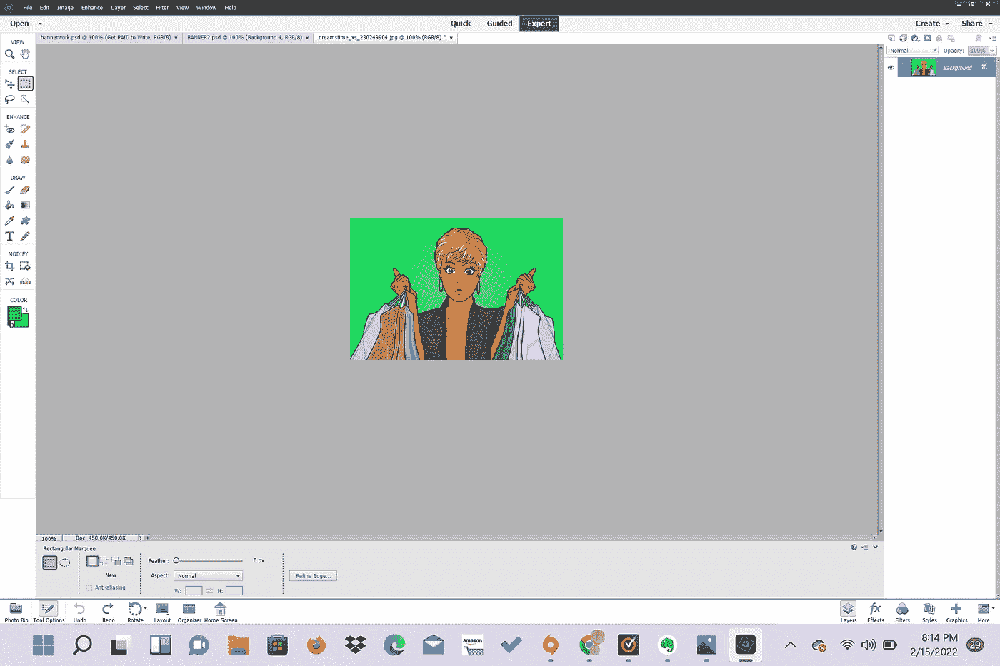

# 为网站创建一个简单的横幅

> 原文：<https://medium.com/geekculture/creating-a-simple-banner-for-websites-22e9c10a041a?source=collection_archive---------15----------------------->

## 你们好。

我决定制作这个快速教程，向人们展示如何在图片编辑器中编辑图片！

我这样做是为了制作横幅来装饰我的个人资料，并获得更多的媒体订户和其他广告。我觉得横幅很吸引眼球，在我的中型个人资料上更容易引起注意。