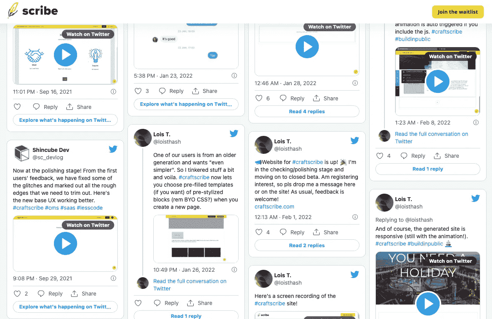
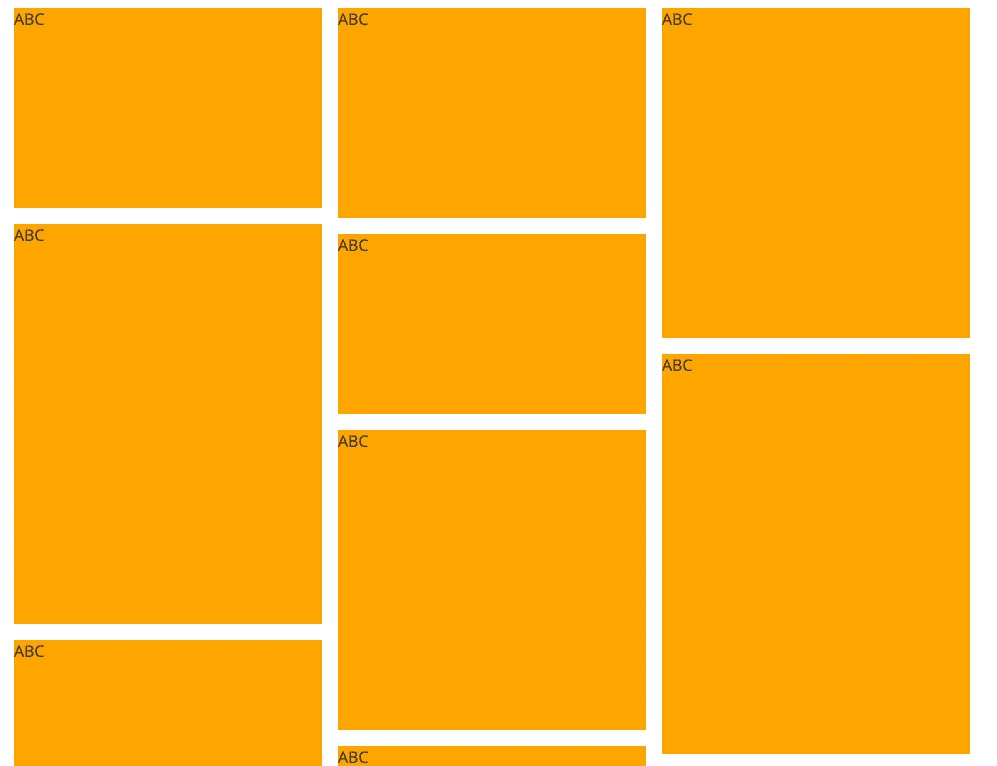
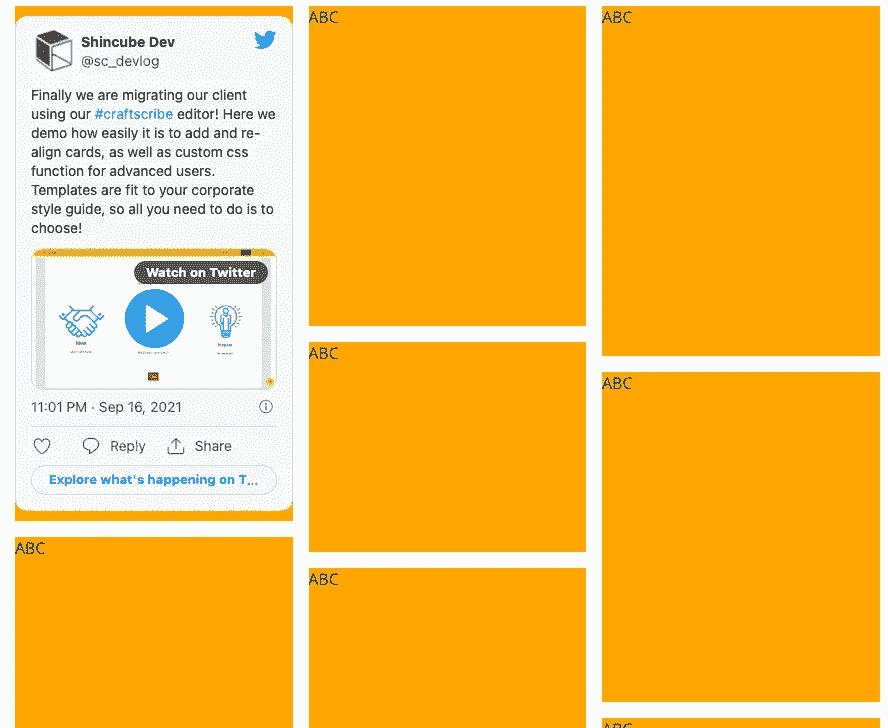

# 创建一个简单的推文墙

> 原文：<https://medium.com/geekculture/creating-a-simple-wall-of-tweets-8e62366e9d4e?source=collection_archive---------7----------------------->

而不必注册成为开发人员


Photo by [Joshua Hoehne](https://unsplash.com/@mrthetrain?utm_source=medium&utm_medium=referral) on [Unsplash](https://unsplash.com?utm_source=medium&utm_medium=referral)

我一直在推特上谈论我的 [Craft:Scribe](https://craftscribe.com) 项目的开发进展，有一天我突然想到，我可以将推文嵌入到登录页面，而不是写一个单独的博客。

快速搜索显示，我可以通过使用社交媒体聚合器或直接通过 Twitter API 来实现。但是，我发现一些简单的 CSS 和 Twitter 的工具可以用来满足我目前的需求，至少目前是这样。

下面是我的推文墙在登录页面上的样子:



Sample wall of Tweets (image by author)

## 假设

这里需要一些手工工作，因为我们将使用 [**Twitter 的网站(嵌入式推文)**](https://developer.twitter.com/en/docs/twitter-for-websites/embedded-tweets/guides/embedded-tweet-javascript-factory-function) ，只接受*推文 ID* : 我们需要自己获取 ID，而不是简单地提供一个关键字进行搜索或过滤。

tweetID 是位于其 url 末尾的一长串数字。您可以从浏览器的地址栏或点击**嵌入推文**查看网址:

```
[https://twitter.com/[username]/status/[Tweet](https://twitter.com/[username]/status/[Tweet)ID]
```

# 步骤 1:创建砖石墙

砖石布局相对容易创建，只需几行 CSS 就可以完成。

首先，一些简单的 HTML:

```
<section id="tweets" >
    <div id="tweet1" style="height:200px">ABC</div>
    <div id="tweet2" style="height:400px">ABC</div>
    <div id="tweet3" style="height:320px">ABC</div>
    <div id="tweet4" style="height:210px">ABC</div>
    <div id="tweet5" style="height:180px">ABC</div>
    <div id="tweet6" style="height:300px">ABC</div>
    <div id="tweet7" style="height:350px">ABC</div>
    <div id="tweet8" style="height:330px">ABC</div>
    <div id="tweet9" style="height:400px">ABC</div>
</section>
```

注意*高度*属性是为了说明的目的而随机分配的。

然后是 CSS:

```
#tweets {
    -moz-column-count:    3; // 3 columns for our wall
    -webkit-column-count: 3;
    column-count:         3;
}#tweets div {
    width: 100%;
    padding: 0;
    margin: 0 0 1rem 0;
    display: inline-block; 
    background-color: orange;
}
```

我们应该得到这样的结果:



Simple Masonry wall (image by author)

# 第二步:用 Javascript 加载推文

Twitter 提供了一个“支持动态插入嵌入式推文的 JavaScript 库”。我们可以使用这个库将推文嵌入到我们的石墙中。

首先，为网站加载[**Twitter Javascript**](https://developer.twitter.com/en/docs/twitter-for-websites/javascript-api/guides/set-up-twitter-for-websites)**(以下代码摘自 Twitter):**

```
window.twttr = (**function**(d, s, id) {
    **var** js, fjs = d.getElementsByTagName(s)[0],
        t = window.twttr || {}; if (d.getElementById(id)) return t; js = d.createElement(s);
    js.id = id;
    js.src = "https://platform.twitter.com/widgets.js";
    fjs.parentNode.insertBefore(js, fjs);
    t._e = [];

    t.ready = **function**(f) {
        t._e.push(f);
    };

    return t;}(document, "script", "twitter-wjs"));
```

**库加载后，我们可以使用它的 *createTweet* 函数:**

```
twttr.ready(
    **function** (twttr) { twttr.widgets.createTweet(
            '[tweetID]',
            document.getElementById('tweet1'),
            {
                theme: 'light', //or dark
                conversation: 'none',
                dnt: true,
            }
        ).then( **function**( el ) {
            console.log('Tweet added.');
     });
});
```

**这将在 id 为 *tweet1* 的元素中自动创建一条呈现的 Tweet(根据 Twitter 的标准布局)。我们可以做一些基本的定制，比如主题、对话等等。，完整的参数表是[这里是](https://developer.twitter.com/en/docs/twitter-for-websites/embedded-tweets/guides/embedded-tweet-parameter-reference)。**

**现在我们的墙看起来会像这样:**

****

**Wall with one tweet loaded (image by author)**

# **进一步的步骤**

**从这里，我们可以继续添加一个 tweetsIDs 数组和一个 for 循环，用不同的 tweet 填充整面墙。我们还可以添加更多的 CSS 规则来根据屏幕大小设置不同的列数，如下所示:**

```
@media only screen and (max-width: 600px){
    #tweets {
        -moz-column-count:    1;
        -webkit-column-count: 1;
        column-count:         1;
    }
}
```

**感谢您阅读本文，希望本文对您有用！**

**如果你有兴趣阅读更多，请查看我的其他一些关于技术的文章**

**[缩小 JS 文件](/geekculture/minifiying-js-files-861cdd7b214c)
[在 PHP 中使用 AWS SDK](/geekculture/using-aws-sdk-in-php-dcbd5513b6dc)
[Docker 用 Mac M1 构建](/geekculture/docker-build-with-mac-m1-d668c802ab96)**

**我也把写历史作为一种爱好**

**[《巴卡》背后的故事](https://loisthash.medium.com/the-story-behind-baka-7e26274e65c2)
[让他们吃肉](https://loisthash.medium.com/let-them-eat-meat-80714d2fed25)**

**再次感谢您！**

**另外，你也可以在推特上找到我。**