# 创建 SQL 实体关系图(ERD)

> 原文：<https://medium.com/geekculture/creating-a-sql-entity-relationship-diagram-erd-ced5ad1239d0?source=collection_archive---------4----------------------->

使用 PostgreSQL 和 Pagila 数据库练习创建和使用实体关系图

1.  本文将使用 pgAdmin 4 和 PostgreSQL 演示如何创建 Pagila 数据库的实体关系图(ERD ),以更好地理解您将使用的数据，并创建一个参考。
2.  这里将展示两种不同的 ERD 创作方法。一个是手动完成的，耗时更长，但学习体验更好，另一个是由 pgAdmin 4 自动完成的，速度快几个数量级，对于那些在使用 Pagila 数据库时只需寻找 ERD 作为参考的人来说更容易。
3.  会有必要信息的链接，github 库和完整的 ERD 供你参考。

# 预先注意(如果你想创建一个 ERD 快，然后读这个)

当我最初尝试使用 pgAdmin 4 创建一个 ERD 时，我点击了工具下拉列表中的“新 ERD 项目”选项，它给了我一个空白的网格。因此，我实际上必须手动创建图表中的每个表、行和约束，这花费了我几个小时的时间。下一次我试图创建一个 ERD 时，我首先右键单击我想要使用的数据库，然后选择“生成 ERD ”,最初看起来我仍然有一个空白的 ERD，但当我缩小时，我注意到已经为我创建了一个 ERD，它包括所有准确的表名、行名、约束和关系。最终，以前需要几个小时才能完成的事情现在只需要 30 秒。

也就是说，我发现手动创建自己的 ERD 非常有用。它让我思考过程、数据类型、约束和关系，我觉得这进一步巩固了我的 SQL 知识。

# 先决条件

本教程假设您已经安装并设置了 PostgreSQL、pgAdmin 4 和 Pagila 数据库。如果你需要设置的指导，请访问我以前的文章:[模拟真实世界的 SQL 环境。](https://jamesopacich.medium.com/simulating-a-real-world-sql-environment-63784f7f37ae)

请在此时打开 pgAdmin 4，并准备好使用您的数据库。

# 自动创建 ERD 的步骤

# 步骤 1:生成 ERD 工具

这是 pgAdmin 4 版中的一个测试工具。

## 生成 ERD

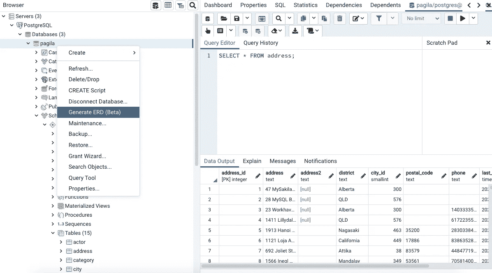

Right-click on your database. I have called my database Pagila in this case. Then find the “Generate ERD” option on the drop down list.

这将在 pgAdmin 4 中打开一个新窗口，该窗口位于查询窗口通常所在的位置。

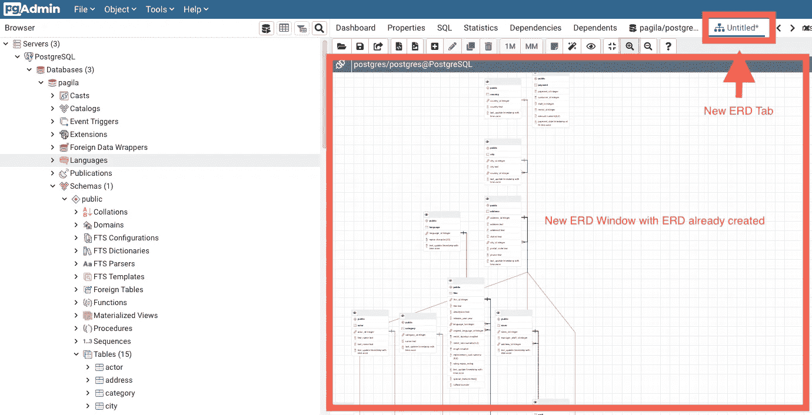

Here a new ERD window and tab are created. This is where the ERD will be created.

# 第二步:保存并命名你的 ERD

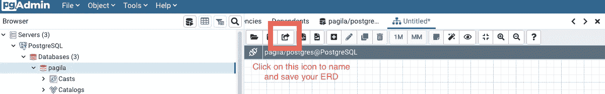

Step 1: Click on this icon to open up the save file browser/box

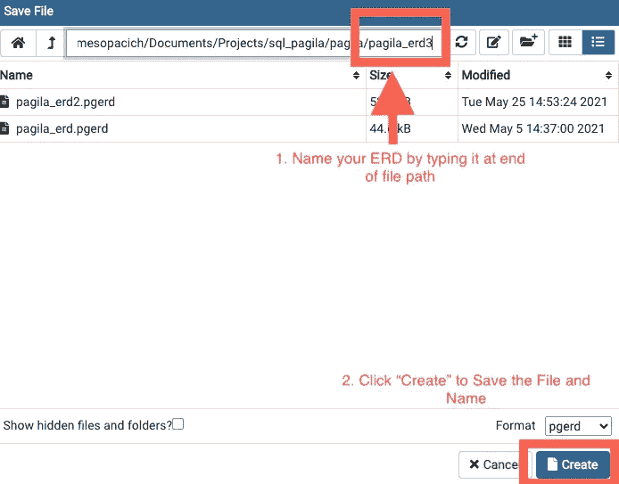

Step 2: Name your ERD by typing your desired name into the end of the file path. Then click Create to save the named file. I decided to name my ERD pagila_erd3 for this exercise.

# 第三步:导出你的 ERD

在 pgAdmin 4 中放大和移动 ERD 有点困难，所以我发现将其导出到图像文件更有助于参考。

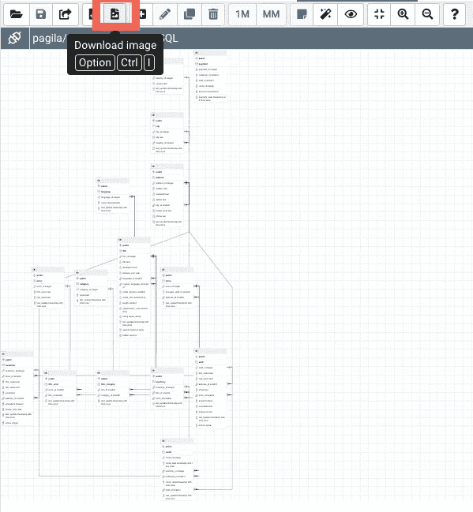

Click on the “Download Image” icon, it will bring up a file browser where you can name your new image file and save it to a desired file on your computer.

# 手动创建您自己的 ERD

手动创建自己的 ERD 的第一步是不同的。

# 步骤 1:创建新 ERD

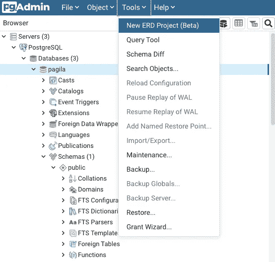

Instead of clicking on the database name and then selecting to generate a new database you will instead click on the “Tools” dropdown at the top of the pgAdmin app window and select “Create New ERD.”

# 第二步:保存并命名你的 ERD

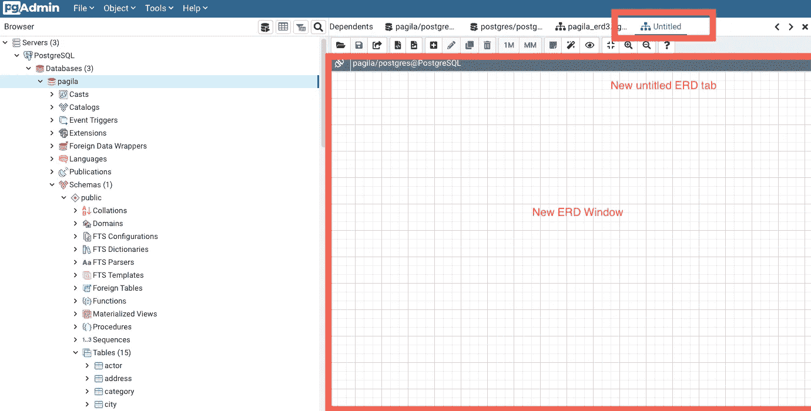

You will see now that you will have a blank ERD Window to work from.

Step 1: Click on this icon to open up the save file browser/box

Step 2: Name your ERD buy typing your desired name into the end of the file path. Then click Create to save the named file. I decided to name my ERD pagila_erd3 for this exercise.

# 步骤 2:创建第一个表格

在这一步中，我们将为 ERD 创建表格图。这些框包含数据库中每个表的表、列、约束和键信息。

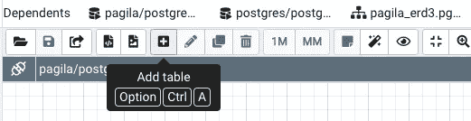

Click the plus-sign icon to add a table.

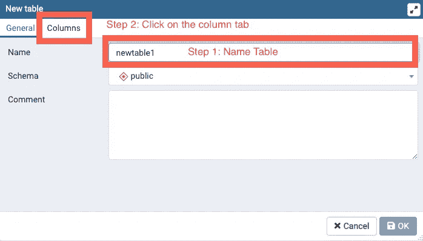

Name your table and click on the column tab.

Click on plus sign to add column and constraints

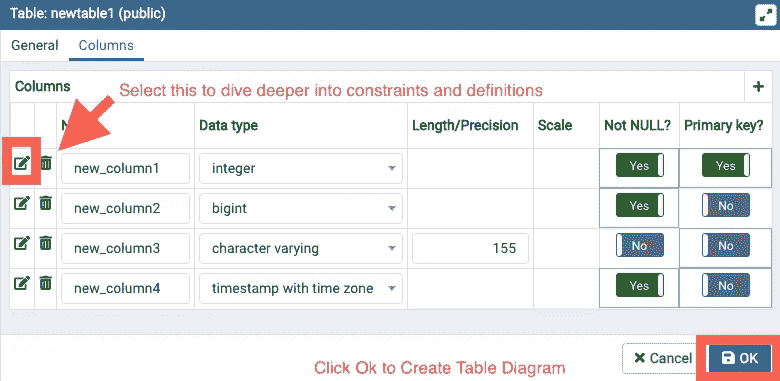

Enter in your column names, data-types and basic constraints here and hit ok to create the table diagram. If you want to dive deeper into constraints then click on the pencil icon next to each column.

## 如果您想深入了解约束条件

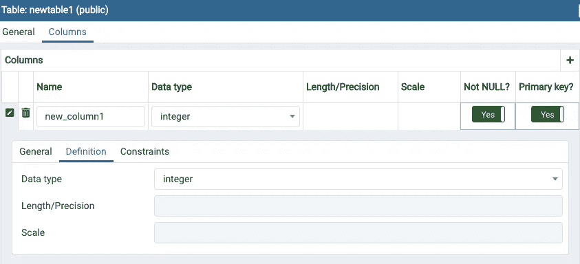

There is a definitions tab although this doesn’t seem to add any additional functionality.

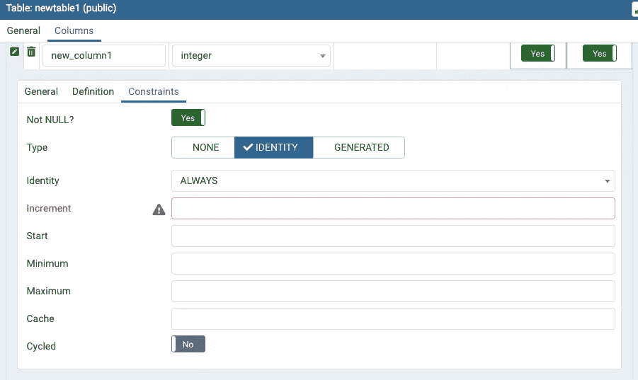

The constraints tab does seem to add a few more parameters to add to your diagram.

# 第三步:建立关系

要完成 ERD，您需要创建表之间的关系。

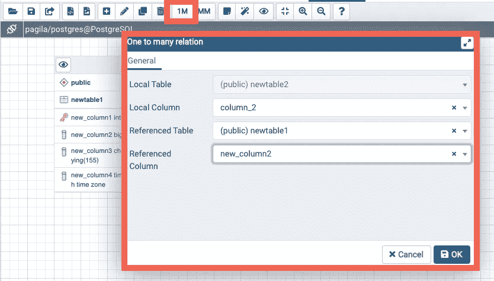

To create a 1 to many relationship highlighting foreign key relationships click on the 1M icon. This will open a form for you to select columns corresponding to the tables and relationships you want to create.

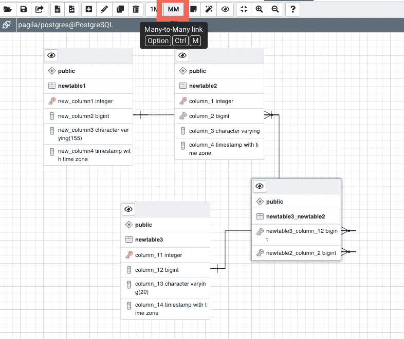

To create a many-to-many relationship click the MM icon and a form will open allowing you to do the same as the previous picture.

您现在已经创建了一个 ERD。我建议从头开始重新创建 Pagila 数据库 ERD 来练习。您可以通过创建如上所述的自动 ERD 来检查您的工作。我还在我的 [**Pagila 问题集**](https://github.com/JamesRonsonOp/SQL_Training_with_Pagila/tree/main/pagila_question_sets) **资源库**中收集了一堆问题集，这将帮助你微调你的查询技能。