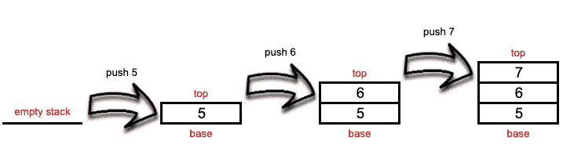
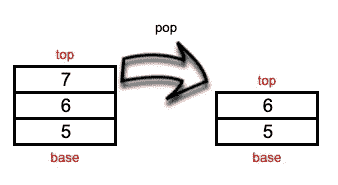
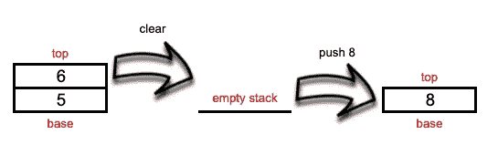
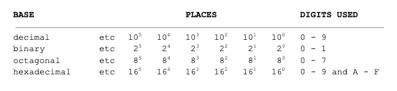
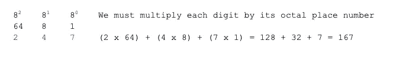

# 用 JavaScript 创建堆栈

> 原文：<https://medium.com/geekculture/creating-a-stack-in-javascript-6031ee8ef9a8?source=collection_archive---------12----------------------->


Photo by [Denise Johnson](https://unsplash.com/@auntneecey?utm_source=unsplash&utm_medium=referral&utm_content=creditCopyText) on [Unsplash](https://unsplash.com/s/photos/stack-of-pancakes?utm_source=unsplash&utm_medium=referral&utm_content=creditCopyText)

在本教程中，我们将学习一种被称为*栈*的数据结构。你们有些人可能会问，“什么是数据结构？”我很高兴你问了…

数据结构是组织数据的一种特定方式。理解它们允许我们通过格式化有效的解决方案来解决编程问题。知道使用哪些数据结构(有几种)以及如何应用它们是至关重要的。为手头的任务选择错误的数据结构可能会影响我们正在编写的程序的性能。因此，我们应该学习各种数据结构以及如何正确应用它们。

一个*数组*是最简单的数据结构，JavaScript 天生支持它。数组存储一系列值。作为 JavaScript 开发人员，我们有点被宠坏了，因为我们可以在一个数组中存储不同数据类型的值。大多数其他语言只允许创建具有相同数据类型值的数组。

堆栈类似于数组。事实上，正如我们将在后面看到的，我们的栈实现将在内部使用一个数组来存储我们的数据。栈是遵循 **LIFO** (后进先出)原则的有序的项目集合。从同一端添加和移除项目。发生这种情况的堆栈末端称为*顶部*，相对的末端是*底部*。所以，最近增加的在顶部附近，最老的在底部附近。


Photo by [Wayne Low](https://unsplash.com/@wayneshin?utm_source=medium&utm_medium=referral) on [Unsplash](https://unsplash.com?utm_source=medium&utm_medium=referral)

堆栈出现在许多现实环境中。通常给出的经典例子是一堆书。一叠煎饼是按后进先出顺序吃的。挤进电梯的人通常以后进先出的顺序离开(除非他们是混蛋)。在杂货店里，商品从货架上拿下来是按照后进先出法的顺序进行的。甚至流行的*万智牌*纸牌游戏也使用“堆栈”作为管理游戏的基本机制。从技术上来说，LIFO 往往发生在执行递归算法的过程中，其中执行的函数按 LIFO 顺序发生。

编程语言中的编译器和计算机也使用堆栈来存储变量。JavaScript 有一个所谓的*调用栈*，当解释器读取程序时，我们所有的代码被一个接一个地推送和执行。

堆栈实现简单且高效。因此，当检索顺序根本不重要时，它们可能是正确的数据结构。我们将构建一个简单的 stack 类(我讨厌使用单词 *class* ，因为从技术上讲 JavaScript 中不存在类)，然后我们将通过一些例子来演示如何使用它。最后，我们将创建一个使用堆栈来解决问题的函数。准备好了吗？开始了。

首先，本文使用的是 [*node.js*](https://nodejs.org/en/download/) ，所以在继续之前要确保已经安装。接下来，创建一个名为*栈*的项目目录(我知道，超级原创吧？).在这个目录中，让我们创建一个名为 *stack.js* 的新文件。在该文件中，输入以下代码:

哇，这里有各种各样的东西——生活，弱映射，类！但这一切意味着什么呢？

我们注意到的第一件事是，整个函数被包装在一个 IIFE(立即调用的函数表达式)中，然后被赋给常量 **Stack** 。通过这样做，我们在生命中创造了第二个范围——一个保护生命中一切的独立范围。这创建了一个闭包，并允许我们只从它的*返回我们想要的*，从而防止直接访问我们的 **items** 变量。这叫做*封装。*

正如所承诺的，在第 4 行我们声明了一个常量， **items** ，它将保存我们堆栈的数据。如上所述，这个变量受作用域保护，所以栈外的任何东西都不能访问它。我们正在使用 WeakMap 的一个实例，所以当它们引用的实例超出范围时，我们的私有属性将超出范围。否则，我们存储在堆栈实例中的数据永远不会被垃圾收集！(垃圾收集是 JavaScript 定期从不再需要保留的项目中回收内存的过程。更多信息，请点击[这里](https://developer.mozilla.org/en-US/docs/Web/JavaScript/Memory_Management)

第 6 行开始了我们的类块。注意，我们甚至懒得给类命名；我们只是把它退回去。这意味着**栈**的实例实际上是这个类的实例。

在第 7–9 行，我们设置了构造函数。这里我们使用 WeakMap 实例， **items** ，为这个设置一个键*，并将其映射到一个空数组。这样，每个实例将被映射到栈自己的 *this* 对象。这个数组是我们保存所有堆栈数据的地方。*

接下来，我们开始为我们的堆栈数据结构构建一些特定的方法。首先是第 11-13 行的**按钮**。调用 **push** 方法将一个新项目(或几个项目)添加到堆栈顶部，而*只会将*添加到堆栈顶部。

接下来是第 15–17 行的**弹出**方法。此方法从堆栈中移除顶部的项并将其返回。我们通过使用 JavaScript 的 pop 方法来实现这一点，因为它遵循我们所追求的 LIFO 原则。

第 19–21 行的下一个方法叫做 **peek** 。当我们想要查看(但不是移除)栈顶的项目时，我们可以使用这个方法。我们通过简单地返回存储在我们的**项目** WeakMap 实例中的数组的最后一个项目来实现这一点。

敏锐的观察者可能已经注意到了 **items.get(this)** 返回了一个堆栈项目的数组。因此，我们可以像对待普通的 JavaScript 数组一样对待它。

我们实现的下一个方法叫做 **isEmpty** ，在第 23–25 行，它……嗯，返回堆栈是否为空。我们在这里所做的就是写一个条件来查看堆栈中的条目数组的长度是否为零。如果是，该方法返回**真**；否则**假**。

接下来是第 27–29 行的**大小**方法。这个方法简单地返回我们的堆栈的项目数组的长度。这里没什么特别的。

我们最后的(终于！)方法是**清除**，在第 31–33 行。该方法将存储在我们的 **items** WeakMap 实例中的数组重置为空数组。实际上，这清空了我们的堆栈。

顺便说一句，不要忘记第 35 行的括号来结束我们的生活！最后，在第 37 行添加一个导出堆栈的方法。

好了，现在我们有了一个完全实现的堆栈数据结构，我们如何使用它呢？让我们来看看…

让我们在堆栈目录中创建一个名为 *useStack.js* 的新文件，并添加以下代码:

我知道，这里发生了很多事！别担心，我们会一起走过去的。

在文件的顶部，第 3 行和第 5 行，我们需要来自 *stack.js* 的 **Stack** 类，然后我们创建一个新的 Stack 实例，我们称之为 **stk** 。接下来的几行代码只是将一些信息记录到我们的终端，我们马上就会看到。

第 12–14 行开始向堆栈中添加数字，然后在第 16–18 行，我们查看顶部的项目是什么，检查堆栈是否为空，然后找出当前堆栈中的元素数量。



Going from an empty stack to one with three items

在下一节中，我们从堆栈中移除顶部的条目，并将其存储在变量 **x** 中。然后，我们使用该变量来报告哪个项目被删除(第 24 行)，然后检查新的顶部项目是什么，并再次报告其大小(第 26–27 行)。



Popping off the top item

接下来，我们完全清空堆栈，然后检查堆栈是否为空(第 31–33 行)。

最后，我们将一个新的项目压入堆栈，然后查看它是什么(第 37–39 行)，然后我们记录我们完成了堆栈的测试。



Clearing the stack, then pushing a new item onto it

为了测试所有这些，我们需要将终端导航到我们的*堆栈*目录，并运行以下命令:

```
node useStack
```

如果成功，您的终端应该有以下输出:

```
Testing the stack...========================================Pushing 5, 6, and 7 onto the stack...The top items is: 7The stack is empty: falseNumber of items in the stack: 3========================================Removing the top item from the stack...Item removed from top: 7The new top item is: 6The new stack size is: 2========================================Clearing the stack...The stack is cleared: true========================================Pushing 8 onto the stack...The top item is: 8========================================Finished testing the stack!
```

好了，现在我们知道我们的堆栈工作正常。但你可能会问，“这有什么好处？我们能用它做什么样的酷东西呢？”你问了最好的问题…

事实证明，堆栈可以帮助解决各种问题。我们要看的是一个基极转换器。作为人类，我们使用以 10 为基数的数字系统，因为我们(大多数人)有 10 个手指。在计算机科学中，我们也看到使用其他一些基数，主要是二进制(基数 2)，但也有八进制(基数 8)和十六进制(基数 16)。这些数字的位置需要一点数学(我知道！)来计算，但都是基于以下模式:



因此，如果我们看到八进制(八进制)数字 247，我们必须做一些数学运算将其转换为十进制(人类友好的)数字。



因此，八进制 247 相当于十进制 167。看，那不是很容易吗？好吧，所以手动转换数字真的很痛苦！幸运的是，我们将编写一个函数来完成这项工作，特别是从数学角度来说，将十进制数从十进制数转换到另一个基数有点困难。

在我们的*栈*项目目录中，让我们创建一个名为 *baseConverter.js* 的新文件，并添加以下代码:

这个函数提供了一个将十进制数转换成任意基数的算法。只要除法结果不为零，我们就将除法的余数推到堆栈中，然后通过除以基数来更新十进制数。然后，我们从堆栈中弹出元素，直到它为空，通过从 **digits** 字符串中检索它们的值来转换数字，然后连接所有从堆栈中移除并转换为字符串的元素。

现在，为了了解当生命转换到其他基础时，它的意义是什么，让我们将终端导航到我们的项目目录并运行

```
node baseConverter
```

它应该提供以下输出

```
The binary meaning of life is 101010The octal meaning of life is 52The hexadecimal meaning of life is 2A
```

我将把创建一个将不同基数的数转换为十进制数的函数作为读者的练习。

也许这个例子会帮助你想到使用栈数据结构可以解决的其他问题。作为一个额外的挑战，尝试使用堆栈来解决经典的河内塔问题。为了让你开始，记住在解谜时有三个塔(即，栈)。

感谢跟随和快乐编码！