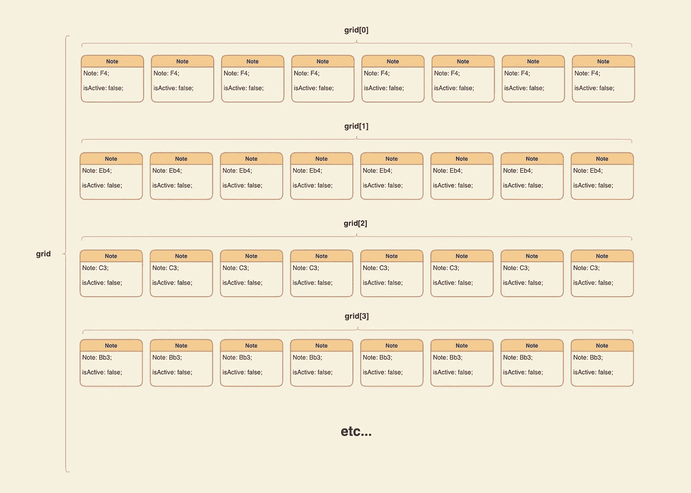
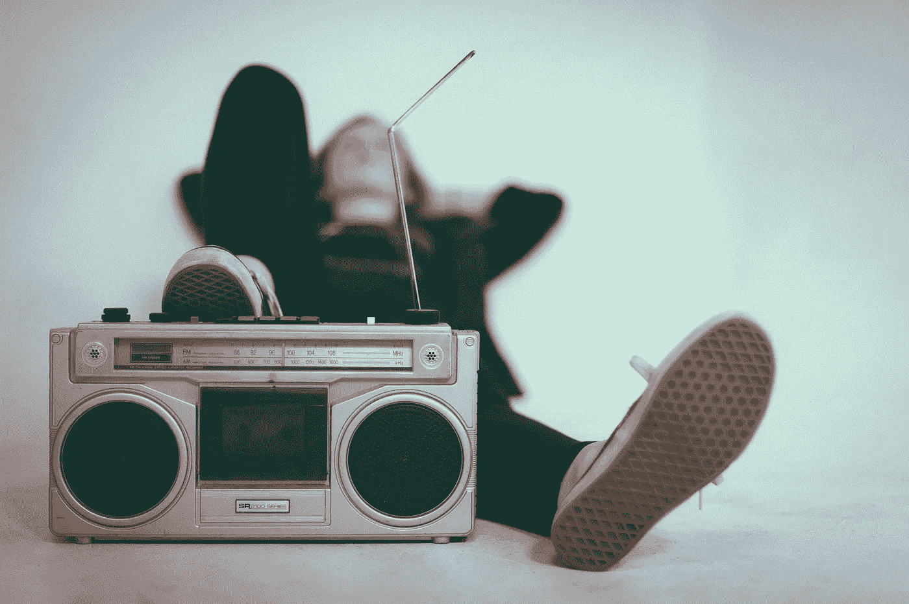

# 使用 Tone.js 创建步长音序器

> 原文：<https://medium.com/geekculture/creating-a-step-sequencer-with-tone-js-32ea3002aaf5?source=collection_archive---------3----------------------->

步长音序器是一种电子装置，它将一个小节分成预定的子小节或“步长”。每一步都可以用来触发特定的声音和/或音符。正如 Monica Dinculescu 的精彩文章中所解释的，由于 Javascript 是单线程语言，因此很难在 Javascript 中实现一致且定时的事件。为了克服这一点，我使用了一个名为 [Tone.js](https://tonejs.github.io/) 的免费网络音频框架作为我项目的基础。

当试图以编程方式生成音乐时，Tone 大大简化了许多事情。虽然文档可能有点混乱，但我发现自己花了几个小时在页面之间点击，试图理解如何将所有部分组合在一起。我希望通过这篇文章(部分地)解决这个问题，并在将来帮助任何使用 Tone 的人。这并不是对 Tone.js 的全面解释，而是对我如何制作音序器的一个演示。

*仅供参考:这篇文章假设读者对音乐理论有所了解*

**我们的步进序列器设计流程如下:**

1.  [制造发声所需的合成器。](#a437)
2.  [在一个父数组中创建一个由多个子数组组成的网格。这将起到类似乐谱的作用，并告诉合成器何时播放一个音调。](#dab6)
3.  [编写一个循环函数，它将读取网格符号并相应地触发合成器。](#d7bc)
4.  [在 DOM 中创建元素来可视化地表示一切，能够与网格交互来打开和关闭注释。](#a23e)

# 设置合成器

Tone.js 提供的最简单直接的工具是 [Synth](https://tonejs.github.io/examples/simpleSynth) 。合成器是单声道的，这意味着它一次只能演奏一个音符。为了克服这个问题，我们将为每个可用的音符创建一个 Synth，并将它们存储在一个数组中。

*切向快速脏声初级读本:*

任何乐器(模拟或数字)的音色(或单个音调质量)都由生成声音的 [*波形*](https://en.wikipedia.org/wiki/Waveform) 和 [*包络*](https://en.wikipedia.org/wiki/Envelope_(music)) 决定。波形指的是声波在[示波器](https://en.wikipedia.org/wiki/Oscilloscope)上的样子，而[包络](https://en.wikipedia.org/wiki/Envelope_(music))指的是声音如何随时间变化。这种改变可以是音量、音高，甚至是声音本身的音色！

Tone.js 的合成器由一个通过[振幅发展](https://tonejs.github.io/docs/14.7.77/AmplitudeEnvelope.html)的[全振荡器](https://tonejs.github.io/docs/14.7.77/OmniOscillator)组成。如果你想了解更多，音调开发人员提供了许多例子，允许你玩不同的[振荡器](https://tonejs.github.io/examples/oscillator)和修补[合成器](https://tonejs.github.io/examples/simpleSynth)的包络设置。我绝不是声学专家，但音调库似乎提供了足够的灵活性来生成各种各样的乐器声音，这些声音可以很容易地合并到这个项目或任何其他项目中。

如果这些行话让你感到困惑和头疼，完全不用担心！Tone 的标准 Synth 为我们的需求提供了足够多的功能，所以请随意忽略/跳过前面的两段，继续学习教程。

# 制作网格

既然已经创建了 synths，我们需要创建一个结构，作为一种符号。我决定使用嵌套数组，每个子数组对应于序列器上的一行，因此对应于一个合成器。

每个子数组包含多个对象，这些对象具有一个`note`属性和一个`isActive`布尔值，用于存储用户是否选择了要播放的音符。

我发现将子数组视为垂直堆叠在父数组中很有帮助，纵轴对应于音高，横轴对应于时间。



visualization of the grid data structure

以及相应的代码:

我用 F 小调五声音阶作为我的音序器，因为这是一个初学者友好的音阶，所有的音符在一起演奏时听起来都很好。请随意更改这里的参数。正如您将在本教程的后面看到的，我们的 DOM 元素是使用网格作为参考以编程方式生成的，因此使用更多或更少的音符，或者更改您希望音序器表示的小节数都是非常快速和简单的！

# 创建我们的循环函数

好了，我们已经设置好了基本的网格，也设置好了合成器，但是我们如何将两者结合起来制作音乐呢？

Tone.js 的核心部分是[传输](https://tonejs.github.io/docs/14.7.77/Transport)，它允许你可靠地安排事件以及播放和暂停音频。我们将为我们的序列器使用`scheduleRepeat` [方法](https://tonejs.github.io/docs/14.7.77/Transport#scheduleRepeat)。`scheduleRepeat`以回调函数为道具，以及执行回调的时间间隔或细分。然后，每当传输正在播放时，它将重复执行回调。

接通我们的回调函数`repeat()`。回调检查外部计数器，以了解它当前所处的步骤。然后，它遍历网格，检查当前步骤是否有任何音符被激活，如果有，就用正确的合成器安排一个事件，让音符发出声音。为了完成任务，计数器递增，这样我们可以在下次执行回调函数时在正确的位置引用网格。

# 在大教堂里建造东西

既然我们已经为序列器编写了必要的逻辑，我们需要构建用户将与之交互的可视化组件。我们的序列器将存在于一个使用网格布局的父 div 中。按钮将以编程方式生成，并被传递给`onClick`函数，这些函数将改变我们的`grid`中相应的注释。

我们的事件侦听器接收`rowIndex`和`noteIndex`，这样我们就可以在网格中找到相应的 note 对象并检查其状态。它还接收事件对象，以便我们可以更改按钮的样式。

# 最后的润色:制作播放按钮

剩下的就是配置一个播放/暂停传输的按钮。在制作任何音乐之前，你必须调用`Tone.start()`，所以我在按钮的逻辑中添加了一个条件位，以便在用户第一次按下 play 时设置好一切。否则，您只需使用一个布尔值作为标志变量来切换传输的开始和停止。

# 看这个音序器



Photo by [Eric Nopanen](https://unsplash.com/@rexcuando?utm_source=unsplash&utm_medium=referral&utm_content=creditCopyText) on [Unsplash](https://unsplash.com/s/photos/music?utm_source=unsplash&utm_medium=referral&utm_content=creditCopyText)

这里有一个 JS 提琴，所有部件组合成一个基本的步音序器。我希望这个演练对你有所帮助，并祝你在未来的编程(和音乐)工作中一切顺利！

*参考资料、来源和进一步阅读:*

```
[Documentation](https://tonejs.github.io/) for Tone.jsWikipedia page on [Synthesizers](https://en.wikipedia.org/wiki/Synthesizer)"[Tone.js & Codepen](https://youtube.com/playlist?list=PLTujTdKucISz9rx7gGqei3fAGrtA97uY0)" YouTube series made by Jake Albaugh"[Making sounds with React and Tone.js](https://react.christmas/2020/15)" by Nicolai Fredriksen"[Let’s Make Music with JavaScript and Tone.js](/dev-red/tutorial-lets-make-music-with-javascript-and-tone-js-f6ac39d95b8c)" by Jim Bennet
```