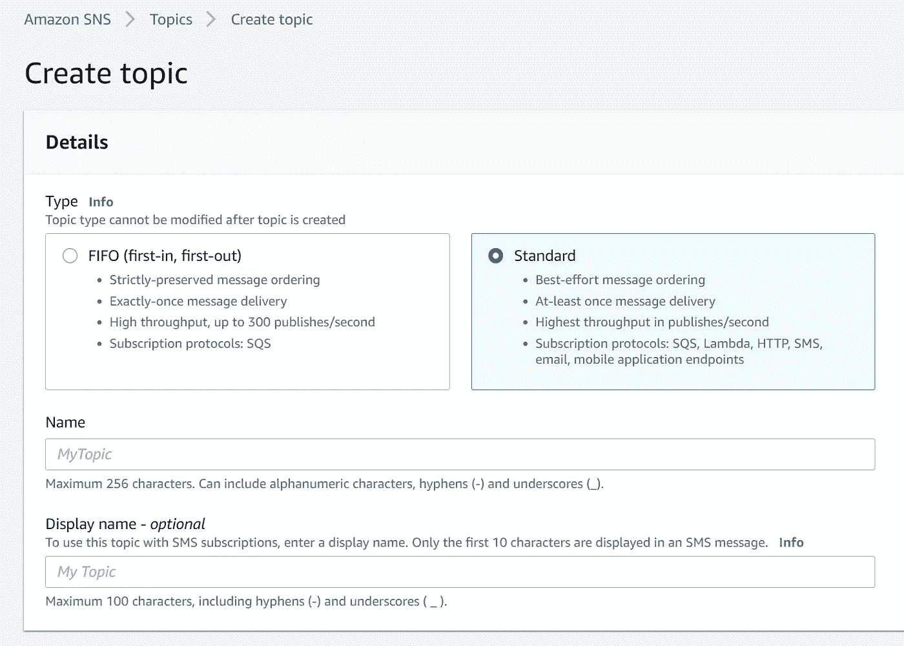
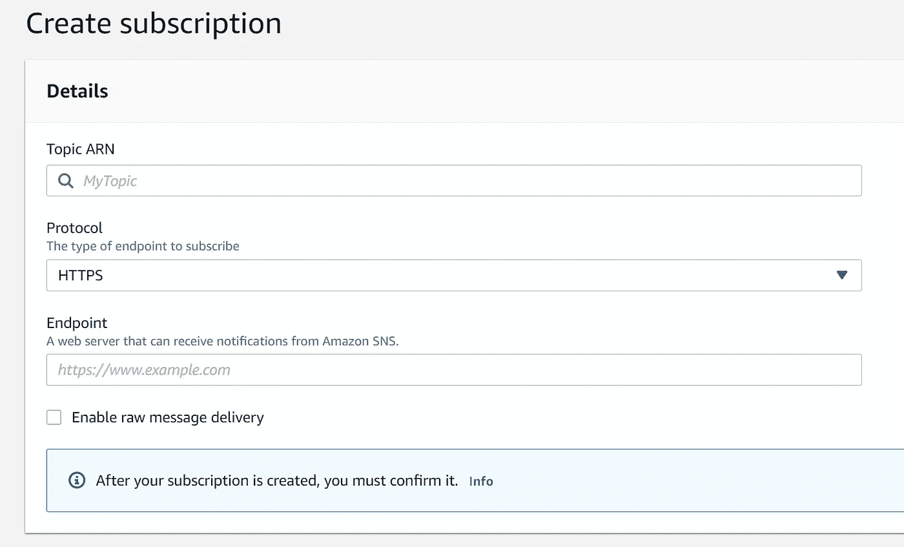
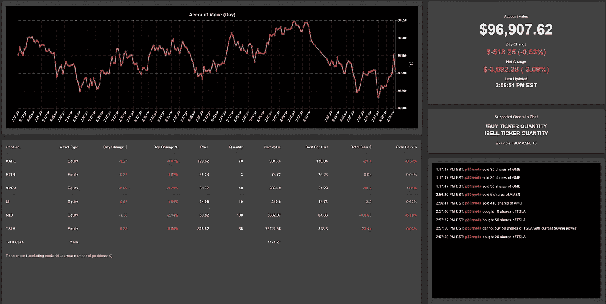

# 使用 NodeJS 和 AWS 为 Twitch 创建一个股票市场模拟器

> 原文：<https://medium.com/geekculture/creating-a-stock-market-simulator-for-twitch-chat-using-nodejs-and-aws-fcbae7ce9017?source=collection_archive---------14----------------------->


Photo by [M. B. M.](https://unsplash.com/@m_b_m?utm_source=medium&utm_medium=referral) on [Unsplash](https://unsplash.com?utm_source=medium&utm_medium=referral)

最近对 Twitch 的痴迷导致了一系列与创建包含 Twitch 聊天的游戏和体验相关的想法。其中一个是股票市场模拟器，聊天者共享一个初始现金池账户，他们在聊天中输入买卖指令。收益、亏损、当前头寸和其他账户数据将被传输，这样聊天者就可以知道他们的交易表现如何。

对于这个项目，我使用 NodeJS 和 AWS 构建了一个 Twitch 聊天机器人来读取股票订单，一个后端服务来处理订单，以及一个前端 UI 来将帐户数据显示到浏览器，该浏览器可以传输到 Twitch。我将逐一介绍这些组件，分享实现细节，并提供一些创建您自己的类似项目的演练。

# 先决条件

1.  需要一个 [Twitch](https://www.twitch.tv/) 帐户，以便您可以将帐户凭证传递到您的机器人中。
2.  需要一个 [AWS](https://aws.amazon.com/) 账户，因为我们将使用 AWS SNS 和 DynamoDB。
3.  为了获得实时报价数据以便在后端服务中处理订单，我使用我的 TD Ameritrade 帐户向他们的[实时报价数据 API](https://developer.tdameritrade.com/apis)发出授权请求。如果您没有经纪帐户，您可以创建一个开发者帐户并获得延迟数据。你也可以从其他各种途径获得报价数据，比如刮[雅虎财经](https://finance.yahoo.com/)。

# Twitch 聊天机器人

对聊天机器人的要求很简单，它需要:

1.  实时阅读 Twitch 聊天
2.  解析股票市场订单的聊天消息
3.  将订单发送到后端服务器进行处理

使用 Node 的 [tmi.js 包](https://github.com/tmijs/tmi.js)很容易创建 Twitch 聊天机器人。tmi.js 包允许机器人为各种事件调用事件处理程序，比如在聊天中键入新消息时。

主要的机器人驱动程序代码相当简单。使用您的 Twitch 帐户凭证创建一个客户端，我们定义一个 **onMessageHandler** 函数，在市场开放时处理每条消息。使用正则表达式(例如“购买 AAPL 10”)解析消息，以确定它们是否是订单。然后订单排队发布到 AWS SNS 主题。

要设置 SNS 主题，请转到 AWS 控制台并导航到简单通知服务。转到**主题**，然后**创建主题**。确保在创建主题屏幕上选择**标准**。我们需要标准，因为我们的后端服务将通过 HTTP 订阅 SNS 主题。



AWS SNS Topic Creation

为您的主题选择任意名称，您可以将其余选项保留为默认名称。创建主题并转到左侧菜单上的**主题**。您应该能够看到您新创建的主题及其 **ARN** 。将主题 ARN 复制到一个. env 文件或环境变量中，以便机器人知道将订单发送到哪里。

有了这个，我们应该有一个可以工作的机器人，它可以读取股票市场订单，并将它们发布到 SNS 主题，供其他服务使用。

[这里是完整聊天机器人实现的 GitHub 库](https://github.com/nramkissoon/Twitch-Stock-Order-Bot)。

# 用于处理订单和更新帐户的后端服务

后端服务器是一个简单的 Express 服务器，每当来自 SNS 的新订单到来时，或者在设定的时间间隔后，处理订单并更新 DynamoDB 中的帐户数据，以尽可能保持数据最新。

服务器有两个 API 端点:orders 端点和 account 端点。

```
POST
/sns/ordersGET
/data/account
```

orders 端点接受来自 SNS 主题的订单消息。为此，我们需要为我们的 API 端点订阅 SNS 主题。打开 AWS 控制台，转到您创建的 SNS 主题，然后创建订阅。



AWS SNS Create Subscription Form

请务必为您的 SNS 主题选择 ARN 主题，并选择 HTTPS 作为协议(因为我们为该主题订阅了一个 web 服务器)。如果您在本地主机上运行服务器，端点可能会比较棘手。我使用了 [ngrok](https://ngrok.com/) 并添加了 ngrok 创建的 URL 作为端点。可以在 EC2、DigitalOcean Droplets 等上托管服务器。并且只需提供主机 URL + /sns/orders。

在订单 API 逻辑的 Express router 函数中，我们需要通过 AWS SDK 确认 SNS 订阅。这需要对 SNS 做出简单的响应来确认订阅。一旦 AWS 收到确认，SNS 主题就可以开始向服务器发送订单消息。每当新的 SNS 通知被发送到端点时，我们从 SNS 中提取消息并将其解析为订单对象，然后将订单传递给包含核心帐户数据更新逻辑的 **runUpdate** 函数。

在我们开始研究 runUpdate 函数之前，我们需要设置 DynamoDB 表来读写帐户数据。使用 AWS 控制台设置 DynamoDB 表相对简单，所以我们将直接进入我们的应用程序需要哪些表。

需要三个表，在我的实现中，我创建了另一个表来读/写我的 TD Ameritrade 帐户的 API 凭证(如果您使用不同的报价数据源，这个表并不重要)。这些是必需的表格和每个表格的样本文档:

**账户值表**:包含游戏百分比、市值等账户数据。带有时间戳排序键(每个 DynamoDB 文档都是给定时间点的帐户值的快照)

```
{
  "day_gain_percent": 0,
  "day_gain_total": 0,
  "key": "account_value",
  "mkt_value": 100000,
  "previous_day_mkt_value": 100000,
  "timestamp": 1611071780713,
  "total_gain_percent": 0,
  "total_gain_total": 0
}
```

**持仓表**:包含代表每个持仓的文件，用股票代号索引，每个文件都有最新的持仓值/盈亏、价格、数量等。

```
{
  "asset_type": "Equity",
  "average_cost_per_unit": 142.65,
  "day_gain_percent": 0.1187,
  "day_gain_total": 0.17,
  "mkt_value": 2866.6,
  "POSITION": "AAPL",
  "price": 143.33,
  "quantity": 20,
  "total_gain_percent": 0.48,
  "total_gain_total": 13.6
}
```

**已处理订单表**:包含服务器上给定更新的已处理订单，每个订单还包含与输入订单的 Twitch 用户相关的数据。

```
{
  "key": "processed_orders",
  "processedOrders": [
    {
      "executed": true,
      "orderValidationInfo": {
        "isValid": true
      },
      "processedTimestamp": 1611671916539,
      "userOrderData": {
        "badges": {
          "premium": "1"
        },
        "color": "#FF0000",
        "display-name": "foo",
        "id": "123",
        "order": "!SELL NIO 110",
        "tmi-sent-ts": "1611671926787",
        "user-id": "1234",
        "username": "foo"
      }
    }
  ],
  "timestamp": 1611671916605
}
```

**runUpdate** 函数利用所有这些表在设定的时间间隔后或每当通过 AWS SNS 收到新订单时更新账户和头寸。

更新数据的步骤非常简单:

1.  获取当前位置
2.  获取当前帐户值
3.  获取两个位置和任何新订单的报价，然后使用一些数据提供商获取报价数据
4.  验证并执行订单
5.  更新职位
6.  将新的头寸和账户数据写入 DynamoDB 表

为了深入了解订单验证逻辑、对 DynamoDB 的读写以及更新逻辑，[这里是完整后端服务器](https://github.com/nramkissoon/TP_stonks_OrderProcessing)的 GitHub 存储库。

# 显示账户数据和头寸的前端

目标是将模拟账户以近乎实时的方式直播到 Twitch。浏览器可以流，所以前端用户界面将是一个简单的网页。为此，我使用 [React](https://reactjs.org/) 和 [Material-UI 组件库](https://material-ui.com/)构建了一个带有不同面板的仪表板，显示不同类型的数据。

实施了五个面板组件:

1.  全天账户价值图
2.  当前账户价值和每日/总收益
3.  包含当前头寸和单个收益、数量等的表格。
4.  Twitch 用户可以输入有效股票市场订单格式的面板
5.  订单事件的提要，显示每个用户输入了什么订单以及订单是否被执行

关于 UI 面板的一些其他注意事项:图表是使用 [react-chart-js-2](https://github.com/reactchartjs/react-chartjs-2) 开发的，并且整个 UI 按照设定的时间间隔更新。

前端通过在后端定期从前面提到的账户数据 API 获取账户数据，从后端服务器接收新数据。新的帐户数据被传递到适当的组件状态/属性中，以更新整个 UI。

这里是前端的 GitHub 库。

下面是用户界面的最终外观(账户赤字很大……)。



UI for displaying data to Twitch

# 把所有的放在一起

通过在 bot、后端和前端节点项目中运行 **npm run start(或 dev)** ，并使我们的 AWS 资源可用，项目应该正在运行。剩下的就是在网络浏览器上打开前端 UI，流式传输到 Twitch！

对于中级程序员或有抱负的软件工程师来说，这种规模的项目在设计方面教会了很多东西。这是一个真正的全栈项目，有明确的需求和最终产品。包含 SNS 和 DynamoDB 等 AWS 服务是一个额外的好处，可以让您在 JavaScript 中使用 AWS 和 AWS SDK。

当然，可以添加新功能，如期权交易(真正的股票市场乐趣所在)和 Twitch 用户订阅或关注的事件。例如，一个很酷的想法是，每次有新用户加入时，在账户中加入更多的模拟现金。Twitch API 包括 [webhooks](https://dev.twitch.tv/docs/api/webhooks-reference) 就是为了这个目的！完全脱离股票交易，可以使用聊天机器人/后端/前端架构开发带有 Twitch 聊天的交互式游戏的新思路。这里的可能性是无限的。