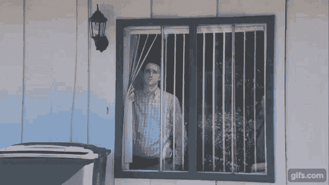
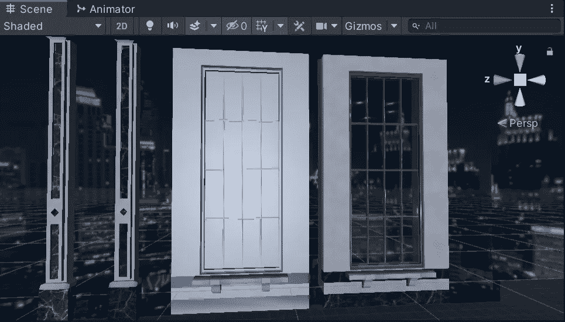
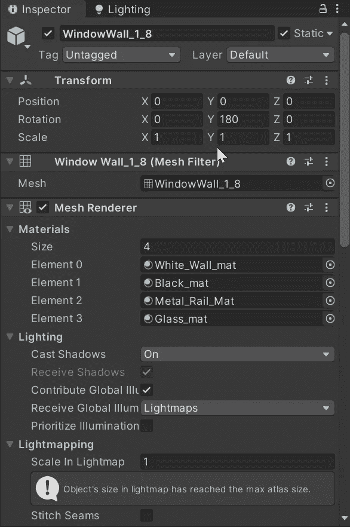
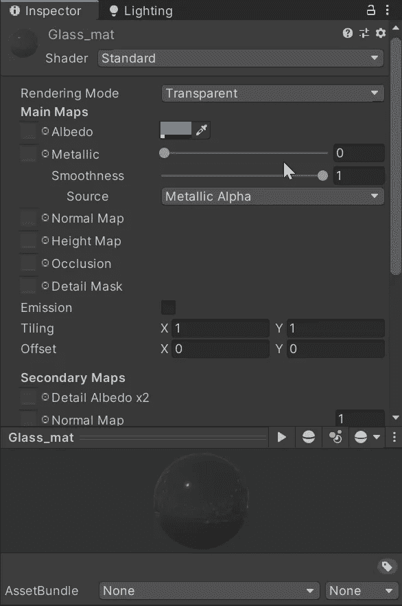
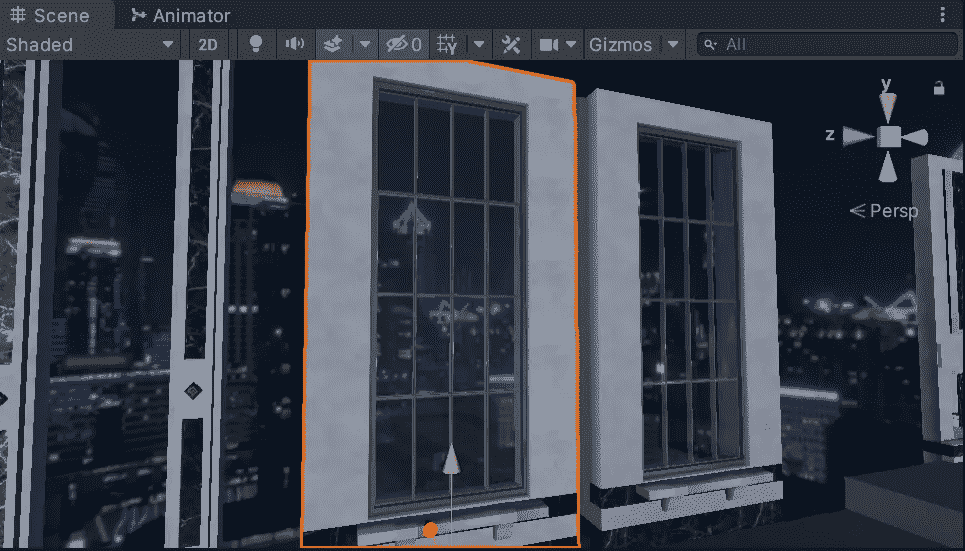

# 在 Unity 中创建透明窗口效果的游戏

> 原文：<https://medium.com/geekculture/creating-a-transparent-window-effect-in-unity-341e8473f0e7?source=collection_archive---------31----------------------->

在 Unity 中，我们的材质不一定需要是纯色或纹理。我们也可以引入透明的效果来创造玻璃。下图是一个没有材料的窗户，一个成品。

这个物体已经设置了多个**网格**，允许在不同的**元素**上使用不同的**材质**。如前所示，我们可以很容易地为类似大理石的结构创建材质，但是要创建玻璃材质，我们需要为我们的**着色器**使用不同的**渲染模式**。

如果我们创建一个新的材质，并将其渲染模式设置为**透明**，并转动**平滑度**，我们会得到一个很好的玻璃材质的起点。调整**金属**变量允许我们改变透明度和反射率。

我们不需要任何预定义的纹理来创建一个相当好看的玻璃材料，尽管我们可以调整**反照率**颜色来给玻璃一个特定的色调，如果我们愿意的话。

一旦我们潜入**光探头，**我们也能够通过我们的**透明**玻璃材料投射更多的反射和光。