# 使用 Azure 函数、Azure Cosmos DB MongoDB API 和 C#创建 Web API

> 原文：<https://medium.com/geekculture/creating-a-web-api-with-azure-functions-azure-cosmos-db-mongodb-api-and-c-9bd8d528405a?source=collection_archive---------0----------------------->

## 在本教程中，我们将使用 Azure 函数构建一个 Web API，它使用 C#中的 MongoDB API 在 Azure Cosmos DB 中存储数据


Azure Cosmos DB 是一个全球分布式、多模型、NoSQL 数据库服务，它允许我们构建高度可用和可伸缩的应用程序。Cosmos DB 通过它的 [SQL API](https://docs.microsoft.com/en-us/azure/cosmos-db/introduction) 和 [MongoDB API](https://docs.microsoft.com/en-us/azure/cosmos-db/mongodb-introduction) 支持使用文档模型数据的应用程序。

我一直想在 Cosmos DB 的 Mongo API 上制作更多内容，所以在这篇文章中，我将在 [Azure Functions](https://docs.microsoft.com/en-us/azure/azure-functions/) 中开发一个使用 Cosmos DB MongoDB API 帐户的无服务器 API。这篇文章大致基于这篇关于用 ASP.NET 核心和 MongoDB 创建 Web API 的精彩教程。

到本文结束时，您将知道如何创建一个使用 MongoDB API 的 Cosmos DB 帐户。您还将知道如何用 C#创建一个简单的 CRUD Web API，与 Mongo DB API 帐户进行交互。

如果您想在阅读本文之前看到完整的代码，可以在我的 GitHub 上查看:

[](https://github.com/willvelida/cosmosdb-mongo-api) [## willvelida/cosmosdb-mongo-api

### 通过在 GitHub 上创建一个帐户，为 willvelida/cosmosdb-mongo-api 开发做出贡献。

github.com](https://github.com/willvelida/cosmosdb-mongo-api) 

你需要跟随这篇文章:

*   带有 Azure 开发工作负载的 Visual Studio 2019。
*   Azure 订阅。
*   [邮递员](https://www.postman.com/)。

【Azure Cosmos DB 如何支持一个 MongoDB API？

[Azure Cosmos DB 为 MongoDB](https://docs.microsoft.com/en-us/azure/cosmos-db/mongodb-introduction#wire-protocol-compatibility) 实现了有线协议，允许我们使用我们习惯的客户端驱动程序和工具，但允许我们在 Azure Cosmos DB 中托管我们的数据。

如果我们已经有了使用 MongoDB 的应用程序，这就太好了。我们可以更改我们的应用程序来使用 Azure Cosmos DB，而不必对我们的代码库进行重大更改。我们还可以获得 Azure Cosmos DB 的好处，例如在吞吐量和存储方面的交钥匙分发和弹性可伸缩性。

**建立账户**

让我们建立我们的宇宙数据库帐户。登录 Azure 并点击创建资源。查找 Azure Cosmos DB，然后单击“**新建**”。

在“**创建 Azure Cosmos DB 帐户**”页面上，提供以下配置:

*   *资源组*—Azure 中的资源组是资源的逻辑集合。对于本教程，您可以创建一个新帐户或将您的帐户添加到现有帐户中。
*   *帐户名称* —这将是您的帐户名称。它需要在 Azure 中是唯一的，所以要做得好:)
*   *API* — Azure Cosmos DB 是一个多模型数据库，但是当我们创建一个 Cosmos DB 帐户时，我们只能选择一个 API，并且这将是帐户生命周期内的 API。因为这是一个 Mongo DB API 教程，所以选择'**Azure Cosmos DB for Mongo DB API**'选项。
*   *位置* —我们希望提供帐户的位置。我选择了澳大利亚东部，因为那里的数据中心离我很近，但请选择离您很近的数据中心。
*   *容量模式* —简而言之，这就是该客户将如何调配吞吐量。如果你感兴趣，我已经写了一些关于吞吐量如何在 Cosmos DB 中工作的文章，但是现在选择'**无服务器**'(在撰写本文时仍在预览中)。
*   *账户类型* —选择生产
*   *版本* —这是帐户将支持的 MongoDB 有线协议的版本。选择 3.6
*   *可用区域* —暂时禁用。

您的配置应该如下图所示。

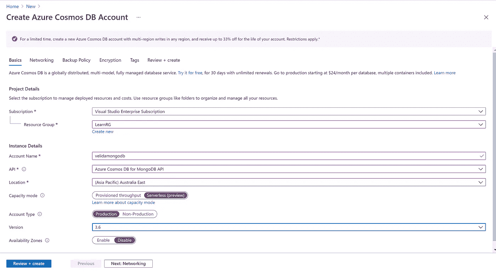

点击查看+创建，然后创建您的 Cosmos DB 帐户。在你等待的时候，请随意喝杯茶。

一旦我们的帐户设置好了，我们就可以创建本教程所需的数据库和集合了。在最初的博客文章中，我们将通过 Mongo Shell 创建我们的数据库和集合。但是为了简单起见，我们可以在门户中这样做。

在你的 Cosmos DB 账户中，打开你的数据浏览器，点击“**新收藏**”。输入' **BookstoreDB** '作为您的数据库名称，输入 Books 作为您的收藏名称。然后我们被要求选择一个分片密钥。

Mongo DB 中的分片是一种跨多台机器分发数据的方法。如果你在 Azure Cosmos DB 中使用过 SQL API，这类似于一个分区键。本质上，这个碎片将帮助您的应用程序通过水平扩展在吞吐量和存储方面进行扩展。

对于本教程，我将选择这个名称作为分片键。单击“确定”创建您的数据库和集合。

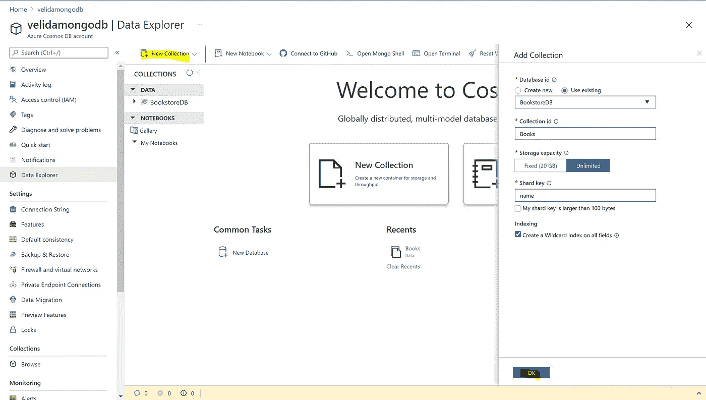

我们现在有我们的数据库，收集和帐户都成立。在设置之前，我们还需要一样东西，我们的连接字符串。点击连接字符串并复制*主连接字符串*值。这个留着以后用。

**创建我们的函数应用。**

让我们进入 Visual Studio 并创建我们的无服务器 API。打开 Visual Studio，点击“**新建一个项目**”。

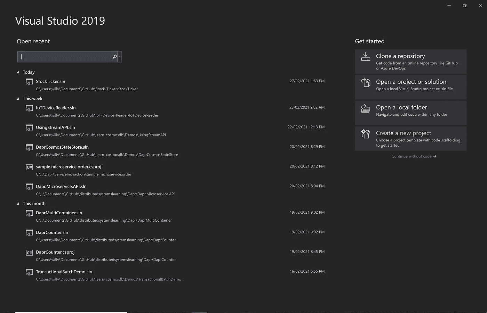

选择' **Azure Functions** 作为我们创建项目的模板。(确保 C#是选定的语言)。

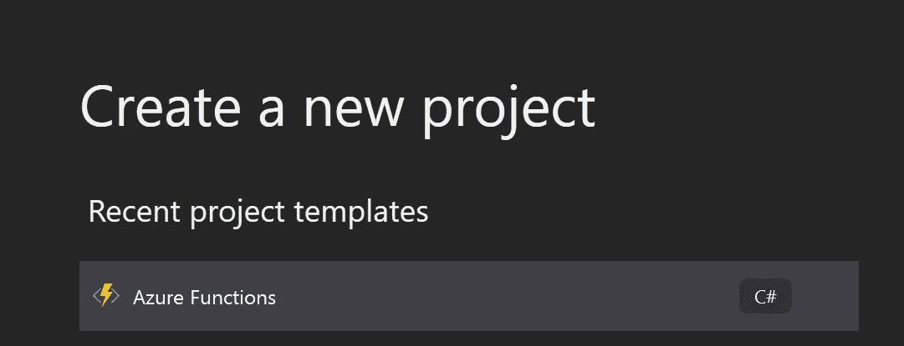

将此项目命名为' **CosmosBooksApi** '，将项目存储在您选择的位置，然后单击创建:

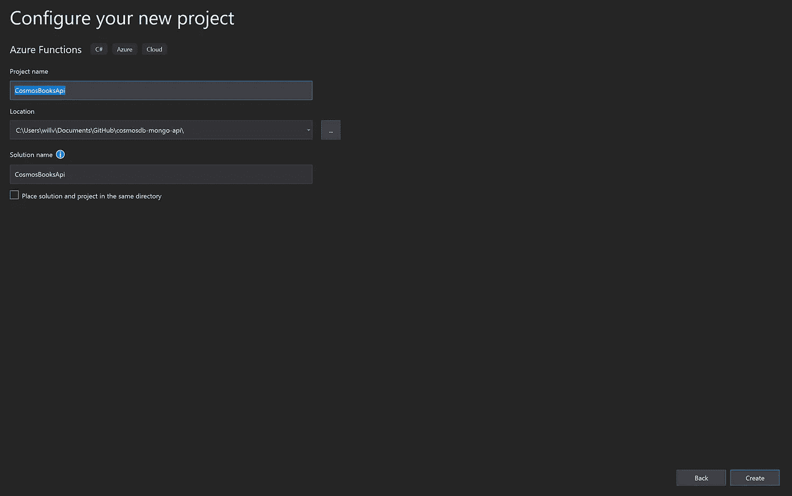

选择 Azure 函数 v3(。NET Core)作为我们的运行时，并创建一个没有触发器的空项目:

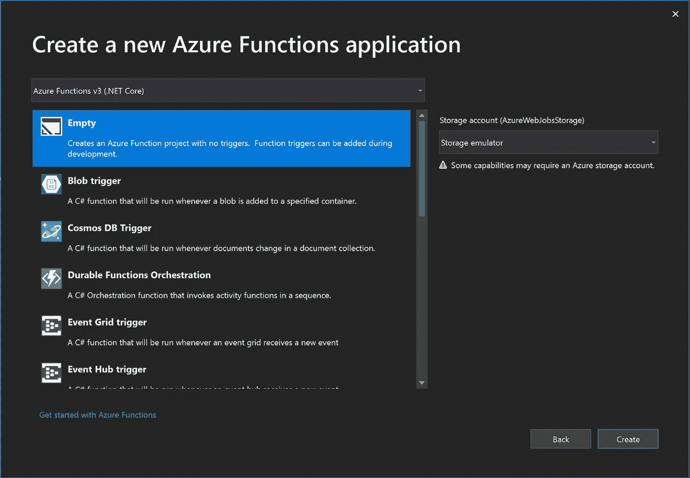

在我们开始创建任何函数之前，我们需要安装 **MongoDB。驱动程序**包。为此，右键单击您的项目并选择' **Manage NuGet Packages** '。在 Browse 部分，键入 MongoDB。驱动程序并安装最新的稳定版本。

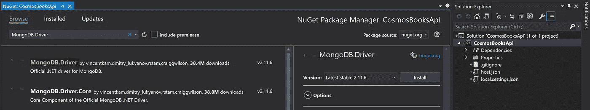

安装完成后，让我们创建一个 *Startup.cs* 文件，它将实例化我们的 *MongoClient* :

从 Azure Functions 的 v2 开始，[我们有了对依赖注入的支持](https://docs.microsoft.com/en-us/azure/azure-functions/functions-dotnet-dependency-injection)。这将帮助我们将我们的 *MongoClient* 实例化为一个 Singleton，因此我们可以在我们所有的函数之间共享我们的 *MongoClient* ,而不是每次我们想要调用函数时都创建一个新的客户端实例。

让我们复习一下这节课。为了注册我们的服务，我们需要向一个 *IFunctionsHostBuilder* 实例添加组件，我们在 *Configure* 方法中将它作为参数传递。

为了使用这个方法，我们需要向启动类本身添加*functions Startup*assembly 属性。

然后我们创建一个类型为 *IConfiguration* 的新配置。所有这些都是从一个 *local.settings.json* 文件中获取函数应用程序的配置。然后，我们将 *IConfiguration* 服务作为单例添加。

然后我们可以设置我们的 *MongoClient* 。我们首先设置我们的连接字符串，将之前的*主连接字符串*作为 *MongoUrl()* 对象传入。将它保存在您的 *local.settings.json* 文件中。作为参考，这是我的文件的样子:

然后我们可以将设置的键(" **ConnectionString** ")传递给我们的 *MongoUrl* 对象。

然后，我们需要使用 *SslSettings* 中的 Tls12 协议为我们的 *MongoClientSettings* 启用 SSL。这是 Azure Cosmos DB 连接到我们的 MongoDB API 帐户所必需的。

一旦我们设置了我们的 *MongoClientSettings* ，我们就可以将它传递给我们的 *MongoClient* 对象，我们将它设置为一个单例服务。

如果你想了解更多关于 Azure 函数中依赖注入的知识，请查阅相关文档:

[](https://docs.microsoft.com/en-us/azure/azure-functions/functions-dotnet-dependency-injection) [## 在中使用依赖注入。NET Azure 函数

### Azure Functions 支持依赖注入(DI)软件设计模式，这是一种实现

docs.microsoft.com](https://docs.microsoft.com/en-us/azure/azure-functions/functions-dotnet-dependency-injection) 

现在我们需要创建一个基本的类来表示我们的图书模型。让我们写以下内容:

在这个类中，我们有书的 Id、名称、价格、类别和作者的属性。Id 属性已经用 *BsonId* 属性进行了注释，表示这将是文档的主键。我们还用*【bson presentation(bson type。ObjectId)]* 来传递我们的 Id 作为类型字符串，而不是 *ObjectId* 。Mongo 将为我们处理从 string 到 *ObjectId* 的转换。

我们其余的属性已经用*【bson element()】*进行了注释。这将决定我们的属性在集合中的外观。

现在，我们将创建一个服务来处理与我们的 Cosmos DB 帐户一起工作的逻辑。让我们定义一个名为 *IBookService.cs* 的接口

这只是一个简单的 CRUD 接口，它定义了我们的服务应该实现的契约。现在让我们实现这个接口:

我已经将我的依赖项注入到我的 *MongoClient* 和 *IConfiguration* 中，然后我创建了我的数据库和集合，这样我就可以对它们执行操作。让我们逐一探索不同的方法。

[**insertone async**](https://mongodb.github.io/mongo-csharp-driver/2.5/apidocs/html/M_MongoDB_Driver_IMongoCollection_1_InsertOneAsync.htm)—这将把单个文档异步插入到我们的 *IMongoCollection* 中。这里，我们传入想要持久化的文档，这个案例是 Book 对象。我们还可以传入一些自定义选项( *InsertOneOptions* )和一个*取消令牌*。除了插入操作“Task”的结果之外，我们在这里不返回任何内容。

[**FindAsync**](https://mongodb.github.io/mongo-csharp-driver/2.4/apidocs/html/M_MongoDB_Driver_IMongoCollectionExtensions_FindAsync__1_1.htm) —这将异步查找与我们的过滤器匹配的文档。这里，我们使用一个 lambda 表达式来查找与我们在方法中提供的 id 相同的书。然后我们使用 Linq 返回匹配的图书。

[**DeleteOneAsync**](https://mongodb.github.io/mongo-csharp-driver/2.4/apidocs/html/M_MongoDB_Driver_IMongoCollectionExtensions_DeleteOneAsync__1_1.htm) —这将异步删除与我们的表达式匹配的单个文档。同样，我们使用 lambda 表达式来查找我们想要删除的书。除了操作结果，我们不返回任何东西。

[**ReplaceOneAsync**](https://mongodb.github.io/mongo-csharp-driver/2.4/apidocs/html/M_MongoDB_Driver_IMongoCollectionExtensions_ReplaceOneAsync__1.htm)—这将异步替换单个文档。

所以我们已经创建了我们的 *MongoClient* ，并且有了一个基本的 CRUD 服务，我们可以用它来与我们的 Cosmos DB 帐户进行交互。我们现在准备开始创建我们的函数。

在本教程中，我们将创建以下函数:

*   *创建图书*
*   *删除书籍*
*   *获取所有书籍*
*   *GetBookById*
*   *更新手册*

为了创建一个新函数，我们右键单击我们的解决方案文件并选择“**添加新的 Azure 函数**”。我们应该会看到这样的弹出窗口。选择 Http Trigger 并选择 *Anonymous* 作为函数的授权级别。

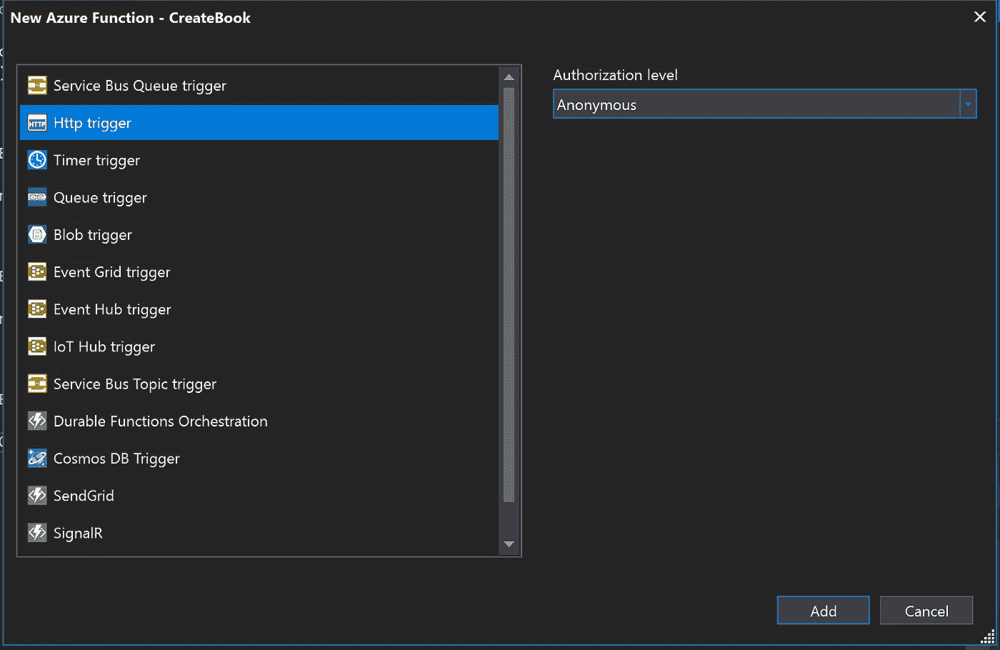

让我们从我们的 *CreateBook* 函数开始。代码如下:

在这里，我们将我们的 *IBookService* 和 *ILogger* 注入到函数中。我们通过向' **/Book** '路由发出 post 请求来调用这个函数。我们获取传入的 *HttpRequest* 并将其反序列化为一个 *Book* 对象。然后我们将这本书插入到我们的图书收藏中。如果我们成功了，我们得到一个 201 响应(已创建)。如果没有，我们将抛出 500 响应。

这是一个有点戏剧性的反应代码。如果我们的 Cosmos DB 帐户不可用，我们会抛出一个不同的代码，但对于这个基本的例子来说，这就足够了。

现在让我们来看看 *DeleteBook* 函数:

这一次，我们向函数(' **/Book/id** ')传递一个 id 来查找我们想要从收藏中删除的书。我们首先使用 *IBookService* 方法寻找这本书。 *GetBook* (id)。如果我们的书不存在，该函数将抛出一个 404(未找到)响应。

如果我们可以找到这本书，那么我们将这本书传递给我们的 *RemoveBook* (book)方法，从我们在 Cosmos DB 中的收藏中删除这本书。如果成功，我们返回 204 响应。

下面是 *GetAllBooks* 函数的代码:

在这个函数中，我们简单地向'**/Books【T1]'路由发出一个 GET 请求。该函数将调用。 *GetBooks* ()方法在我们的 *IBookService* 上检索我们收藏的所有书籍。如果没有书，我们抛出 404。如果有书返回给我们，该函数将把它们作为一个数组返回给用户。**

我们的 *GetBookById* 函数类似于我们的 *GetAllBooks* 函数，但是这次我们传递了我们想要返回给我们的书的 Id:

我们还将一个 id 传递给我们的 *UpdateBook* 函数。我们首先调用我们的。 *GetBook* (id)方法找到我们要更新的书。一旦我们找到了这本书，我们就读取传入的请求并将其反序列化为一个 book 对象。然后，我们使用反序列化的请求来更新我们的 Book 对象，然后将该对象传入传出。 *UpdateBook* ()方法以及我们用来调用该函数的 id。

**测试我们的功能**

现在我们已经完成了函数的编码，让我们开始运行并测试它吧！按下 **F5** 开始本地运行我们的功能。给它一秒钟的时间，你应该看到我们每个函数的以下端点。

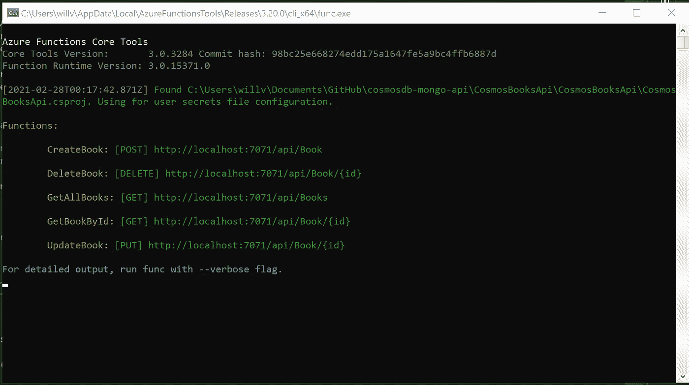

如您所见，我们的函数运行在 localhost 上。我们可以使用 Postman 来测试这些端点。

让我们从我们的 *CreateBook* 函数开始。将函数的端点复制并粘贴到 Postman 中。将请求方法设置为 **POST** 并点击 body 选项卡。我们需要将请求作为 JSON 有效负载发送，所以将其设置为 JSON 并添加以下主体

```
{
  "BookName" : "Computer Science: Distilled",
  "Price": 11.99,
  "Category": "Technology",
  "Author": "Wladston Ferreira Filho"
}
```

您的邮递员请求应该是这样的:

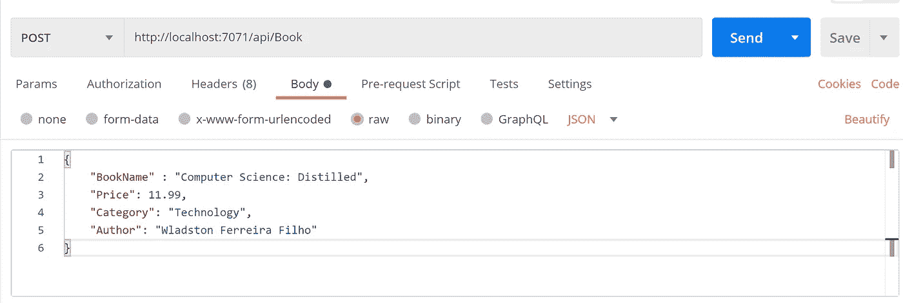

点击**发送**发送请求。我们应该得到下面的响应(201)。


我们可以在我们的 Cosmos DB 帐户中查看该文档，以确保我们将该文档添加到了我们的帐户中，该帐户具有:

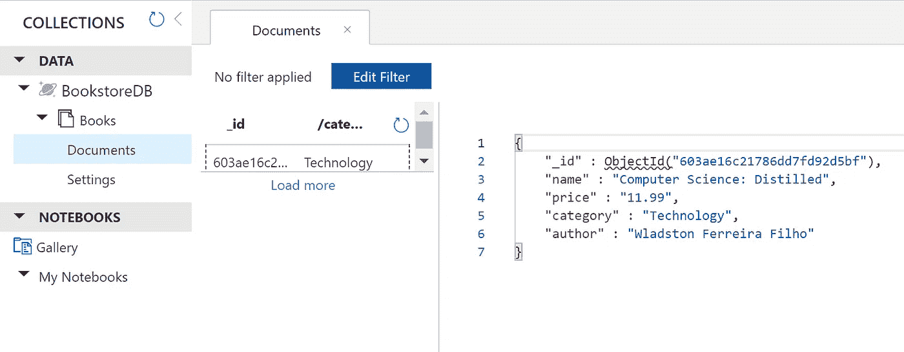

在继续之前，再插入几本书。我们现在将尝试使用 *GetAllBooks* 函数检索我们收藏的所有书籍。从主体中清除 JSON 有效负载，并将请求方法更改为 **GET** 。点击**发送**进行请求

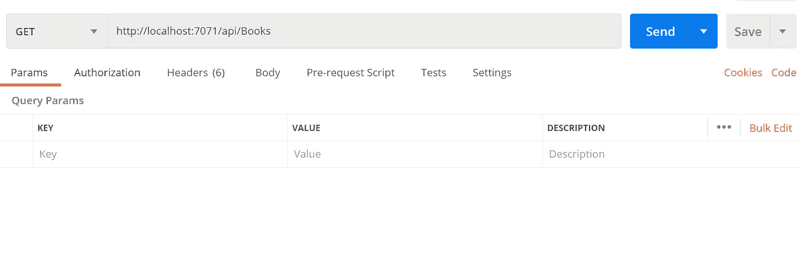

我们应该得到这样的回应:

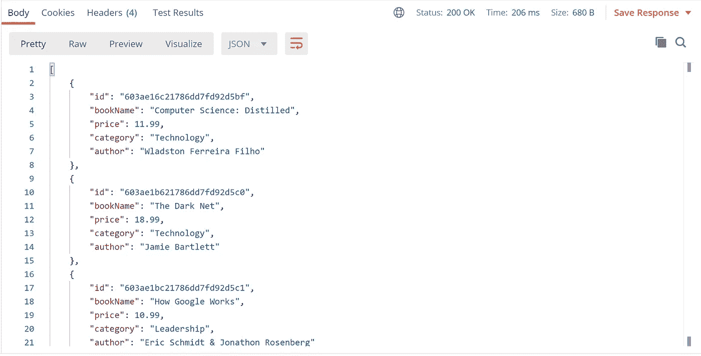

在这里，我们集合中的所有书籍都以 JSON 数组的形式返回给我们。现在，让我们测试我们的 *GetBookById* 函数。在我们的 *GetAllBooks* 函数的响应中，获取一个 id 并将其作为参数添加到您的路线中。保持身体清洁，保持**得到**请求的方法。这里所改变的是，我们通过使用 Id 来查找特定的书。

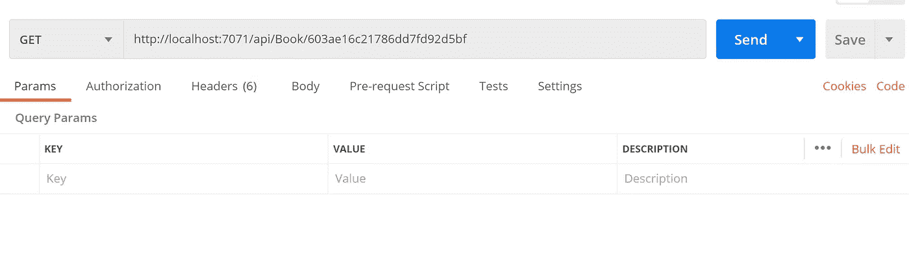

点击**发送**进行请求。我们应该让 book 对象像这样返回给我们:

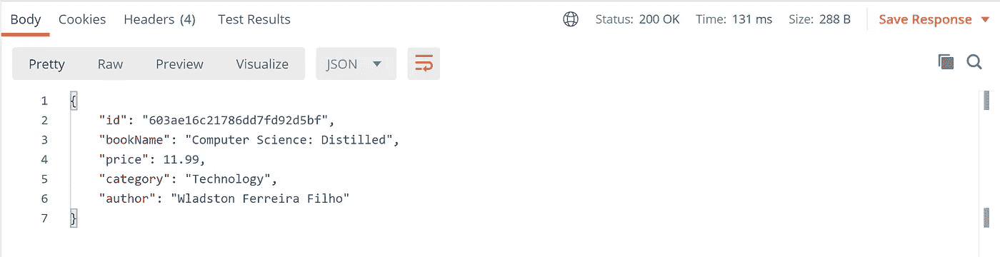

现在让我们将这本书从我们的 Cosmos DB 收藏中删除。将您的请求方法更改为**删除邮递员中的**并点击**发送**。

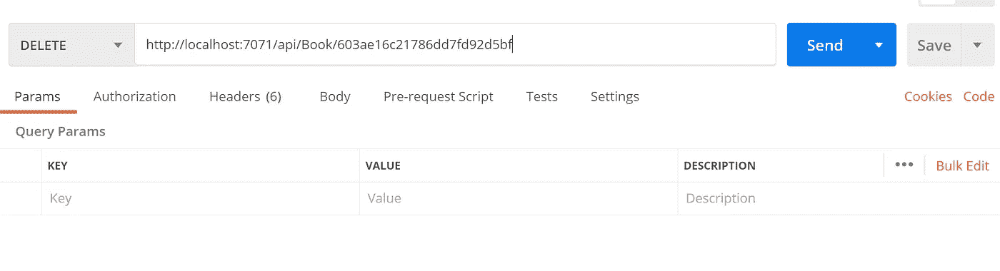

我们应该得到以下响应:

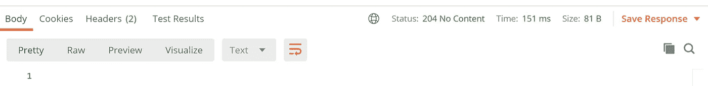

在 Azure Cosmos DB 中检查我们的收藏，我们可以看到这本书已经不在那里了:

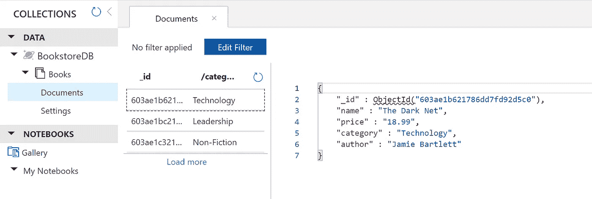

最后，我们来试试更新一本书。让我们看看我们收藏的以下书籍:

```
{
  "id": "603ae1b621786dd7fd92d5c0",
  "bookName": "The Dark Net",
  "price": 18.99,
  "category": "Technology",
  "author": "Jamie Bartlett"
}
```

获取 id 并将其用作我们的 *UpdateBook* 函数的参数。将该方法更改为一个 **PUT** 请求，并将以下主体添加到我们的请求中

```
{
  "bookName": "The Dark Net v2",
  "price": 11.99,
  "author": "Jamie Bartlett"
}
```

我们将这个主体作为 JSON 有效载荷发送。点击**发送**更新本书文档。

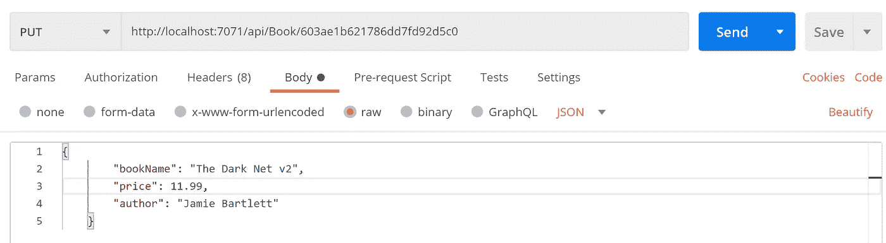

我们应该得到以下响应。

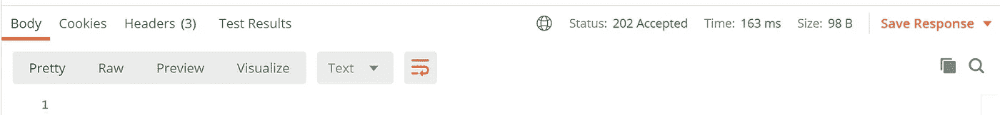

我们还可以在我们的 Cosmos DB 帐户中验证文档是否已经成功更新。

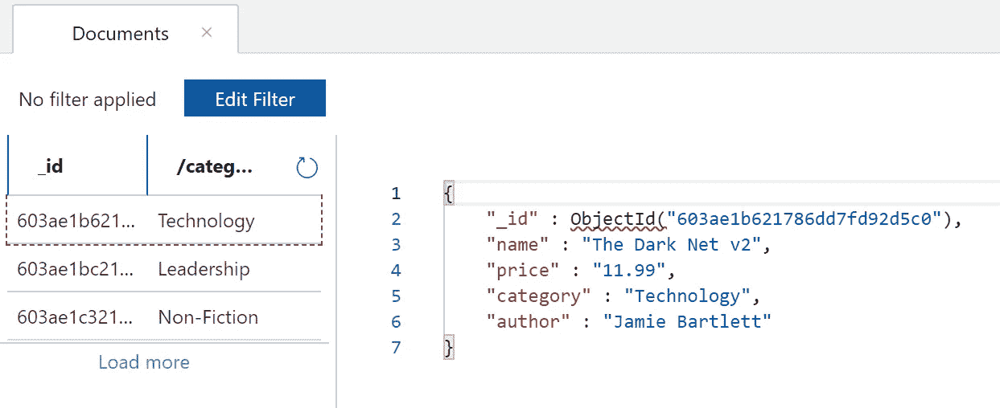

**结论**

在本教程中，我们使用 Azure 函数构建了一个 CRUD Web API，用于管理 Cosmos DB Mongo API 帐户中的图书。虽然这是一个简单的教程，但希望您可以看到，如果您已经使用 MongoDB 作为数据存储构建了应用程序，您可以轻松地切换到 Azure Cosmos DB，而无需对您的代码库进行重大更改。

如果你想下载完整的代码，请在我的 GitHub 上查看(如果你发现任何错误，并希望帮助修复，请随时做一个 PR！)

[](https://github.com/willvelida/cosmosdb-mongo-api) [## willvelida/cosmosdb-mongo-api

### 通过在 GitHub 上创建一个帐户，为 willvelida/cosmosdb-mongo-api 开发做出贡献。

github.com](https://github.com/willvelida/cosmosdb-mongo-api) 

如果您有任何问题，请在下面评论或通过 [Twitter](https://twitter.com/willvelida) 联系我。