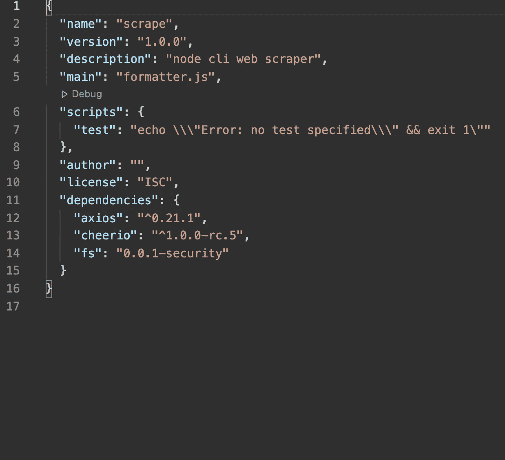
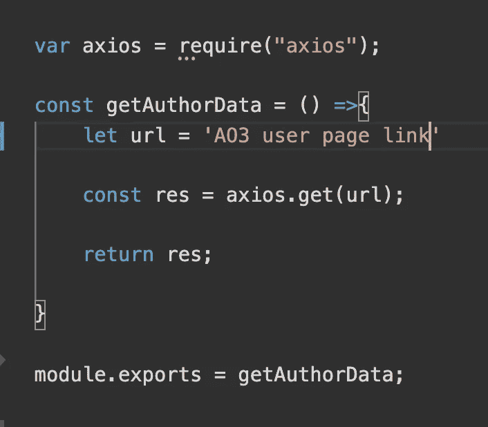
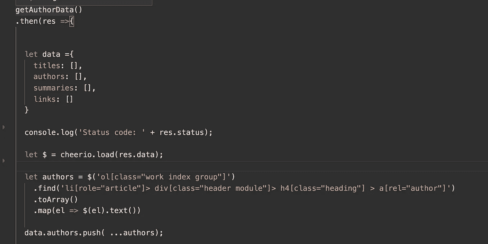
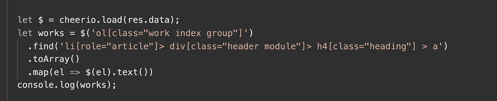
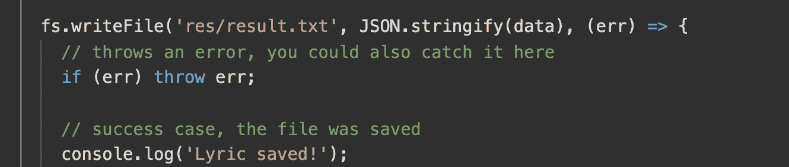

# 用节点创建 AO3 Web Scraper

> 原文：<https://medium.com/geekculture/creating-an-ao3-web-scraper-with-node-45042eec8db9?source=collection_archive---------21----------------------->

我正在做一个涉及到 AO3 的个人项目，涉及到一个用户作品的结果，令我苦恼的是，不存在我可以容易地向其发出数据获取请求的 API。

所以我决定创建我自己的 web scraper 来(部分)弥补这一点。(我相信 API 已经在 AO3 团队的待办事项列表上了，但是为什么还要等待呢？)

在做了一些研究并评估了自己的需求之后，我选择了 Node.js CLI scraper。我知道大多数网页抓取器都使用 Python，但是我的个人项目涉及到为一个[应用程序](https://sapper.svelte.dev/)获取数据，所以用 JavaScript 编写网页抓取器更有意义。(令人有点失望的是，开发团队没有继续这样做，因为这已经迅速成为我最喜欢的框架之一，但是我们能做什么呢？).

# 初始步骤

首先，你需要对 Node.js/JavaScript 有基本的了解，并理解 HTML。

像往常一样设置节点项目。如果你在这个阶段有问题，[这里有一个方便的指南来帮助](https://developer.mozilla.org/en-US/docs/Learn/Server-side/Express_Nodejs/development_environment)。

我使用的依赖项是:Axios、Cheerio 和 FS。

这里的 Axios 将用于向 url 发出请求。在这个实例中，我们只发出简单的 get 请求。您也可以自由使用 fetch 或任何其他您喜欢的依赖项。

Cheerio 用于解析我们用 Axios 检索的网页信息上的降价。同样，如果您有其他选择，请随意使用您喜欢的任何依赖项。

我在这里使用 FS 将我们抓取的结果写入一个. txt 文件。如果你愿意，你可以很容易地修改这个应用程序，将结果写入 Excel 或. csv 文件，甚至是数据库。

在继续之前安装所有这些。

安装完所有依赖项后，package.json 应该是这样的。

package.json after installing dependencies

# 正在检索网页信息

我创建了一个 webscraper_util.js 文件，并使用 Axios 向我想要获取信息的 AO3 用户页面发出 http 请求。

我们使用 Axios 发出一个简单的 GET 请求；返回的结果将是网页的 HTML。

# 网页抓取和格式化结果

现在是困难的部分。在我们从 AO3 检索到 HTML 结果后(**非常重要的注意:Axios 将返回 HTML，而不是 JSON 或任何其他容易解析的数据**)，我们将需要使用 Cheerio 来解析我们拥有的 HTML。

在检索 HTML 之后，我们使用 Promise 特性来创建数据集以供使用。

在检索和解析 HTML 之后，我们可以将数据转换成我们喜欢的格式。不过，这里有点棘手，因为我们将在一个数组中获取所有结果，并将其放在一个对象上

Cheerio 语法基本上是相同的，或者至少非常类似于 JQuery，并且使用相同的方法来选择 DOM 的各种元素。下面是一个例子:

在这个特定的实例中，我们获取标题为 AO3 用户作品的 HTML 元素，并将其转换为一个数组变量。

# 写入 txt

我选择将结果写入一个. txt 文件。这不是特别有用，但是正如前面提到的，这只是为了简单的演示目的。为了更有效地利用这一点，您可以选择将结果(经过适当的格式化后)写入您想要的任何其他文件，甚至写入后端服务器的数据库。

下面是写入. txt 文件的代码片段。

# 搞定了。

你有它！一个简单的 AO3 用户页面的网页抓取器。

您可以使用 node 在终端中运行 CLI 应用程序。

你可以在这里查看完整的回购协议。

感谢阅读！如果您有任何意见或问题，请告诉我。对我个人来说，我的目标是给 CLI 增加更多的交互性。