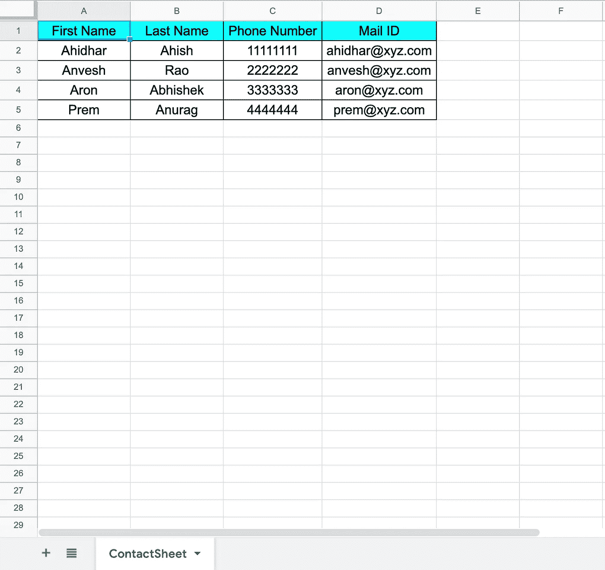
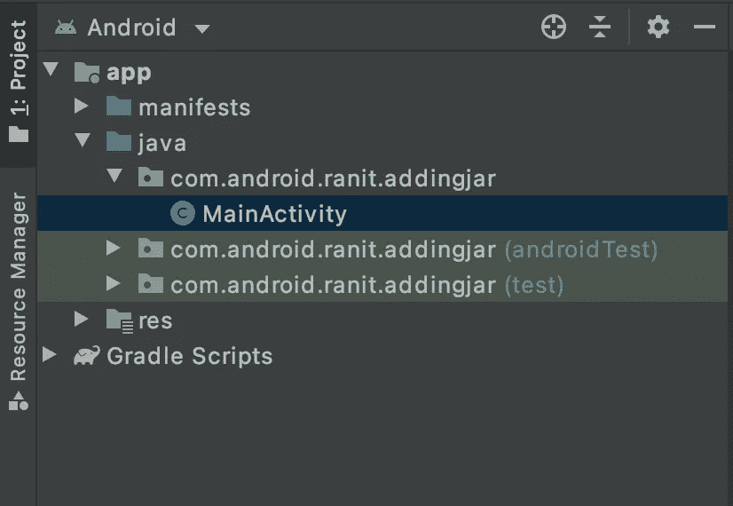
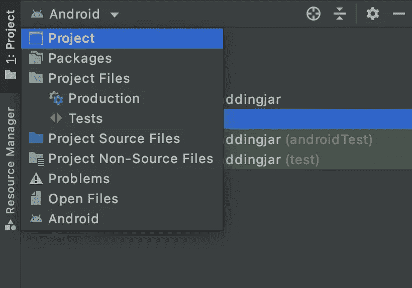
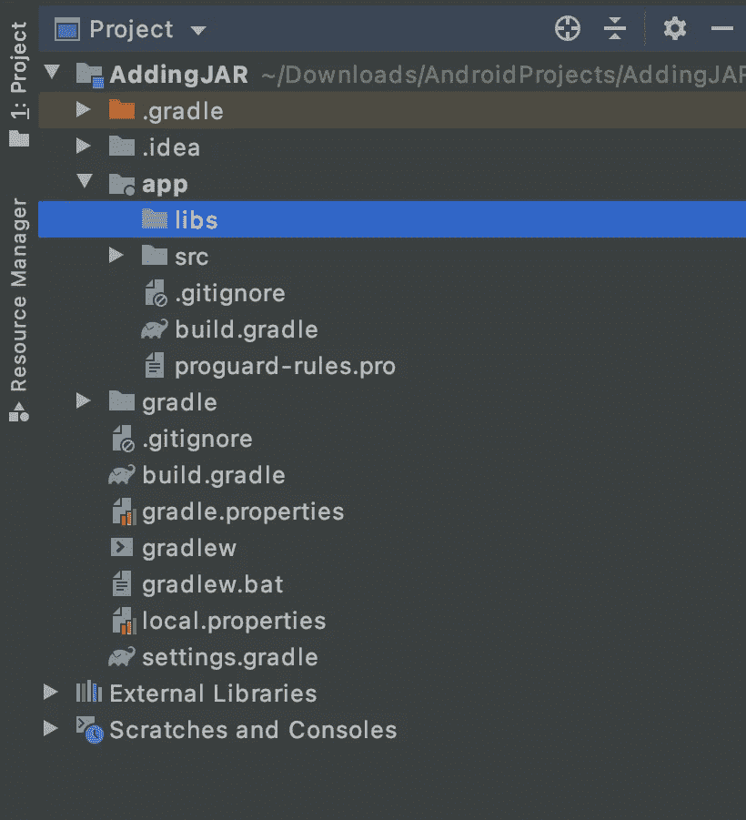
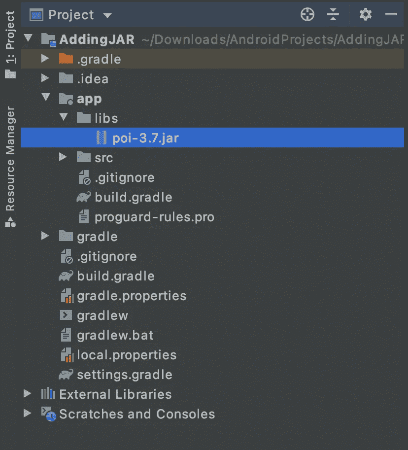
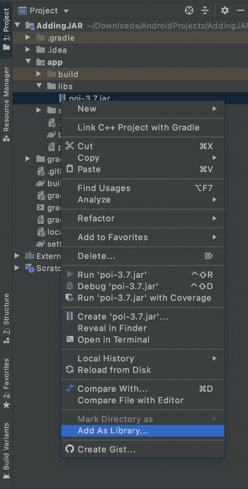
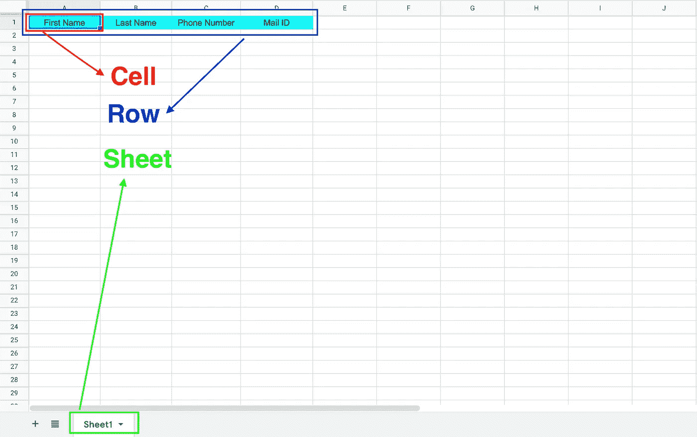
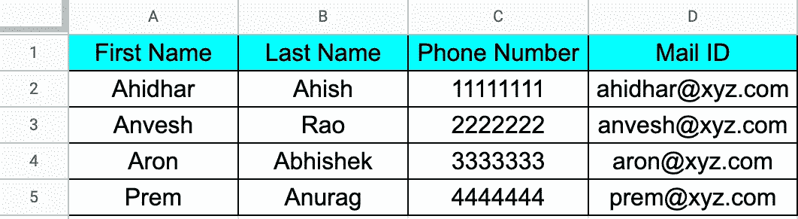

# 在 Android 中创建/读取 Excel。

> 原文：<https://medium.com/geekculture/creating-an-excel-in-android-cd9c22198619?source=collection_archive---------1----------------------->

Photo by [William Iven](https://unsplash.com/@firmbee?utm_source=medium&utm_medium=referral) on [Unsplash](https://unsplash.com?utm_source=medium&utm_medium=referral)

随着移动设备的指数级增长，数据访问的便利性增加了十倍。

我们可以在移动设备上看到与任何领域相关的所有数据，例如，一个组织的年营业额、上个月加入的员工人数等。然而，在移动应用程序上显示数据是有用的，尽管当我们需要与管理层或其他人共享相关数据时，它变得非常无用。这是数据导出派上用场的地方，并且可以在今天的大多数移动应用程序中看到。

# 概述:

我们想创建一个我们自己的*‘Contact’*应用程序，如下面的视频所示。

在此应用中:

*   最初，我们将查询 Contacts 内容提供者，以便检索 Android 设备中存在的所有联系人。
*   接下来，我们将所有联系人导出到一个 Excel 工作簿(。xls 格式)
*   最后，我们将从先前生成的 xls 工作簿中读取数据，并在 recycler 视图中显示结果。
*   作为一个额外的功能，我们还可以通过支持的应用程序(例如:附近的共享，蓝牙等)共享 excel。)

Contacts Entrepot Android application preview

*你可以在这里* *找到这个应用程序的代码* [*。*](https://github.com/ranitraj/ContactsEntrepot)

## 但是，在本文中，我们将只涉及以下内容:

1.  *下载 jar 文件。*
2.  *在 Android Studio 中将 jar 导出为依赖项。*
3.  *创建 Excel 工作簿。*
4.  *从 Excel 工作簿导入数据(读取)。*
5.  *将数据导出(写入)到 Excel 工作簿。*

到本文结束时，你将能够生成下面的 excel 工作簿:

不要再浪费时间了，让我们马上开始吧！

# 下载 JAR 文件

我们将利用 [Apache 的 POI](https://poi.apache.org/) 项目来实现我们的目标。完全免费，可以从 [**这里**](http://www.java2s.com/Code/Jar/p/Downloadpoi37jar.htm) 下载。

根据官方文件:

> 你可以用 Java 读写 MS Excel 文件。此外，您还可以使用 Java 读写 MS Word 和 MS PowerPoint 文件。Apache POI 是您的 Java Excel 解决方案(适用于 Excel 97–2008)。

因此，我们不仅可以使用 POI 来生成 excel，它还可以用于创建 MS Word 和 MS Power point。但是，这超出了本文的范围。

# *在 Android Studio 中将 jar 导出为依赖项*

接下来，我们需要在 Android Studio 中将 JAR 导出为一个依赖项。我在下面一步一步地描述了同样的情况:

## 步骤 1:导航到左侧的项目结构

Android file structure

## 第二步:通过选择下拉菜单切换到“Android”的“项目”表单

Switching to Project view

## 步骤 3:在“app”目录中选择“libs”文件夹

Navigate to libs folder within the Project structure

## 第 4 步:复制下载的 JAR 并粘贴到“libs”目录

Copy and paste the JAR file into the libs directory

## 步骤 5:(最重要的)添加 JAR 作为库

Right click on the newly added JAR and select the option ‘Add as library’

将其添加为库会自动处理添加和编译 *build.gradle* 中的文件*(' libs/library _ name . jar ')*。我们不需要手动添加。

就是这样！现在，您已经将 Android Studio 中的 JAR 导出为一个库。

# 创建 Excel 工作簿

在本节中，我们将详细介绍创建 excel 工作簿的过程。

在此之前，让我们先熟悉几个 excel 术语:

*   *细胞*
*   *工作表*
*   排
*   *工作簿*

我们可以试着用以下方式联系这些术语:

*   **工作簿**是**工作表的集合。**
*   **工作表**是**行**(和列)的集合。
*   **行**是**单元格**的集合。

那么，让我们开始吧！

**步骤 1:创建新的“工作簿”**

**步骤 2:创建新的“工作表”**

**步骤 3:创建新的“行”**

**步骤 4:创建一个新的“*单元格”*，并为其分配“样式”**

*   最初，我们声明一个类型为“cell”的变量“Cell”
*   接下来，我们要创建一个“单元格样式”，它可以分配给任何单元格*(例如，excel 表中的标题行)*，并根据需要定制它。例如，设置前景色、对齐等。
*   接下来，我们创建一个新的“单元格”并将其分配给一个“行”
*   最后，我们为单元格设置值和样式。

**合并步骤 1 至 4:**

上面的代码将生成一个包含 4 个单元格的单行，如下所示:

在我们继续下一步之前，请确保您已经在“清单”中添加了必要的权限

# 从 Excel 工作簿导入数据(读取)

在本节中，我们将尝试理解从 excel 工作簿中读取数据的过程。

在本节结束时，我们将能够从下面显示的 excel 工作簿中读取数据，即从 android 设备中导出的联系人列表(假设在 Android 设备中显示)。

**第一步:从存储器中访问 Excel 文件**

**步骤 2:创建一个引用。xls 文件**

**步骤 3:从工作簿中提取所需索引处的工作表**

**步骤 4:遍历工作表中的行和单元格**

*   遍历工作表中的每一行。
*   使用 *'row.cellIterator()'* 迭代一行中的每个单元格
*   检查每个单元格的单元格类型，并相应地设置数据格式。
*   打印值*(参考 GitHub 应用程序的链接* [*这里*](https://github.com/ranitraj/ContactsEntrepot) *我已经将数据存储在一个列表中)*

**合并步骤 1 至 4:**

# 将数据导出(写入)到 Excel 工作簿中

在本节中，我们将了解将 Android 应用程序中的数据(比如手机中所有联系人的列表)导出到 excel 工作簿并将其存储在外部存储中的机制。

这真的很简单，因为我们之前已经研究过生成工作簿的机制。这里我们需要做的就是从任何数据源(例如:List)读取数据，并将其适当地转换为单元格和行，以生成如下所示的 excel 表格:

但是，将数据写入 excel 的完整代码可以在本节末尾找到。

**第一步:将列表中的数据填入 Excel**

**步骤 2:检查外部存储器是否为只读**

**第三步:检查存储空间是否可用**

**步骤 4:将 Excel 存储在外部存储器中**

**结合所有步骤:**

在代码中使用上述函数时(假设在 MainActivity 中)，只需执行以下操作:

这就是我们如何使用“Apache POI”库生成 Excel。此外，还可以从中读取和写入数据。

*如果你有兴趣看完整的代码，可以从* [*这里*](https://github.com/ranitraj/ContactsEntrepot) *随意克隆这个库。*