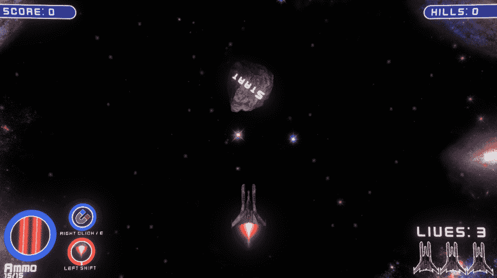
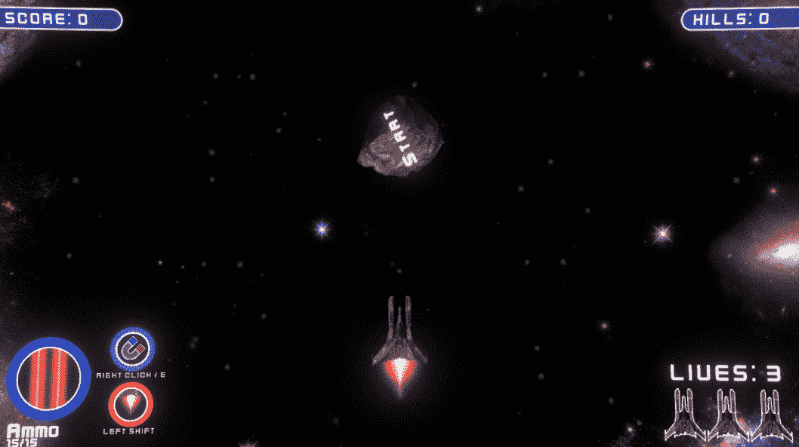
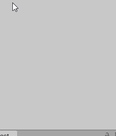
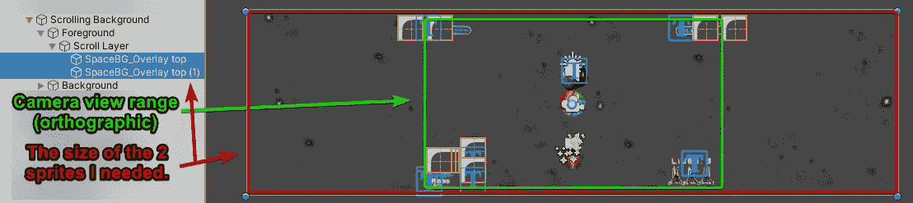
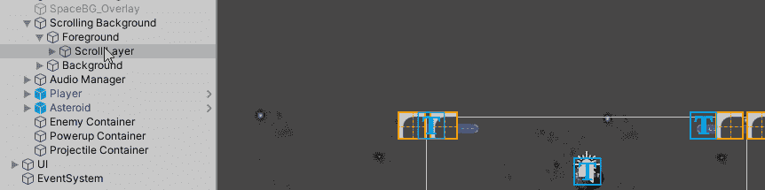
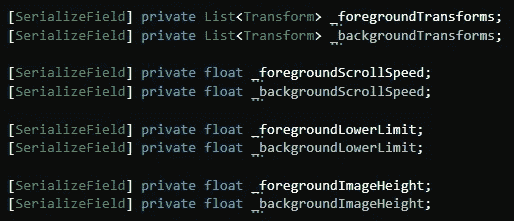
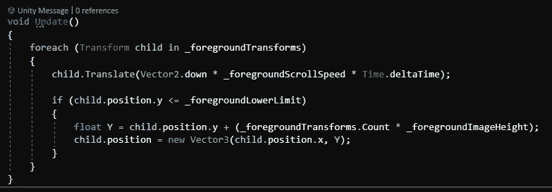
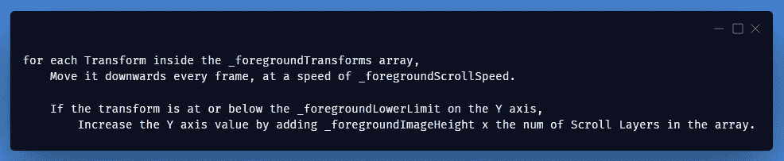
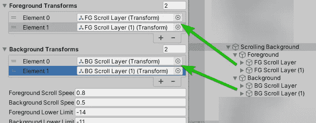
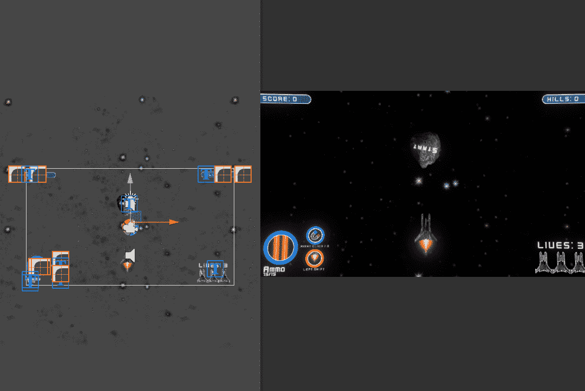

# 创建一个身临其境的滚动游戏背景！(第一部分)

> 原文：<https://medium.com/geekculture/creating-an-immersive-scrolling-game-background-part-1-4917c5b09c03?source=collection_archive---------33----------------------->

## 虽然它通常不会太引人注目，但我的太空射击游戏目前只有一个静态背景。我想给人一种持续运动的感觉，所以让它滚动起来吧！

**今天的目标:**创造一个滚动的空间背景，给人以持续运动的印象。

It will go from this…

… to this!!

看起来更真实，对吧？

## (这种制造效果的方法)需要什么:

*   一个不动的图像层代表非常遥远的景色(边上较大的星系)。
*   一个移动图像层代表中等范围的风景(褪色的移动星星)。
*   一个移动图像层来表示近距离的风景(较大的移动恒星)。
*   大量的数字和计算。**(在明天本帖的** [**第二部分**](https://vintay.medium.com/creating-an-immersive-scrolling-game-background-part-2-4652d8889553) **中，我将展示如何自动化大量的计算并去除重复的模式。真的很有帮助！)**

你可以只使用一个移动层，但是两个或更多层会增加更强的 3D 效果。

## 设置:

创建一个空的游戏对象，下面还有 2 个空的游戏对象。这两个子对象应该分别叫做“ ***【前景*** ”和“ ***【背景*** ”。

在“*下，创建另一个名为“ ***滚动层*** ”的空游戏对象。在该对象下，根据需要创建尽可能多的 2D 精灵游戏对象:*

1.  *只要填满屏幕高度，*
2.  *并用大量多余的图像填充屏幕宽度。*

**

*The image covers the whole height of the camera, and easily covers the width*

*注意:使用的精灵应该是**或者***

*   *边缘完全透明，*
*   *或者所谓的“无缝”图像。*

*现在复制 ***滚动层*** 并把它移动到原来的上面，**准确的说是**在原来的上面(缝隙一般都不好)。这可能很难做到，但很重要。在本教程的第 2 部分中，我将展示如何自动加速开发，我还将移除当你连续滚动同一张图片时明显的重复模式。*

*我建议把背景图片(在我的例子中是星星)做得小一点，不要太亮，给人一种它们离得更远的印象。这可能会导致它们的图像比例变小，这没什么。稍后在你的数字中说明这一点。*

**

*我已经创建了"*"滚动层，但你需要创建足够多的滚动层，以便其中一个滚动层可以完全脱离玩家的视野，而不在玩家的视野内留下任何空白。**

****

**Unity 设置完成！**

## **现在创建一个新的 C# Monobehaviour 脚本:**

**将其命名为“***Scrolling Background***”，并将其添加到场景中的“ **Scrolling Background** ”游戏对象(层次结构中其下有前景和背景的游戏对象)上。**

****

**Create 2 List<Transform>’s for the Scroll Layers, 2 scroll speed floats, and 2 lower limit floats, plus 2 image height floats**

****

**Create this **foreach** loop inside the **Update** method**

**上述内容的作用:**

****

**重复这个 *foreach* 循环，切换变量为背景层做同样的循环。**

**你需要通过反复试验，找出你的项目/图像的正确的“***_ * * * * * scroll speed***”、“***_ * * * * * lower limit***”和“***”_ * * * * * image height***”值。**

## **附言:**

**"***_ * * * * * scroll speed***"和"***_ * * * * * image height***"应该总是正的，而"***_ * * * * * lower limit***"很可能(也应该)是负的。**

****

**Fill in the variables in the Inspector**

**现在，如果你已经做了所有正确的事情，并且得到了所有正确的数字，你应该有一个漂亮的滚动背景，就像这样:**

****

**Obvious in the editor, but seamless in game view! The lower image layer is being raised up to the top every time it reaches the minimum Y axis value.**

**如果您发现确定正确的数值以使您的滚动看起来完美的工作是乏味或烦人的，不要担心！**

**明天，我将发布本指南的第二部分 **，向你展示如何改进这个脚本，让它自动为你完成大部分的计算！****

**如果你对此感兴趣，请给我一个掌声并跟随！；)**

**到时候见！**