# 创建一个身临其境的滚动游戏背景！(第二部分)

> 原文：<https://medium.com/geekculture/creating-an-immersive-scrolling-game-background-part-2-4652d8889553?source=collection_archive---------51----------------------->

## 继[第 1 部分](https://vintay.medium.com/creating-an-immersive-scrolling-game-background-part-1-4917c5b09c03)之后，我将升级系统，使所有那些挑剔的数字计算几乎自动化，并删除明显的重复模式！

如果你还没看过《T2》第一部，那就先去看看吧。

**今天的目标:**升级滚动后台脚本，自动完成大部分数字计算，而不是手动完成。

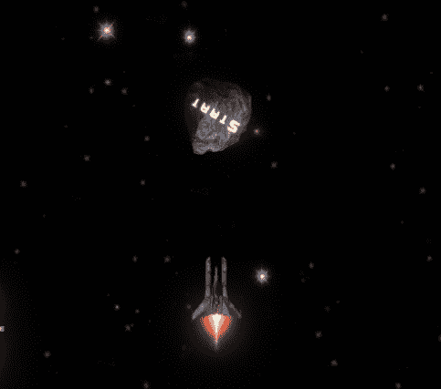

实际效果会保持不变，但是这次升级后让它看起来正确会容易很多。

## 我将 ForEach 循环转移到单独的函数中:

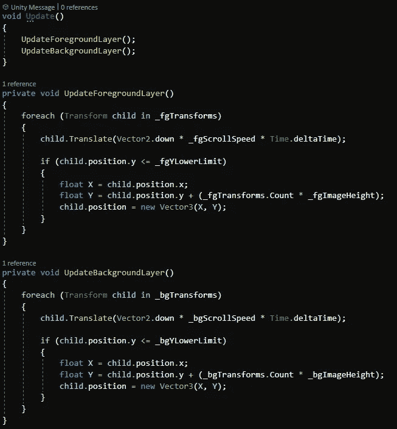

# 现在开始改进:

## **变量**(这些将很快详细解释):

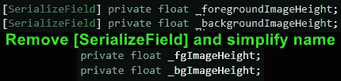

Make private and rename the Image Height variables

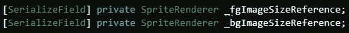

Add new Sprite Renderer variables for size

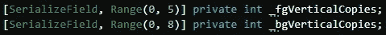

Add new Int variables for number of copies (“Range” attribute optional)

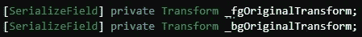

Add new Transform variables for base Transform

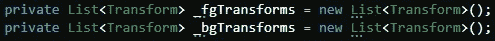

Remove [SerializeField] attribute from the existing Lists and initialize them since they’re private now

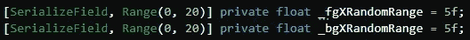

Add new Float variables for random X axis range (“Range” attribute optional)

## **功能:**

创建一个名为 ***的新函数 InitializeForegroundLayerDuplicates***。在此功能中，我们希望:

1.  将“***_ fgOriginalTransform***”添加到私有**列表<转换>**“***_ fg transforms***”，
2.  使用***_ fgXRandomRange***和***_ fgImageHeight***变量，为我们的***_ fgOriginalTransform***副本定义一个起始位置。
3.  从**0->(*_ fgVerticalCopies*-1)**创建一个 For 循环，在上面定义的起始位置实例化***_ fgOriginalTransform***的副本。
4.  并且，更新起始位置，为下一次复制做好准备。

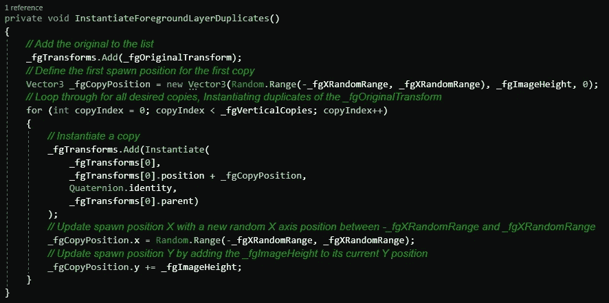

Duplicate this function and rename variables to create the same function for the background layer

## 在**和*都更新了吗？？？？*ground layer()**功能:

确保切换到 ***_？？LowerLimit*** 【变量到】 ***-_？？ImageHeight*** ”。

也让 **X** 值重新定位时定义为随机值，就像“ ***_？？CopyPosition*** "为其 X 值。

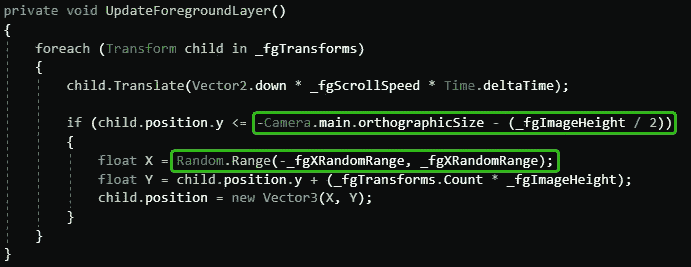

The **Camera.main.orthographicSize** calculation obviously only works if your camera is orthographic. If not, you’ll have to find another solution

## 现在创建一个新的唤醒功能:

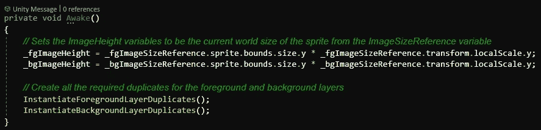

## 然后在 Unity 编辑器中:

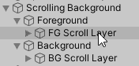

Delete all “Scroll Layers” except 1 for both Foreground and Background

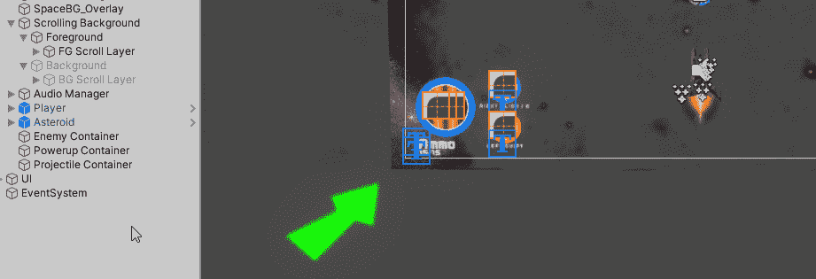

Position the Scrolling Layer for both Foreground and Background right at the bottom of the Camera view

现在，使用在删除除了 1 层之外的所有层之前你拥有的滚动层的数量，决定你需要多少层来完全垂直填充相机加上至少 1 层。

对于我的前景，我使用了一个大的图像，所以它是 **1 填充加 1 额外的**。我的背景是 **3 补加 1 额外**。

在**滚动背景**组件上，设置 ***_？？*** 变量到**这个数减 1** 。列表中已经有了原始的，所以我们只需要生成副本( *total required -1* )。

现在设置参考。

单个**滚动层**到 ***原始变换*** 变量，以及**精灵渲染器**到 ***图像尺寸引用*** 变量。如果你在**滚动层**对象下有多个精灵游戏对象，这没问题。**只要确保它们都是相同的尺寸**，因为引用的渲染器的尺寸用于所有的重新定位计算。

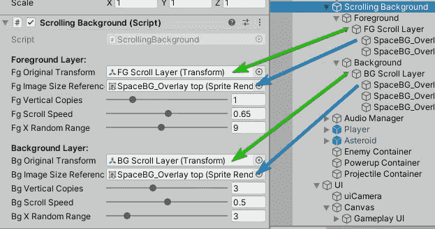

***X 随机范围*** 变量是**重新定位后的**滚动层**可以放置到零左右多远。通过添加一个随机的水平偏移，你可以避免背景中重复的图案，这些图案很容易被玩家注意到。**

## 全部完成！

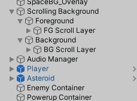

When the game starts, the single Scroll Layer is duplicated however many times you specified, and moved up each time

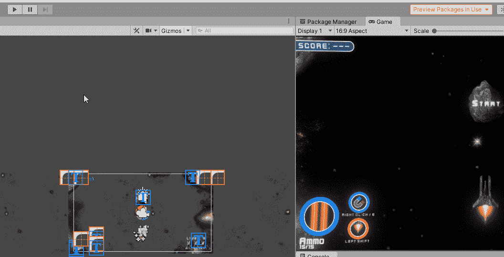

The foreground has 1 additional layer created, covering the screen, with 1 extra layer for buffer, and each layer given a random X offset to avoid patterns

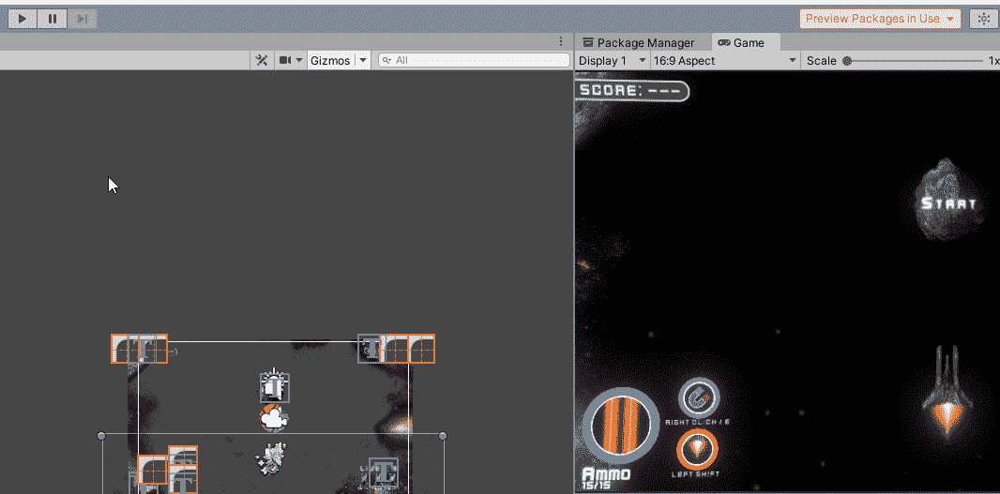

The background has 3 additional layers created, covering the screen, with 1 extra layer for buffer, and each layer given a random X offset to avoid patterns

您可以在右侧看到，两层都没有明显的图案或重复的星形位置。玩家会欣赏这一点。

我希望这有助于你创造一个更好的滚动效果！暂时就这样吧！

如果你还没有阅读[第一部分](https://vintay.medium.com/creating-an-immersive-scrolling-game-background-part-2-4652d8889553)，你可能应该去做，否则这可能会令人困惑。