# 创建一个与 TigerGraph 不和的“无限针机器人”

> 原文：<https://medium.com/geekculture/creating-an-infinite-pin-bot-for-discord-with-tigergraph-9870de089581?source=collection_archive---------23----------------------->

## 将数据从 Discord 动态加载到 TigerGraph 用 Python 构建一个不和谐机器人，为我的科学碗不和谐提供无限的针

# 目标

我的朋友最近为我们的科学碗团队创建了一个不和谐服务器。老实说，这很神奇，每个科学碗类别都有添加问题和资源的地方。也许我最喜欢的部分是有一个“邮局”，在那里我们订阅了一些科学杂志和期刊，以获得最新的科学新闻。

由于我们一天会收到这么多文章，所以我们会“锁定”最有趣的文章。但是，不一致的是，引脚的限制是每通道 50 个。因此，我创建了一个机器人，其基本功能是将我们所有的图钉移动到一个不同的#有趣文章频道，下面是如何做到这一点。

# 概观

在这个博客中，我们想要从一个频道获取固定的消息，并将其发送到另一个频道。为了确定哪个管脚去了哪里，我们将在`createGraph.py`中创建一个图表。机器人本身将在`bot.py`中，我们每次想运行机器人时都会运行它。

> 注意:`createGraph.py`只会运行一次。`bot.py`将被运行以激活机器人。

我们的文件夹结构将如下所示:

```
PinBot
├── bot.py
└── createGraph.py
```

# 第一步:创建你的机器人

首先，你需要在[https://discord.com/developers/applications](https://discord.com/developers/applications)上创建你的机器人。这里，从“新应用程序”开始

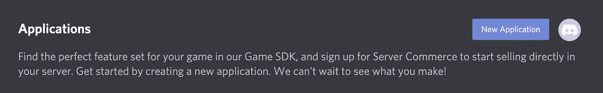

Click the “New Application” Button

接下来，命名你的机器人，并按下创建。

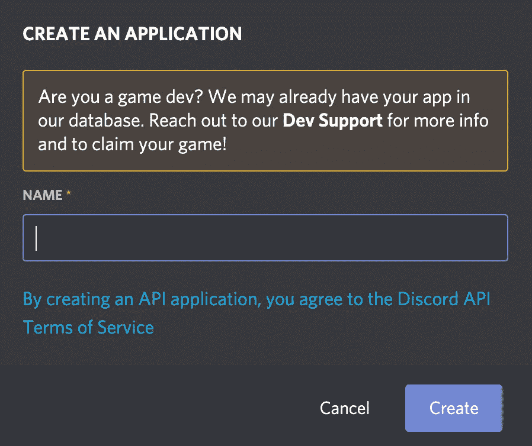

Name Your Bot and Press “Create”

在右边的菜单栏，点击“机器人”，然后按下蓝色的“添加机器人”按钮。

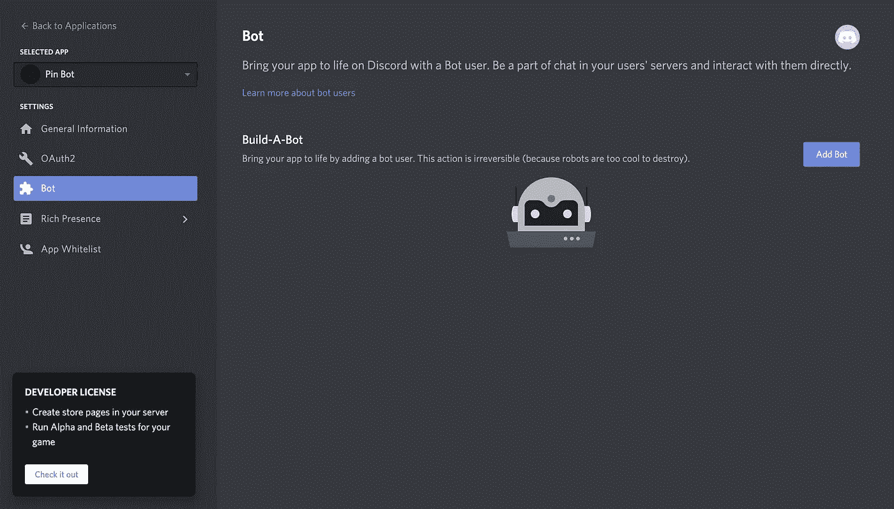

Press “Bot” then “Add Bot.”

确认后，你会看到如下页面。最重要的部分是“复制”按钮；这将复制您的令牌。我们将在 Python 文件中使用它来创建 Discord bot 功能。

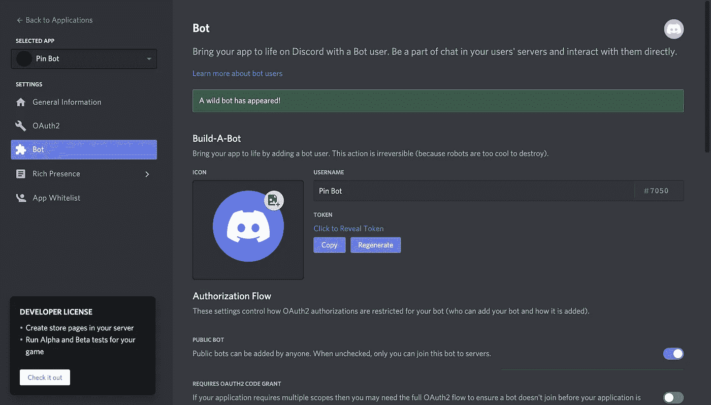

This is your created bot! Copy your Token!

# 第二步:用 Python 创建机器人的基本结构

现在我们要创建一个不和谐机器人的基本结构。这个代码将属于`bot.py`。

```
import discordclient = discord.Client()@client.event
async def on_ready():
  print(f'{client.user} has entered Discord')client.run("PASTE_YOUR_TOKEN_HERE")
```

(`PASTE_YOUR_TOKEN_HERE`应该替换为您在上一步中复制的令牌。)

让我们走一遍。首先，我们使用`import discord`导入 discord.py。discord.py 的所有文档都在[这里](https://discordpy.readthedocs.io/en/stable/)，你可以在这里[找到它的 pip 包。](https://pypi.org/project/discord.py/)

接下来，我们使用`client = discord.Client()`创建一个客户端对象。有了这个，我们将向机器人发送指令。最后，我们运行客户端，并将我们的令牌作为参数传递，指示我们正在控制哪个 bot。

# 步骤三:在 TigerGraph 中创建一个解决方案

既然 Discord 方面已经准备好了，让我们设置我们的 TigerGraph 解决方案。前往 https://tgcloud.io/[的](https://tgcloud.io/)，使用您的 TigerGraph 账户登录。

> 注意:创建 TigerGraph 云帐户是完全免费的，不需要您的信用卡号码。


Log in or register at [https://tgcloud.io/](https://tgcloud.io/).

登录后，单击“解决方案”选项卡，然后单击“新建解决方案”按钮。

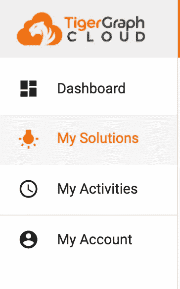

On the sidebar, click “My Solutions.”


Then click the blue “Create Solution” button.

在第一页上，选择“空白”初学者工具包。然后点击“下一步”

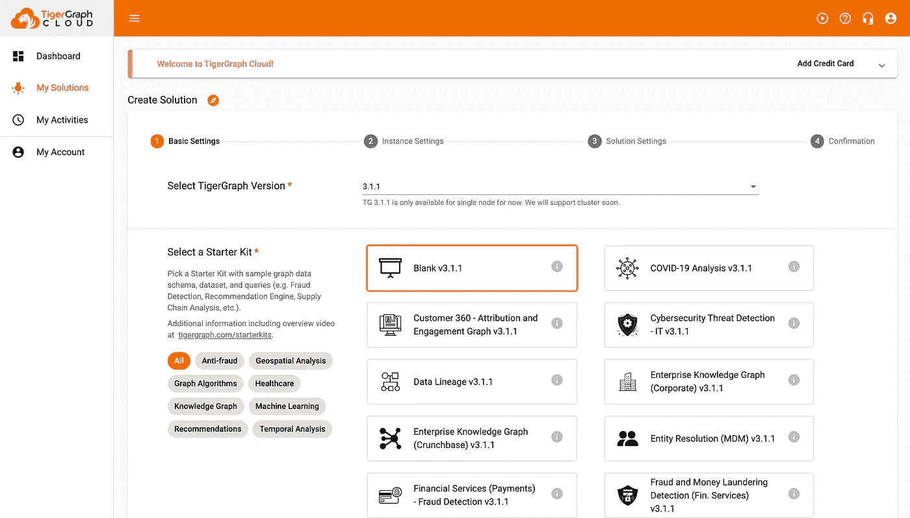

Select the “Blank” starter kit and hit “Next.”

在下一页，不要点击任何东西，按“下一步”

> 注意:这个页面设置了一个免费的 TigerGraph 解决方案。如果你需要付费解决方案，你需要添加你的信用卡并修改设置。

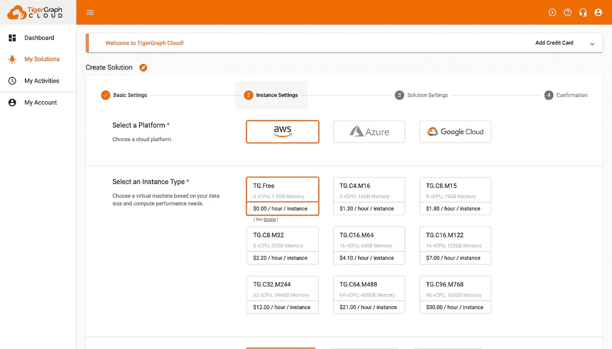

Leave this page as is and press “Next.”

在下一页上，编辑凭据。命名您的解决方案，添加标签，并添加描述。设置初始密码和子域名，并记下这些值。最后，按“下一步”

> 注意:写下你的域名和密码！此外，所有子域必须是不同的。

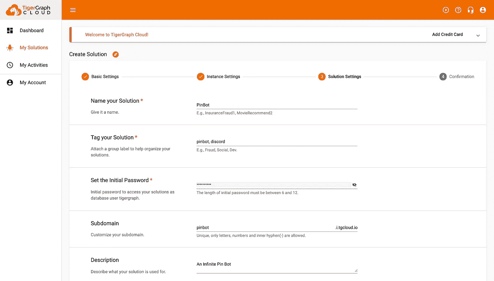

Edit this page to the details for your solution then press “Next.”

最后，在第四部分，检查您的总结是否有错误，然后点击“提交”

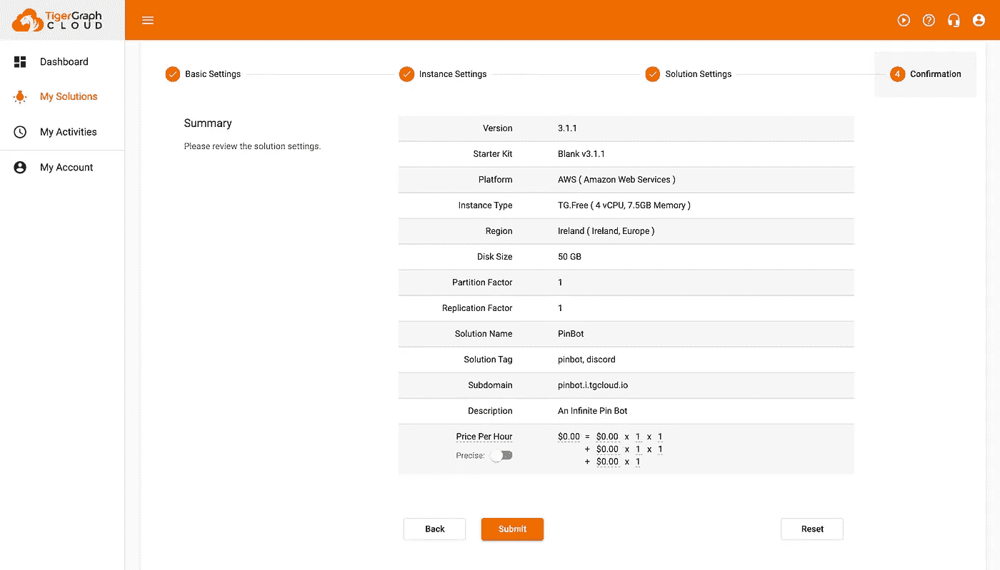

Review your summary and press “Submit.”

您的解决方案可能需要几分钟才能启动。当“解决方案”选项卡下的状态显示“就绪”并带有一个绿点时，您就知道它准备好了。

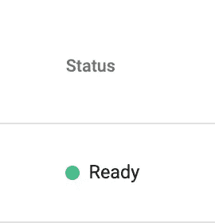

When the status is “Ready” and has a green dot, then it’s ready!

干得好！是时候将 TigerGraph 集成到我们的项目中了。

# 第四步:创建你的图表

导航到`createGraph.py`文件。在这个文件中，我们将创建图表并安装查询。

## 第四步。I:导入库并连接到解决方案

首先，你需要导入 [pyTigerGraph](https://pytigergraph.github.io/pyTigerGraph/) 。您可以使用以下命令从终端中的 pip 安装它:

```
pip install pyTigerGraph
```

安装完成后，将其导入到`createGraph.py`文件中:

```
import pyTigerGraph as tg
```

干得好！现在您需要创建一个到您的解决方案的连接。为此，请使用 tg.TigerGraphConnection。文件应该是这样的，其中 SUBDOMAIN 是您的子域，PASSWORD 是您的密码。

```
import pyTigerGraph as tgconn = tg.TigerGraphConnection(host="https://SUBDOMAIN.i.tgcloud.io", password="PASSWORD")
```

> 注意:为了正确执行，请确保您的解决方案在[https://tgcloud.io/](https://tgcloud.io/)的“解决方案”选项卡上处于“就绪”状态。

您现在已经连接到 GraphStudio 上的解决方案！现在让我们创建我们的图表！

## 第四步。II:创建图表

我们将创建一个带有通道顶点和 SEND_TO 有向边的基本图形。我们将首先创建全局顶点和边，然后创建名为 PinGraph 的图。

```
print(conn.gsql(''' CREATE VERTEX Channel(PRIMARY_ID channel_id STRING) WITH primary_id_as_attribute="true"
   CREATE DIRECTED EDGE SEND_TO(FROM Channel, TO Channel) CREATE GRAPH PinGraph(Channel, SEND_TO)'''))
```

一旦执行完毕，您可以在 GraphStudio 中看到您的图形。要访问 GraphStudio，请转到 tgcloud.io 中的“解决方案”选项卡。当您将鼠标悬停在“应用程序”上时，单击您的解决方案旁边和“操作”列下的四个框。您将看到一个下拉菜单，然后单击第一个选项 GraphStudio。

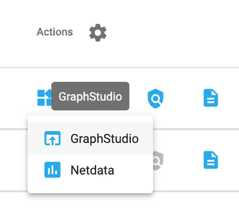

Click “GraphStudio” under the Actions column

在“设计模式”中，您应该会看到刚刚创建的模式！

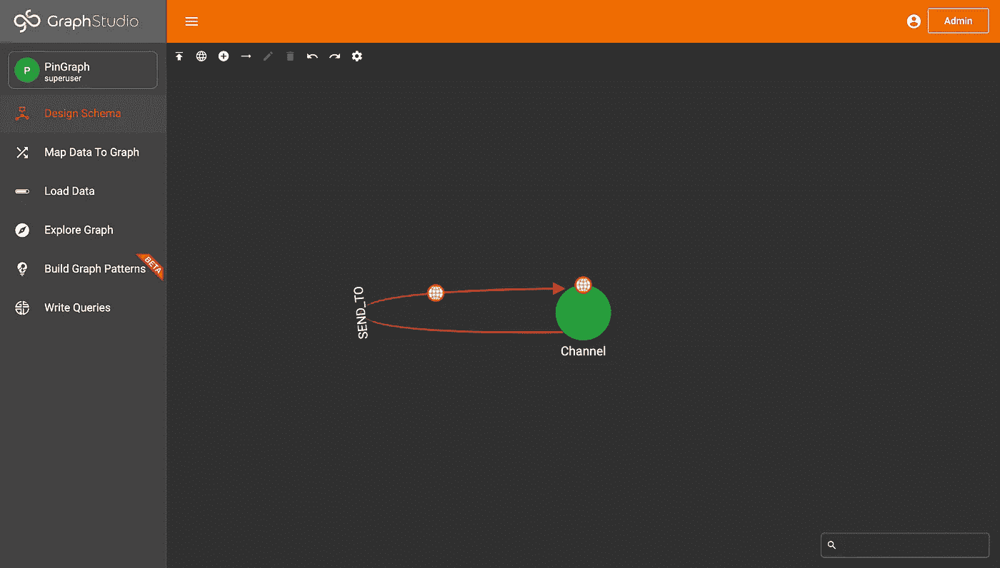

Schema for PinGraph in GraphStudio

最后，您需要更新您的图形凭证，以便我们可以安装查询。我们将把 graphname 改为 PinGraph，并生成一个 API 令牌。

```
conn.graphname = "PinGraph"conn.apiToken = conn.getToken(conn.createSecret())
```

## 第四步。III:编写一个查询

厉害！最后一个设置步骤是编写一个查询。这里，我们将需要创建一个查询，该查询将能够获取连接到某个频道的所有频道。(这样，当我们锁定一个消息时，我们就知道将数据放在哪里。)

```
conn.gsql(''' DROP QUERY getConnectedChannels CREATE QUERY getConnectedChannels(STRING id) FOR GRAPH PinGraph { Seed = {Channel.*}; Res = SELECT c FROM Seed:s -(SEND_TO:e)-> Channel:c
            WHERE s.channel_id == id;

      PRINT Res; } INSTALL QUERY getConnectedChannels''')
```

这里，我们创建查询 getConnectedChannels。我们来分解一下。

我们首先删除已经存在的查询。

```
DROP QUERY getConnectedChannels
```

接下来，我们将为我们的查询创建标题。我们称它为 getConnectedChannels，它将接受一个名为 id 的字符串。最后，这个查询将用于图形 PinGraph。

```
CREATE QUERY getConnectedChannels(STRING id) FOR GRAPH PinGraph
```

查询本身从一个种子开始。这将抓取图形中的所有通道顶点。

```
Seed = {Channel.*};
```

然后我们有了 SELECT 语句。在 FROM 子句中，它表示从种子(通道顶点)开始，经过 SEND_TO 边，最后在通道顶点结束。

SELECT 语句说要抓取目标通道顶点。(它说选择 c，并且在 FROM 子句中，目标通道顶点在 Channel:c 中被声明为 c。)

最后，WHERE 过滤我们的结果，以确保我们只获取连接到作为参数传递的通道 id 的通道顶点。

这存储在一个名为 Res 的变量中。

```
Res = SELECT c FROM Seed:s -(SEND_TO:e)-> Channel:c
      WHERE s.channel_id == id;
```

在查询的最后一行，输出 Res。

```
PRINT Res;
```

最后，我们安装查询。这可能需要几分钟来运行。

```
INSTALL QUERY getConnectedChannels
```

并且，运行第一个块，您已经创建了查询！恭喜你。您已经完成了图形和`createGraph.py`的创建。运行该文件一次，然后返回到`bot.py`以完成 bot 的创建。

> 注意:如果多次运行 createGraph.py，可能会遇到错误。在这种情况下，您可以注释掉已经执行的代码，或者使用`conn.gsql('DROP ALL')`删除所有数据并重新运行。

# 第五步:将 TigerGraph 集成到你的机器人中，并创建你的机器人

现在一切都设置好了，让我们开始编写机器人代码。

## 步骤 V.I:添加您的 TigerGraph 连接

目前，`bot.py`应该已经有了第二步中的模板。

```
import discordclient = discord.Client()@client.event
async def on_ready():
  print(f'{client.user} has entered Discord')client.run("PASTE_YOUR_TOKEN_HERE")
```

让我们导入 pyTigerGraph 并创建连接。再次确保您的解决方案已经在 GraphStudio 中启动！

```
import discord
import pyTigerGraph as tgclient = discord.Client()conn = tg.TigerGraphConnection(host="https://SUBDOMAIN.i.tgcloud.io", password="PASSWORD", graphname="PinGraph")
conn.apiToken = conn.getToken(conn.createSecret())@client.event
async def on_ready():
   print(f'{client.user} has entered Discord')client.run("PASTE_YOUR_TOKEN_HERE")
```

在我们的 TigerGraphConnection 中，我们现在有了另一个参数 graphname，它将是 PinGraph。

## 步骤 V.II:向图中添加顶点和边

现在我们将为 on_message 创建另一个@client.event 函数。为了这句话！sendto #channel_name，我们将在撰写消息的频道和提到的频道之间创建一个链接。

首先，我们将创建一个客户端消息，这个函数将在每次发送消息时做出反应。

```
@client.event
async def on_message(msg):
   pass
```

现在我们将添加一个 if 语句。如果发送的消息是！sendto，然后它会尝试抢占频道。它将向上插入两个顶点(当前通道和参考通道)，然后创建连接这两个顶点的边。如果有问题，它会简单地说有一个错误。

```
@client.eventasync def on_message(msg): if msg.content[:7] == "!sendto": try: from_id = str(msg.channel.id)
         to_id = str(msg.content[10:-1])
         conn.upsertVertex("Channel", from_id, attributes={"channel_id": from_id})
         conn.upsertVertex("Channel", to_id, attributes={"channel_id": to_id})
         conn.upsertEdge("Channel", from_id, "SEND_TO", "Channel", to_id)
         await msg.channel.send(f"Posting Pins from <#{from_id}> to <#{to_id}>") except: await msg.channel.send(f"Uh oh. There's been an error.")
```

让我们来测试一下！

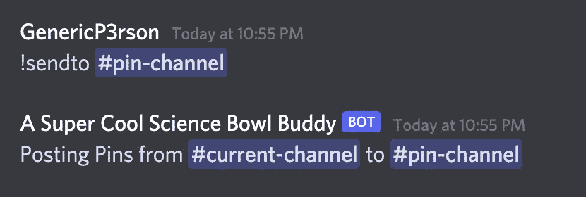

Running the command in Discord

完美！有用！

## 步骤 V.III:从图中删除顶点和边

现在让我们做同样的功能，但删除边缘切断连接。我们将使用命令！rmfrom 和代码大致相似，但使用 delEdge。

```
@client.eventasync def on_message(msg):
   if msg.content[:7] == "!sendto":
      # Code from above; excluded for shortening purposes. Make sure to include in the final version! if msg.content[:7] == "!rmfrom": try: from_id = str(msg.channel.id)
         to_id = str(msg.content[10:-1])
         conn.delEdges("Channel", from_id, "SEND_TO", "Channel", to_id)
         await msg.channel.send(f"Stopped Posting Pins from <#{from_id}> to <#{to_id}>") except: await msg.channel.send(f"Uh oh. There's been an error.")
```

让我们来测试一下:

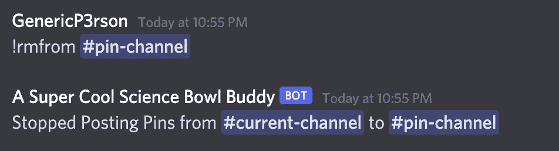

!rmfrom command in Discord.

不错！现在，我们可以添加和删除连接，让我们有机器人后引脚！

## 步骤五.四:张贴大头针

现在我们将使用 Discord.py 中的另一个事件 on_guild_channel_pins_update，它接受两个参数:channel 和 last_pin

```
@client.eventasync def on_guild_channel_pins_update(channel, last_pin):
```

很好。这就是我们编写的查询发挥作用的地方。让我们运行查询来搜索任何连接到当前通道的通道，在当前通道中，某些内容被固定或取消固定。如果有结果，我们将从最近到最早获取所有的 pin，并将其发布到另一个通道中，然后从当前通道中取消。总而言之，代码看起来像这样:

```
@client.event
async def on_guild_channel_pins_update(channel, last_pin): connectingChannels = conn.runInstalledQuery("getConnectedChannels", params={"id": str(channel.id)}) if len(connectingChannels[0]["Res"]) > 0:
      channel_pins = await channel.pins() for channels in connectingChannels[0]["Res"]: if len(channel_pins) > 0:
            await client.get_channel(int(channels["attributes"]["channel_id"])).send(channel_pins[-1].content)
            await channel_pins[-1].unpin()
```

太棒了。让我们检查它是否工作。

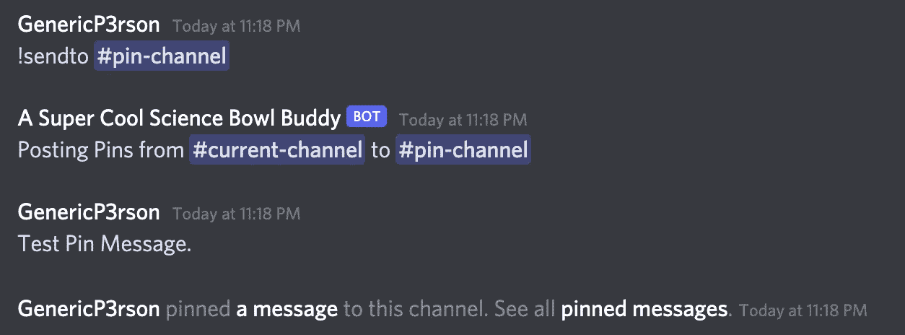

Sending the Pin Request

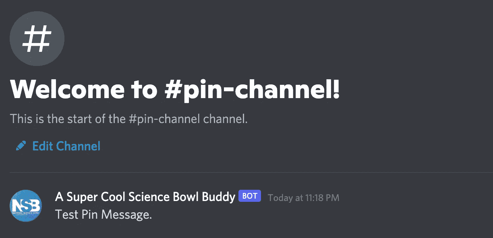

Message appears on the other channel!

太棒了。你现在已经创建了你自己的无限针机器人！

# 第六步:祝贺+资源

恭喜你。您学习了如何使用 Discord 创建机器人，如何使用 TigerGraph 设置解决方案，以及如何创建无限 pin 机器人！

要加入 TigerGraph Discord 加入社区项目，了解更多信息，并提出任何问题，请单击此处:

[](https://discord.gg/gRHWBZNpxW) [## 加入 TigerGraph Discord 服务器！

### 查看 Discord 上的 TigerGraph 社区-与 568 名其他成员一起玩，享受免费的语音和文本聊天。

不和谐. gg](https://discord.gg/gRHWBZNpxW) 

要查看其他 TigerGraph 社区工具，请单击此处:

[](https://developers.tigergraph.com/) [## TigerGraph 开发者网站

### 所有 TigerGraph 开发者内容的一站式商店。探索学习、TigerGraph 项目和我们生动的…

developers.tigergraph.com](https://developers.tigergraph.com/) 

我希望你喜欢这个博客，学到一些东西，并继续探索更多的 TigerGraph 和 Discord！