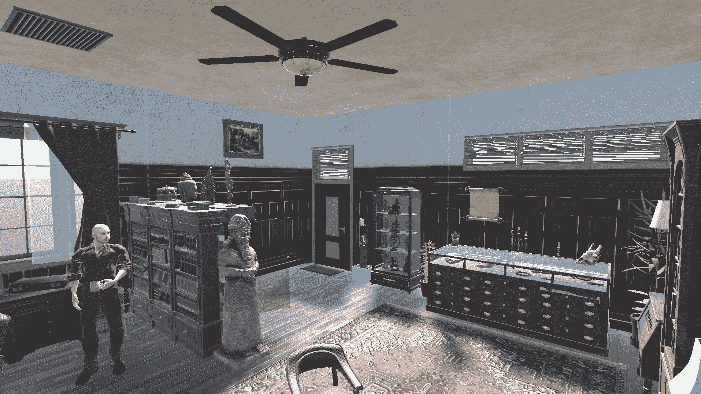

# 在 Unity 中创建办公室第 1 部分:设计和组织

> 原文：<https://medium.com/geekculture/creating-an-office-den-in-unity-part-1-design-and-organization-bb166998d674?source=collection_archive---------11----------------------->

当设计一个场景时，一定要记住保持有序和放置 3D 物体一样重要。在这篇文章中，我用家具和其他物品填充一个空房间，同时保持层次结构整洁有序。

我从 *GameDevHQ* 得到了这个空的 office starter 资产。