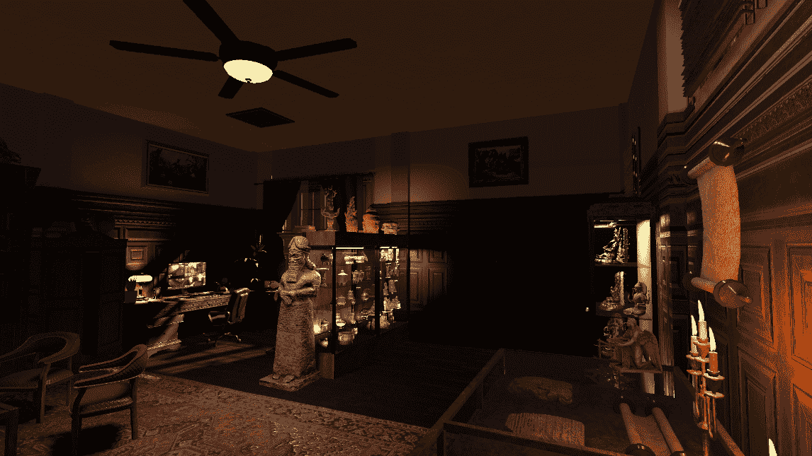

# 在 Unity 中创建办公室第 2 部分:灯光、饼干和排放

> 原文：<https://medium.com/geekculture/creating-an-office-den-in-unity-part-2-lights-cookies-and-emissions-1bc060d13be1?source=collection_archive---------19----------------------->

在我的上一篇文章中，我用普通的高强度平行光设计了这个场景。这篇文章包括设置一些房间照明，处理平行光，给物体添加发射和给一些光源添加 cookies。

我首先关掉所有的灯，除了一盏*方向灯*。就本文而言…