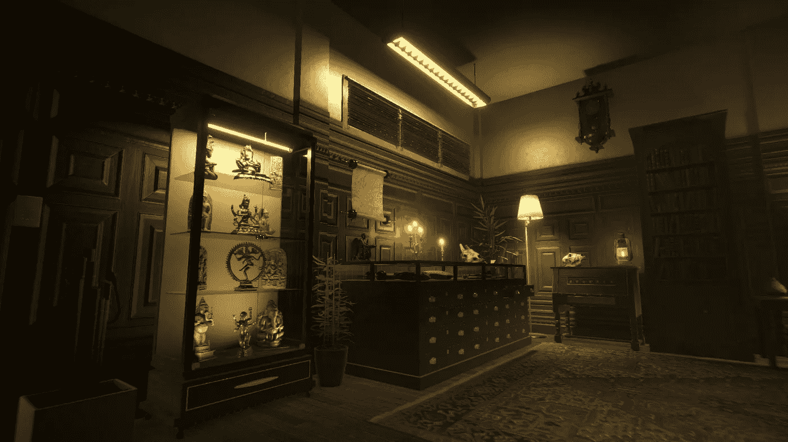

# 在 Unity 中创建办公室第 3 部分:锦上添花

> 原文：<https://medium.com/geekculture/creating-an-office-den-in-unity-part-3-the-icing-on-the-cake-51201381d593?source=collection_archive---------15----------------------->

这三篇文章以各种美味的视觉主题结尾。

**体积照明和雾**

确保你的灯*开启*上的*音量*。

*在全局或局部*卷*中为*雾*启用*和*超控*。