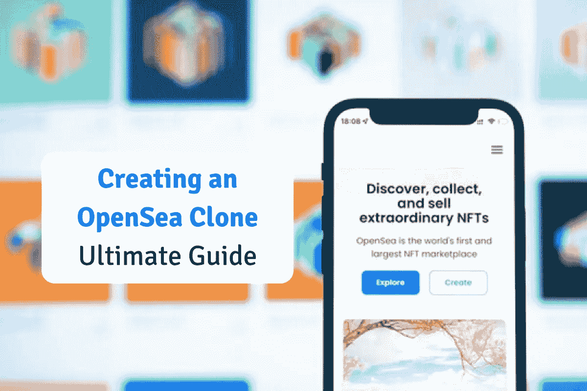
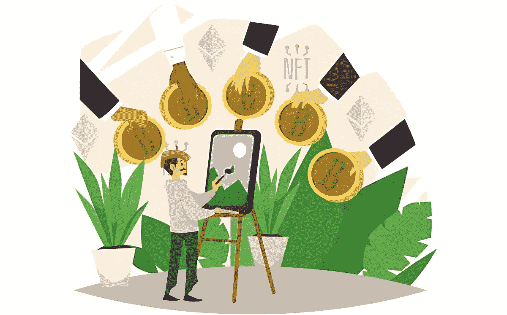
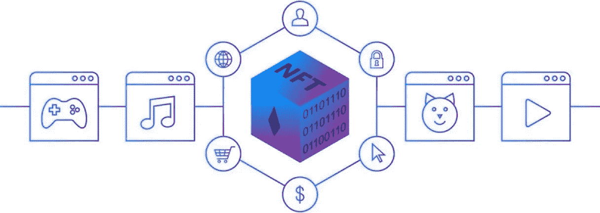

# 创建一个 OpenSea 克隆:像 NFT 市场一样启动 OpenSea 的终极指南

> 原文：<https://medium.com/geekculture/creating-an-opensea-clone-ultimate-guide-to-launch-opensea-like-nft-marketplace-f53c7e3eced9?source=collection_archive---------7----------------------->

在过去几年中，非功能性测试的范围已经大大扩大。这最终提高了企业家的门槛。像你们这样的新兴企业家正在提出更好的想法，以在 NFT 市场展现。根据外行人的字典，NFT 只是以数百万美元出售的数字收藏品。但只有千禧一代知道这些非功能性思维的价值。NFT 市场见证了一场巨大的变革，全球各地崭露头角的企业家都在实践自己的想法。这为许多崭露头角的个人设计自己的 NFT 商业理念奠定了基础。

OpenSea 一直是市场上的先锋商业模式，吸引了大量崭露头角的创业者。 [**OpenSea 克隆**](https://www.appdupe.com/opensea-clone) 是一个受欢迎的选择，一直吸引着个人在 NFT 市场开始他们的冒险。以下是你如何开发一个类似的有吸引力的平台。

# **NFTs——全球市场的引领者**

NFT 的概念是在 2017 年首次提出的，在那段时间里，几乎没有一百台 NFT 被售出。但是现在，情况完全不同了，一天卖出 10，000 个 NFT。随着人们对非酒精性脂肪性肝炎的认识引起了个人的共鸣，这一数字大大增加了。NFT 是罕见的数字收藏品的数字证书。人们都很兴奋能拥有一些本质上非常独特的东西。NFT 不仅仅是一个花哨的词，它对个人来说是很好的投资。

OpenSea 是 NFTs 领域中最好的 NFT 市场。它们是买卖 NFT 收藏品的绝佳市场。像亚马逊和易贝一样，OpenSea 是一个专门从事不可替代代币的市场。NFT 爱好者可以在这个平台上买卖他们的 NFT，因为它将潜在的买家和卖家聚集在一个屋檐下。此外，专家声称，OpenSea 是第一个进入 NFT 市场的市场，用户可以在这里找到任何范围的数字收藏品，从艺术代币到音乐代币。

# OpenSea Like Platform 如何为其用户提供服务？

像 OpenSea 这样的 [**NFT 市场对卖家和买家都开放。销售者或创作者可以通过在平台上上传他们的数字作品来创建他们的 NFT。他们可以上传文件，并通过固定相同的价格将它们制作成 NFT。卖家还将有权捆绑销售近 30 个 NFT，一次性售出。将 NFT 捆绑在一起的限制是因为高昂的以太币价格、气体限制和单一交易。当用户添加他们的结束价格和到期日将转换成荷兰固定清单。**](https://www.appdupe.com/nft-marketplace-development)

在购买 NFTs 之前，用户应该将他们的以太坊转换成包装以太坊。为了将 ETH 转换成 wETH，用户不需要选择其他 DeFi 平台，因为该选项在类似平台本身的 OpenSea 中很容易获得。我们只不过是 ERC-20 令牌与联邦理工学院联系在一起。一旦买家确定了自己的 wet，他们就可以开始购买 NFT。拍卖的最高出价者将在市场本身的拍卖结束时得到通知。

# **要在你的 OpenSea Like 平台上复制的 NFT 列表类型**

就销售 NFT 而言，有三种类型。NFT 爱好者可以从这三种类型的 NFT 列表中选择任何可行的方法。

**以固定价格上市**

这是一个简单的过程，卖家将在平台上列出它们之前确定和固定 NFT 的价格。购买者可以很容易地进入平台，继续购买 NFTs。

**英国拍卖中的列表**

你听说过易贝的拍卖吗？是..这有点类似于易贝的拍卖。在这里，卖家将确定 NFT 系列的最低价格。买家可以开始竞价，当出价上升时，卖家可以开始接受最高的出价。如果你鼓励用户从 0 开始竞价会更好，因为这会培养用户参与竞价的兴趣。这也将阻止卖家以更低的价格出售他们的非功能性食物。卖方只能根据自己的利益出售他们的非关税壁垒。

**荷兰拍卖中的物品**

在荷兰式拍卖中，卖家应该确定拍卖的起拍价、结束价和持续时间。卖家可以确定他们想要出售 NFT 藏品的价格，然后等到拍卖结束。当 NFT 的价格上涨时，他们将计划向买家出售他们的非交易资产。

## **如何设计 NFT 市场的功能？**

当 [**像 NFT 市场**](https://www.appdupe.com/nft-marketplace-development) 一样开发你的 OpenSea 时，精心关注它的工作模式是很重要的。对于任何一个 NFT 平台来说，区块链技术是管理整个论坛运作的基础。例如，OpenSea 是一个跨链的 NFT 平台，支持多种区块链技术。你有各种各样的区块链网络，从以太坊，卡尔达诺，创，索拉纳，BSC，多边形等。

分散的 NFT 平台在智能合同的支持下运作。智能合约规范并自动化平台交易活动的功能。此外，他们还是一个平台的管理机构。您可以通过考虑 OpenSea 平台中遵循的操作来决定您的 NFT 平台的工作流程。这里有一个简单的工作机制，您应该遵循它来开发您的 NFT 平台，

*   简单的注册过程，他们可以很容易地注册自己。
*   为个人提供多种销售和拍卖方式。
*   鼓励你的用户使用加密货币和法定货币交易。
*   允许你的用户自由分享他们在平台上找到的关于 NFT 的观点。

## **NFT 市场发展需要考虑的重要特征**

当你启动像 OpenSea 这样的 NFT 市场时，你应该小心地完成平台的功能。看看您的 NFT 平台开发中包含的有前途的特性，

**Swift 注册流程**

NFT 迷可以通过提供必要的用户信息，如电子邮件地址和有效密码，迅速注册。他们还应通过 KYC 和反洗钱阶段，成为该平台的一部分。

**打造自己的 NFT 系列**

用户应该能够在平台上创建他们的 NFT 收藏。他们可以上传所需格式的文件，以支持 NFT 的制作过程。

**各种非功能性食物**

在开发像 OpenSea 这样的 NFT 平台时，你应该允许用户创造任何类型的 NFT，包括音乐、艺术品、体育收藏品、游戏角色、虚拟土地等等。这将有助于您为平台赢得更广泛的用户群。

**多币种支持**

NFT 平台应该鼓励用户使用法定货币和加密货币支付。随着加密货币在市场上的发展，这将是你在 NFT 投资的一个伟大举措。

**分享评论**

NFT 发烧友可以根据他们的经验分享他们对 NFT 系列的看法。他们还可以对平台提供的 NFT 收藏和服务进行评分。

## **包装**

你对在 NFT 市场创业有多大兴趣？市场的本质和现状看起来非常有希望让初露头角的企业家立足。作为一名企业家，你需要做的就是找到最好的 [**NFT 市场开发公司**](https://www.appdupe.com/nft-marketplace-development) ，他们可以用预先构建的 OpenSea 克隆脚本来支持你在 NFT 的创业。