# 在 JavaScript + Phaser 中创建和动画像素艺术

> 原文：<https://medium.com/geekculture/creating-and-animating-pixel-art-in-javascript-phaser-54b18699442d?source=collection_archive---------12----------------------->

如果你像我一样喜欢像素艺术的极简主义魅力，你可能想知道如何创建自己的交互式像素艺术。也许你甚至想知道如何用自己的艺术资产制作自己的 2D 游戏。网上有很多免费的像素艺术资产，但有自由根据你的项目和愿景定制自己的资产也很好。

我将分解如何制作你自己的像素艺术精灵表，用普通 Javascript 制作动画的挑战，以及使用 Phaser 这样的库的能力。

**样板:**

如果你正在考虑使用 React，只是一个警告，有相当多的 Phaser 和 React 不能很好地一起使用的文档。如果你想快速上手并运行，我强烈推荐从 Phaser 的样板文件开始:【https://github.com/photonstorm/phaser3-project-template

## **做出创造性的决定！**

接下来，决定你的角色，以及你的动画需要什么动作。从简单开始。

像素艺术可能会给人一种比其他动画形式更容易的错觉，但用更少的东西进行更多的交流是它自己的艺术。给人一种只用两帧行走或呼吸的错觉，并停留在模型上，同时在像素而不是线条的范围内挤压和拉伸，这是它自己的挑战。

## **雪碧片**

2D 游戏不是单独存储每一帧(这会很快变得混乱),而是将姿势存储在称为 sprite sheets 的资产中。下面是我为猫“Pusheen”制作的精灵图片示例:

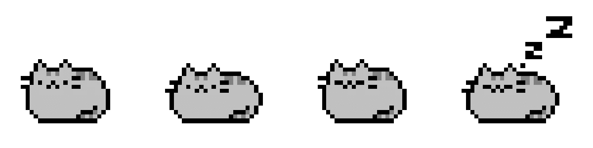

有一些很棒的程序可以让你画出你的像素艺术，并为你生成精灵表。

如果你想学习如何在 Adobe Photoshop 中设置和创建精灵表，请继续阅读，否则你可以跳到“给你的游戏添加帧”

## **在 Adobe Photoshop 中创建 Sprite 工作表**

首先创建一个你想要的大小的新画布。请记住，我们是在处理像素！所以我们将从小尺寸开始——比如 40 x 40 像素是一个好的开始。我们可以在以后改变这一点。

放大你的小画布，现在让我们设置它，这样我们就可以看到像素在哪里。

**参考线，网格&切片设置:**(首选项- >参考线，网格&切片)

这些设置将为每个像素创建一个可见的网格，这将使我们更容易绘制它们:

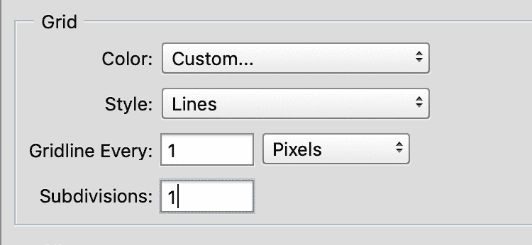

您的画布现在应该看起来像右边的一样:

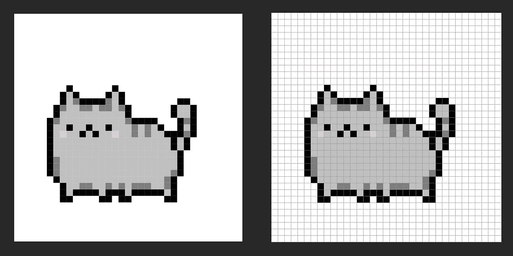

如果你没有看到你的网格，去查看->显示->点击网格打开网格线。

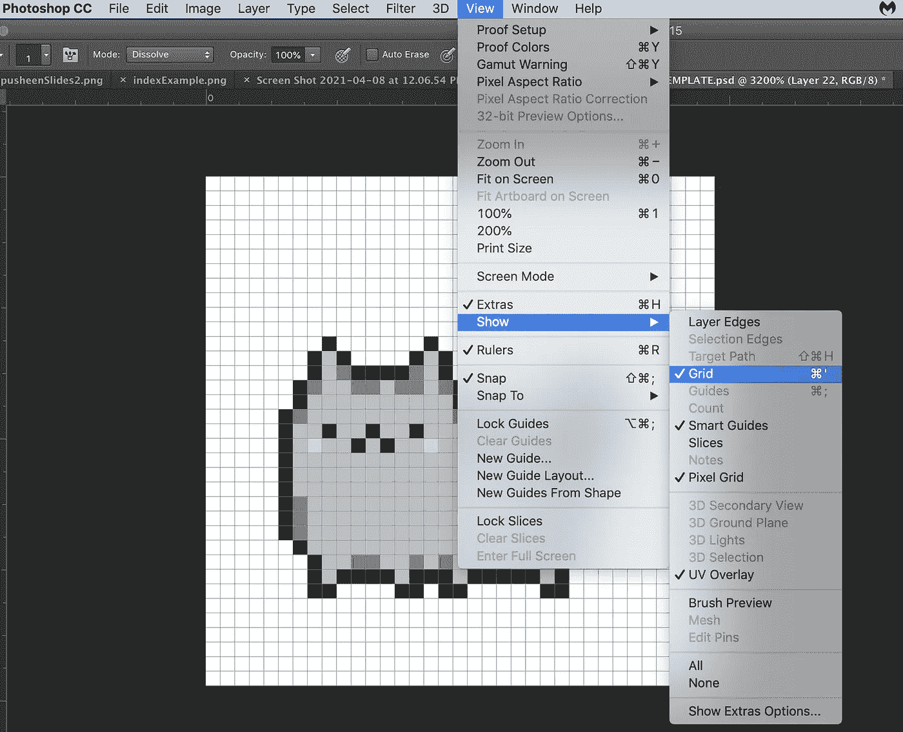

**笔刷设置:**

转到你的笔刷设置，按住点击并释放来查看其他笔刷选项，并选择“铅笔工具”

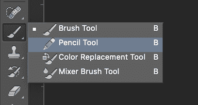

将笔刷大小调整为 1 个像素。您可以使用热键[和]来快速调整画笔的大小。或者你可以点击工具栏中的笔刷下拉菜单，手动选择笔刷大小。

**图像插值设置:**

转到首选项->常规->图像插值:最近邻

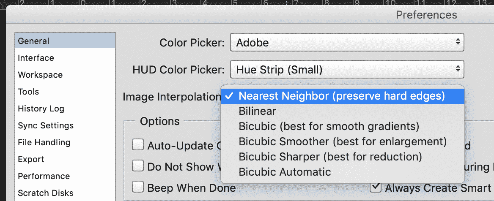

这告诉 photoshop 不要平滑边缘，通常我们希望这样，但对于像素艺术，我们希望每个像素都有一个硬边。以下是这些不同的图像插值设置如何以不同的方式缩放图像。默认情况下，这是设置为双三次平滑线。对于像素艺术，我们希望保留硬边:

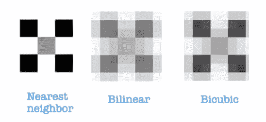

source: [https://www.youtube.com/watch?v=rLdA4Amea7Y&t=13s](https://www.youtube.com/watch?v=rLdA4Amea7Y&t=13s)

**给你的游戏添加画面**

然后你必须想办法告诉你的游戏你想要的当前帧在哪里。

我们可以通过向它传递 x 和 y 坐标以及要从 sprite 工作表中剪切的单个帧的尺寸来实现这一点。

在下面的例子中，每个 Pusheen 是 35 x 35 像素。

得到这些 x，y 坐标的简单公式:

**x =索引*宽度**

**y =指数*高度**

如果我们的 sprite 工作表有多行，我们将像这样计算 x 和 y:

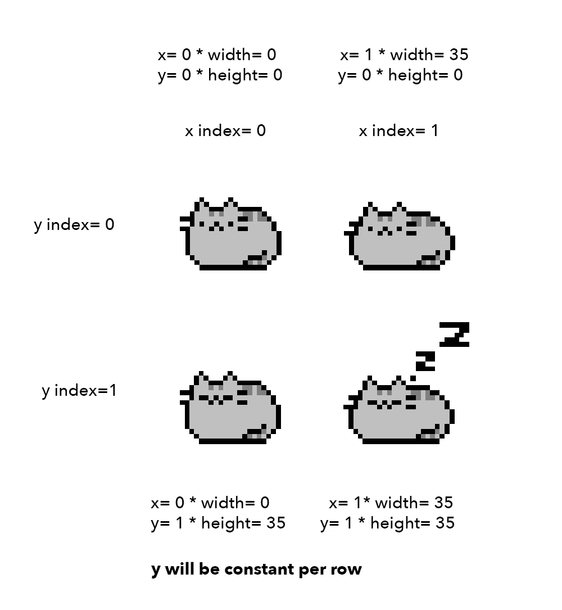

你可以看到多种姿势和更多的游戏资源会很快变得非常乏味。

进入相位器！

**在相位器中制作精灵动画**

Phaser 为我们做这些计算，并使精灵动画变得非常简单。

**设置游戏**

首先，我们用“new”命令创建一个新游戏，并传递给它我们想要的类型、大小、场景和物理属性。重力的典型设置如下所示:

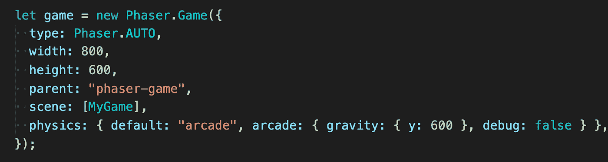

调试时(如您所料), debug 属性会派上用场。当设置为 true 时，您可以看到所有游戏对象周围的点击框，这有助于找出资产何时表现不符合预期。

在此之上，通过延长相位器来创建你的游戏场景。场景类。确保传递给游戏场景属性的场景名称匹配！：

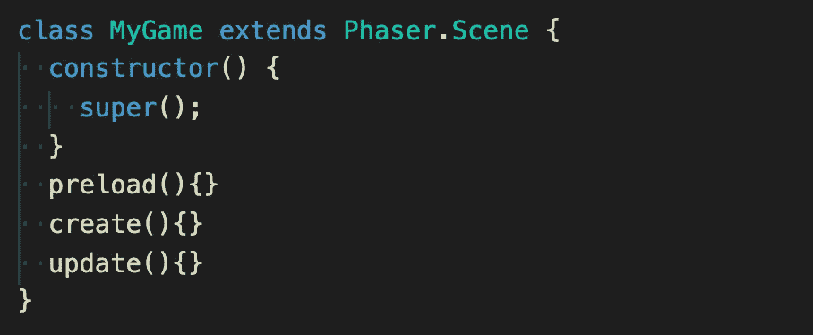

**场景方法**

场景由这三种主要方法组成:

*   **预载()**
*   **create()**
*   **更新()**

**预载()**

预加载是你加载所有初始游戏图像的地方。

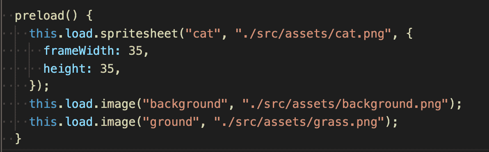

这里我使用 phaser 中的内置方法来加载一个 sprite sheet“cat”和两个图像:“background”和“grass”。

第一个参数是您想要给它的键名，第二个参数是图像的文件路径，第三个参数允许我们设置帧大小。当我们创建动画时，我们将引用这些关键名称！

**创建()**

“创建”是从上面加载的图像中创建游戏对象的地方。

上面我们正在添加我们的背景图片。角色和背景被添加到物理中，因此重力会影响它们。前两个参数是我们希望资源在场景中出现的 x 和 y 坐标，第三个参数是键名。

我们也将在这里创建我们的动画周期！

让我们回到只有一行的原始 sprite 表。还记得之前我们必须计算每一帧的 x 和 y 吗？有了 Phaser，就像告诉它 sprite 表中图像的索引一样简单。

对于下面的精灵图，我们清醒时的坐姿周期是第 0 帧和第 1 帧，睡眠时是第 2 帧和第 3 帧。

我们可以使用 **this.anims.create()** 方法为我们的角色创建动画循环，以便在其间切换。我们传递给它以下属性:

**键:**你的动画周期的名字

**重复:**循环重复多少次。值-1 会将其设置为连续循环。下面，我们将猫设置为“坐下”4 帧，然后再睡着。

**frames:** 这是我们传递之前命名的 sprite 工作表的键名的地方，并传递 sprite 工作表中循环的起始和结束索引号**。**

**更新()**

我们在游戏场景中第三个也是最后一个主要方法是更新。这是我们添加游戏状态更新逻辑的地方，比如动画周期何时改变。

Phaser 还内置了我们可以利用的键盘事件监听器。我们可以将它保存在一个变量中，以使我们的代码更简洁，更容易使用。

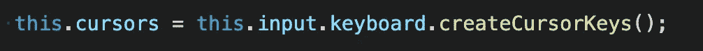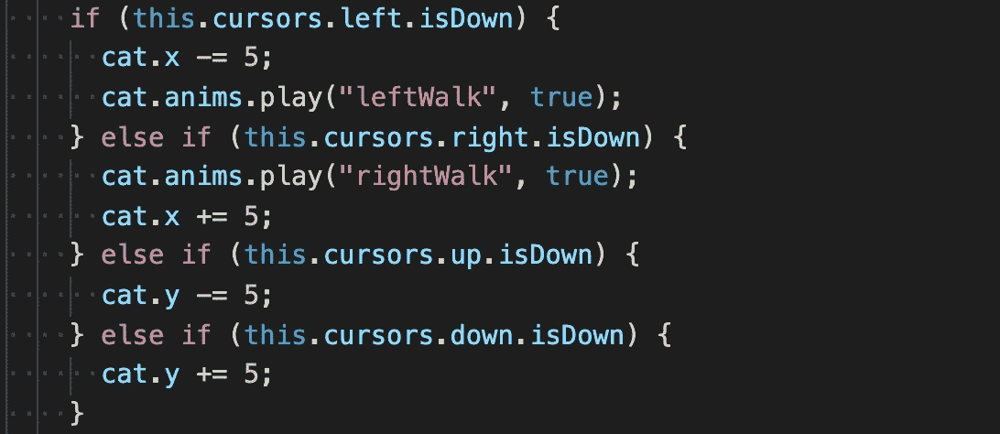

在这个例子中，我为在屏幕上走动的猫设置了监听器。如果玩家点击左，猫将播放向左行走的循环，并向那个方向移动，以此类推。

这只是 Phaser 所能做的一切的开始。我希望这能帮助你开始制作你自己的惊人的像素艺术资产，并在 Phaser 中制作动画！