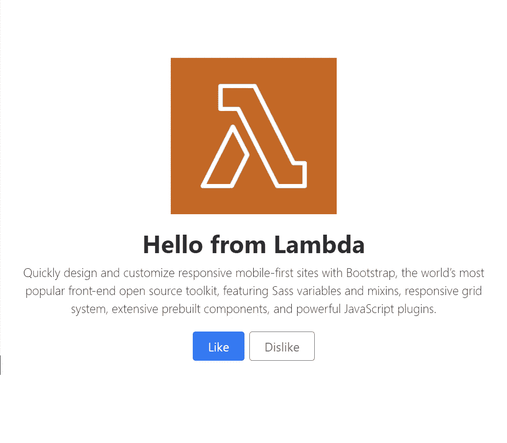
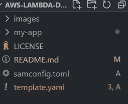
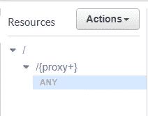
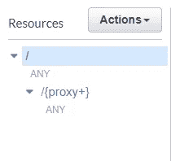
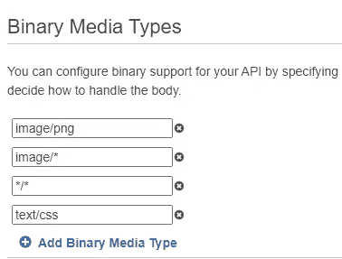

# 创建 Express 应用程序并将其部署到 Lambda

> 原文：<https://medium.com/geekculture/creating-and-deploying-express-app-to-lambda-811463ce7be2?source=collection_archive---------2----------------------->

大多数开发人员认为 Lambda 只是一个小函数。一个简单的句柄函数，在云中运行一些代码。但通常你需要的不止这些，比如几个不同的函数，或者一个完整的 REST 端点，幸运的是 Lambda 可以很好地运行它。虽然不建议将一个大的应用程序作为一个函数来运行，但这并不妨碍您创建和部署一个 Lambda 应用程序。

很多应用程序都是在 ExpressJs 框架上构建的。它简单而强大。它有许多为它编写的插件，对于任何以 REST 或 [GraphQL](https://graphql.org/) 为端点的 API 来说，它都是一个很好的起点。

在本教程中，我将展示如何创建一个完整的 Express 应用程序并将其部署到 AWS Lambda。您将学习如何创建路由并在它们之间导航，设置一个简单的 REST 端点，最后与 Bootstrap 集成并提供静态内容。

本教程分为三个不同的部分:

1.  创建 ExpressJs 应用程序
2.  配置 AWS SAM
3.  配置 API 网关



## 创建快速应用程序

让我们在一个名为“aws-app”的新文件夹中开始一个新项目。这将是根项目，因为我们将使用 AWS SAM 工具将应用程序部署到 AWS，所以我们需要在“aws-app”中创建一个新文件夹，这将是我们的 ExpressJs 应用程序所在的位置。然后在内部运行“npm init -y”。现在您需要添加所需的包:expressjs、ejs、cors 和 serverless-http。
` NPM I express ejs CORS server less-http`
` NPM I node mon—save-dev `用于开发目的。

在本教程中，我不会试图解释所有关于 Expressjs 的东西，而是把重点放在正确的基础上。

```
**app.*get*(“/”, getBasePath, (req, res) => {****res.render(“index”, { title: “test”, page: req.basePath });****});**
```

创建路线非常简单:

1.  实例化 express app:` const app = express()；`
2.  使用你需要的 http 方法: **get、post、put、delete、head 等**
3.  设置端点，可以是:' **/** '，'/: **id** '，'/ **new** '等。

接下来是用户，但是首先，我们需要组织一下，因为在同一个文件中有太多的路由可能会很混乱，所以对于用户来说，我们将使用一个快速路由器。快速路由器就像特定路由 URL 的微型应用程序。在我们的情况下'/用户'的路线:

1.  在“用户”文件夹中创建一个名为 users.js 的单独文件
2.  实例化路由器:const router = express。路由器()；
3.  就像一个快速应用程序一样，我们可以向它添加任意数量的路由
4.  另一个选项是创建一个路由，并将不同的方法链接到该路由:

ExpressJs 的另一个特性是模板引擎的使用，在我们的例子中，我使用了 **ejs** ，并使用这种格式呈现不同的页面。生成一个基本页面非常简单，你所要做的就是创建一个名为' **views** '的新目录，然后创建` **users** '文件夹，并在其中放入以下文件:

您可以看到这与普通的 HTML 页面非常相似，但有一点需要注意:

```
<%= **locals**.page %>
```

在渲染时，中的内容将被替换为服务器发送的内容。 **locals** 这是一个来自 **ejs** 库的特殊对象，包含了我们传递给页面的所有对象，并且它总是被定义的。并且不发送自定义**页面**对象。并且不会抛出任何错误或警告。

要将对象发送到页面，很简单，只需在模板旁边添加一个对象:

```
router.get("/new", getBasePath, (*req*, *res*) => {
   *res*.render("users/new", **{
**                      **firstName**: "post",
                      **basePath**: *req*.basePath + "/home/users",
   **}**);
});
```

ExpressJs 中一个重要的关键特性是中间件功能的使用。中间件只不过是一个简单的带有一些参数(请求、响应、下一个)的 JavaScript 函数
，最重要的是在**进入**你的代码之前被调用。在调用代码之前，您可以添加任意多的中间件函数。一个重要的警告是，您需要调用 **next()** 来移动到下一个中间件函数**。**
基本结构是:

如果您需要传递任何信息，无论是身份验证还是关于请求的一些额外信息，都可以随意添加到请求对象中。这是将额外数据发送到下一个中间件或路由处理器的常用方式。

你可以在上面的例子中看到，我将 **basePath** 信息添加到请求中，这样每个函数都可以使用它。

*   **额外提示:req.requestContext 来自 serverless-http 包，当在 Lambda 中部署时，它为我们提供了有关 events 对象的额外信息。它给出了代表阶段的 URL 的最后一部分(例如生产、开发……)。

现在让我们把注意力集中在每个应用程序都必须拥有的静态资产上。这些资源可以是图像、样式、图标、字体或任何其他类型。使用 ExpressJs 服务任何静态资产非常简单，只需在我们的应用程序根目录下创建一个名为` **public** 的文件夹。

要告诉 express 将请求传播到 public 内部的文件，我们只需编写:

```
app.use(express.static("public"));
```

最后，这将是一个没有显示 REST 端点的 ExpressJs 教程。在“users.js”文件中，我们可以看到我们已经定义了完整的 CRUD，其中包含我们可以发送和接收数据的路由。在这种特殊情况下，我们使用 Express Router，但是您也可以使用主要的 ExpressJs 函数来完成。下面是同样使用中间件 **getBasePath** 的工作示例:

```
*router*.route("/:id")
.***get***(getBasePath, (*req*, *res*) => {
   * const id = req.params.id;*
 *res*.status(200).json({ user: { id } });
}).***put***(getBasePath, (*req*, *res*) => {
    *const id = req.params.id;*
    *res*.status(200).json({ user: { id } });
}).***delete***(getBasePath, (*req*, *res*) => {
   * const id = req.params.id;*
    *res*.status(200).json({ user: { id } });
});
```

*   **为了处理发布请求，我们需要在主 express 应用程序中添加以下内容:

```
app.use(express.urlencoded({ extended: true }));
app.use(express.json());
app.use(cors());
```

现在，我们准备通过发送名称来创建一个新用户:

```
router.**post**("/", *getBasePath*, (*req*, *res*) => {
 *res*.status(200).json({ users: [{ id: 1, name: ***req*.body.firstName** }]      });
});
```

完整 Express 应用程序的代码在 GitHub 库[这里](https://github.com/BogdanNic/aws-lambda-docker/tree/express-app)。

## 设置 AWS SAM

我们将使用 AWS SAM 部署我们的应用程序。但是山姆是什么？

> AWS 无服务器应用程序模型(SAM)是一个用于构建无服务器应用程序的开源框架。它提供了表达函数、API、数据库和事件源映射的简写语法。每个资源只有几行代码，您就可以定义您想要的应用程序，并使用 YAML 对其建模。在部署期间，SAM 将 SAM 语法转换和扩展为 AWS CloudFormation 语法，使您能够更快地构建无服务器应用程序。

基本上，它允许您非常容易地创建或更新资源，并且全部以可预测的方式从终端进行。

***提示:即使使用从容器提供的，SAM CLI 也会更新 lambda。

首先，我们需要创建一个 Docker 文件，并将它放在应用程序的其余部分旁边。

我们现在需要转换我们的 ExpressJs 应用程序，以匹配 Lambda 所期望的，所以只是一个函数处理程序。为此，我们可以使用优秀的包 provide **serverless-http** 来包装它。

我们需要额外的 mime 类型来允许我们提供图像和其他文件。如果您只想返回 JSON 格式，就不必添加 mime 类型。

我们首先需要安装 AWS 提供的几个免费工具:

1.  适当用户的 AWS CLI(关于 AWS CLI 的更多信息[请点击这里](/@bogdan_nic100/setup-a-lambda-function-using-docker-72356e0a4f13)
2.  来自[的 AWS SAM 在这里](https://docs.aws.amazon.com/serverless-application-model/latest/developerguide/serverless-sam-cli-install.html)
3.  创建 SAM 的配置并将其添加到项目的主根目录。



The structure of the project

就像我们对 lambda 所做的一样，我们必须包装我们的 ExpressJs 应用程序。将模板**放在 app 文件夹的**外，如图所示。

SAM 模板基本上是一个 YAML 文件，它允许我们配置函数名称、类型、内存，还创建 API 网关端点以及必要的角色和权限。

从模板中，您可以看到我们正在使用我们之前创建的 Docker 文件，以及它的位置“**my-app”,**最后的值只是让我们知道什么是应用程序的 URL。

部署时，SAM 会问你几个问题，比如容器注册表的位置在哪里(如果你像我一样使用 Docker 文件)。并且它创建了 **samconfig** 。toml 在成功部署后自动运行。

有时，SAM 无法部署应用程序，也无法创建文件，或者更糟的是，它创建了错误的数据。我不喜欢调试配置，所以我事先提供了一个。

我们需要将<>替换为真实的数据，如账户和地区。现在让我们创建一个存储桶:

```
aws s3api create-bucket --bucket my-bucket-<**Random**> --region **<region>** --create-bucket-configuration LocationConstraint=**<region>**
```

*   **提示:在名称中添加一些随机字符，因为它在整个 s3 中必须是唯一的。并设置区域。并将该名称放入 samconfig.toml 中。

在 ECR 中创建存储库:

```
aws ecr create-repository --repository-name hello-world
```

完成所有这些后，我们准备将我们的功能部署到 Lambda，但首先，我们必须构建它，然后部署它:

```
sam build
sam deploy
```

重要的 SAM 命令:

1.  首先，需要构建函数`sam build`
2.  可选调用`sam validate`来验证模板

3.本地测试`sam local invoke`或`sam local start-api`

4.最后通过运行`sam deploy`将函数发送到云端

5.使用`sam logs -n HelloWorldFunction — stack-name <stack_app> — tail`查看日志

运行 sam 构建的映像`docker run -p 9000:8080 helloworldfunction:rapid-1.30.0`

## 配置 API 网关

现在我们应该有一个用于 prod 的 API 网关端点。如果我们转到该链接，它会显示一条 JSON 消息，文本为:Missing Authentication Token。

发生了什么事？让我们到 API Gateway 检查一下，在 SAM 配置中，我们添加了一个代理，允许所有方法映射到一个简单的函数处理程序。

看这张图片，你应该看到类似的东西:



第一个“/”表示根端点，我们在这里没有任何集成。

遗憾的是，SAM 无法在此添加新资源，因此我们将手动更改它。但是当你重新部署的时候问题就出现了。

解决这个问题的最好方法是创建一个新的 API 网关端点。因为只有一次，所以让我们使用 AWS 网站来创建它。登录后导航到 API 网关。

1.  点击顶部的**创建 API** 按钮
2.  在**中选择 API** 类型:选择 **REST API** 卡，点击 **Build**
3.  为其命名:sam-test，然后单击 create
4.  现在我们看到空资源只是一个“/”
5.  点击**动作**下拉菜单，然后选择**创建方法**
6.  选择**任意**方法
7.  将 Lambda Integration 设置为 true 并选择您的地区，然后在 **Lambda 函数**中选择我们的函数
8.  批准出现的关于权限的模式
9.  点击“任何”方法，然后点击**动作**下拉列表，然后选择**创建资源**
10.  点击**配置为代理资源**，然后创建资源
11.  将 Lambda Integration 设置为 true 并选择您的地区，然后在 **Lambda 函数中选择我们的函数。**

完成设置后，您应该会看到如下所示的资源树:



如果你点击任何一个**或者任何一个**方法，你应该会看到 lambda 集成。

现在让我们设置媒体类型，因为我们正在发送图像和文本。在中，导航至左侧的设置。向下滚动，直到找到二进制媒体类型



并添加以下类型:

*   图片/png
*   图像/*
*   */*
*   文本/css

要查看它的运行情况，我们必须部署 API。使用操作下拉菜单列表选择**部署 API。**为名为 dev 的实例创建一个阶段，并单击**将**部署到 dev。

最好的事情是，如果我们改变或更新 lambda 函数，它将自动更新 API 以使用新版本。

要删除应用程序并释放 AWS 使用的所有资源，请在您的终端中编写以下命令:`aws cloudformation delete-stack — stack-name <stack_app>`

完整的代码可以在 GitHub [这里](https://github.com/BogdanNic/aws-lambda-docker/tree/express-app)找到。我还做了一个关于 Lambda 与自定义 Docker 映像集成的教程。

如果你对更多的教程感兴趣，请订阅并鼓掌！

## 助手链接:

1.  AWS CLI 配置指南:[此处](https://docs.aws.amazon.com/cli/latest/userguide/cli-configure-quickstart.html#cli-configure-quickstart-creds)
2.  AWS SAM 指南[此处](https://docs.aws.amazon.com/serverless-application-model/latest/developerguide/serverless-getting-started-hello-world.html)
3.  创建 S3 铲斗的指南[此处](https://awscli.amazonaws.com/v2/documentation/api/latest/reference/s3api/create-bucket.html)