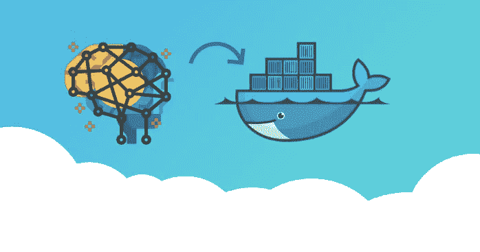
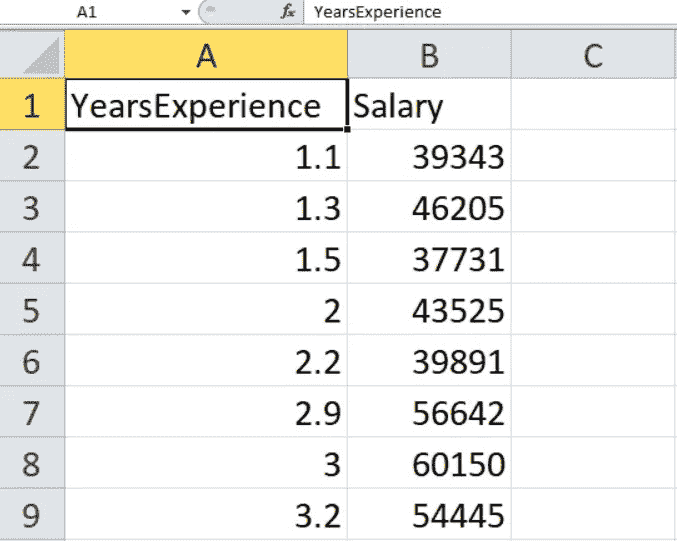
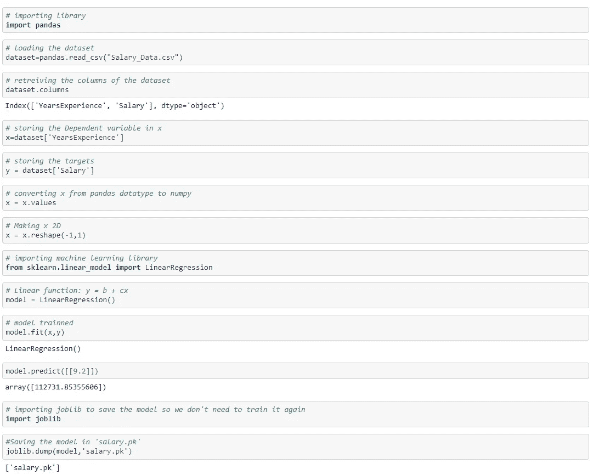
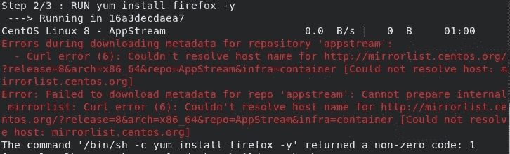

# 在 Docker 容器中使用 Python 创建和部署机器学习模型

> 原文：<https://medium.com/geekculture/creating-and-deploying-machine-learning-model-using-python-in-docker-container-819e62cce122?source=collection_archive---------10----------------------->



# 任务描述:

*   从 DockerHub 中提取 CentOS image 的 Docker 容器映像，并创建一个新容器
*   在 docker 容器上安装 Python 软件
*   在容器中，您需要复制/创建您在 jupyter 笔记本中创建的机器学习模型

## 什么是机器学习？

机器学习是人工智能(AI)和计算机科学的一个分支，它专注于使用数据和算法来模仿人类的学习方式，逐步提高其准确性。

## 机器学习是如何工作的

机器学习算法的学习系统分为三个主要部分。

1.  决策过程:通常，机器学习算法用于进行预测或分类。基于一些输入数据，可以标记或不标记，您的算法将产生一个关于数据模式的估计。
2.  误差函数:误差函数用于评估模型的预测。如果有已知的例子，误差函数可以进行比较，以评估模型的准确性。
3.  模型优化过程:如果模型可以更好地拟合训练集中的数据点，则调整权重以减少已知示例和模型估计之间的差异。该算法将重复这一评估和优化过程，自动更新权重，直到达到准确度阈值。

## 机器学习方法

机器学习分类器分为三个主要类别。

## 监督机器学习

监督学习，也称为监督机器学习，是通过使用带标签的数据集来训练算法，以准确地对数据进行分类或预测结果。当输入数据输入到模型中时，它会调整其权重，直到模型得到适当的拟合。这是交叉验证过程的一部分，以确保模型避免过拟合或欠拟合。监督学习有助于组织大规模解决各种现实世界的问题，例如将垃圾邮件分类到收件箱之外的单独文件夹中。监督学习中使用的一些方法包括神经网络、朴素贝叶斯、线性回归、逻辑回归、随机森林、支持向量机(SVM)等等。

## 无监督机器学习

无监督学习，也称为无监督机器学习，使用机器学习算法来分析和聚类未标记的数据集。这些算法发现隐藏的模式或数据分组，无需人工干预。其发现信息相似性和差异的能力使其成为探索性数据分析、交叉销售策略、客户细分、图像和模式识别的理想解决方案。它还用于通过降维过程减少模型中的特征数量；主成分分析(PCA)和奇异值分解(SVD)是两种常用的方法。无监督学习中使用的其他算法包括神经网络、k 均值聚类、概率聚类方法等等。

## 半监督学习

半监督学习在监督学习和非监督学习之间提供了一个很好的媒介。在训练期间，它使用较小的已标记数据集来指导从较大的未标记数据集进行分类和特征提取。半监督学习可以解决没有足够的标记数据(或者没有能力标记足够的数据)来训练监督学习算法的问题。

## 强化机器学习

强化机器学习是一种类似于监督学习的行为机器学习模型，但该算法不是使用样本数据训练的。这个模型通过反复试验来学习。一连串成功的结果。

## 真实世界的机器学习用例

这里只是你每天可能会遇到的几个机器学习的例子:

**语音识别**:也称为自动语音识别(ASR)、计算机语音识别或语音转文本，是一种使用自然语言处理(NLP)将人类语音处理成书面格式的能力。许多移动设备将语音识别集成到其系统中，以进行语音搜索，如 Siri，或提供更多的短信服务。

**客户服务**:在线聊天机器人正在取代客户旅程中的人工代理。他们回答关于运输等主题的常见问题，或提供个性化建议，交叉销售产品或为用户建议尺寸，改变我们对网站和社交媒体平台上客户参与的看法。例子包括电子商务网站上带有虚拟代理的消息机器人，消息应用程序，如 Slack 和 Facebook Messenger，以及通常由虚拟助理和语音助理完成的任务。

**计算机视觉**:这种人工智能技术使计算机和系统能够从数字图像、视频和其他视觉输入中获取有意义的信息，并根据这些输入采取行动。这种提供建议的能力使其区别于图像识别任务。在卷积神经网络的支持下，计算机视觉可以应用于社交媒体中的照片标记、医疗保健中的放射成像以及汽车行业中的自动驾驶汽车。

**推荐引擎**:利用过去的消费行为数据，人工智能算法可以帮助发现数据趋势，这些趋势可以用来制定更有效的交叉销售策略。这用于在在线零售商的结账过程中向客户推荐相关的附加产品。

**自动化股票交易**:人工智能驱动的高频交易平台旨在优化股票投资组合，每天进行数千甚至数百万笔交易，无需人工干预。

## 模型的实施极其重要，数据产品现在可以被视为具有类似项目结构、管理和生命周期的软件产品。因此，我们也可以使用软件开发中的所有相关技术来将我们的 ML 模型投入生产。

容器化是一种广泛用于将软件产品部署到云平台和本地服务器的技术。它是将代码和依赖项打包到一个称为“容器”的封闭盒子中的过程。

> *容器是一个标准的软件单元，它将代码及其所有依赖项打包，以便应用程序能够快速可靠地从一个计算环境运行到另一个计算环境。*

Docker 是一个平台，可以帮助您加快开发、集装箱化以及实施过程，我们可以使用 Docker 将我们的 ML 模型部署到其他环境中。在这一系列教程中，我将向您展示如何存储您的模型，将您的模型作为 API 端点公开，为 API 测试构建一个简单的接口，将您的 ML 应用程序容器化并在 Docker engine 上运行它。

# 所以问题是“为什么是 Docker？”

如果您正在考虑我们需要执行的所有步骤，以便让笔记本电脑准备好运行项目，那么您的脑海中可能会出现许多问题，例如:

*   由于他使用的是 Macbook 和 ThinkPad，他将在哪个操作系统上运行演示？
*   第二个问题是:“他有没有装 Python？”。如果是，那么他有什么版本，版本 2 还是版本 3？是 2.6，2.7 还是 3.7？
*   scikit-learn、pandas、numpy 等必备套装怎么样？他在我的开发机上有和 mines 一样的版本吗？

带着这些问题，这些都是让我的模型在他的机器上运行我应该做的步骤。

*   安装 Python
*   安装所有软件包
*   设置环境变量
*   把代码复制到机器里
*   使用所需的参数运行代码

# 现在让我们开始这项任务，

我们将使用线性回归创建机器学习模型

线性回归是最简单和最流行的机器学习算法之一。这是一种用于预测分析的统计方法。线性回归预测连续/真实或数字变量，如**销售额、工资、年龄、产品价格、**等。

线性回归算法显示了因变量(y)和一个或多个自变量(y)之间的线性关系，因此称为线性回归。因为线性回归显示线性关系，这意味着它发现因变量的值如何根据自变量的值而变化。

线性回归模型提供了代表变量之间关系的倾斜直线。


数学上，我们可以将线性回归表示为:

```
y = b + wx
```

**这里，**

Y=因变量(目标变量)
X=自变量(预测变量)
b=线的截距(给出一个额外的自由度)
e =线性回归系数(每个输入值的比例因子)。

x 和 y 变量的值是用于线性回归模型表示的定型数据集。

让我们考虑这样一个场景，在一家公司中，人力资源部门希望根据一名[员工](https://www.bing.com/search?q=define+employee&FORM=DCTRQY)的经验来分析他/她的工资。为此，团队使用各种平台从各种来源收集数据。正在收集的数据称为**历史数据**或**数据集。**



在上面的数据集中，我们收集了各种观察数据。所以现在如果一个候选人有 2.5 年的工作经验，我们要付多少钱？

但是作为人类，我们在计算上很慢，我们将花费更多的时间，而这种计算将由机器在几秒钟内完成。但是我们如何预测我们应该支付给那个候选人多少钱呢？

答案是机器学习，但是怎么做呢？

1.  告诉机器使用哪个公式
2.  训练那个模型
3.  使用模型进行预测。

## 现在，我们将在 jupyter 笔记本上编写完整的代码并测试它



## 检查 Docker 是否已安装

```
$ docker info
```

## 现在，让我们安装 docker

```
$ yum install docker-ce
```

## 检查对接器是否正在运行

```
$ systemctl status docker
```

从 Docker Hub 下载 Centos:最新图片:

```
$ docker pull centos:latest
```

## 借助 Centos image 创建一个容器

```
$ docker run -it --name=salary_prediction centos:latest
```

## 在容器中下载 Python

```
$ yum install python3
```

## 注意:如果您得到以下错误



运行以下命令，

```
$ firewall-cmd --zone=public --add-masquerade --permanent$ firewall-cmd --zone=public --add-port=80/tcp$ firewall-cmd --zone=public --add-port=443/tcp$ firewall-cmd --reload$ systemctl restart docker
```

## 安装依赖的库

```
$ pip3 install numpy$ pip3 install pandas$ pip3 install scikit-learn
```

## 将模型复制到容器中

```
$ docker cp salary.pk1 Salary_prediction:/salary.pk1
```

## 创建模型文件

```
$ vi model.pyimport joblib
model = joblib.load("salary.pk1")
n = int(input("Enter the number of years of experience))
print(model.predict([[n]])
```

## 运行模型

```
$ python3 model.py
```

或者，我们可以键入代码，而不是复制机器学习模型。

GitHub URL:[lw-summer-program/Task 1 at main gursimarh/lw-summer-program(github.com)](https://github.com/gursimarh/lw-summer-program/tree/main/Task%201)