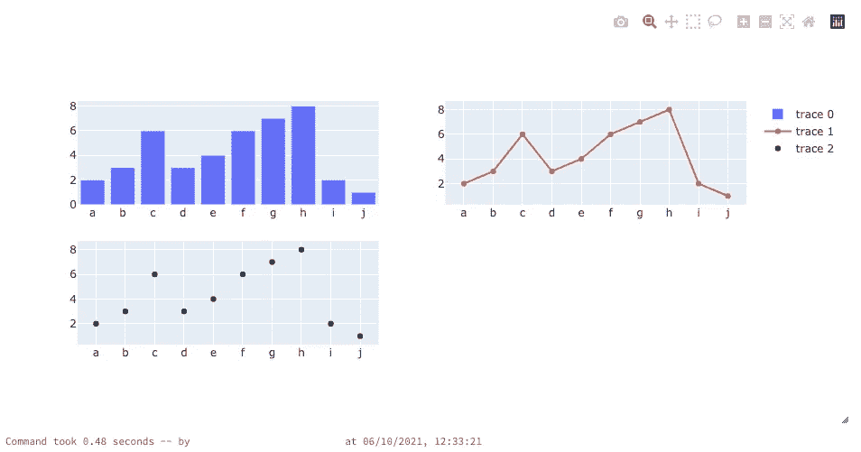

# 在 Databricks 笔记本中创建 BI 仪表板

> 原文：<https://medium.com/geekculture/creating-bi-dashboards-inside-a-databricks-notebook-91a2297362ad?source=collection_archive---------8----------------------->

## 动手实验

## Plotly + PySpark + Databricks


[Databricks](https://databricks.com/) 正在成为越来越多企业的首选大数据分析解决方案。我个人从事 Databricks 已经一年多了，处理过从其他数据分析平台到 Databricks 的迁移。

Databricks 通过将 SQL 数据源与其计算连接起来，并提供一个用于运行 SparkSQL 和摆弄图表的 UI 界面，为构建交互式仪表板提供了丰富的功能集。更多关于它的信息[在这里](https://docs.microsoft.com/en-us/azure/databricks/sql/user/dashboards/)。

## 这篇博客简单地说

在这篇文章中，我将演示如何创建一个具有多个交互式图形的仪表板，并在您的数据块笔记本中查看仪表板。我将使用[](https://plotly.com/)**来生成我们所有的图形。这里的技巧是使用 plotly 的子情节特性，并将多个轨迹追加到父情节中。然后，我最终从父绘图生成 HTML，并使用 Databricks 中可用的 [**displayHTML**](https://docs.databricks.com/notebooks/visualizations/index.html#displayhtml-function) 方法进行渲染。**

# **计算仪表板的大小**

**我们的第一步是确定整个图或仪表板的大小。想象它是一个网格或 2D 数组，数组中的每个元素都是一个子图。我们需要找到这个 2D 数组的长度和宽度。为简单起见，我们假设仪表板上的每个图表大小相同。**

```
import mathdef get_dashboard_dimensions(no_of_plots):

    y = math.sqrt(no_of_plots)
    x_width = 0
    y_width = 0 if(y.is_integer()):
        x_width = y_width = y else:
        z = int(y)
        y_width = z
        x_width = z+1 if (y_width * x_width) < no_of_plots:
        y_width += 1 return (x_width, y_width)
```

# **填充仪表板**

**下一步是使用 plotly 的 subplots 模块，并将我们所有的图形作为轨迹添加到我们的仪表板中。我们使用支线剧情模块的 **make_subplots** 方法。**

```
from plotly.subplots import make_subplots
from plotly.graph_objs import *def populate_dashboard(plot_array): x_width , y_width = get_dashboard_dimensions(len(plot_array))
    plot_counter = 0 dashboard = make_subplots(rows=x_width, cols=y_width, start_cell="top-left") for x in range(1,x_width+1):
        for y in range (1,y_width+1):
            if plot_counter <= len(plot_array) - 1:
                dashboard.append_trace(plot_array[plot_counter],row=x, col=y)
                plot_counter += 1

    return dashboard
```

# **在 Databricks 笔记本中显示仪表板**

**一旦我们准备好仪表板，我们的最后一步是使用 plotly 的离线模块，并将仪表板导出到 HTML。我们使用离线模块的 **plot** 方法。一旦我们准备好了 HTML，就只需要调用 Databricks 的 displayHTML 方法并在我们的笔记本中呈现仪表板。**

```
import plotly.offline as pyodef display_dashboard(dashboard):
    inner_html = pyo.plot(dashboard, output_type='div')
    displayHTML(inner_html)
```

# **驱动程序**

**要自己测试这段代码，可以使用下面的驱动程序。这里我们用随机数据集生成多个图，然后将它们作为一个列表传递给我们上面的方法来呈现仪表板。**

```
from plotly.graph_objs import *data_x = ["a","b","c","d","e","f","g","h","i","j"]
data_y = [2,3,6,3,4,6,7,8,2,1] plot1 = Bar(x=data_x,y=data_y)
plot2 = Scatter(x=data_x,y=data_y)
plot3 = Scatter(x=data_x,y=data_y,mode='markers',marker=Marker(color='black'))plot_array = [plot1, plot2, plot3]export_canvas(figs)generated_dashboard = populate_dashboard(plot_array)display_dashboard(generated_dashboard)
```

**在上面的代码中，我们为同一组数据生成了 3 个不同的图(条形图、折线图、散点图),然后将这些图传递给我们的方法，由我们的方法创建一个仪表板。然后，我们最终在笔记本中以 HTML 的形式显示我们的仪表板。**

**仪表板将如下所示**

****

# **导出仪表板**

**有了仪表板的整个 HTML，导出仪表板变得非常简单。我们只需要将 html 内容复制到一个. HTML 文件中，并将其放在任何外部挂载中。它是一个自给自足的 HTML 文件，也可以作为 iframe/widget 嵌入到现有的 webapps 中。**

```
def export_dashboard_html(dashboard, file_path):

    inner_html = pyo.plot(canvas, output_type='div')
    with open(file_path, 'w') as f:
        f.write(inner_html)
```

# **定制仪表板布局并添加更多功能**

**一旦我们在笔记本中渲染了仪表板，我们现在就可以做 plotly 支持的任何事情。**

**在我们的示例代码中，我们以相等的总高度和宽度来呈现每个图形。我们可以更进一步，在我们的子情节中创建一个自定义布局。更多关于它的信息[这里](https://plotly.com/python/subplots/#customize-subplot-column-widths-and-row-heights)。**

**我们还可以在图中添加下拉菜单和其他小部件，根据选择的标准对它们进行交互式过滤。更多信息请点击[这里](https://plotly.com/python/dropdowns/)**

# **可挑选的两种方法**

**还有其他方法可以做到这一点。我们可以不使用 subplots 模块，而是直接分别为每个图形生成 HTML，将所有图形附加到一个文件中，然后在笔记本中将整个文件呈现为 HTML。这样做的一个缺点是，每个图形都带有相同的 plotly.js 代码集，即使是 4-5 个图形，HTML 的文件大小也会很大。**

**我们也可以使用 Databricks 内置的可视化和绘图功能实现相同的结果。这将在某种程度上把我们的代码与数据块捆绑在一起，如果我们想把它移植到不同的分析引擎，就需要重写代码。**