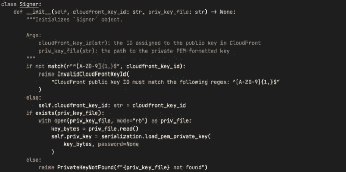

# 使用 CloudFront 签名 Cookies 实现安全访问

> 原文：<https://medium.com/geekculture/creating-cloudfront-signed-cookies-c51464c84c97?source=collection_archive---------4----------------------->

## 授权访问私有内容的更安全的方式

我最近发布了[cloudfront-signed-cookies](https://github.com/bin3xish477/cloudfront-signed-cookies)，这是 PyPI index 上提供的一个包，它允许您快速生成签名 cookie，以便安全地访问 CloudFront 发行版背后的资源，比如 S3 桶中的一个对象。在这篇博客中，我将谈一点关于 CloudFront 签署的…