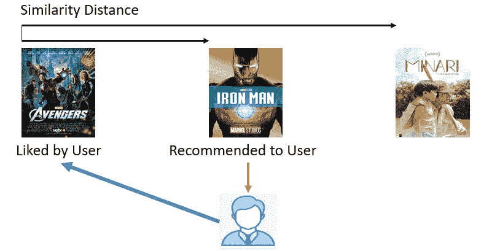
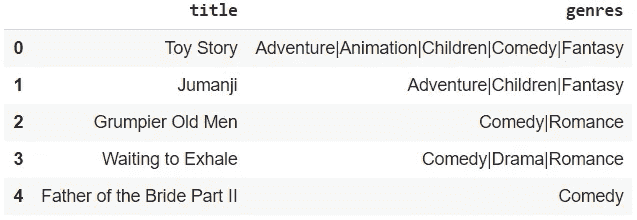
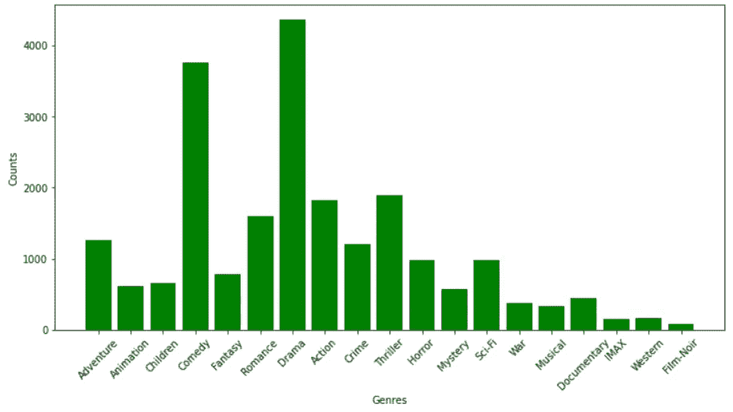
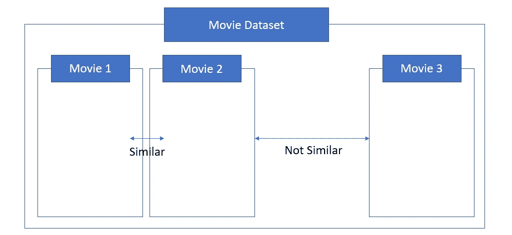
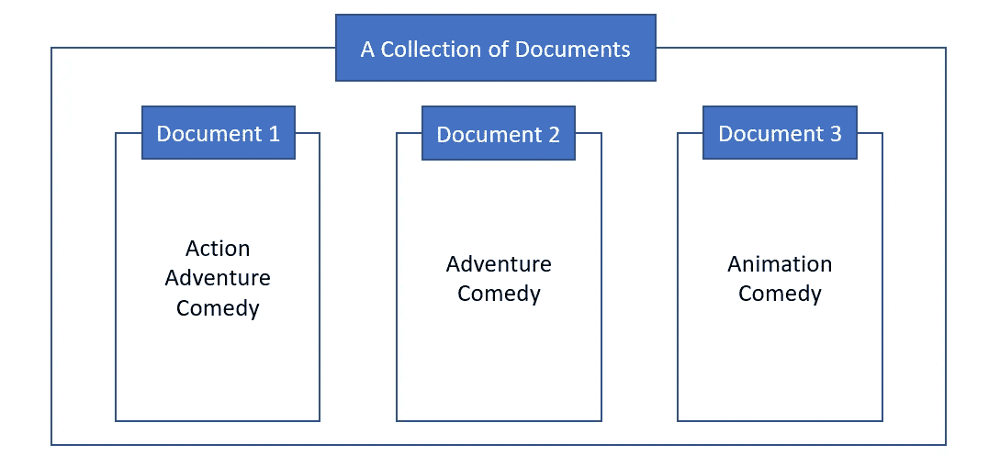
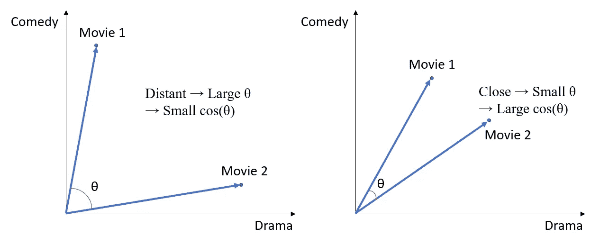
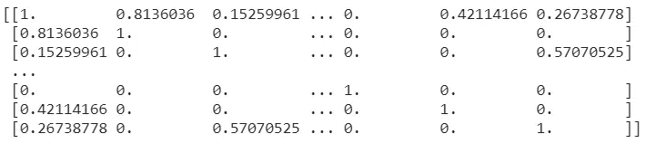
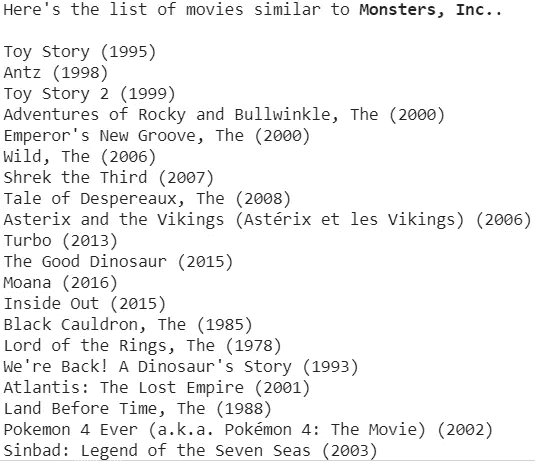
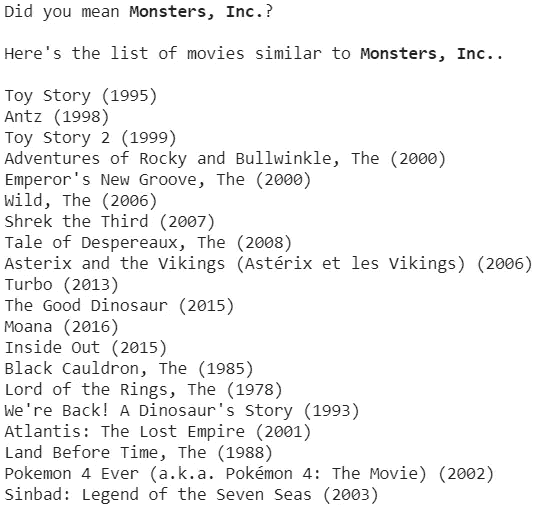

# 用 Python 制作基于内容的电影推荐器

> 原文：<https://medium.com/geekculture/creating-content-based-movie-recommender-with-python-7f7d1b739c63?source=collection_archive---------3----------------------->


Photo by [Glenn Carstens-Peters](https://unsplash.com/@glenncarstenspeters?utm_source=medium&utm_medium=referral) on [Unsplash](https://unsplash.com?utm_source=medium&utm_medium=referral)

**基于内容的推荐系统**是依靠项目的相似性向用户推荐项目的系统。例如，当用户喜欢一部电影时，系统找到并推荐与用户喜欢的电影具有更相似特征的电影。(功能 1)



Content-Based Recommending System (Feature 1)

在本文中，我将练习如何使用 **MovieLens** 数据集创建基于**内容的**推荐器。

# 读取数据

我们来读数据。来自 **MovieLens** 的电影数据集有多个版本。本练习中使用的版本有 9，742 部电影。

```
import pandas as pd
import numpy as np
import matplotlib.pyplot as pltmovies = pd.read_csv('movies.csv')
```

该文件有 3 列:**电影 ID** 、**标题**和**类型**。列**标题**的格式为`**title (year)**`。比如第一行的标题是`Toy Story (1995)`。由于把**标题**和**年份**分开更方便以后使用，所以我提前把这两个分开。

```
**# the function to extract titles** 
**def extract_title**(title):
   year = title[len(title)-5:len(title)-1]

   **# some movies do not have the info about year in the column title. So, we should take care of the case as well.**

   if year.isnumeric():
      title_no_year = title[:len(title)-7]
      return title_no_year
   else:
      return title**# the function to extract years**
**def extract_year**(title):
   year = title[len(title)-5:len(title)-1] **# some movies do not have the info about year in the column title. So, we should take care of the case as well.** if year.isnumeric():
      return int(year)
   else:
      return np.nan**# change the column name from title to title_year**
movies.rename(columns={'title':'title_year'}, inplace=True) **# remove leading and ending whitespaces in title_year**
movies['title_year'] = movies['title_year'].apply(lambda x: x.strip()) **# create the columns for title and year**
movies['title'] = movies['title_year'].apply(extract_title) 
movies['year'] = movies['title_year'].apply(extract_year) 
```

# 探索特色(类型)

列**流派**是这个推荐引擎使用的唯一特征。由于没有关于**类型**信息的电影在本练习中是不必要的，我将在数据中删除这些电影。

```
r,c = movies[movies['genres']=='(no genres listed)'].shape
print('The number of movies which do not have info about genres:',r)**[Out] The number of movies which do not have info about genres: 34****# remove the movies without genre information and reset the index**
movies = movies[~(movies['genres']=='(no genres listed)')].reset_index(drop=True)
```

每部电影包含多种类型，如下所示:



让我们看看每个流派在数据中出现了多少次。

```
**# remove '|' in the genres column**
movies['genres'] = movies['genres'].str.replace('|',' ')**# count the number of occurences for each genre in the data set**
counts = dict()
for i in movies.index:
   for g in movies.loc[i,'genres'].split(' '):
      if g not in counts:
         counts[g] = 1
      else:
         counts[g] = counts[g] + 1**# create a bar chart**
plt.bar(list(counts.keys()), counts.values(), color='g')
plt.xticks(rotation=45)
plt.xlabel('Genres')
plt.ylabel('Counts')
```



The Frequency of Each Genre in the Data (Feature 2)

# tf-idf(术语频率和逆文档频率)和余弦相似度



Feature 3

特征 3 简单地说明了推荐引擎的过程。由于*电影 1* 和*电影 2* 被认为彼此相似，并且它们与*电影 3* 不相似，如果用户喜欢*电影 1* ，那么系统应该向用户推荐*电影 2* 。

为了实现这一过程，需要两个步骤。

*   *步骤 1* :量化每部电影的特征( **tf-idf** )
*   *第二步*:计算电影之间的相似度(**余弦相似度**)

## 术语频率和反向文档频率(tf-idf)

**tf-idf** 是一个数值统计，用于计算**文档集**中**一个**一个**字**对**一个文档**的重要性。

实践中有几种定义和归一化 ***tf*** 和 ***idf*** 的方法。但基本公式如下:

***TF-IDF***(***I***，**，*j***)=***TF***(***I***，***j***×***IDF***(***I***，

*   ***TF***(***I***，***j***)=***f***(***I***，***j***/***∑ₖf***(
*   *****IDF***(***I***，***N***)=***log***(***N***/*df*(***I*)****
*   *****f***(***I***，***j***):word***I***在文档 ***j*** 中出现的次数**
*   *****∑ₖf***(***k***， ***j*** ):文档字数 ***j*****
*   *****df ᵢ:*** 出现 ***i*** 字样的单据号**
*   *****N:*** 单据总数。**

****

**Feature 4**

**为了更好地理解该公式，请看特征 4。根据上面的公式:**

*   *****我*** = { *动作、冒险、动画、喜剧* }**
*   *****j***= {*文件 1* ，*文件 2* ，*文件 3*}(***N***= 3)**
*   **随着文档包含的单词越来越少，文档中的每个单词都变得越来越重要。从这个意义上说， ***tf-idf*** **对于** ' ***冒险'*** **在** ***文档 2*** 中应该大于 ***tf-idf* 对于'*冒险'*文档 1 中*。*****
*   **随着一个单词在较少的文档中出现，该单词在该单词出现的文档中变得更加重要。***TF-IDF*for*Comedy***在每个文档中应该很低因为所有文档中都有这个词。**

****tf-idf** 用于量化**数据集**(文档集合)中**一个流派**(词)对**一部电影**(文档)的重要性。从专题 2 中的条形图，我们可以预计到*剧情*和*喜剧*会有较低的 ***tf-idf*** 评分，因为大约一半的电影包含这些流派。**

**来自`**sklearn.feature_extraction.text**`库的`**TfidVectorizer()**`类可用于计算和矢量化每部电影的 **tf-idf** 分数。**

```
from sklearn.feature_extraction.text import TfidfVectorizer**# change 'Sci-Fi' to 'SciFi' and 'Film-Noir' to 'Noir'** movies['genres'] = movies['genres'].str.replace('Sci-Fi','SciFi')
movies['genres'] = movies['genres'].str.replace('Film-Noir','Noir')**# create an object for TfidfVectorizer**
tfidf_vector = TfidfVectorizer(stop_words='english')**# apply the object to the genres column**
tfidf_matrix = tfidf_vector.fit_transform(movies['genres'])
```

**`**tfidf_matrix**`长什么样？**

```
tfidf_matrix.shape
**[Out] (9708, 19)**
```

*   **`**tfidf_matrix**`是 9708 行(电影)19 列(流派)的矩阵。**
*   **矩阵的行号对应于**电影**数据帧的索引**

```
print(list(enumerate(tfidf_vector.get_feature_names())))**[Out][(0, 'action'), (1, 'adventure'), (2, 'animation'), (3, 'children'), (4, 'comedy'), (5, 'crime'), (6, 'documentary'), (7, 'drama'), (8, 'fantasy'), (9, 'horror'), (10, 'imax'), (11, 'musical'), (12, 'mystery'), (13, 'noir'), (14, 'romance'), (15, 'scifi'), (16, 'thriller'), (17, 'war'), (18, 'western')]**
```

*   **`**tfidf_matrix**`的栏目依次为:`*(‘action’, ‘adventure, ‘animation’, ‘children’, ‘comedy’, ‘crime’, ‘documentary’, ‘drama’, ‘fantasy’, ‘horror’, ‘imax’, ‘musical’, ‘mystery’, ‘noir’, ‘romance’, ‘scifi, ‘thriller’, ‘war’, ‘western’)*`**
*   **矩阵的第一行向量是**玩具总动员**，值如下: *(0，0.4168，0.5163，0.5049，0.2674，0，0，0，0，0.483，0，0，0，0，0，0，0)。*根据这个向量， *tf-idf(动画)= 0.5163* 和 *tf-idf(儿童)= 0.5049* ，也就是说*动画*对*玩具总动员*最显著的流派，其次是*儿童*。**

## **余弦相似性**

**下一步是计算电影之间的相似度。在这一步，我们可以使用**余弦相似度**，它可以用来计算两个向量之间的距离。**

****余弦相似度**的公式如下:**

*****相似度***=***cos(θ)***=**(a⋅b)/(∥a∥×∥b∥)****

*   **A & B:非零向量**
*   **θ:A 和 B 之间角度的度量**
*   **A⋅B:点积**
*   **∨A∨或∨B ∨:向量 A 或 B 的长度**

****

**Cosine Similarity (Feature 5)**

**在特征 5 中，考虑两个不同的电影(*电影 1* 和*电影 2* )在类型方面在二维空间中。很明显，随着 ***cos(θ)*** 减小( **θ** 增大)，两个向量变得更远，而随着 ***cos(θ)*** 增大( **θ** 减小)，两个向量变得更近。**

**`**sklearn.metrics.pariwise**`中的`**linear_kernel()**`类可以用来计算**余弦相似度**。**

```
from sklearn.metrics.pairwise import linear_kernel**# create the cosine similarity matrix**
sim_matrix = linear_kernel(tfidf_matrix,tfidf_matrix) print(sim_matrix)
```

****

*   ****sim_matrix** 是一个 9708×9708 矩阵**。****
*   ****sim_matrix *ᵢⱼ*** 是电影 ***i*** 和电影 ***j*** 之间的相似度值。**
*   **矩阵中的对角线元素表示电影与其自身的相似性。(因此，这些值都是 1。)**
*   ****sim _ matrix*ᵢⱼ*t57】=**sim _ matrix*ⱼᵢ*t61】。******

# **创建电影推荐者**

**我们已经完成了对数据集中所有电影对的相似性值的计算。**

## **“你是说……？”欺骗**

**我们经常拼错电影名。当我们在使用*谷歌*搜索某样东西时出现拼写错误时，*谷歌*会问我们，*“你是说…？”*为了帮助我们的搜索。我应用 [*Levenshtein 距离*](https://en.wikipedia.org/wiki/Levenshtein_distance#:~:text=Informally%2C%20the%20Levenshtein%20distance%20between,considered%20this%20distance%20in%201965.) 就是为了实现推荐引擎的这一招。这是一种计算单词间距离的技术。`**fuzzywuzzy**`库中的`**fuzz**`类可以用来实现 Python 中的 *Levenshtein 距离*。**

```
from fuzzywuzzy import fuzz**# create a function to find the closest title**
**def matching_score**(a,b):
   return fuzz.ratio(a,b)
```

****fuzz.ratio(a，b)** 计算 **a** 和 **b** 之间的 *Levenshtein 距离*，并返回该距离的得分。如果两个单词 **a** 和 **b** 完全相同，则得分变为 100。随着单词之间距离的增加，分数下降。**

```
**# a function to convert index to title_year**
**def get_title_year_from_index**(index):
   return movies[movies.index == index]['title_year'].values[0]**# a function to convert index to title**
**def** **get_title_from_index**(index):
   return movies[movies.index == index]['title'].values[0]**# a function to convert title to index**
**def get_index_from_title**(title):
   return movies[movies.title == title].index.values[0]**# a function to return the most similar title to the words a user type**
**def** **find_closest_title**(title):
   leven_scores = list(enumerate(movies['title'].apply(matching_score, b=title)))
   sorted_leven_scores = sorted(leven_scores, key=lambda x: x[1], reverse=True)
   closest_title = get_title_from_index(sorted_leven_scores[0][0])
   distance_score = sorted_leven_scores[0][1]
   return closest_title, distance_score
```

**函数`**find_closest_title()**`应该返回数据中与用户输入的单词最相似的标题。如果没有这个，推荐器只有在用户输入数据的确切标题时才起作用。**

## **制作推荐引擎**

```
**def contents_based_recommender**(movie_user_likes, how_many):
   closest_title, distance_score = find_closest_title(movie_user_likes) **# When a user does not make misspellings
**   **if** distance_score == 100:
      movie_index = get_index_from_title(closest_title)
      movie_list = list(enumerate(sim_matrix[int(movie_index)])) **# remove the typed movie itself**
      similar_movies = list(filter(lambda x:x[0] != int(movie_index), sorted(movie_list,key=lambda x:x[1], reverse=True))) 

      print('Here\'s the list of movies similar to '+'\033[1m'+str(closest_title)+'\033[0m'+'.\n') for i,s in similar_movies[:how_many]:
         print(get_title_year_from_index(i)) **# When a user makes misspellings**    
   **else**:
      print('Did you mean '+'\033[1m'+str(closest_title)+'\033[0m'+'?','\n') movie_index = get_index_from_title(closest_title)
      movie_list = list(enumerate(sim_matrix[int(movie_index)]))
      similar_movies = list(filter(lambda x:x[0] != int(movie_index), sorted(movie_list,key=lambda x:x[1], reverse=True))) print('Here\'s the list of movies similar to '+'\033[1m'+str(closest_title)+'\033[0m'+'.\n') for i,s in similar_movies[:how_many]:
         print(get_title_year_from_index(i))
```

## **测试推荐者**

**该测试引擎了。让我们找到与**《怪物公司》**相似的电影。设置引擎推荐 20 部电影。**

```
contents_based_recommender('Monsters, Inc.', 20)
```

****

**推荐者似乎找到了与我选择的电影非常相似的电影。然后，让我们看看如果我拼错标题会发生什么。**

```
contents_based_recommender('Monster Incorporation.', 20)
```

****

**系统找到了我想要的，很好的推荐了榜单。**

**本练习的数据和代码可在[这里](https://github.com/yjeong5126/movie_recommender/tree/master/content_based)找到。**