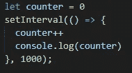
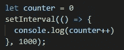
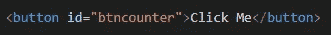
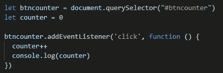
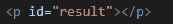
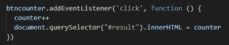

# 用 Javascript 创建计数器

> 原文：<https://medium.com/geekculture/creating-counter-with-javascript-4b1c60892c45?source=collection_archive---------1----------------------->

为了创建一个 JavaScript 计数器，有很多方法可以做到。在这篇文章中，我们将学习两种方法来做到这一点。

# 1.使用 setInterval

setInterval 是 javascript 中的一种方法，用于在一定时间内重复执行某些任务。我们将直接在 HTML 文件内的脚本标签中创建它，并将它登录到浏览器中。这是它的样子。

Create counter

在那里我们声明了一个名为 *counter* 的变量，然后我们给它赋值 0。然后我们创建 *setInterval* 方法来重复递增计数器值，每隔 *1000ms* 或每隔 1 秒递增一次。你也可以用更短的语法来写，像这样。

Create counter in more short ways

一旦浏览器打开，这两种方式将立即触发，并且只要浏览器没有刷新，计数器就会一直增加。

# 2.使用按钮

创建计数器的另一种方法是在 HTML 中创建一个按钮，然后给它分配一个 *onclick 事件。下面是如何做的。*

Define a button

这里我们在 HTML 中创建一个按钮，并给它一个 id *btncounter。*

然后我们将它赋给一个变量，这样我们就可以给它一个 *onclick 监听器*事件。 *onClick* 中的方法与上一个相对相同，但这次我们不再使用 *setInterval* ，因为只有当按钮被按下时计数器才会增加。

或者，您也可以将结果显示为 HTML，而不是控制台日志。这是如何做到的。

这里我们定义了 *p* 标签，并赋予它和 id *结果*。

然后，我们使用 *querySelector* 将计数器显示到 HTML 中，并给出计数器的结果，而不是在控制台记录它。

就是这样！这就是如何用 javascript 创建一个计数器的方法。希望这篇文章能对你有所帮助，感谢你阅读到这里。谢谢大家！