# 用 DeepFaceLab 教程创造 Deepfake 奇迹(SAEHD 模型)

> 原文：<https://medium.com/geekculture/creating-deepfake-miracles-with-deepfacelab-tutorial-saehd-model-aa2aa12c08f3?source=collection_archive---------1----------------------->

毫无疑问，Deepfake 是我们这个时代最性感的技术之一。自己试试怎么样？

# 那么这个深假的东西是什么？

**deep fakes**([深度学习](https://en.wikipedia.org/wiki/Deep_learning)、[【1】](https://en.wikipedia.org/wiki/Deepfake#cite_note-FoxNews2018-1)的一个[组合词](https://en.wikipedia.org/wiki/Portmanteau))是[合成媒体](https://en.wikipedia.org/wiki/Synthetic_media)[【2】](https://en.wikipedia.org/wiki/Deepfake#cite_note-2)，将现有图像或视频中的一个人替换成他人的肖像。虽然伪造内容的行为并不新鲜，但 deepfakes 利用来自[机器学习](https://en.wikipedia.org/wiki/Machine_learning)和[人工智能](https://en.wikipedia.org/wiki/Artificial_intelligence)的强大技术来操纵或生成具有很高欺骗潜力的视频和音频内容。[【3】](https://en.wikipedia.org/wiki/Deepfake#cite_note-:17-3)用于创建 deepfakes 的主要机器学习方法基于深度学习，并涉及训练生成性[神经网络](https://en.wikipedia.org/wiki/Artificial_neural_network)架构，如[自动编码器](https://en.wikipedia.org/wiki/Autoencoder)[【3】](https://en.wikipedia.org/wiki/Deepfake#cite_note-:17-3)或[生成性对抗网络](https://en.wikipedia.org/wiki/Generative_adversarial_network) (GANs)。，维基百科说。

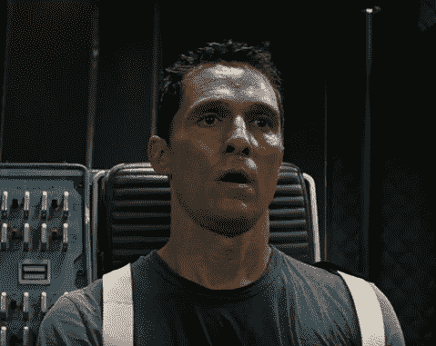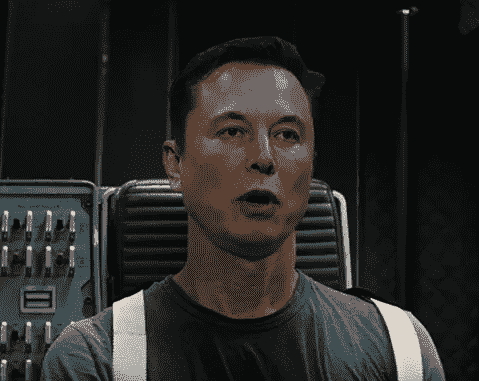

Replacing the heads (Source: [https://github.com/iperov/DeepFaceLab](https://github.com/iperov/DeepFaceLab))

Another example (Source: [https://github.com/iperov/DeepFaceLab](https://github.com/iperov/DeepFaceLab)

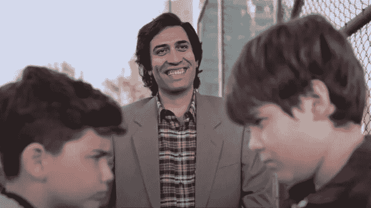

And this is an example from Turkey. The actor passed away in 2000\. It’s from a TV advertisement for Ziraat Bank in 2021\. [https://www.youtube.com/watch?v=fPiwmoxa0QE&ab_channel=ZiraatBankas%C4%B1](https://www.youtube.com/watch?v=fPiwmoxa0QE&ab_channel=ZiraatBankas%C4%B1)

## 我有令人震惊的消息告诉你。你也可以这样做，用你家里的电脑。嗯，听起来很有趣，对吧？那我们就来上教程吧！

# 步骤 1:下载

*   首先，我们需要到达这个项目的 Github 页面。

## [https://github.com/iperov/DeepFaceLab](https://github.com/iperov/DeepFaceLab)

*   向下滚动时，您会看到“发布”部分。挑选最适合自己的版本。我用 Torrent 客户端下载的。

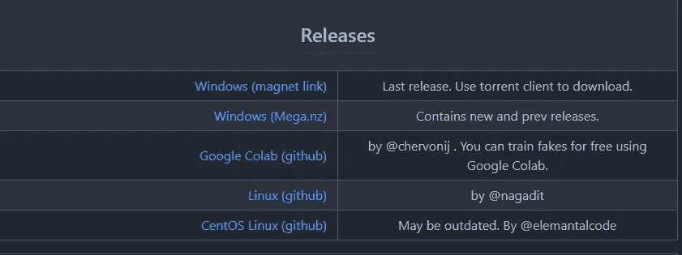

*   你不需要全部下载。只下载一个适合你显卡的。我有一台 RTX 2060，我下载了英伟达最新的 RTX2080Ti。

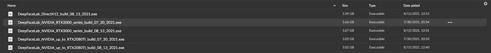

*   下载过程完成后，双击并点击“提取”我们准备好创造奇迹了！

# 第二步:开始之前

*   这个页面欢迎你。最好习惯一下，因为你会把所有的时间都花在这里。你们将会是最好的朋友！“工作区”文件夹是你创造奇迹的地方。一切从这里开始。

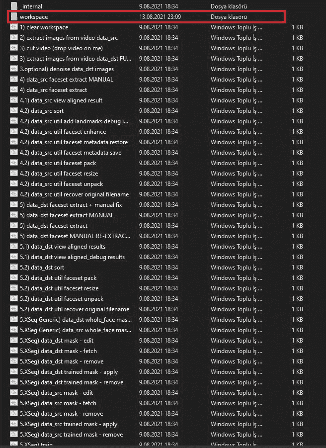

*   两个名为“**data _ dst”**和**“data _ src”**的. mp4 视频欢迎你进入“Workspace”文件夹。这两个视频是默认视频，你可以直接开始工作。我尝试了这两个视频，但后来我用新的替换了它们，当时我正在进行新的项目。这就是为什么，这段文字下面照片里的这两个视频，不是默认的。我把它们放在那里。

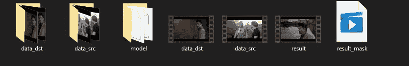

videos named “data_dst ve data_src”

## “data_src”(源)是您的源视频。

## “data_dst”(目的地)是您的目的地视频。

将提取 data_src 视频中的面集，并将其替换为 data_dst 视频中的面。

# 源和目标视频要求

*   高分辨率(4K WebM 最好，不建议低于 1080p)
*   离镜头不太远且无障碍的脸
*   多角度，面部表情
*   明亮均匀的灯光
*   脸应该有些匹配(胡子、帽子、头发、肤色、形状、眼镜)
*   需要至少 2 分钟的高质量视频。面试视频效果很好。

【https://pub.dfblue.com/pub/2019-10-25-deepfacelab-tutorial】**)**

# *作者的一个小纸条*

> *您必须将您将要处理的视频命名为“data_src”和“data_dst”这是非常重要的一点。您可以创建一个新文件夹，并将旧数据、源和结果视频放入其中。我给你的建议是不要删，因为编译好了，你可以回去看看你的老项目和他们的资料。
> 另外，当你开始一个新项目时，只需点击“清除工作区”即可。一切都准备好了。你唯一需要做的就是把“data_src”和“data_dst”视频放入工作区。*

*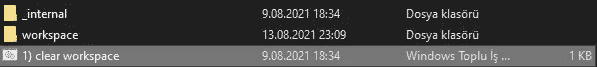*

# *第三步:伙计们，系好安全带。我们开始了！*

*你需要做的是:*

*   *2) *从视频数据 _src 中提取图像*(从“数据 _src”中提取图像)(按几次“回车”使用默认设置。)*

*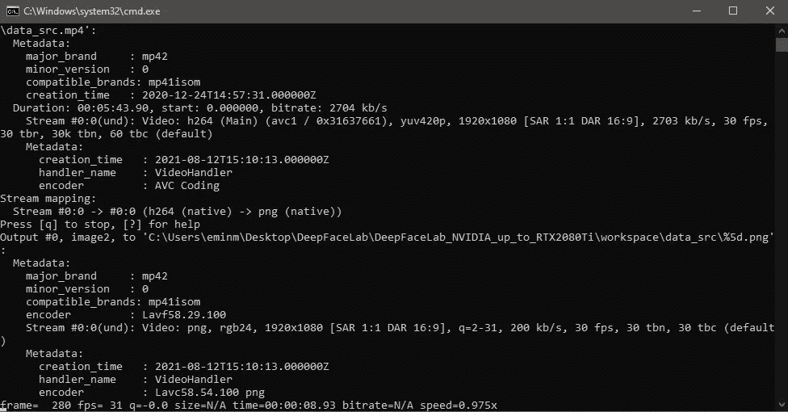*

*When it’s done, you will see “Press a Key To Continue.”*

*   *3) *从 video data_dst FULL FPS 中提取图像*(从“data_dst”中提取图像)(按几次“Enter”使用默认设置。)*
*   *4) *数据 _src 面集提取*(它从数据 _src 中提取面集。看到了吗？这不是火箭科学的家伙！)*

*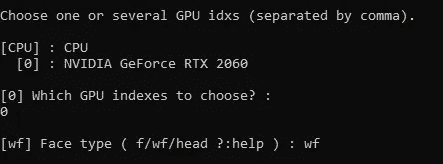*

*When it asks you for the Face Type, write “wf” and use default settings then.*

*   *4.1) *data_src 查看比对结果*(你可以在这里看到你的结果。为了获得最佳效果，在开始培训课程之前，删除不符合我们标准的不必要的照片。例如，错误识别的人脸、扭曲的图像等。)*

*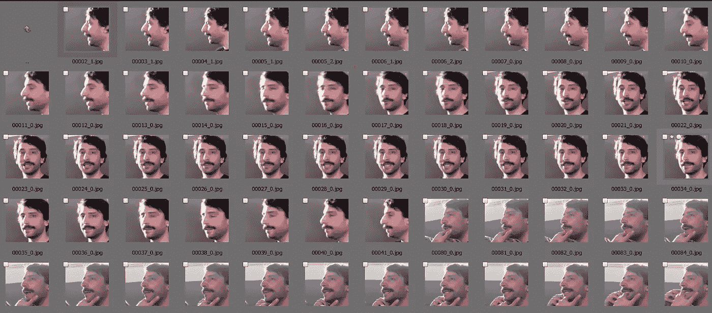*

*   **5) data_dst 面集提取*(从 data_dst 提取面集)(同步骤 4)*

**

*When it asks you for the Face Type, write “wf” and use default settings then.*

*   *5.1) *data_dst 查看对齐结果(*你可以在这里看到你的结果。为了获得最佳效果，在开始培训课程之前，删除不符合我们标准的不必要的照片。例如，错误识别的人脸、扭曲的图像等。)(与步骤 4.1 相同)*

*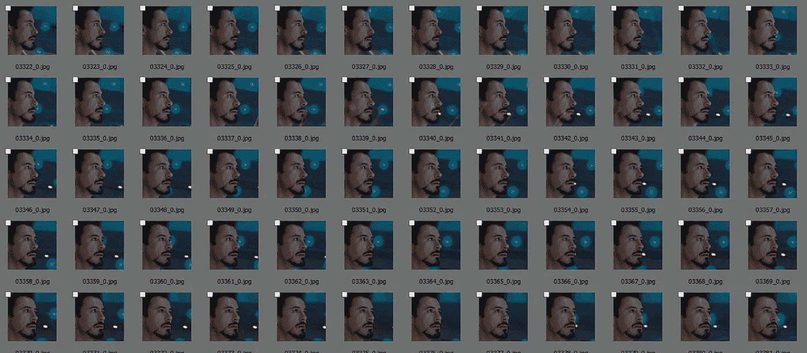*

*   **5。XSeg) data_dst mask —编辑**

*现在是一个临界点。在这一章中，我们将手动遮罩面部。我们必须小心地进行掩蔽过程。如果你掩膜不正确或者马虎，你会得到一个令人讨厌的结果。我做的蒙版过程有点草率，在几个地方加入了个人的头发。这产生了令人沮丧的结果。我会把照片放在最后。*

*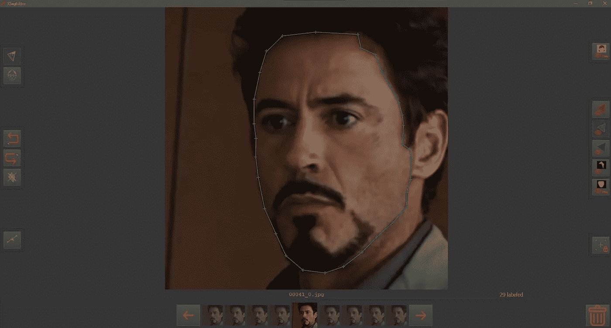*

*More masking = Better results*

*   **5。XSeg) data_src mask —编辑**

*我们对源视频再次进行同样的处理。同上一步。*

*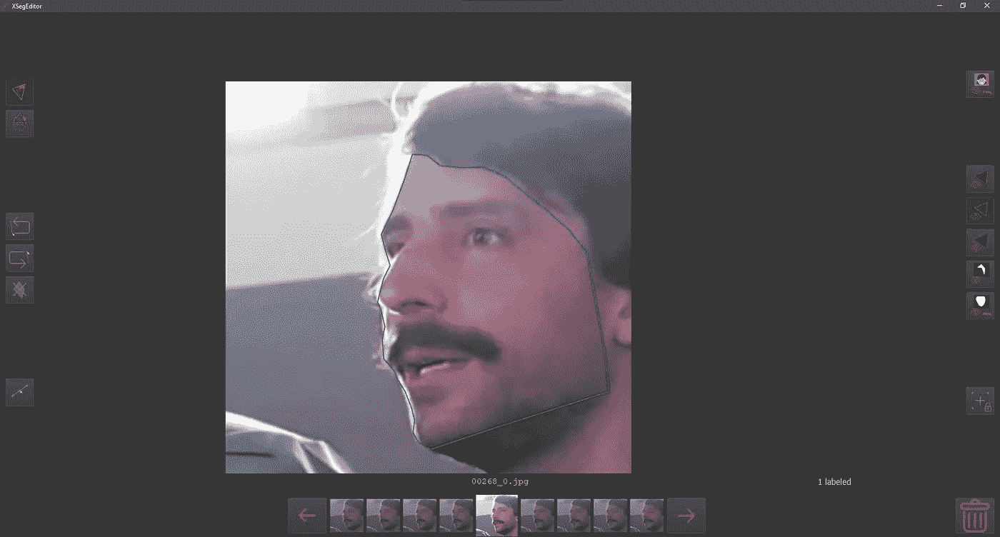*

*   **5。XSeg)列车**

*现在是时候开始训练我们的 XSeg 模型了。当它要求你输入脸型时，写下“wf ”,然后按 Enter 键开始训练。激动人心的部分开始了！*

*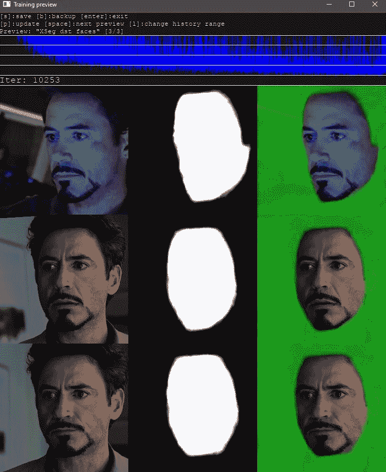*

*首先，让我们就这一点达成一致:*

*迭代次数越多=结果越好*

> *我给你的建议是最少要有 10000 个 Iters。当然可能更多。因为我们刚刚说的，迭代越多=结果越好。*

*当你说 OK，这就够了，你就可以按“Enter”键，完成模型的训练。我们继续。*

*   **5。XSeg) data_dst 训练掩码—应用*(我们应用我们的训练模型)*
*   **5。XSeg) data_src 训练掩码—应用*(我们应用我们的训练模型)*
*   **5。XSeg) data_src mask — edit (* 我们检查结果，再次屏蔽不良结果以获得最佳输出 *)**
*   **5。XSeg) data_dst mask — edit (* 我们检查结果，再次屏蔽不良结果以获得最佳输出 *)**

*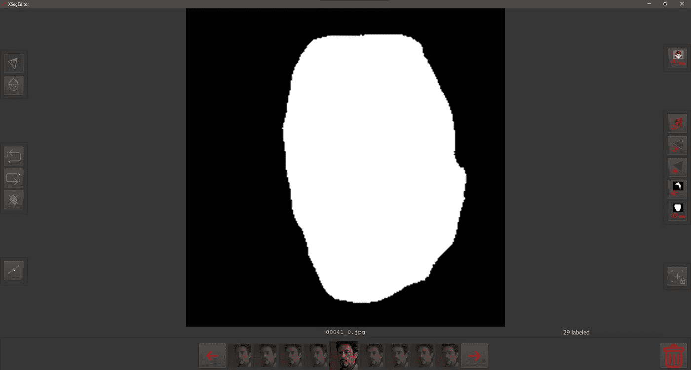*

*   **5。(重制面具后，我们又训练了一些。如果你没有做过任何重标，你不需要重新培训。)**
*   **5。XSeg) data_dst 训练掩码—应用*(我们应用重新训练的模型，就像前面的步骤一样。)*
*   **5。XSeg)data _ src trained mask—apply(*我们像前面的步骤一样应用重新训练的模型。)*

# *神奇开始了！*

*作为最后一步；*

## *6)培训 SAEHD*

*我们点击并开始我们模型的训练。确保至少有 100.000 次迭代。越多越好。如果你愿意，你可以做 500.000 或 1.000.000 次迭代。但是 iters 越多，结果越好！当你说“好了，这就够了”时，按下“回车”键，完成训练环节。*

*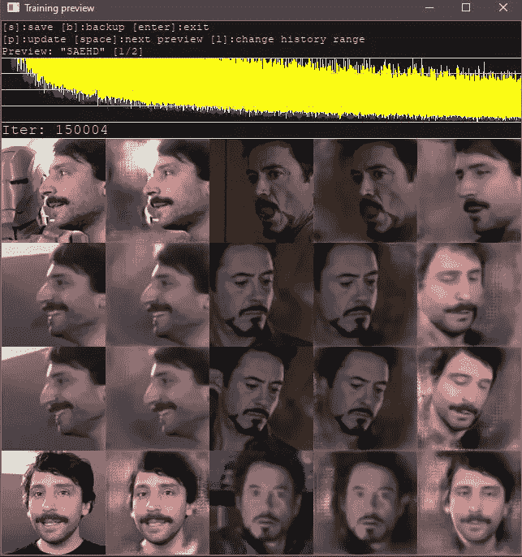*

*在这个过程中，你的系统会有困难。你的电脑会热得要命。在这个过程中，我去给自己买了一个笔记本电脑冷却器。我用一张图给你看这个。*

*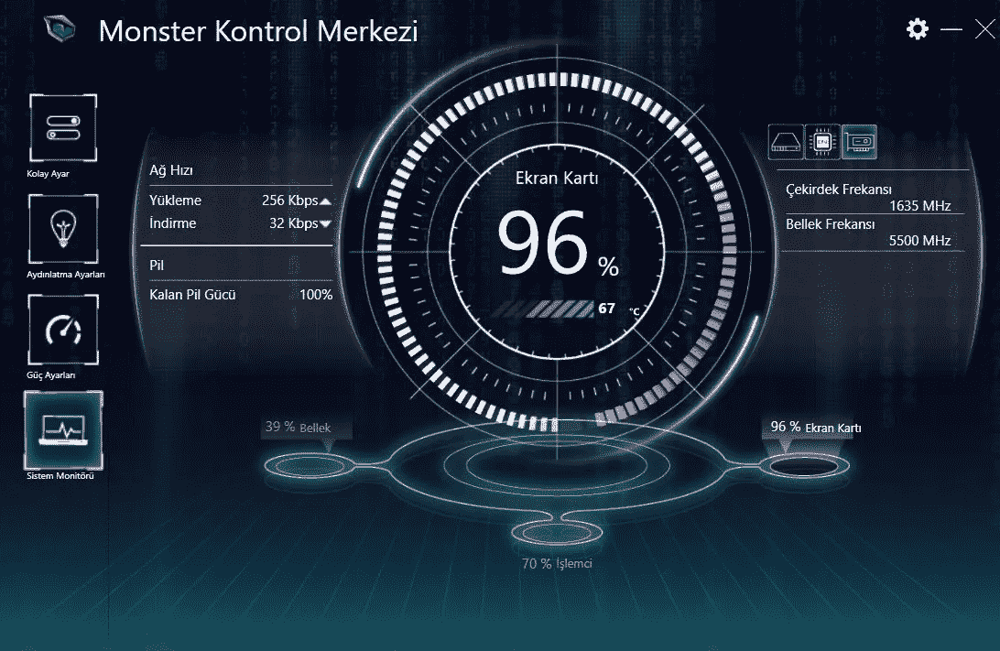*

*Graphics Card*

*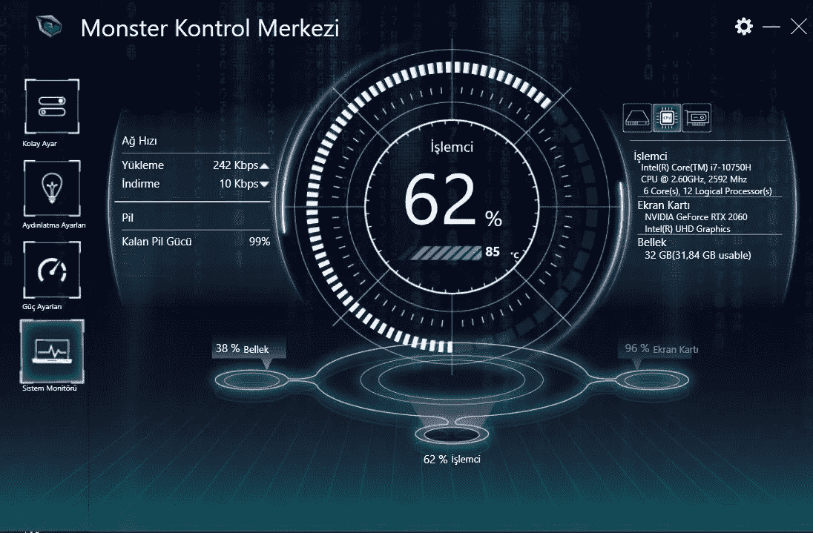*

*Processor*

# *第四步:走向决赛*

*我们现在已经走到了尽头。*

*   *7)合并 SAEHD*

*你会看到一个互动屏幕。*

*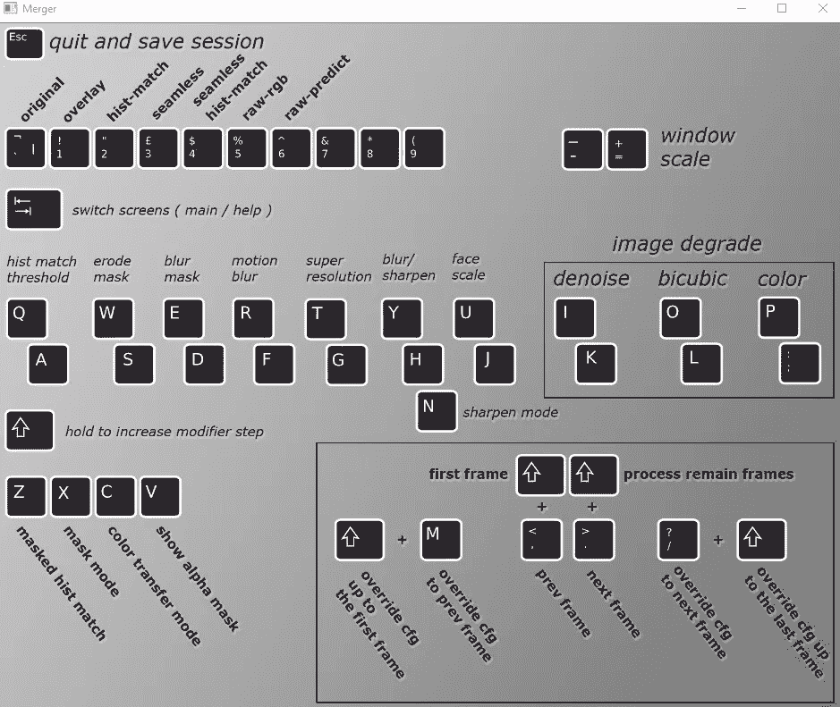*

*You can decide on the most appealing result by pressing options such as Q-A / W-S / E-D / R-F / T-G / Y-H-N / U-J. You can switch between screens by pressing the TAB key. When you’re done, press Shift + M and Shift + ? so you can apply them for previous and next frames. It would be more beneficial for you to try the options one by one.*

*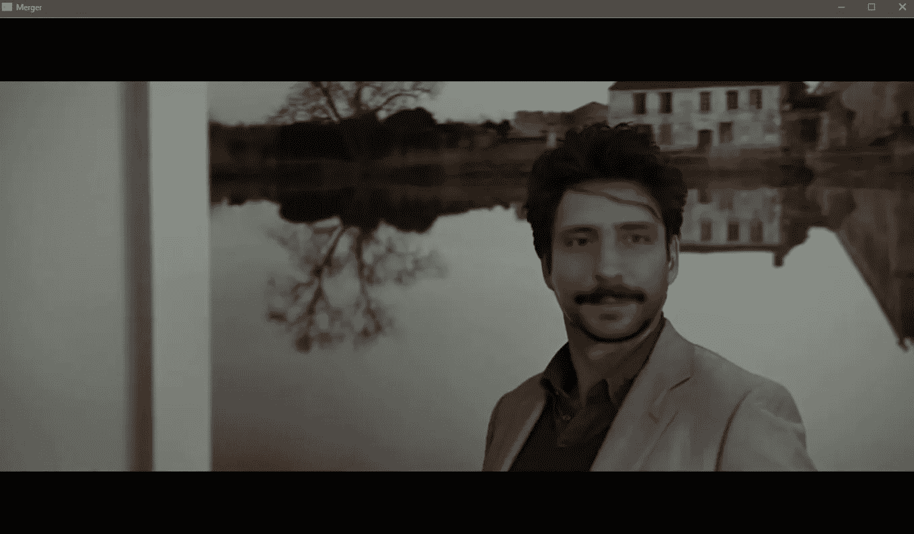*

*After you get your result, make sure to press “C” to apply “Color Transfer Mode.” You can play on it however you want. Remember, this is where you do wonders, and it has a massive impact on how realistic you will get the result.*

*在本例中，您会看到错误屏蔽的结果。如果遮罩过程做得更细致一些，这次我会得到一个非常逼真的效果。我故意犯这个错误，这样你就不会犯同样的错误。*

# *第五步:总决赛！*

**8)合并到 mp4**

*点击它，你会看到你的结果。你得到的结果会在“Workspace”文件夹中以“result.mp4”的名称等着你。你可以在网上或和我分享你的成果给你的朋友和爱人！*

*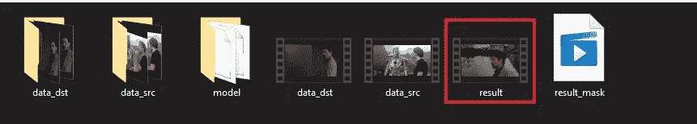*

*希望这篇教程对你有用。你可以随时问我问题。*

*您可以通过以下方式联系我:*

*【领英:[https://www.linkedin.com/in/mehmet-emin-masca-359812207/](https://www.linkedin.com/in/mehmet-emin-masca-359812207/)*

*电子邮件:eminmasca@hotmail.com*