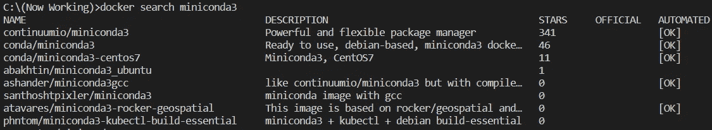
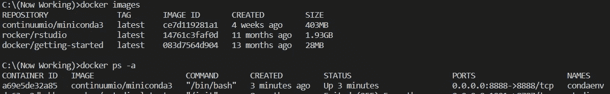
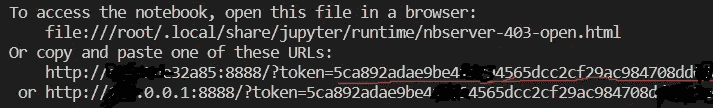
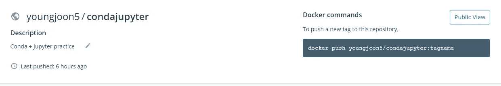

# 为社会科学家创建 Docker 图像(conda+Jupyter 笔记本)

> 原文：<https://medium.com/geekculture/creating-docker-image-conda-jupyter-notebook-for-social-scientists-8c8b8b259a9a?source=collection_archive---------3----------------------->

我们可以在互联网上找到许多代码，可以作为我们研究的很好的参考。然而，代码并不总是在我的电脑上工作。由于环境的变化，例如不同的版本和操作系统，这变得更加复杂。
对于像我这样的社会科学家来说，这是**而不是**一个小问题，因为编码对我们来说已经是一个重大挑战。

***Docker*** 可以协助我们。它使我们能够使用整个参考代码环境，并且我们可以在同一个作者环境中运行代码。

# 什么是 Docker


Docker 的标志提供了 Docker 是什么的信息。一只鲸鱼正在运输集装箱。
我们可以把代码、库、必要的资源放在一个容器里，鲸鱼会把容器运到我们的计算机环境里，这些环境和编码作者的并不一样。

# 集装箱的三个因素

我们需要**三个**因素: **dockerfile** 、 **image** 和 **container** 。

*   **dockerfile** :包含图像的设置脚本
*   **图片**:包含所有设置+ dockerfile。(此图像不可更改。)
*   **容器**:允许在容器内使用图像。我们可以改变容器，这使我们能够为我们的目的操纵原始代码。

# 创建 dockerfile 文件

创建`dockerfile`

```
FROM ubuntu:latest
RUN apt-get update && \
    apt-get install -y python3.9 \
    python3-pip

RUN pip3 install JPype1 jupyter pandas numpy seaborn scipy matplotlib pyNetLogo SALib 

RUN useradd -ms /bin/bash jupyter
USER jupyter
WORKDIR home/jupyter 
EXPOSE 8888                                           
ENTRYPOINT ["jupyter", "notebook","--allow-root","--ip=0.0.0.0","--port=8888","--no-browser"]
```

这个 dockerfile 文件就是一个例子。`FROM`用于加载基本映像，`RUN`用于安装或运行命令。这个 dockerfile 的框架创建了一个 Docker **映像**。然后，**容器**可以用于我们的目的。

如果你搜索创建 Docker 镜像，你会发现还有额外的 starnage 文件，比如 **requirements.txt** 或者 **yml 文件**。此外，还提供了复杂的格式和词汇表。即使你能为这些文件收集到好的例子，一个微小的差异或遗漏也会让你陷入无休止的错误信息中。

我不会说我喜欢读**计算机参考文献**。在许多情况下，简单地解释参考文献并不足以帮助我。我需要其他参考资料或解释来完全理解这些参考资料。我只想使用对我有用的计算机工具，而不是学习一些新的令人兴奋的方法。

因此，我将**不会创建任何不寻常的文件**。相反，我试着为那些想使用计算机工具而不是像我一样研究它们的社会科学家们直接创造`Image`和`Container`**。**

# **从 Docker hub 中拉出`miniconda Image`并创建一个`Container`**

****conda** 是创建符合我们需求的 Python 环境的良好起点。**

```
docker search miniconda3
```

****

**我将使用来自 **Docker hub** 的第一个 miniconda3 图像。**

```
docker run -i -t --rm --name condaenv -p  8888:8888 continuumio/miniconda3 /bin/bash
```

**`docker run`命令用于运行**图像**。但是，如果我没有我选择的图像，这个命令会提取它并创建一个**容器**。**

*   ****-i -t** :允许容器交互**
*   ****— rm** :工作完成后移除集装箱。**
*   ****—名称 condaenv** :创建容器名称， *condaenv。***
*   ****-p 8888:8888** :连接端口 8888 用于 **Jupyter 笔记本****
*   ****/bin/bash** :运行 *bash* 在**端子**输入更多命令**

```
docker images
docker ps -a
```

****docker images** 显示你拥有的图像，而 **docker ps -a** 提供关于你的容器的信息。你可以在 **Docker 桌面**中查看它们。**

****

# **使用`conda`创建 Python 环境**

```
conda update conda
conda install python=3.9.6
```

**首先来更新一下康达，**康达更新康达**。如果需要特定版本的 Python(比如 3.9.6)，安装那个版本，**conda install Python = 3 . 9 . 6**。**

```
conda install -c conda-forge jpype1
conda install jupyter pandas numpy  
pip install SALib seaborn
```

**用 **conda install** 和 **pip install** 安装软件包。**

# **`Jupyter notebook`在码头集装箱中**

**这是最具挑战性的部分。在 Docker 中可以很容易地找到很多关于如何使用 Jupyter notebook 的帖子。有些很难理解，而有些则不再起作用。**

**我相信，这种方法对像我这样的社会科学家来说是最直接和最有效的。**

```
# In the Windows PowerShell or VS code
ipconfig
```

**你需要你的电脑的 IPV4 地址。
ipconfig 显示很多地址。您需要连接到互联网的 IPV4 地址。因为我用的是笔记本电脑，所以需要*无线局域网适配器 Wi-Fi* 地址(比如 111.000.1.000)。**

```
mkdir -p /opt/notebooks 
jupyter notebook --notebook-dir=/opt/notebooks --ip='*' --port=8888  --no-browser --allow-root
```

****mkdir** 为 Jupyter 笔记本
创建目录 **jupyter 笔记本**有很多选项。**—notebook-dir =/opt/notebooks**表示 Jupyter 笔记本将在新目录下运行。其他选项只有一个目的:它们允许 Docker 的 Jupyter notebook 连接到网络浏览器并在其中运行。**

****

**不要使用 URL。复制一个**令牌**就可以了。
将 **IPV4 地址:8888** (例如 111.000.1.000:8888)输入您的网络浏览器。然后 Jupyter 请求**令牌**。输入复制的令牌。**

# **更新 Docker 映像并创建存储库**

**首先，在 [Docker hub](https://hub.docker.com/) 中创建您的存储库。**

****

**我的库名是**young joon 5/condajupyter**。当我把我的新形象推送到 Docker hub 时，它应该被命名为**young joon 5/condajupyter**。**

```
# In the PowerShell or VS code
docker ps -a
docker commit {Container ID} {new Image name(repository name)}
#ex# docker commit 40b8d16b7dba youngjoon5/condajupyter
```

**我们需要*容器 ID* 用容器更新**图像**(使用 **docker ps -a** )。 **docker commit** 使用容器和拉出的图像生成一个*新图像*。新的映像名称应该是与存储库名称相同的**名称，以便将新的映像推送到 Docker hub。****

```
docker login
docker push youngjoon5/condajupyter
```

**登录 Docker ( **docker 登录**)后，从 **Docker hub** 复制推送命令，粘贴到你的终端。**

# **使用新图像**

```
# Pull the new Image and Create a Container
docker run -i -t --rm --name condaenv -p  8888:8888 youngjoon5/condajupyter /bin/bash# Run Jupyter notebook
jupyter notebook --notebook-dir=/opt/notebooks --ip='*' --port=8888  --no-browser --allow-root
```

**最初发布在[我的网站](https://youngjoon5.github.io/)**