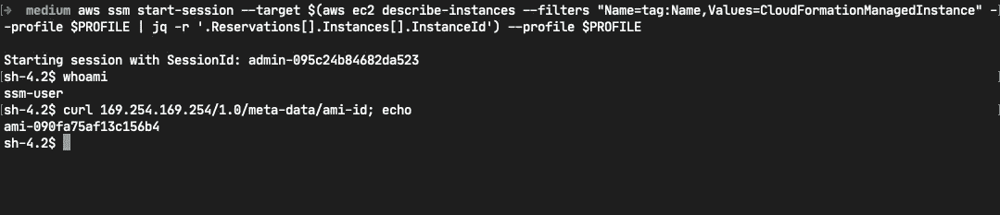

# 使用 CloudFormation 创建 EC2 实例

> 原文：<https://medium.com/geekculture/creating-ec2-instances-with-cloudformation-87c3fbe7e4b7?source=collection_archive---------4----------------------->

## 使用 AWS SSM 安全地访问我们的实例——不再需要 SSH

你好，世界！AWS CloudFormation 允许我们自动部署 AWS 基础设施和服务，即基础设施即代码。CloudFormation 使用可以用 JSON 或 YAML 编写的声明性模板来部署 AWS 资源。使用 AWS 时的一个常见任务是…