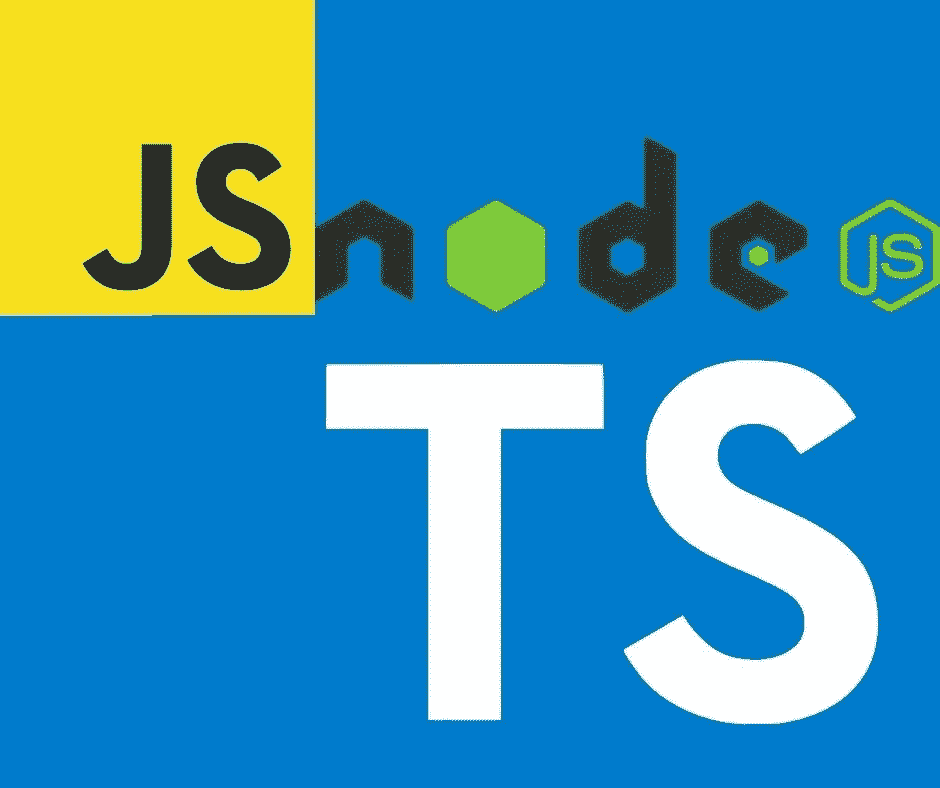

# 使用 Typescript 为 Node.js 包创建 CommonJS 或 ES6 模块

> 原文：<https://medium.com/geekculture/creating-either-commonjs-or-es6-modules-for-node-js-packages-using-typescript-ca8e05928ab6?source=collection_archive---------4----------------------->

## `package.json`中的新特性为构建我们的包提供了极大的灵活性

Image by Author, using logos for JavaScript, TypeScript and Node.js

**node . js 上软件的核心单元是*包*。因此，为 Node.js 应用程序使用 TypeScript 需要学习如何创建用 TypeScript 编写的包，或者有时是一种混合的** …