# 制造敌人的爆炸

> 原文：<https://medium.com/geekculture/creating-enemy-explosions-23c2e732c809?source=collection_archive---------76----------------------->

## 体面地把它们拿出来

有什么比消灭你的敌人更好？看着他们在淘汰中爆炸。

特效给游戏带来许多人渴望的特殊视觉享受。在这里，我们要让我们的敌人在被消灭时爆炸成一个火球。

要将爆炸的精灵动画附加到我们的敌人身上，我们必须首先选择我们的敌人预设并打开预设。

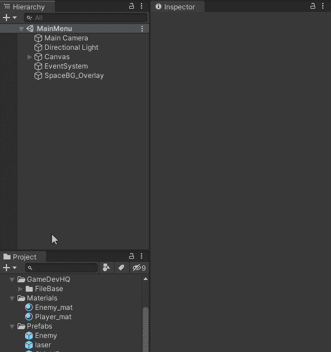

Open Enemy Prefab

现在我们将创建一个新的动画，名为《敌人 _ 毁灭 _ 动画》。在资产中找到敌人爆炸序列。

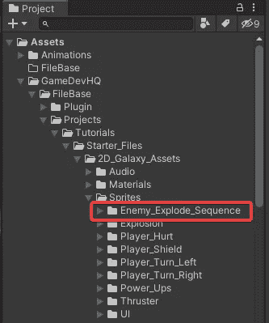

在动画窗口中，创建一个新的动画。选择动画文件夹，并将其命名为敌人 _ 破坏 _ 动画。

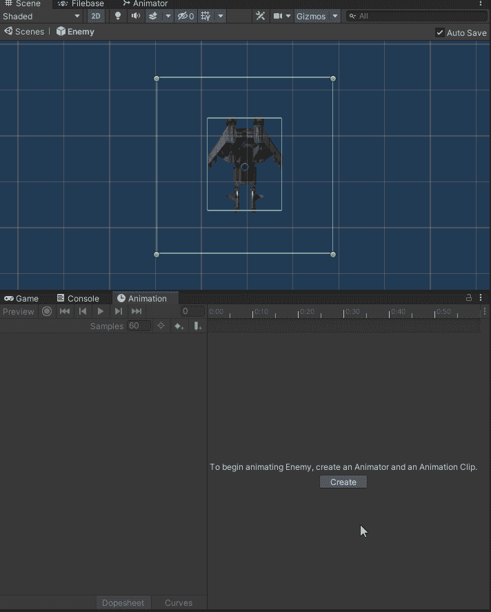

Creating new animation

我们现在选择动画窗口中的 record 按钮，选择爆炸的整个 sprite 序列，并将其拖动到 Animator 上。点击播放观看动画，然后再次点击录制按钮停止录制。

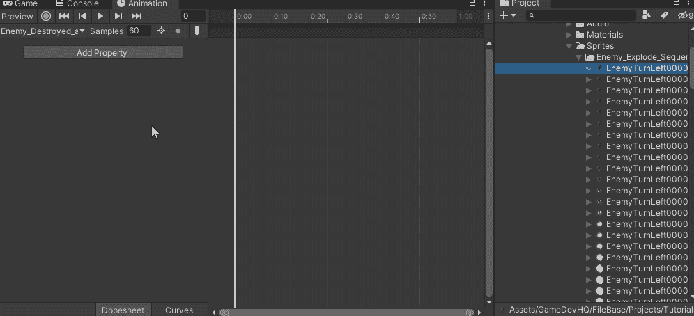

Importing animation sprites

我们不希望这个序列循环，因为敌人的物体在爆炸后被摧毁。因此，在我们的项目窗口的动画文件夹中，选择敌人 _ 摧毁 _ 动画，并在检查器中，取消选择**循环时间**。

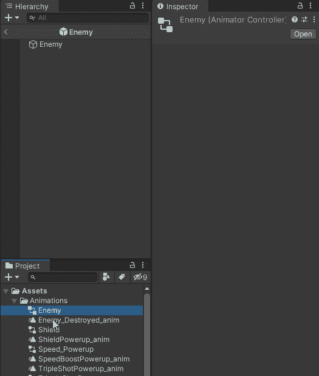

Stop animation from looping

如果我们玩我们的游戏，我们会注意到我们的敌人一出生就会爆炸。这是因为我们刚刚创建的动画从一开始就在播放。

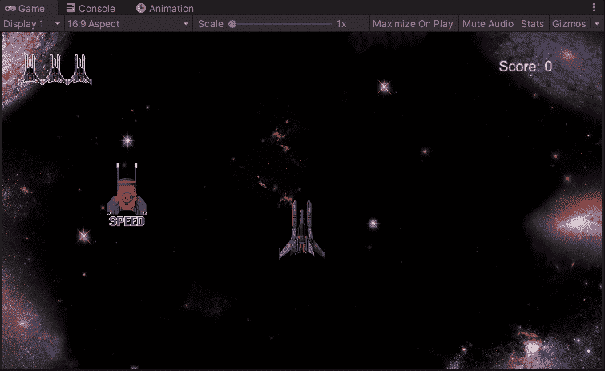

要了解发生了什么，我们必须打开动画的 Animator 视图。在我们项目的动画文件夹中，双击敌人控制器(在敌人 _ 毁灭 _ 动画上方)。

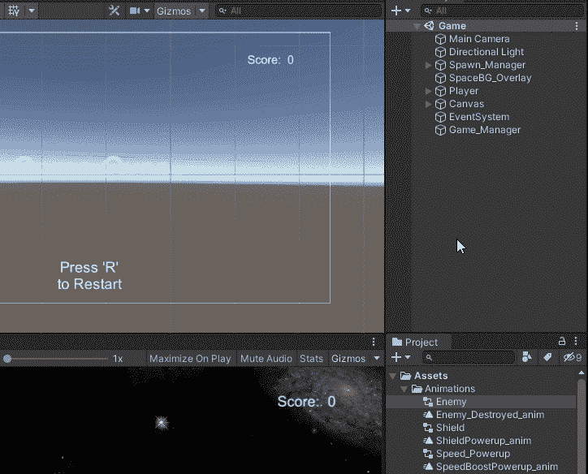

Opening the Enemy Destroyed Controler panel

我们可以看到动画对象是橙色的，意味着是自动播放的。

为了防止这种情况发生，我们必须在入口和敌人 _ 被摧毁 _ 动画对象之间放置一个**空状态**对象。

右击基础层画布并选择**创建状态>空。**重命名为空。

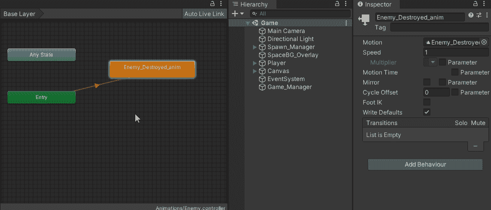

Creating an Empty state object

我们现在需要入口对象指向我们的空对象，而不是敌人 _ 毁灭 _ 动画对象。

右键点击**空**对象，选择**选择为层默认状态**。

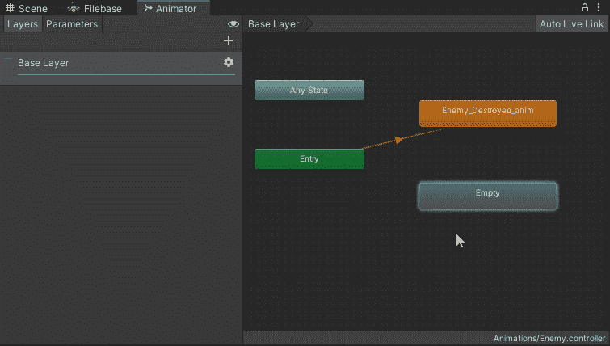

现在，箭头指向新的空物体(现在是橙色的)而不是敌人 _ 被摧毁 _ 动画对象(现在是灰色的)。

为了继续事情的流程，我们现在需要将我们的空对象连接到敌人 _ 毁灭 _ 动画对象。否则永远不会播放。

右键点击**空**对象，选择**制作过渡**，然后选择**敌人 _ 被摧毁 _ 动画**按钮。

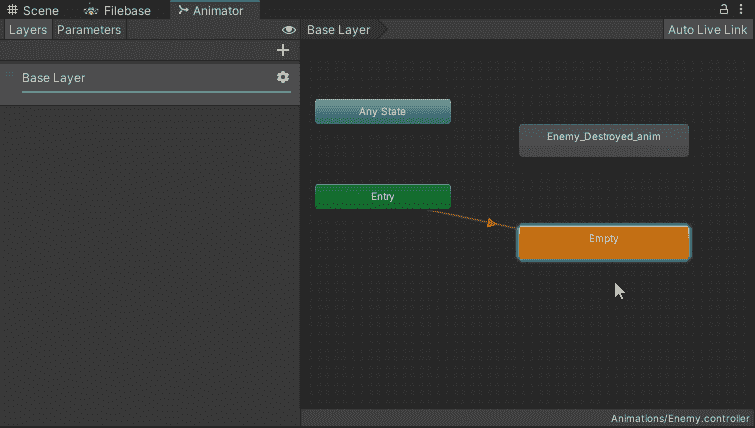

现在这两个对象之间有了联系。

如果我们玩这个游戏，我们会注意到敌人一进入我们就被消灭了，只是有一点延迟。延迟是由于首先播放的是空的对象。

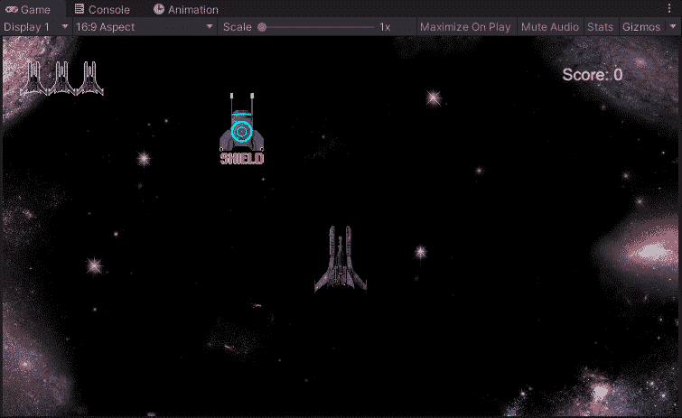

为了控制何时播放动画，我们需要做两件事。

1.  创建一个**参数**设置为**触发**
2.  使用代码控制**触发器**何时被激活。

在“动画制作”面板中，选择参数。这里，有一个带向下箭头的+按钮。如果你选择向下，我们看到我们可以创建四种类型的参数:**、浮点数、整数、布尔值和触发器。**

我们需要创建一个**触发器** **参数**来激活动画。

选择**参数，从下拉列表中触发**，将其重命名为 **OnEnemyDeath** 。

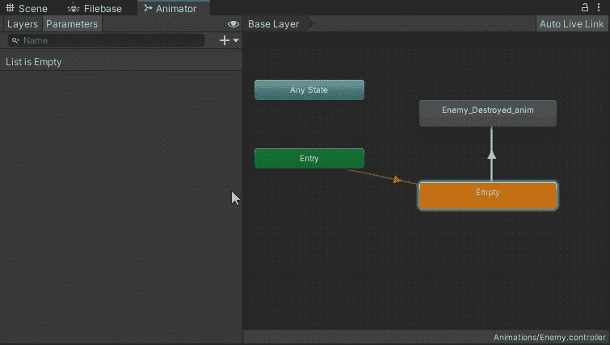

Creating a Trigger parameter

我们现在需要将这个参数添加到空物体和敌人被摧毁的动画物体之间的转换条件中。

选择这两个对象之间的过渡(箭头本身)，注意在检查器窗口中，它有一个**条件**部分。选择+键，并从下拉列表中选择 **OnEnemyDeath** 。

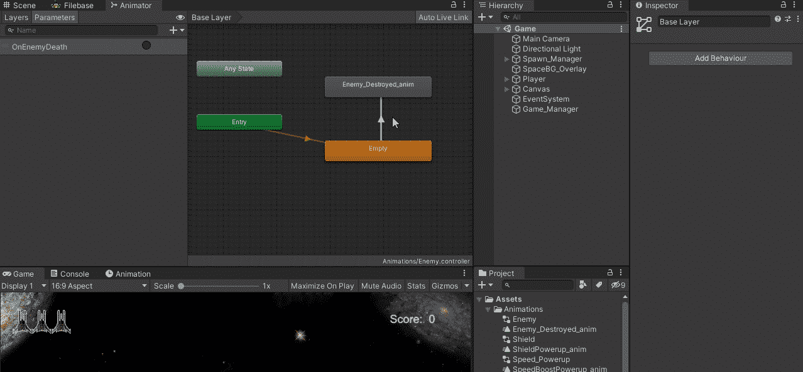

现在，我们需要能够通过代码激活这个触发器。

这段代码将放在**敌人脚本**中，因为是敌人要爆炸成一个大火球。

打开 Enemy.cs 脚本并添加一个新的 Animator 类型的变量。

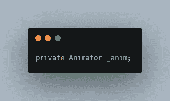

在 Start()方法中，我们需要将组件赋给 _anim。

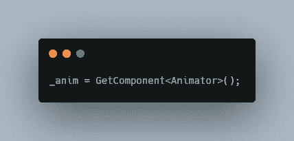

我们将在 **OnTriggerEnter2D** 方法中触发 OnEnemyDeath 动画，如果被激光或玩家对象击中，敌人对象将被摧毁。

就在我们摧毁敌人之前，插入代码来触发动画。

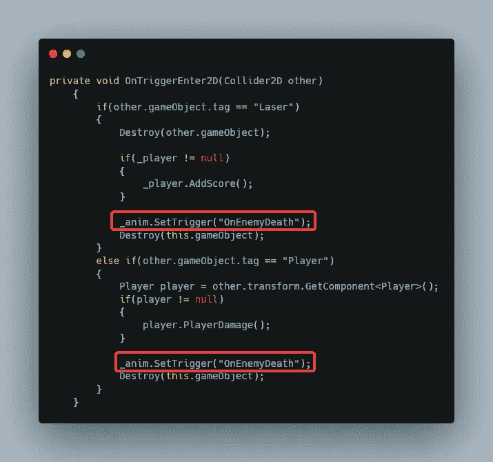

如果我们运行这个，我们会注意到敌人死亡时动画不会播放。这是因为敌方物体被摧毁的速度太快，没有让动画播放。

这可以通过**增加摧毁敌方目标**的延迟来弥补。这个延迟放置在*销毁(this.gameObject)* 之后，使用“，”作为分隔符。

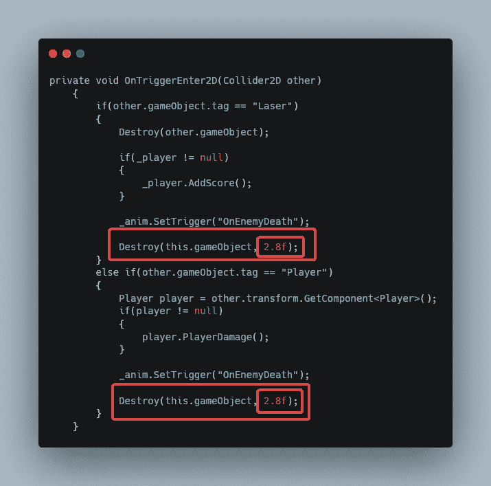

Delaying the Destruction of an object

**2.8f** 的值大约是播放爆炸的动画所需要的时间长度。

通过现在玩我们的游戏，我们注意到当敌人被击中和爆炸动画之间的延迟。这是因为在爆炸开始播放之前，空对象会一直播放到结束。

要解决这个问题，请选择空对象和敌人已摧毁的动画对象之间的转换箭头。在检查器中，取消选择**已退出时间**，在**设置**中，将**过渡持续时间设置为 0** (零)。

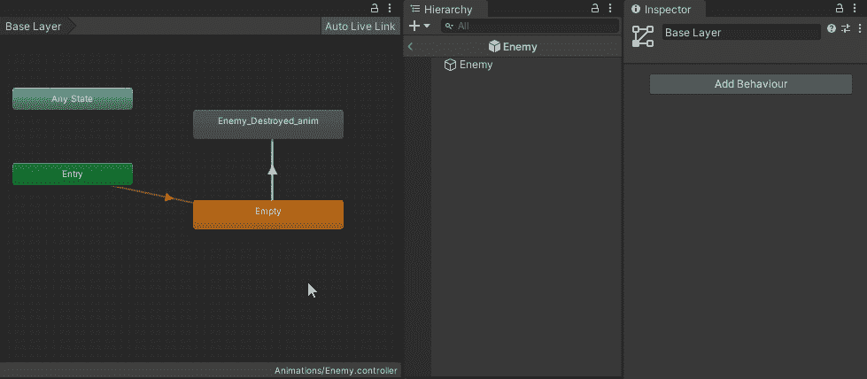

现在看起来不错，但是有一个问题。当敌人爆炸时，如果玩家靠近它，他们会受到伤害并失去一条生命。

我们现在需要做的是在敌人被击中时阻止他们。我们可以通过在敌人被击中时将**敌人速度设置为 0** (零)来做到这一点。

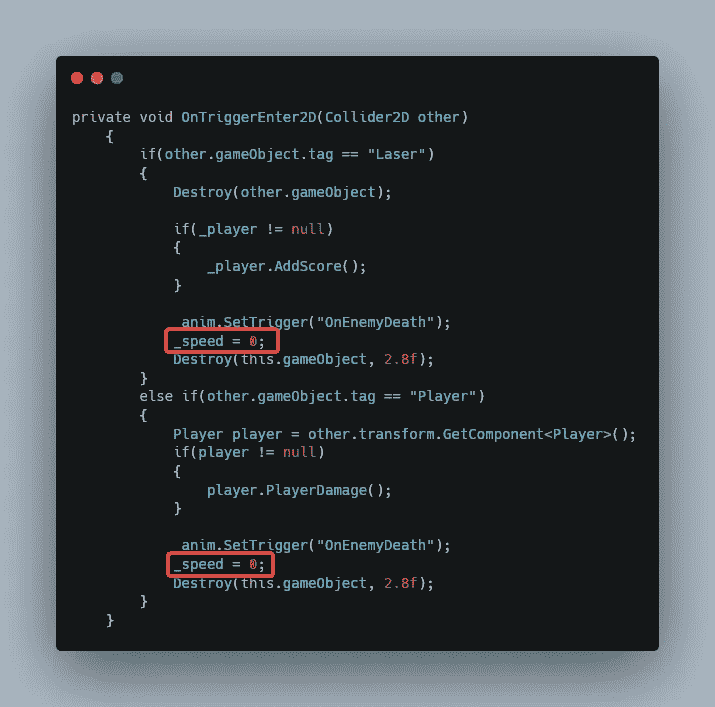

Setting Enemy speed to 0 when hit

现在好多了。敌人被消灭但不影响玩家，动画很惊艳。

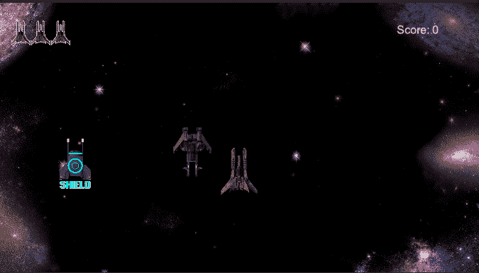

希望你喜欢这个简短的教程。下一集见。