# 从头开始创建 Git 存储库

> 原文：<https://medium.com/geekculture/creating-git-repository-from-scratch-5f3d81955a88?source=collection_archive---------16----------------------->

Git 是每个开发人员日常生活中必不可少的一部分，但是他们中有多少人真正了解 git 的内幕呢？当你说`git commit`或其他命令时，git 如何执行 git 提交。

但是知道幕后发生了什么真的很重要吗，为什么一个人应该关心？

*   作为开发人员，我们应该了解我们使用的工具的内部结构，特别是当我们非常频繁地使用时。
*   如果我们了解 git 的内部结构，它将真正帮助我们做很多事情，比如创建一个分支，解决合并冲突，或者解决任何其他与 git 相关的问题。
*   当你知道内部的东西，特别是当你认为你搞砸了一些事情的时候，它提供了工作和使用命令的信心。

# 这篇文章是给你的吗？

*   如果您不熟悉 git 及其基本命令，我建议您去阅读一下，了解一下我们将要讨论的内容。
*   如果你已经知道基本的命令，如`git commit`、`git add`、`git branch`、`git pull`等，并且你想知道它们的内部工作原理，你可以开始了，这是给你的。

# 接下来是什么？

我们将在不使用`git init`命令的情况下从头创建一个 git repo，这将让我们了解 git 如何创建一个`.git`目录以及它的内容，我们将能够在进行过程中关联许多顶级命令，例如，当我们向 git staging area 添加内容时会发生什么。

# 我们开始吧

我们将从创建一个还没有初始化 git 的目录开始。

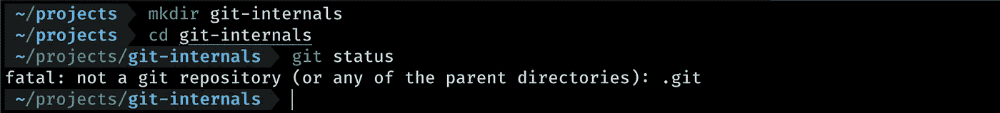

在上面的步骤中，我们已经创建了一个目录并在那里使用了 git 状态，我们可以清楚地看到 git 对这个命令不满意，它说这不是一个 git 库。

所以，让我们首先使用`git init`命令，看看当我们初始化 git repo 时 git 做了什么。

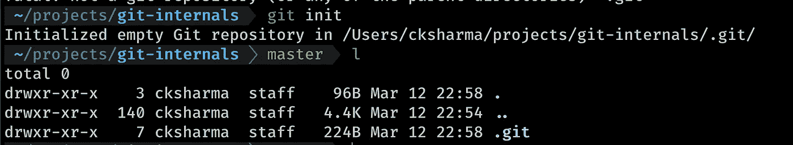

你可能会注意到，一旦我们初始化了 git，它就为我们创建了一个名为`.git`的目录，现在让我们探索一下`.git`文件夹中的内容。

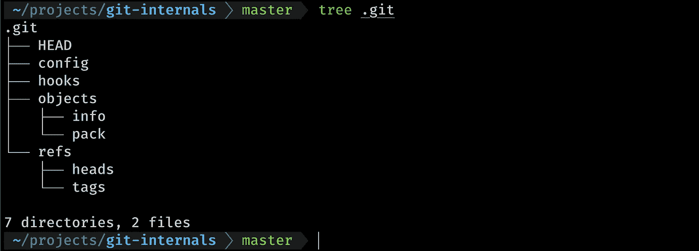

到目前为止，我们可以清楚地看到`.git`中有两个主目录**【objects】**和**【refs】**以及一些子目录，其中还有一个名为 hooks 的目录，但现在我们不用担心它。

还有一些文件需要注意 **HEAD** 和 config，我们会在某个时候看看这些是什么。

现在让我们创建一个文件，并将其添加到 git 中，看看它能做什么

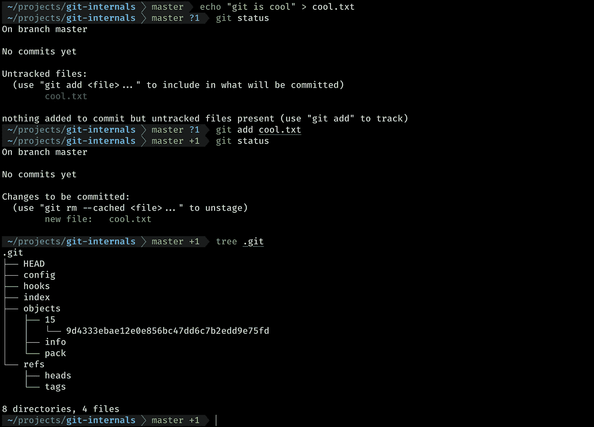

我们可以看到，在将文件添加到 git 之后，它已经在**内部创建了一些东西。git/objects"** 这似乎是一个有趣的数字，现在我们已经做了足够多的工作，并看到了基本结构`**.**git`。我们已经看到了使用`git init`命令的初始化，现在让我们删除`.git`并自行初始化。

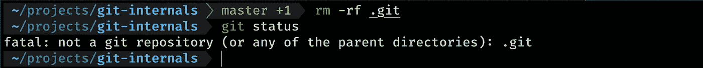

由于我们删除了`.git`目录，它现在不是一个 git 存储库。

# 展开“git init”魔法

正如我们已经看到的 git repo，它必须有一个`.git`，在`.git`里面有两个更重要的子目录，分别叫做**【objects】**和**【refs】**，让我们创建它们，看看 git 是否满意

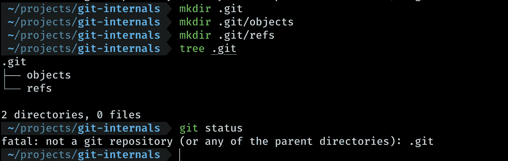

创建`.git`和子目录并没有帮助我们，因为 git 仍然不高兴，所以现在让我们在这里暂停一段时间来理解

## "这两个子目录是什么，它们对 git 有什么用？"

## 。git/对象

让我们把 git 想象成维护一个文件系统，特别是及时维护文件的快照，一个文件系统可以包含文件、目录和子目录。

git 对象目录用于存储三种对象，称为

*   **斑点**
*   **树**
*   **提交**

**BLOB** **(二进制大对象)**:BLOB 只存储文件的内容，它不同于典型的文件，因为它不包含任何元数据，但它只包含每个 BLOB 通过其“sha-1”散列来识别的内容。

**TREE** :在 git 中，目录的等价形式是 TREE，它是一个目录列表，引用 blob 和其他树，它也由一个“sha-1”散列来标识，它存储指向其他 blob 和树的指针。

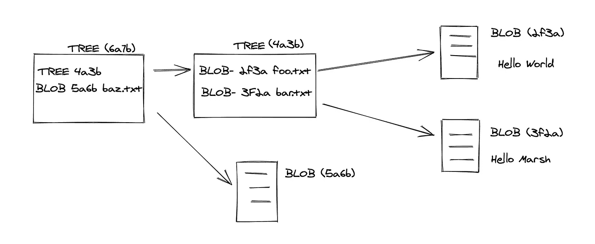

directory like tree structure

如果你仔细观察上面，你会发现它以树和 blobs 的形式表示了一个目录结构。

提交:在 git 中，工作树的快照被称为提交，它存储对工作树的引用，还包含一些元数据，如作者姓名、时间、提交消息和父提交(如果有的话)。它还通过“sha-1”哈希进行识别。

提交存储工作树的整个快照，而不仅仅是提交之间的差异，这难道不意味着它必须存储大量数据吗？

为了解决这个问题，git 只在文件内容发生变化时创建一个新的 blob，否则它使用相同的引用 sha 来指向那个`blob`对象，例如——如果我们创建 100 个内容相同的文件，git 将只为它创建一个 blob 对象，并引用每个文件。

## 。git/refs 或。git/refs/heads

我们可能已经知道了 git 分支，当我们现在创建一个新的 git 存储库时，我们会将`master`或`main`作为默认的 git 分支。

分支只不过是对提交的名称引用，我们当然可以只引用提交，但是作为人类，我们不太愿意记住 shaid，因此给它一个名称。

的。git/refs/heads 目录包含关于分支的信息，它只不过是一个以分支命名的文件，分支的内容是引用 commit，因为我们知道我们可以有许多分支，因此里面可以有多个文件。git/ref/heads。

现在我们知道了对象和引用，让我们在`refs/heads`中创建一个默认的分支`main`

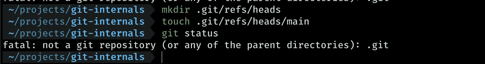

哦，饭桶似乎还是不开心，还剩下什么？

正如我们所知，在任何给定点我们都可以有多个分支，但是现在的问题是*“git 如何知道它应该指向哪个当前分支？”*

为了解决这个问题，git 在顶层有一个名为 **HEAD** 的文件，我们已经看到了。它存储对当前分支的引用。所以让我们添加指向`main`分支的头

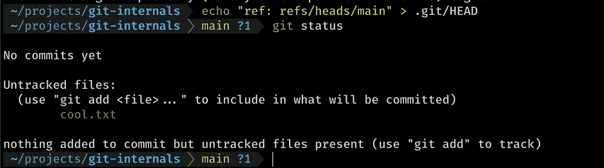

哇！git 这次好像高兴了，现在指向了 main branch。

我们现在该怎么办？

我们现在准备创建一个提交，我们将使用更多的内部命令来完成，暂时我们将删除 cool.txt 文件以使一切变得干净。

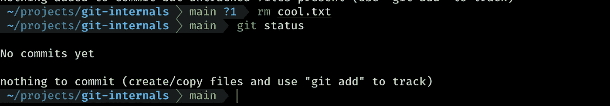

我们的。git 结构现在看起来更好了:

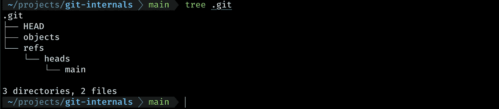

正在创建 git 提交

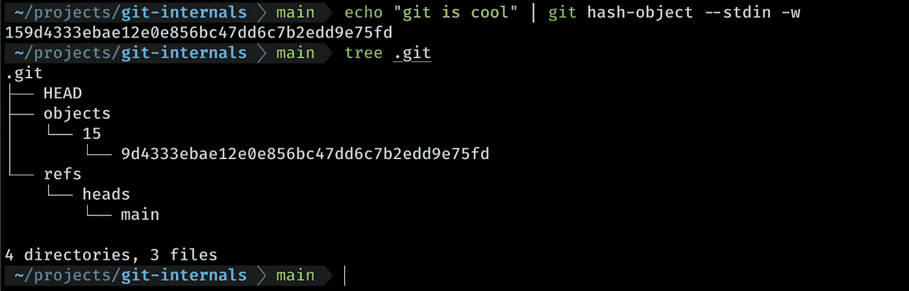

`hash-object`命令接受一个输入，在这种情况下，该输入来自`— stdin`，然后为其生成一个`blob`。

使用 git `hash-object`我们添加了一个带有内容“git 很酷”的 blob。请注意，我们没有给它指定文件名，它只是内容，我们还看到它在`objects`目录中创建了一个文件，如果我们试图捕获这个文件，它会显示垃圾，但是我们有一个 git 命令，可以通过打印这个文件的类型和内容来解决这个问题。

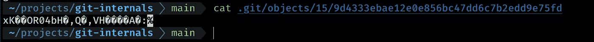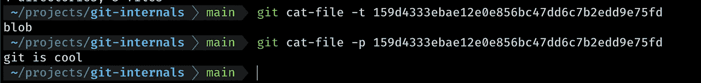

注意，对象类型是`blob`，sha 以目录名的两个字符结束，git 使这些目录易于查找。

因为我们有一个斑点，我们可以添加到我们的`staging/indexing`区域

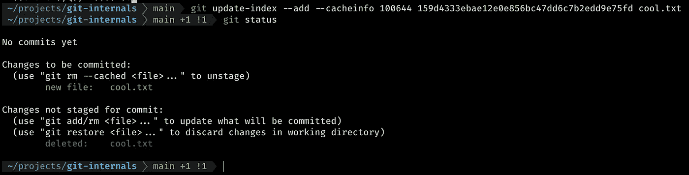

我们使用了 git 内部使用的`git update-index`命令，当我们说`git add`时，我们可以看到 git 认为文件`cool.txt`被删除了，因为根目录没有这个文件，当我们更新索引时，我们也给了文件名`cool.txt`和权限`10064`，我们现在不用担心权限，而是名称。

让我们转储文件的内容并用相同的内容创建`cool.txt`,然后看看 git 的行为

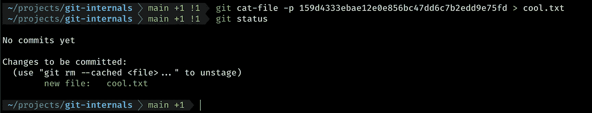

由于文件现在已创建，git 看起来更加开心和环保，现在我们处于可以提交的阶段，但在此之前，我们需要用这个特定的`blob`创建一个树，因为我们只能提交一个`tree`，所以让我们使用`git write-tree`命令来完成，它将选取我们已提交的所有更改并从中创建一个树。

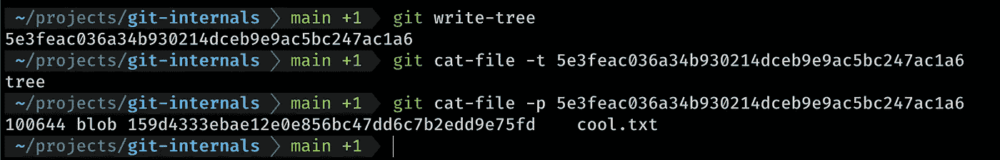

现在已经创建了一个树，我们可以看到树指向一个 blob，它的文件名在 reference (cool.txt)中。

我们都准备好提交了，现在让我们使用命令`git commit-tree`来完成它

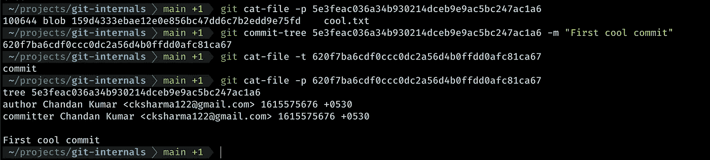

通过使用`git commit-tree`，传递一个树 id 和一条消息，我们已经提交了一个树，一旦我们提交了一个树，它就会给我们一个`commit id`，当我们对类型进行 cat-file 时，我们可以看到它是一个`commit object`，内容有一个树，我们已经将它和消息一起传递给了它，它从本地 git 配置中选取作者。

此时，如果我们看到`.git`文件夹的结构，我们可以看到其中有三个对象，`a blob`、`a tree`和`a commit`

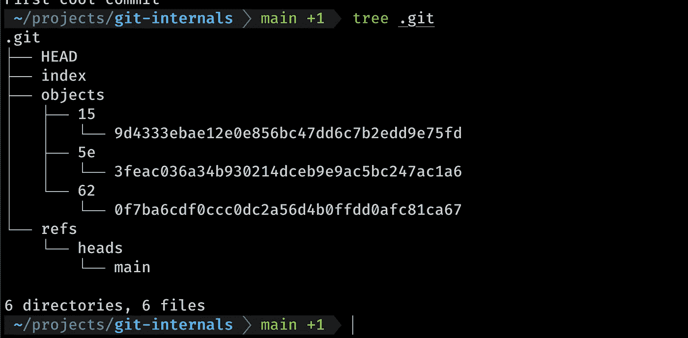

现在让我们做一个 git 日志，看看我们的提交是否反映在日志中？

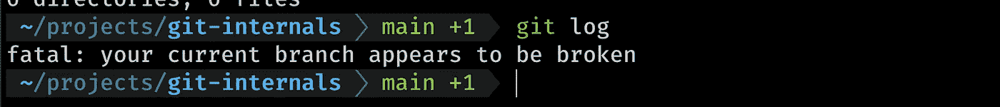

哦不！我们的承诺到哪里去了？

请记住，当我们使用 touch 命令创建分支时，我们没有指定它应该引用的提交 id，这意味着主分支不知道它需要指向哪里并从哪里获取提交。

为了解决这个问题，我们需要将提交 id 分配给主分支

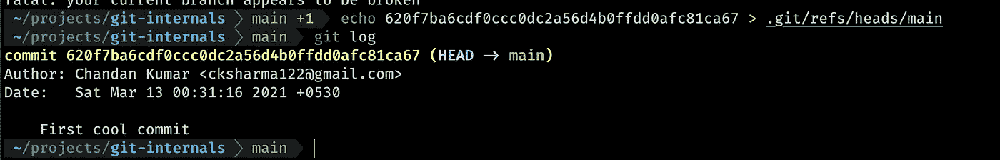

耶！！将提交 id 分配给分支`main`，这意味着分支 main 现在将开始指向该提交，依此类推，因此`git log`开始工作。

现在我们已经结束了，我们已经创建了一个 git 存储库，并且在不使用任何顶级命令的情况下进行了提交。

我希望现在您对 git 的内部工作原理有了更好的了解。如果你想了解更多关于我在文章中使用的命令，你可以参考我以前的文章 git [了解 Git Inside-Out](/swlh/knowing-git-inside-out-223499c58860)

感谢阅读:)