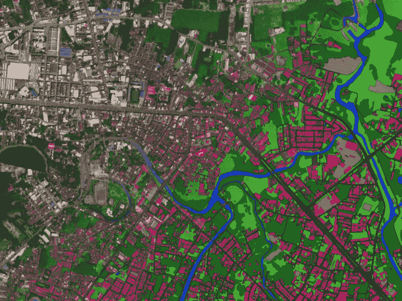
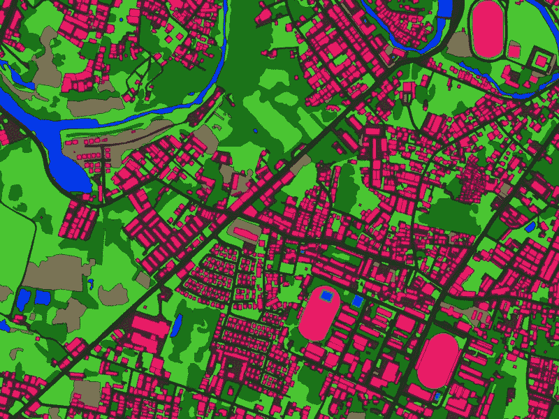

# 使用空中客车和 Ecopia AI 创建全球高精度数字地图

> 原文：<https://medium.com/geekculture/creating-high-accuracy-digital-maps-around-the-globe-with-airbus-ecopia-ai-a7f86f299757?source=collection_archive---------25----------------------->

# 高分辨率地理空间图像和高精度特征提取

世界各地的组织依靠高分辨率地理空间图像做出更明智的决策。根据影像创建或生成数字地图后，分析和工作流可以提高效率，并为各种现实使用案例提供动力。例如，保险承保人可以更准确地识别房产的洪水风险，市政当局可以更好地规划智能城市和可持续基础设施。

从影像源提取详细的土地覆盖数据越快、越准确，组织就能越快、越可靠地在全球范围内实施有意义的变革。

**Rayong, Thailand.** Ecopia AI (Ecopia) can rapidly extract 12+ land cover classes from high-resolution imagery as accurately as a GIS-professional.

然而，绘制我们的地球并从图像中提取这些高清矢量地图是一项挑战，尤其是在大规模的情况下。从影像中提取土地覆盖类别的许多传统解决方案都有一些局限性:

1.  他们的提取速度**高度可变**
2.  它们的提取精度低**和/或不可靠**
3.  他们的提取能力**不可扩展**

手动提取团队可以准确地从影像中提取图层，但是这种手动过程速度慢、成本高，并且无法在国家和大陆之间进行扩展。当今的一些自动化解决方案可能速度快、价格合理，并且在某些地区可扩展，但它们的数据输出可能不准确，降低了数据的可靠性和可用性。

# 空客与 Ecopia AI 合作应对挑战

## 合作关系

空中客车公司提供覆盖全球每个角落的优质高分辨率卫星图像，并寻找合作伙伴来提供快速、准确和可扩展的土地利用/土地覆盖特征提取，并在 OneAtlas 平台上提供。在评估了各种提供商之后，空客决定 Ecopia 的能力将为他们的客户提供市场上最全面的特征提取解决方案。

空客和 Ecopia 正式合作，在全球范围内提供下一代数字地图。这些数字地图可以包括十几个高度详细的土地利用/土地覆盖层，包括道路和建筑足迹数据。

这种数字地图解决方案将为商业和政府用户提供他们感兴趣领域的准确和最新的数字表示，推动各行业更好地做出决策。

## Ecopia 矢量地图

这种新的合作关系允许空中客车公司的客户在他们感兴趣的领域快速方便地请求 **Ecopia 矢量地图**。这些矢量地图利用 Ecopia 行业领先的基于人工智能的系统，从空中客车的高分辨率图像中提取 12 个以上的土地覆盖类别。

在设计时考虑到了可扩展性，新老客户可以请求提供他们感兴趣区域的 Ecopia 矢量地图，范围从一个城市到整个大陆，所有这一切都可以在 OneAtlas 平台中实现，只需点击几下鼠标，或者根据请求。

Ecopia 矢量地图使用空中客车公司的全球优质 50 厘米高分辨率卫星图像创建，无需内部工作或开发即可提供 GIS 专业级精度。我们先进的深度学习系统提取高水平的细节，同时提供高度可扩展的映射解决方案。

**Rayong, Thailand.** A closer look at our GIS-professional accuracy.

通过 OneAtlas(或按需)请求 Ecopia 矢量地图的直接好处包括:

1.  **精细细节:**高精度提取 12+级土地覆盖解决方案，包括建筑物足迹和道路
2.  **高精度:**特征提取能力与利用下一代人工智能的 GIS 专业人员一样精确
3.  **数据的新鲜度:**使用空中客车公司的新鲜优质档案或根据要求提供最新的 OneAtlas 图像
4.  **大规模快速交付:**在全球范围内获取大规模的影像和 Ecopia 矢量地图，在极短的时间内满足您的需求

# 用例

利用空中客车公司高分辨率卫星图像的 Ecopia 矢量地图的能力为各种行业提供了广泛的使用案例，在这些行业中，准确的土地覆盖数据至关重要，但快速提取和最新图像至关重要。

这些用例包括但不限于:**土地管理、保险和人道主义救援**。

敬请关注我们的下一篇博客，了解如何利用空客的高分辨率卫星图像和 Ecopia 的下一代人工智能，在公共和私营行业大规模地进行更好的决策。

要了解更多关于我们的[空客](https://www.intelligence-airbusds.com/high-accuracy-map-extraction/)伙伴关系的信息，请阅读[官方新闻稿](https://www.businesswire.com/news/home/20210304005274/en)，[查看我们的产品演示](https://demo.ecopiatech.com/demo/054/001)，或访问我们的[伙伴关系页面](https://www.ecopiatech.com/partner-with-us)。