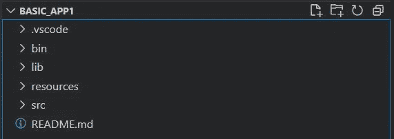
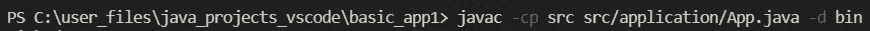
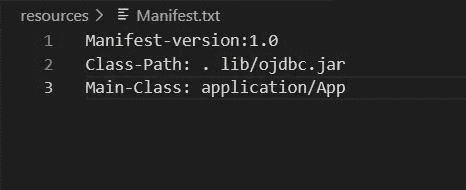
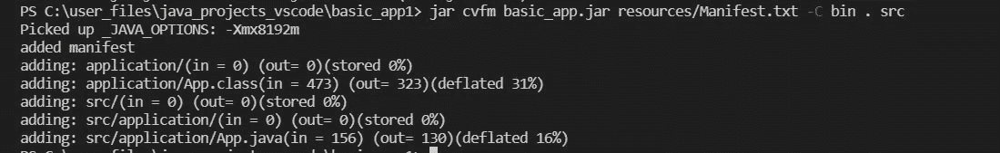

# 使用命令提示符创建 jar 文件

> 原文：<https://medium.com/geekculture/creating-jar-files-using-command-prompt-b3443ac01c0?source=collection_archive---------11----------------------->

Photo by [Maximilian Weisbecker](https://unsplash.com/@maxweisbecker?utm_source=medium&utm_medium=referral) on [Unsplash](https://unsplash.com?utm_source=medium&utm_medium=referral)

# 介绍

构建 jar 文件应该是一个古老的过程，对于任何编写 Java 应用程序的程序员来说都是基本的/必须的。有了像 [Eclipse](https://www.eclipse.org/downloads/packages/release/kepler/sr1/eclipse-ide-java-developers) 和 [IntelliJ](https://www.jetbrains.com/idea/) 这样的 ide，这个过程变得非常简单。图形用户界面使琐碎的任务变得简单，只需到处点击几下。

然而，当使用 CLI(命令行界面)将基本应用程序转换成 jar 文件时，就有点棘手了。在使用 Visual Studio 代码编辑器编写 java 应用程序时，我尤其体会到了这一点。因此，当 GUI 不起作用时，我们必须求助于基础——也就是 CLI。

# 为执行设置一个基本程序

第一个任务是设置 VS 代码来运行基本的 java 应用程序。所有的实现都是使用 CLI 和 VS 代码完成的。要下载编写简单 java 应用程序的 VS 代码，请点击[这里](https://code.visualstudio.com/download)。

我们需要为在 VS 代码上运行 java 应用程序设置扩展。微软的 Java 扩展包提供了 6 个扩展，从语言支持和 maven 到智能代码和自动完成功能。可以从 CLI 左侧面板的“扩展”选项卡安装此扩展。

应用程序的基本结构如下图所示:

请注意，文件夹 lib、bin 和 resources 分别用于您希望包含在项目中的附加 java 库，用于已编译的类文件和 Manifest.txt 文件。

# 编译程序并创建类路径

编译程序需要使用 java 编译器。通常，程序是自动编译的，当编译和设置程序执行时，所有的背景音乐对用户是隐藏的。

因此，用于启动编译过程的命令是 **javac** 。编译代码的命令如下:

该命令使用 **-d** 参数指定包含**主方法**和输出位置的文件夹和文件。

这种情况下的特例是在应用程序中包含 jar 文件。我已经在 lib 文件夹中添加了一个用于与 Oracle 数据库交互的基本 jar 文件 ojdbc ( Oracle JDBC)。编译命令应该包括 jar 文件的位置以及要编译的文件夹的位置。编译命令会发生变化，如下所示:

# 从编译的项目创建 Jar 文件

为了创建 jar 文件，我们首先需要创建 **Manifest.txt** 文件。清单文件创建在项目结构中的**资源**文件夹下。该文件如下所示:

第一行必须是清单的版本。然后是类路径和主类。Class-Path 应该包含所有要添加到 jar 中的文件，包括 jar 文件。 **Main-Class** 指定了项目中的主方法文件。

创建 jar 的命令是:

命令 **jar cvfm** 表示创建一个 jar，要详细，指定输出文件名，并指定清单文件名。你可以在下面的论点中看到所有的东西。 **-C** '为所有类别提供位置。

# 结论

虽然通常情况下的 jar 生成基本上是点击一下按钮(或者在 maven 和 Dev-Ops 的情况下是相当自动化的)，但是了解构建 jar 的基本命令可以让我们更深入地了解幕后工作的机制。

**本文是关于我尝试构建和执行容器的过程的一个小系列文章的一部分。因此，请继续关注我的探索之旅。