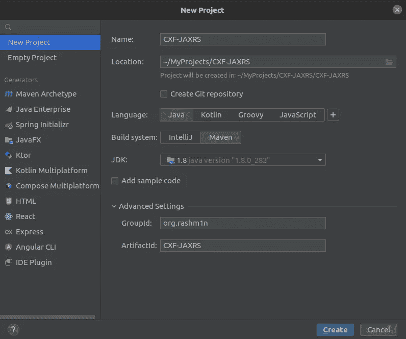
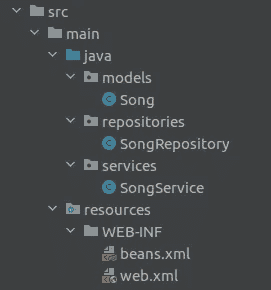

# 用 Apache CXF 和 Tomcat 创建 JAX-RS RESTful API

> 原文：<https://medium.com/geekculture/creating-jax-rs-restful-apis-with-apache-cxf-and-tomcat-c3e13f3b65c4?source=collection_archive---------3----------------------->


Photo by [Andre Klimke](https://unsplash.com/@andre_klimke?utm_source=medium&utm_medium=referral) on [Unsplash](https://unsplash.com?utm_source=medium&utm_medium=referral)

Apache CXF 是一个开源的 web 服务框架，它支持多种类型的 API，如 JAX-RS (REST)和 JAX-WS (SOAP ),以及多种传输，如 HTTP 和 JMS。

Apache CXF 符合 JAX-RS，这是一个关于在 Java 企业应用程序中创建 RESTful APIs 的 Java EE 规范，由 JSR-311 标准引入。

JAX-RS 标准有几种实现，比如 Jersey、RESTeasy，当然还有 Apache CXF。

在本文中，我将讨论如何使用 Apache CXF 创建一个简单的 JAX 遥感应用程序，并将其部署在 Tomcat 中。

首先使用您喜欢的 IDE 创建一个简单的空 maven 项目。我将使用 IntelliJ 的想法。



Creating A New Maven Project

创建 maven 项目后，我们需要在 pom.xml 中添加一些依赖项，这些依赖项将用于创建我们的 web 应用程序。

在这里，我们可以看到提供 JAX 遥感功能的初始`cxf-rt-frontend-jaxrs`依赖关系。由于 spring 与 Apache CXF 紧密集成并在 CXF 内部使用，我们将使用 Spring 来配置 JAX-RS 配置，因此添加了两个 Spring 依赖项`spring-context`和`spring-web`。由于这个 web 应用程序将被部署在 tomcat 服务器中，因此还添加了`javax.servlet.servlet-api`依赖项。为了集成 JSON 支持，添加了`jackson-jaxrs-json-provider`依赖项。

添加完这些初始依赖项后，我们就可以开始创建基本的类结构了。在这里，我将在`src.main.java`目录下创建 3 个包，分别命名为`models`、`repositories`和`services`。

在模型包中，让我们创建一个名为 Song 的简单类。

为了模拟数据层，让我们在`respositories`目录中创建一个 SongRepository 类。请注意，我们将创建一个虚拟对象，并将其直接提供给一个请求，而不是连接到一个真实的数据库，因为这将使事情复杂化。

最后，让我们创建应用程序最重要的部分，服务类。这里我们将使用下面列出的标准 JAX 遥感注解。

*   `@Path` —表示 URI 路径
*   `@Consumes` —表示 API 使用给定的媒体类型
*   `@Produces` —表示 API 使用给定的媒体类型
*   `@GET` —表示获取方法。

## 添加配置

在创建了上述简单的类结构之后，让我们添加必要的配置。这些配置将被添加到`src/main/resources/WEB-INF/`目录中。

因为我们使用 Spring 来设置 JAX-RS 服务，所以让我们首先创建一个`beans.xml`并在其中定义我们的服务类。

这里，我们已经在`<jaxrs:server>`标签中定义了服务 beans，并提供了我们服务中的单一服务。如果您有多个服务，您可以在这里将它们都列为 beans。

由于我们需要为这个 API 添加 JSON 支持，我们将在这里引用之前添加的`JacksonJsonProvider`。

现在让我们创建最终的配置，`web.xml`。我们需要首先在`context-param`标签下引用 beans.xml 文件来建立两个配置之间的联系。如前所述，CXF 使用 [Spring](https://cxf.apache.org/docs/configuration.html) 来提供服务的 XML 配置，所以 spring `ContextLoaderListener`是通过一个监听器添加的。

由于 JAX-RS 规范是建立在 Servlet 之上的，JAX-RS 的实现应该提供一个 Servlet 作为应用程序的入口点。这个 Servlet 负责请求的初始处理。在 Apache CFX 中，我们使用一个名为`CXFServlet`的 Servlet。

最后，您的应用程序代码结构应该如下所示。



Final Project Structure

## 包装

创建代码后，我们应该将它打包成一个`.war`文件，部署在 Tomcat 服务器中。为此，我们需要在`pom.xml`文件中再添加两个配置。

1.  用`<packaging>war</packaging>`指定包装
2.  用下面的`maven-war-plugin`指定配置位置和 war 名称。

```
<build>
    <plugins>
        <plugin>
            <groupId>org.apache.maven.plugins</groupId>
            <artifactId>maven-war-plugin</artifactId>
            <configuration>
                <webResources>
                    <resource>
                        <directory>src/main/resources</directory>
                    </resource>
                </webResources>
                <warName>jaxrswar</warName>
            </configuration>
        </plugin>
    </plugins>
</build>
```

最终的 pom.xml 如下所示。

在这之后，您可以在项目目录上运行`mvn clean install`,一个 jaxrswar.war 文件将在目标文件夹中创建。

现在，您应该将它部署在一个 servlet-container 中，为此，我将使用 Apache Tomcat 9。

我已经创建了一个简单的 Dockerfile，它将很容易地创建一个包含我们构建的 war 文件的 docker 映像。

将它包含在项目主文件夹中，并在终端中从该文件夹运行`docker build .`。如果构建成功，它会给你一个如下的响应。

```
Sending build context to Docker daemon  21.63MB
Step 1/4 : FROM tomcat:9.0.62-jdk8
 ---> 84d55ba5d6c1
Step 2/4 : ADD target/jaxrswar.war /usr/local/tomcat/webapps/
 ---> 5ccea8c355e3
Step 3/4 : EXPOSE 8080
 ---> Running in 67cccd7a72ef
Removing intermediate container 67cccd7a72ef
 ---> 3af35b518c31
Step 4/4 : CMD ["catalina.sh", "run"]
 ---> Running in 9403e9c69cbf
Removing intermediate container 9403e9c69cbf
 ---> 6d42782fb41e
Successfully built 6d42782fb41e
```

然后，您可以复制 image-id 并创建一个新的容器，如下所示。

```
docker run -p 8080:8080 6d42782fb41e
```

如果你做的一切都是正确的，这一定不能给任何错误，战争应该部署成功。

最后，为了测试 API，您可以在浏览器中输入下面的 URL。

```
[http://localhost:8080/jaxrswar/songs/2](http://localhost:8080/jaxrswar/songs/2)
```

它应该返回一个样本 JSON 响应！你可以在我的 Github 上找到完整的项目。

[](https://github.com/rashm1n/CXF-JAXRS/tree/master) [## GitHub - rashm1n/CXF-JAXRS:使用 Apache CXF 创建 RESTful JAX-RS API

### 此时您不能执行该操作。您已使用另一个标签页或窗口登录。您已在另一个选项卡中注销，或者…

github.com](https://github.com/rashm1n/CXF-JAXRS/tree/master) 

文章到此结束，感谢您的阅读。如果您想了解更多关于 JAXRS 和 Apache CXF 的知识，请参考参考资料！干杯。如果你喜欢这篇文章，在 linkedin/twitter 上关注一下吧！

[](https://www.linkedin.com/in/rashmin95/) [## Ravindu Rashmin -软件工程师- WSO2 | LinkedIn

### 在世界上最大的职业社区 LinkedIn 上查看 Ravindu Rashmin 的个人资料。Ravindu 列出了 7 个工作…

www.linkedin.com](https://www.linkedin.com/in/rashmin95/) 

参考

*   [https://cxf.apache.org/docs/jax-rs.html](https://cxf.apache.org/docs/jax-rs.html)
*   [https://cxf . Apache . org/docs/jaxrs-services-configuration . html # JAXRSServicesConfiguration-ConfiguringJAX-rsservicesincontainerwithpspringconfigurationfile](https://cxf.apache.org/docs/jaxrs-services-configuration.html#JAXRSServicesConfiguration-ConfiguringJAX-RSservicesincontainerwithSpringconfigurationfile)。
*   【https://en.wikipedia.org/wiki/Apache_CXF 
*   [https://www.baeldung.com/apache-cxf-rest-api](https://www.baeldung.com/apache-cxf-rest-api)