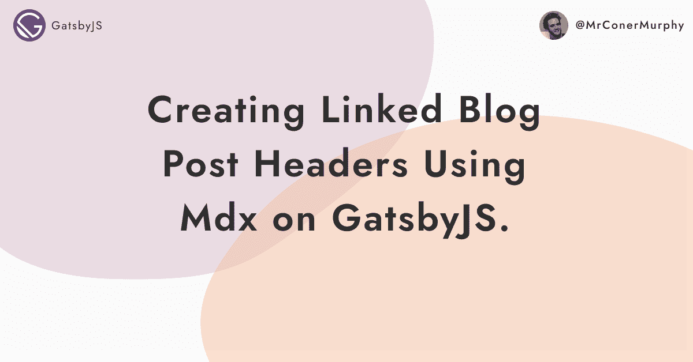

# 在 GatsbyJS 上使用 MDX 创建链接的博客文章标题。

> 原文：<https://medium.com/geekculture/creating-linked-blog-post-headers-using-mdx-on-gatsbyjs-3ef6b292bbc5?source=collection_archive---------75----------------------->

如果你是开发人员，MDX 是写博客的好方法。几年来，我一直在我的个人网站上使用它，几乎没有理由放弃它。

它最大的优点之一是它的灵活性。如果你想添加一些新的字段或者改变它的显示方式，你可以很容易地从你的代码库中完成。