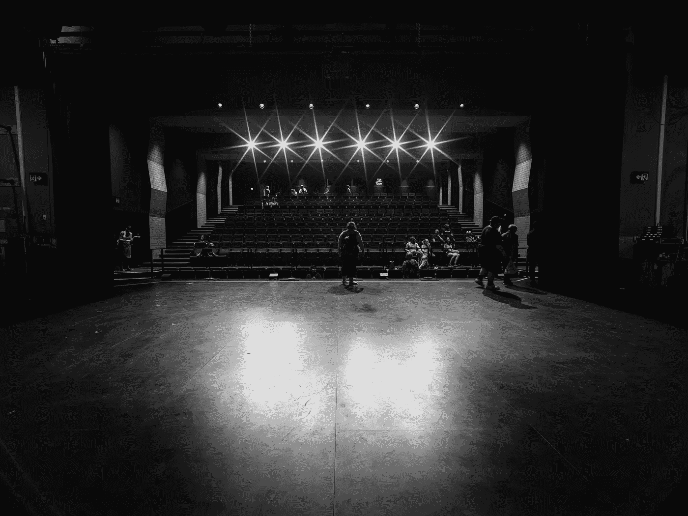

# 为 AR/VR 体验创建中等逼真度的原型

> 原文：<https://medium.com/geekculture/creating-medium-fidelity-prototypes-for-ar-vr-experiences-d476139b2ef5?source=collection_archive---------13----------------------->

Photo by [Mark Thompson](https://unsplash.com/@markthompson_media?utm_source=unsplash&utm_medium=referral&utm_content=creditCopyText) on [Unsplash](https://unsplash.com/s/photos/theater?utm_source=unsplash&utm_medium=referral&utm_content=creditCopyText)

**TL；博士:***3D 原型和二维原型不一样。与常规的平面网站相比，增强和虚拟现实在创建原型时有着非常不同的要求。为了填补 AR/VR 原型制作方法中等保真度范围内的空白，我们创建了*360°加热器*，它利用立体布景和 360°内容来创建物理数字原型* …