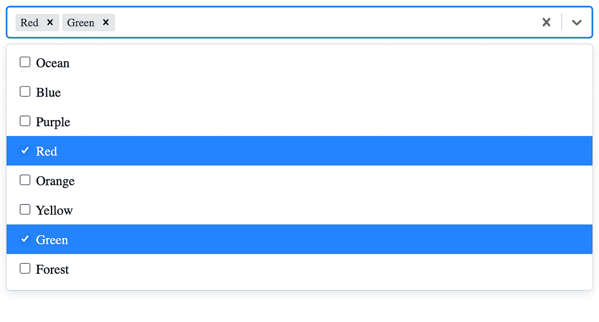

# 在 React 中创建带有复选框的多选下拉列表

> 原文：<https://medium.com/geekculture/creating-multi-select-dropdown-with-checkbox-in-react-792ff2464ef3?source=collection_archive---------0----------------------->

最近，在做一个项目时，我不得不创建一个带有过滤器的下拉列表，可以一次选择多个过滤器。我开始在网上寻找做这件事的最佳方法，并发现了多种方法。

在这个故事中，我将向您展示在 React 中创建带有复选框项目的多选下拉列表的最简洁的方法之一。有很多方法可以…