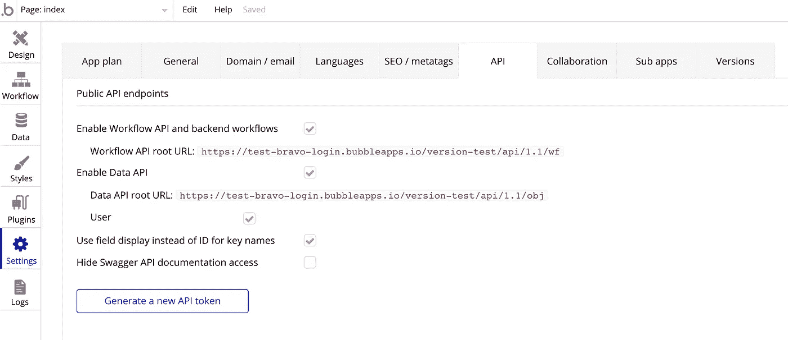
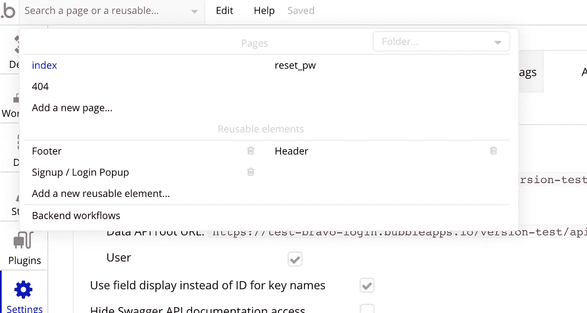
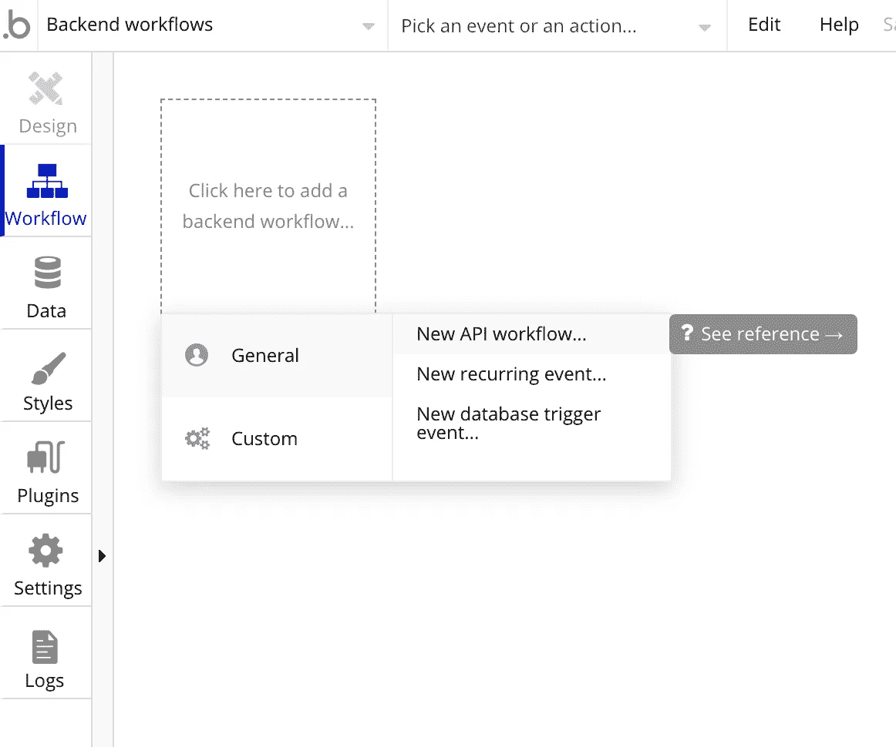
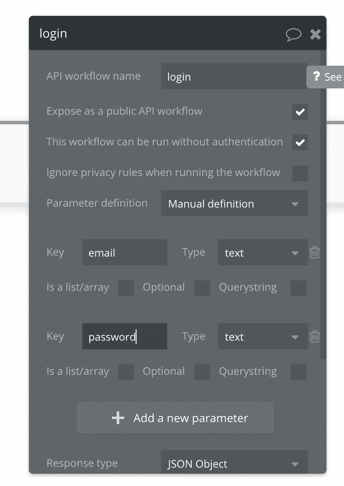
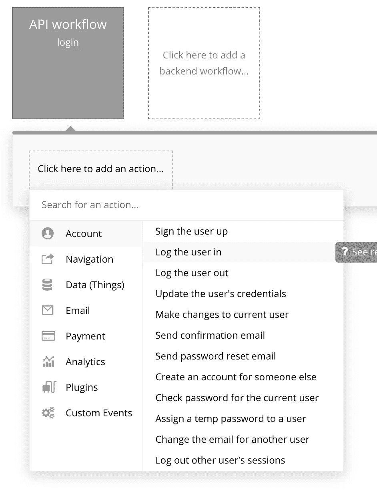
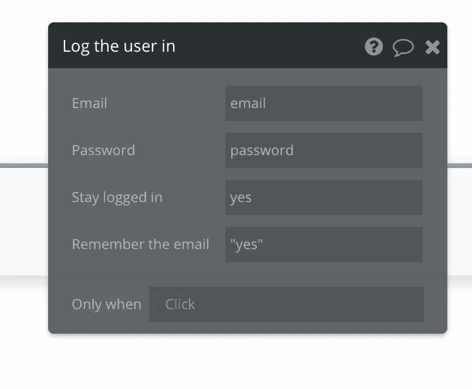
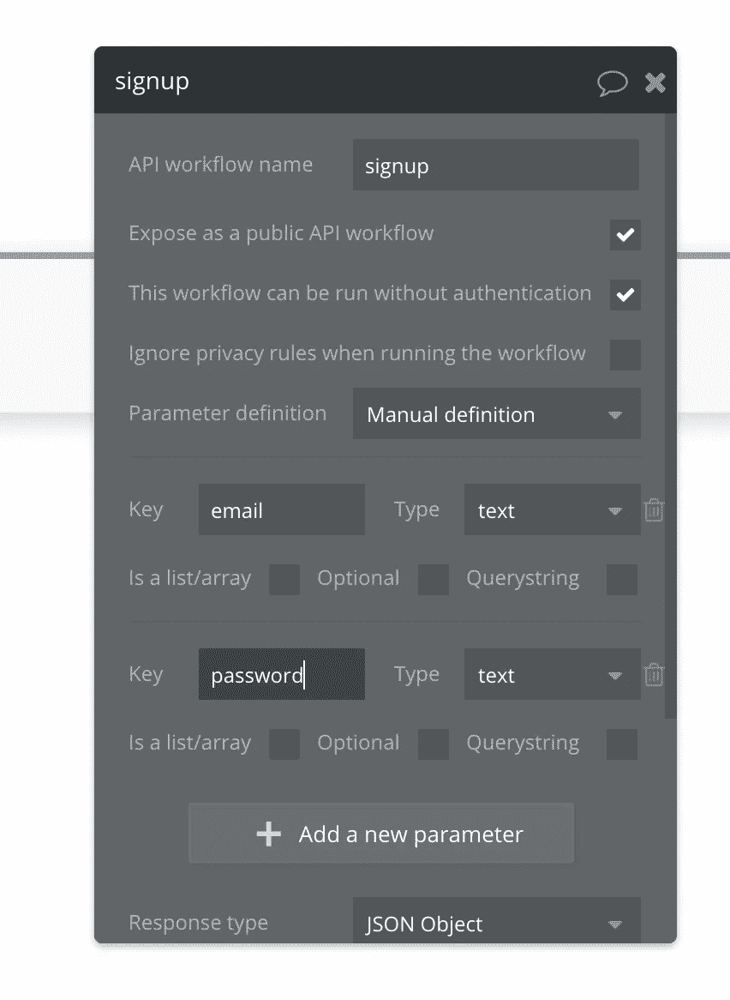
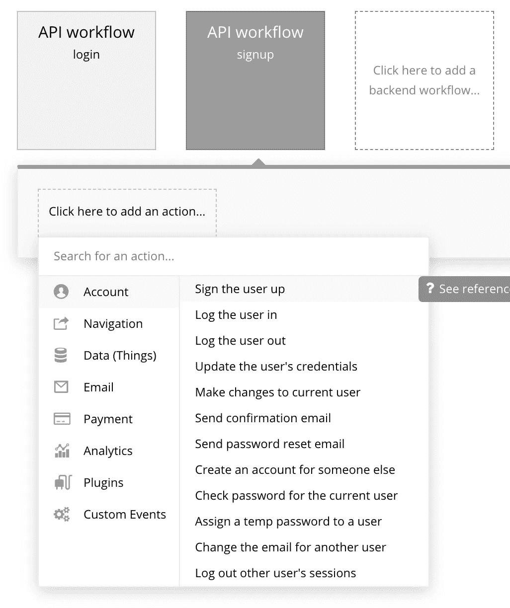
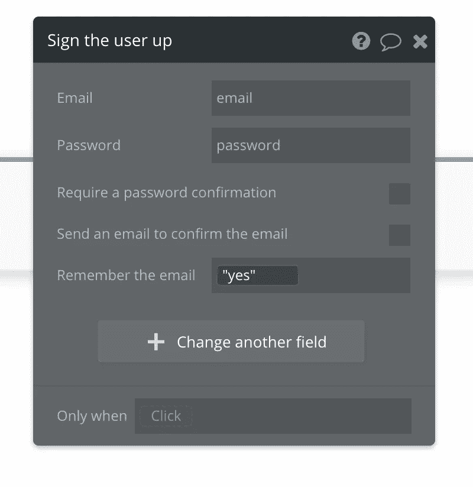

# 使用 Bravo Studio 从 Bubble 应用程序创建本地移动应用程序

> 原文：<https://medium.com/geekculture/creating-native-mobile-apps-from-bubble-applications-using-bravo-studio-a75c4c592d5d?source=collection_archive---------15----------------------->

> 更新—自撰写本文以来，我们添加了一个自定义登录功能，简化了授权请求。你可以在这里了解更多:[https://docs . Bravo studio . app/integrations/user-authentic ation/custom-authentic ation-beta](https://docs.bravostudio.app/integrations/user-authentication/custom-authentication-beta)

有很多泡泡应用，但由于它是基于网络的，有时你也想创建一个本地移动应用版本。使用 Bravo Studio，您可以创建一个本地移动应用程序，并使用 API 将其连接到 Bubble 应用程序。

在本教程中，我将向你展示如何连接一个 Bravo Studio 应用程序到 Bubble 后端，并使用 Bubble 进行身份验证。

要访问 Bubble API，您需要为您的 Bubble 应用程序购买付费计划。

# a)设置气泡

1.  创建新的泡泡应用程序

*   转到设置-> API 并勾选复选框以启用工作流 API、数据 API 和用户。记录工作流 API 根 URL，因为您稍后会需要它。



*   这将使您能够在左上角的下拉列表中看到后端工作流编辑器。



2.进入后端工作流编辑器并添加一个新的工作流(常规->新 API 工作流…)



*   调用新的后端工作流`login`并使其无需认证即可运行。还要添加两个参数`email`和`password`，这两个参数将用于进行如下认证。



3.单击以添加一个操作，并添加一个让用户登录的操作(帐户->让用户登录)。



*   通过将电子邮件和密码连接到端点的电子邮件和密码字段，完成此步骤的详细信息。也选择“是”来记住邮件。



4.在工作流编辑器中添加另一个工作流，这次称为注册，再次允许它在没有身份验证的情况下运行，并添加电子邮件和密码参数。



5.对于这个注册工作流，添加一个为用户注册的操作(Account-> sign user up)。



6.通过将电子邮件和密码连接到端点的电子邮件和密码字段，完成此步骤的详细信息。也选择“是”来记住邮件。



*   登录和注册 API 现在已经可以用于 Bubble 应用程序了。注册 API 是`<Workflow API root URL>/signup`，登录 URL 是`<Workflow API root URL>/login`(使用步骤 A1 的根 URL)。

# b)设置 Bravo API 访问

1.  首先你需要登录 Bravo(你可以免费注册[这里](https://projects.bravostudio.app/signup?utm_campaign=bubble-bravo-article&utm_medium=referral&utm_source=medium))

2.接下来导入这个例子 app 文件[https://www . fig ma . com/file/HF nab 1 wyhml 2 jciq 6 I 79/food gram-Bubble-Example？node-id=0%3A1](https://www.figma.com/file/hfnAB1WYyhml2cjCiQ6I79/Foodgram-Bubble-Example?node-id=0%3A1) (在本练习中，我们只使用登录和注册屏幕，但是对于您自己的应用程序，您可以将它们复制到另一个 figma 文件中)。

3.点击左侧 Bravo 中的`Data Library`。点击`New Collection.`点击“空白请求”并将其命名为`Foodgram Bubble Example`

4.点击 Requests 旁边的+按钮，为以下 2 个请求中的每一个添加一个新请求(注意`<Workflow API root URL>`来自上面的步骤 A1。

*   注册

```
Name: Signup
Type: POST
Request URL: <Workflow API root URL>/signup
Headers : None
Parameters:
  Key = email, Value = noone@none.com
  Key = password, Value = noone
Body (JSON):
{  
  "email" : "${email}",
  "password" : "${password}"
}
```

一旦你输入了上面的内容，点击这个请求的蓝色`send`按钮来创建测试用户并检查一切是否正常。

*   注册

```
Name: Login
Type: POST
Request URL: <Workflow API root URL>/login
Headers : None
Parameters:
  Key = email, Value = noone@none.com
  Key = password, Value = noone
Body (JSON): 
{
 "email" : "${email}",
 "password" : "${password}"
}
```

输入上述内容后，点击该请求的蓝色`send`按钮，获取样本数据，以便为该请求设置接收到的数据。

确保勾选了`.data.response.token`字段，然后在`Selected Data`选项卡中将字段名称更改为`token`。我们可以在其他请求中引用这个名称作为变量，以允许请求通过身份验证。

# c)在 Bravo 中将 API 绑定到设计

现在我们有了 Bravo 中的 API，最后一步是将它们连接到应用程序设计。进入 Bravo 的`Foodgram Bubble Example`应用程序，这样你就可以看到所有的屏幕。

1.注册

点击`Signup`屏幕编辑该屏幕的绑定，选择`Foodgram Bubble Example`集合，然后选择`signup`请求

*   在`Select Visual Elements`列表中点击`username`元件，并将其连接到`Content Destination`部分右侧绑定面板中的`email`。这将把输入字段绑定到将在请求中使用的变量。
*   点击`password`元件，并将其连接到右侧绑定面板中的`password`
*   将`Response Actions — on success`改为`Go to Page — Login`。
*   更改响应行动—失败时，以文本'`Signup Failed`'发送至`Show Alert`

2.注册

点击`Login`屏幕编辑该屏幕的绑定，选择`Foodgram Bubble Example`收藏，然后选择`login`请求

*   在`Select Visual Elements`列表中点击`username`元件，并将其连接到`Content Destination`部分右侧绑定面板中的`email`。这将把输入字段绑定到将在请求中使用的变量。
*   点击`password`元件，并将其连接到右侧绑定面板中的`password`
*   将`Response Actions — on success`改为`Go to Page — Home Screen`。
*   将响应行动—失败时更改为文本为'`Login Failed`'的`Show Alert`

您现在已经将 Bravo 应用程序连接到 Bubble 进行身份验证。

如果您需要在以后发出需要认证的请求，您可以添加一个带有 Key: `Authorization`和值:`Bearer ${token}`的头。由于 Bravo 在登录时记住了令牌(在步骤 B 中我们将`.data.response.token`命名为`token`，我们可以将它传递给后面的请求。

祝你好运！