# 用生成对抗网络和深度学习创造新人类

> 原文：<https://medium.com/geekculture/creating-new-humans-with-generative-adversarial-networks-and-deep-learning-e1312ddec544?source=collection_archive---------7----------------------->

# 你认识这里的人吗？

Photo from [NVlabs](https://github.com/NVlabs/stylegan)

# 你玩过这个电子游戏吗？

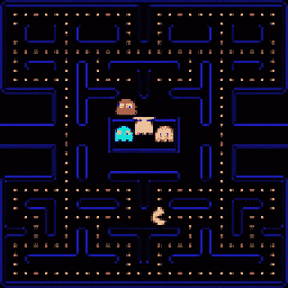

Pacman from [Nv-tlabs](https://nv-tlabs.github.io/gameGAN/)

也许你两个都答应了，或者只答应了第二个。毕竟，这是吃豆人，我们一生中至少玩过一次的游戏。

**对吗？**

事实上，无论是人还是游戏都不是真实的。它们都是使用人工智能生成的，更具体地说，是一个**生成对抗网络。**

# 什么是 GAN，它是如何工作的？

GAN 或生成式对抗网络是一种深度学习框架，擅长于**生成**与真实数据点无法区分的虚假数据点。这就意味着 GANs 能够生成栩栩如生的面孔，甚至可以再造视频游戏。

## 它们是如何工作的？

顾名思义，生成性**对抗性**网络由两个相互竞争的网络组成。冲突被利用来创建期望的输出。

GAN 的第一个神经网络称为生成器。给定一个随机输入，生成器尽最大努力生成一个似是而非的输出。

第二个网络是鉴别器。鉴别器的工作就是看发电机的输出，确定是真的还是假的。

两个网络一起训练，玩零和游戏。生成器生成样本。这些样本连同来自数据集中的示例一起被提供给鉴别器。鉴别器将每幅图像分类为真或假。这种分类用于改进两个网络。对鉴别器进行了调整，以更好地对图像进行分类，并识别由生成器生成的图像。更新生成器以创建更好的图像来欺骗鉴别器。

随着他们的训练和改进，生成器在生成数据方面变得更好，直到最终，生成的结果与真实的结果无法区分。

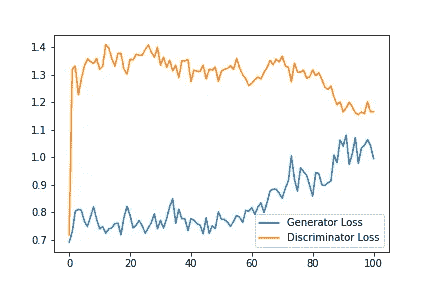

The loss of a GAN during training. The networks compete, which is shown by the losses. If one network has a decrease in loss, the other one will have an increase and vice versa | image from [StackExchange](https://stats.stackexchange.com/questions/332991/how-to-interpret-the-following-gan-training-losses)

发生器可以被认为是试图制造假币的伪造者，而鉴别器是试图检测假币的警察。鉴别器将假币与真币进行比较，从而更好地检测假币。因此，生产者必须更加努力地工作，制造更有说服力的赝品。鉴别者和制造者相互竞争，改进他们的方法，直到制造者能够制造出与真币几乎无法区分的伪钞。

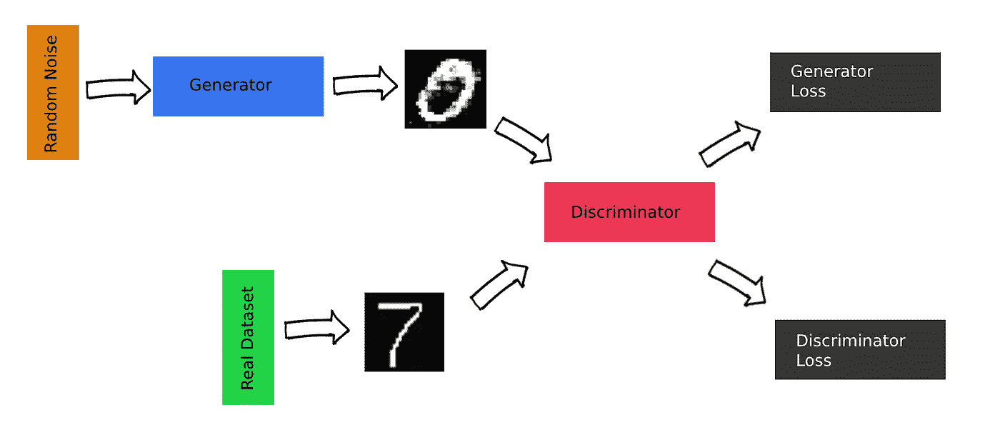

The structure of a GAN

## 事实真相

为了改善网络，这两个网络必须以价值最大化为目标。因此，我们训练鉴别器将正确的标签分配给生成的图像和真实样本。 *D(x)* 表示 *x* 来自真实数据集而非生成器的概率。 *D(x)* 产生值 1，意味着鉴别器 100%确信样本是真实图像。为了最大化鉴别器将正确标签分配给生成样本和真实样本的概率，鉴别器试图最大化

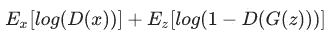

The discriminator maximizes its accuracy at classifying images. To do this D(x) of a real image should be close to 1, and D(G(z)) (the discriminator’s prediction on an image generated from the generator) should be close to 0.

同时，发电机被训练为最大化 *log( D( G(z))，*其中 z 是输入噪声。 *log( D( G(z ) )* 表示鉴别器对发电机输出的分类。数字越大，鉴别器越认为发电机的输出是真实的，因此发电机的性能越好。

# GANs 是如何如此擅长生成图像的？

**卷积层**

structure of CNN | photo from [wikipedia](https://commons.wikimedia.org/wiki/File:Typical_cnn.png)

卷积层通常存在于卷积神经网络中，擅长处理图像。这些网络从图像中识别形状和图案。

鉴别器利用这种能力来更好地对图像进行分类，生成器利用这种能力来创建与真实图像具有相同形状和图案的更真实的图像。

卷积层和 GAN 结构一起创建了一种 GAN 类型，称为深度卷积生成对抗网络或 DCGAN。

# 让我们创建自己的 GAN 来生成逼真的人眼

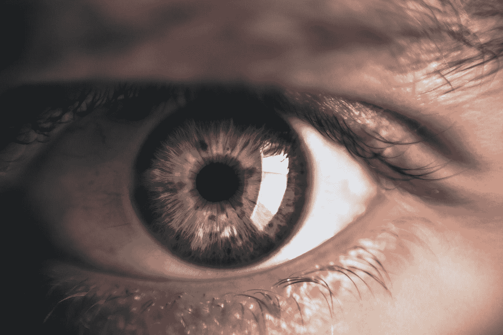

Photo by [Victor Freitas](https://unsplash.com/@victorfreitas?utm_source=medium&utm_medium=referral) on [Unsplash](https://unsplash.com?utm_source=medium&utm_medium=referral)

# 数据收集

像所有的机器学习模型一样，要取得好的结果，需要高质量和丰富的数据集。

我们将图像加载到 RGB 的 3 个通道中，然后将它们的大小调整为 128x128。我发现这个分辨率是低计算时间和高分辨率之间的一个很好的折衷。当图像被载入时，每个像素的值是一个从 0 到 255 的浮点数。因为我们的生成器的激活函数将是 tanh，像素的值必须映射到-1 到 1 之间的值来匹配。

使用的数据集是使用此 i [图像下载脚本](https://github.com/ostrolucky/Bulk-Bing-Image-downloader)和另一个眼睛数据集找到的图像的组合。这产生了大约 1000 张特写眼睛的图像。这可能已经足够了，但我决定通过水平翻转每个图像来增加数据，以创建总共 2000 个图像。

在加载和扩充图像后，我们在第 23 行创建了一个 TensorFlow 数据集，将图像混洗并将其分成几批。我用 64 的批处理大小来训练模型，因为这是我的 GPU 可以处理的最大值。数据集中的最终图像如下所示。

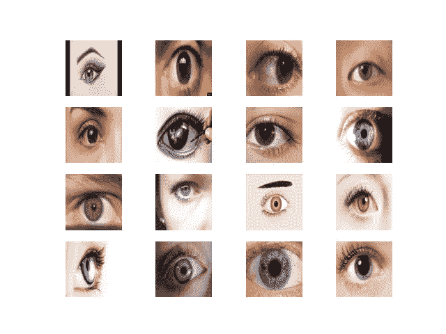

# 构建模型

## 鉴别器

鉴别器只是一个简单的 CNN。增加了一个 sigmoid 激活函数，以保持输出值在 0 和 1 之间。CNN 输出 1 意味着 100%确信输入图像是来自数据集的真实眼睛。

## 发电机

发电机稍微复杂一点

它几乎就像一个反向的 CNN。它接受随机噪声的张量，并应用过滤器将其放大为 128x128 的图像。随着它的训练，过滤器的权重将提高，以创建更好的图像。

因此，生成器的输入是大小为 100 的随机张量。

形状 100 的张量连接到大小为 16*16*256 的致密层。这是为了使层的大小可以调整到 16，16，256。换句话说，随机噪声被转换成具有 256 个通道的 16x16 图像。Conv2DTranspose 层会减少通道，同时增加输出的大小，直到发生器最终输出一个 128x128 的 3 通道图像。

## 失败

损失函数是 GAN 和任何神经网络的关键部分。对于 GANs，我们对鉴频器和发生器使用两个独立的损耗函数来优化二者。

## 发电机损耗

生成器正在进行优化，以创建一个输出，鉴别器会将类似于训练数据的图像分类为 1。为了对此进行优化，我们使用二进制交叉熵损失，当在当前训练步骤中给定来自生成器的图像时， *y_true* 为 1， *y_pred* 为鉴别器的输出。这捕获了生成的图像与真实图像的接近程度。

## 鉴频器损耗

与生成器不同，鉴别器每一步都在两个方面进行了优化。它的准确性在于将真实的训练数据匹配到标签 1，将生成的输出匹配到标签 0。因此，鉴频器损耗由两个独立的损耗相加而成。像发电机损耗一样，使用二进制交叉熵。

# 培养

运行模型训练的主训练循环。在每个训练步骤中，为生成器生成噪声。然后，发生器的输出图像被输入鉴别器。同样，一批真实的眼睛被送入鉴别器。将鉴别器的两个预测放入损失函数，然后计算梯度。最后，Adam 优化器将梯度应用于两个模型。在每个时期之后，生成一幅图像，其中包含生成器所生成内容的示例。

# 结果

## 400 个时代

运行 GAN 400 个周期，得到如下结果。生成器已经从数据集中学习了皮肤颜色，并对眼窝和瞳孔的样子有了大致的了解。然而，生成的图像仍然是模糊的，并且具有许多伪像

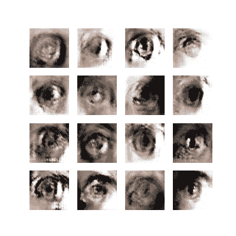

Eyes after 400 epochs

## 另外 400 个时代(总共 800 个时代)

在运行 GAN 另外 400 个周期后，生成器对皮肤的纹理和颜色有了更好的了解。它开始生成具有良好瞳孔形状和颜色的合适的眼睛。图像的分辨率也有所提高。

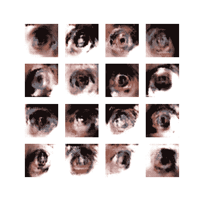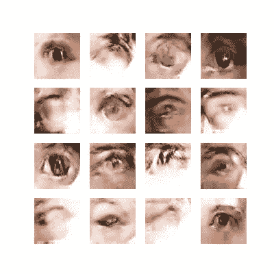

GAN after 800 epochs

## 又是 400 个时代(总共 1200 个时代)

经过总共 1200 个周期后，GAN 能够产生更精细的图像。生成器现在能够生成睫毛，并且眼睛周围有更多的清晰度。

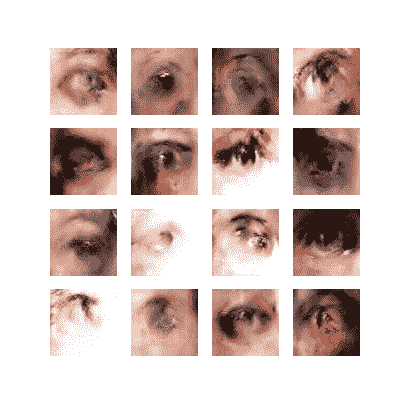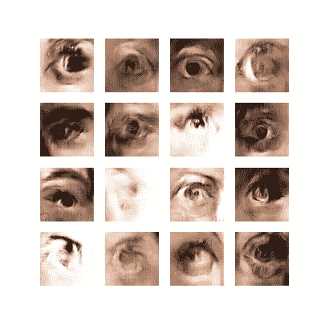

GAN after 1200 epochs

## 最后 400 个时代(总共 1600 个时代)

最后，在 1600 个纪元后，生成器大多能够生成具有较小伪影的高质量眼睛。发生器并不完美，如具有蓝色皮肤的图像、没有实际眼睛的图像以及具有红色而不是眼睛的图像所示。同时，生成器能够生成几乎逼真的眼睛。特别是第三列的第四只眼睛。

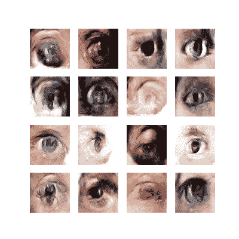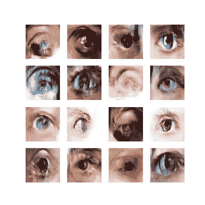

GAN after 1600 epochs

**完整代码，以及训练数据，可以在** [**Github**](https://github.com/williamjchen/eyeGAN) 上找到

# 结论

即使是简单的架构，GANs 也非常强大。它们能够生成与真实眼睛无法区分的眼睛。有了更复杂的架构和更深入的网络，GANs 能够创造出[栩栩如生的](https://github.com/NVlabs/stylegan)面孔、[再造视频游戏](https://nv-tlabs.github.io/gameGAN/)、[给图像和电影着色](https://github.com/jantic/DeOldify#about-deoldify)，把人变成[卡通](https://github.com/justinpinkney/toonify)等等。

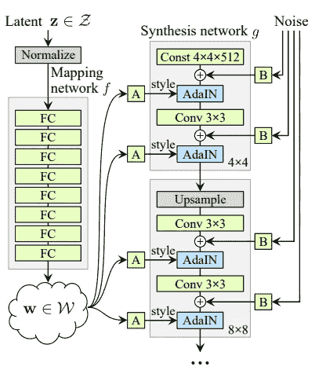

styleGAN architecture | image from [styleGANpaper](https://arxiv.org/pdf/1812.04948.pdf)