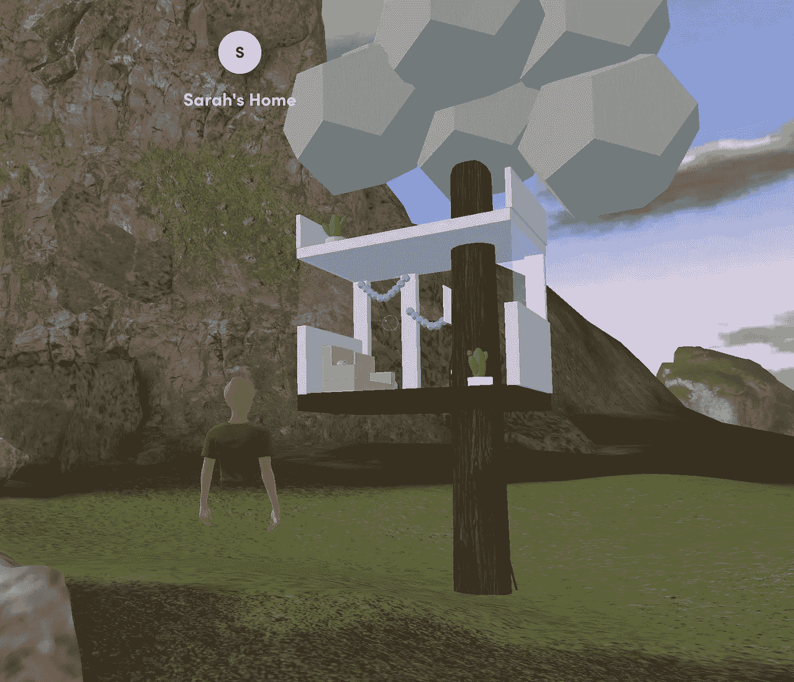

# 为社会公益创建 NFT

> 原文：<https://medium.com/geekculture/creating-nfts-for-social-good-a4049901aa75?source=collection_archive---------5----------------------->

*反思+我在 Web3Con 上的黑客马拉松经历的收获*

Our treehouse NFT in my VR metaverse backyard :)

我对 [Web 3](https://www.youtube.com/watch?v=DlNDYMNJ5zQ&t=7199s) 很好奇有一段时间了，尤其是在参加了 [NFT 之后。纽约](https://twitter.com/SarahN2323/status/1457779349621379076),看到这个领域最近得到的所有关注。除了目前的宣传，我还对了解长期潜力和我想贡献的领域感兴趣。我认为最好的学习方法是实践——所以我决定参加…