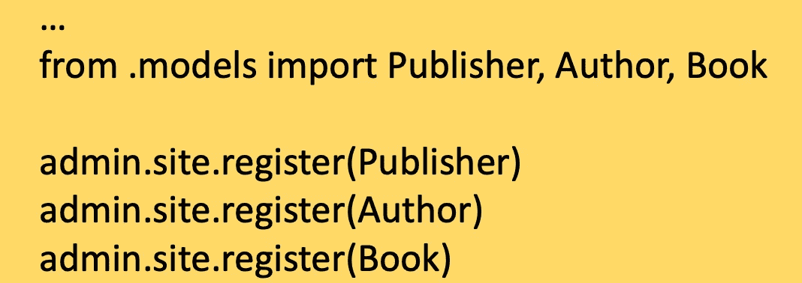

# Django 面向初级程序员

> 原文：<https://medium.com/geekculture/creating-our-first-django-project-86858a5b8df7?source=collection_archive---------21----------------------->

## 下面是创建你的第一个 Django 项目的分步指南

Photo by [Shahadat Rahman](https://unsplash.com/@hishahadat?utm_source=medium&utm_medium=referral) on [Unsplash](https://unsplash.com?utm_source=medium&utm_medium=referral)

# 预设置

如果你**没有** **安装 Django 和/或 Python**，请按照下面的**步骤** **操作，如果你有任何问题**请在**下面留言，我会尽我所能帮助你，否则你可以跳过这一步。**

设置 Django 就像实际使用它进行网站开发一样简单。家酿，这是一种广泛用于轻松下载软件的终端工具。**b*rew install Python****将*下载 Python 并且 **python -m venv virtual** 将为我们的 Django 代码创建一个环境。

进入环境是 **source bin/activate** ，激活虚拟环境后在终端内输入 **pip install django** 将安装 django 框架。

# 第一个 Django 项目

## 创建:

在安装 Python、设置虚拟环境和安装 django 之后，键入**" Django-admin start Project*项目名称* "** 将创建一个 Django 项目，键入" **python manage.py startapp 应用程序名称"**将为我们刚刚创建的**项目**创建我们的**第一个应用程序**，一个 **Django 项目**可以有**多个 Django 应用程序。**

在创建我们的第一个应用程序后，我们必须通过在我们的**已安装应用程序中添加**app _ name . Apps . appname+Config**来为我们的应用程序定制" **settings.py"** 。**

## 数据库设置:

我们可以在 **models.py 文件中添加我们网站所需的数据库模型。下面是一个例子:**

要检查您是否有任何问题或错误，您可以键入 **python manage.py check** ，如果**没有出现问题，**键入**python manage . py make migrations<应用程序名称>** 将创建迁移文件，最后**键入 python manage.py migrate** 将创建我们的数据库。

## 超级用户(管理员):

Django 自动为项目创建一个管理网站。一个**管理员**可以通过**输入****python manage . py create super user 来创建。**

接下来，我们在 **admin.py 文件中导入并注册我们的 databas 模型，下面是一个例子。**

## 运行和测试:

**python manage.py runserver** 将运行我们的项目服务器，[**http://127 . 0 . 0 . 1:8000/admin/**](http://127.0.0.1:8000/admin/)**可用于访问我们的管理员网站。**

## **第一个 API:**

**在我们的 **views.py 文件**中，我们可以为我们的应用程序添加任意多的 API。**

> ****def handleregisterequest(request):
> 返回 HttpResponse('尚未实现')****

## **将视图功能与资源 URIs 关联**

**最后，我们需要将 views.py 文件中的函数链接到我们的 **url.py** 文件中的 URI。在我们的 **urlpatterns 中，**添加 **path ('api/register/'，HandleRegisterRequest)，**其中' api/register '是 url，第二个参数是我们在 views.py 中创建的函数。**

## **第一代码**

****if request . method = = ' GET ':do _ something()。****

****elif request . method = = ' POST ':do _ something _ else()****

**以上是可以添加到函数**handleregisterequest(request)**的示例代码，该函数将链接到“api/register”。**

**我希望这个教程有所帮助，如果出现任何问题，请在下面留下评论，我会确保帮助你。快乐编码。**