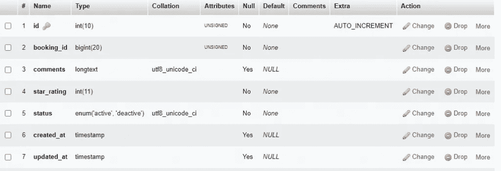
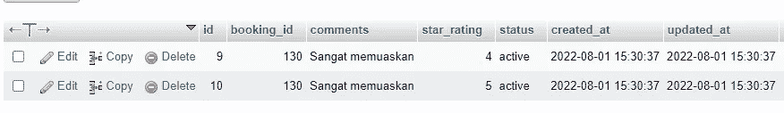
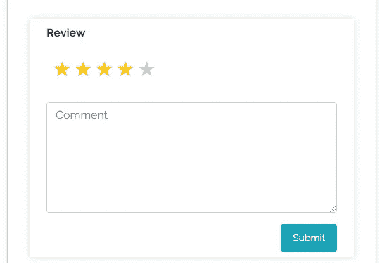

# 使用 Laravel 创建评级和评论

> 原文：<https://medium.com/geekculture/creating-ratings-and-reviews-with-laravel-6efa61d43ee3?source=collection_archive---------0----------------------->


你好，你们都好吗，我希望你们都永远健康和成功。这一次我们将回到编码。用 laravel 评分。当你创建销售应用程序或其他服务时，这对于你获得对你创建的服务的评价和评论是非常重要的。

您可以学习其他教程:

[使用 Laravel 拖放图像/文件上传](https://temanngoding.com/en/drag-and-drop-image-file-upload-using-laravel/)

[REST API 登录&向圣所注册](https://temanngoding.com/en/rest-api-login-register-with-sanctum-laravel/)

[在 Laravel 中使用 Ajax 上传文件](https://temanngoding.com/en/upload-files-using-ajax-in-laravel/)

# Laravel 评论和评级

评论评级是每个应用程序中最常见的模块，通常你会在电子商务平台上看到评论和评级系统，在每个产品后都有一个选项来评级或被用户评论，以分享他们的体验或反馈。

例如，为了在 laravel 应用程序中实现一个评论和评级系统，我们在数据库中创建并存储多个帖子，然后在每个帖子后实现一个评论和评级平台，用户可以选择一个星级并撰写评论。

好吧，让我们直接进入讨论。

# 移民

您必须首先创建一个评级表，用于存储来自评级和评论的数据。

```
php artisan make:migration create_review_ratings_table
```

我们打开在 **database\migrations\** 文件夹中创建的迁移文件，并填写如下代码:

```
<?phpuse Illuminate\Support\Facades\Schema;
use Illuminate\Database\Schema\Blueprint;
use Illuminate\Database\Migrations\Migration;*class* CreateReviewRatingsTable extends Migration
{
    /**
     * Run the migrations.
     *
     * @return void
     */
    public *function* up()
    {
        Schema::create('review_ratings', *function* (Blueprint $table) {
            $table->increments('id');
            $table->unsignedBigInteger('booking_id');
            $table->longText('comments')->nullable();
            $table->integer('star_rating');
            $table->enum('status', ['active', 'deactive']);
            $table->timestamps();
        });
    } /**
     * Reverse the migrations.
     *
     * @return void
     */
    public *function* down()
    {
        Schema::dropIfExists('review_ratings');
    }
}
```

注意:在 booking_id 字段中，您可以使用您的所有表进行定制。在这种情况下，我将给出一个我的项目的例子。

# 运行迁移

php 工匠迁移



# 路线

您在 **routes\web.php** 中添加一个如下所示的路由

```
Route::post('review-store', 'BookingController@reviewstore')->name('review.store');
```

# 控制器

在控制器中添加如下代码:

```
public *function* reviewstore(Request $request){
        $review = new ReviewRating();
        $review->booking_id = $request->booking_id;
        $review->comments= $request->comment;
        $review->star_rating = $request->rating;
        $review->user_id = Auth::user()->id;
        $review->service_id = $request->service_id;
        $review->save();
        return redirect()->back()->with('flash_msg_success','Your review has been submitted Successfully,');
    }
```

# 叶片

添加一个评级刀片，请在您的表单中添加下面的代码，所有人。

```
<link rel="stylesheet" href="https://maxcdn.bootstrapcdn.com/bootstrap/4.5.2/css/bootstrap.min.css">
      <script src="https://ajax.googleapis.com/ajax/libs/jquery/3.5.1/jquery.min.js"></script>
      <script src="https://maxcdn.bootstrapcdn.com/bootstrap/4.5.2/js/bootstrap.min.js"></script>
<style>
     .rate {
         float: left;
         height: 46px;
         padding: 0 10px;
         }
         .rate:not(:checked) > input {
         position:absolute;
         display: none;
         }
         .rate:not(:checked) > label {
         float:right;
         width:1em;
         overflow:hidden;
         white-space:nowrap;
         cursor:pointer;
         font-size:30px;
         color:#ccc;
         }
         .rated:not(:checked) > label {
         float:right;
         width:1em;
         overflow:hidden;
         white-space:nowrap;
         cursor:pointer;
         font-size:30px;
         color:#ccc;
         }
         .rate:not(:checked) > label:before {
         content: '★ ';
         }
         .rate > input:checked ~ label {
         color: #ffc700;
         }
         .rate:not(:checked) > label:hover,
         .rate:not(:checked) > label:hover ~ label {
         color: #deb217;
         }
         .rate > input:checked + label:hover,
         .rate > input:checked + label:hover ~ label,
         .rate > input:checked ~ label:hover,
         .rate > input:checked ~ label:hover ~ label,
         .rate > label:hover ~ input:checked ~ label {
         color: #c59b08;
         }
         .star-rating-complete{
            color: #c59b08;
         }
         .rating-container .form-control:hover, .rating-container .form-control:focus{
         background: #fff;
         border: 1px solid #ced4da;
         }
         .rating-container textarea:focus, .rating-container input:focus {
         color: #000;
         } .rated {
         float: left;
         height: 46px;
         padding: 0 10px;
         }
         .rated:not(:checked) > input {
         position:absolute;
         display: none;
         }
         .rated:not(:checked) > label {
         float:right;
         width:1em;
         overflow:hidden;
         white-space:nowrap;
         cursor:pointer;
         font-size:30px;
         color:#ffc700;
         }
         .rated:not(:checked) > label:before {
         content: '★ ';
         }
         .rated > input:checked ~ label {
         color: #ffc700;
         }
         .rated:not(:checked) > label:hover,
         .rated:not(:checked) > label:hover ~ label {
         color: #deb217;
         }
         .rated > input:checked + label:hover,
         .rated > input:checked + label:hover ~ label,
         .rated > input:checked ~ label:hover,
         .rated > input:checked ~ label:hover ~ label,
         .rated > label:hover ~ input:checked ~ label {
         color: #c59b08;
         }
</style>  
@if(!empty($value->star_rating))
                                <div class="container">
                                    <div class="row">
                                       <div class="col mt-4">
                                             <p class="font-weight-bold ">Review</p>
                                             <div class="form-group row">
                                                <input type="hidden" name="booking_id" value="{{ $value->id }}">
                                                <div class="col">
                                                   <div class="rated">
                                                    @for($i=1; $i<=$value->star_rating; $i++) {{-- <input type="radio" id="star{{$i}}" class="rate" name="rating" value="5"/> --}}
                                                      <label class="star-rating-complete" title="text">{{$i}} stars</label>
                                                    @endfor
                                                    </div>
                                                </div>
                                             </div>
                                             <div class="form-group row mt-4">
                                                <div class="col">
                                                    <p>{{ $value->comments }}</p>
                                                </div>
                                             </div>
                                       </div>
                                    </div>
                                 </div>
                                @else
                                <div class="container">
                                    <div class="row">
                                       <div class="col mt-4">
                                          <form class="py-2 px-4" action="{{route('admin.review.store')}}" style="box-shadow: 0 0 10px 0 #ddd;" method="POST" autocomplete="off">
                                             @csrf
                                             <p class="font-weight-bold ">Review</p>
                                             <div class="form-group row">
                                                <input type="hidden" name="booking_id" value="{{ $value->id }}">
                                                <div class="col">
                                                   <div class="rate">
                                                      <input type="radio" id="star5" class="rate" name="rating" value="5"/>
                                                      <label for="star5" title="text">5 stars</label>
                                                      <input type="radio" checked id="star4" class="rate" name="rating" value="4"/>
                                                      <label for="star4" title="text">4 stars</label>
                                                      <input type="radio" id="star3" class="rate" name="rating" value="3"/>
                                                      <label for="star3" title="text">3 stars</label>
                                                      <input type="radio" id="star2" class="rate" name="rating" value="2">
                                                      <label for="star2" title="text">2 stars</label>
                                                      <input type="radio" id="star1" class="rate" name="rating" value="1"/>
                                                      <label for="star1" title="text">1 star</label>
                                                   </div>
                                                </div>
                                             </div>
                                             <div class="form-group row mt-4">
                                                <div class="col">
                                                   <textarea class="form-control" name="comment" rows="6 " placeholder="Comment" maxlength="200"></textarea>
                                                </div>
                                             </div>
                                             <div class="mt-3 text-right">
                                                <button class="btn btn-sm py-2 px-3 btn-info">Submit
                                                </button>
                                             </div>
                                          </form>
                                       </div>
                                    </div>
                                 </div>
                                 @endif
```

注意:在上面的代码中，我只分享了一些 html 和 css 代码。请把你所有的表格都加上。我给出了输入表单时和输入表单后的两个条件，结果如下。

输入形式



输出


以上是我这次可以传达的教程，希望有用。

谢了。