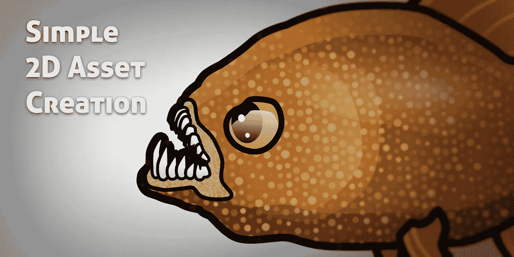

# 创建简单的 2D 游戏资产

> 原文：<https://medium.com/geekculture/creating-simple-2d-assets-faf3e7f4bb6a?source=collection_archive---------17----------------------->

说到电子游戏，艺术可以说几乎和功能一样重要。到目前为止，我一直使用 3D 图形来设计基本的游戏，但是现在是时候拿出**画板了！**

谈到艺术，无论是 2D 还是 3D，传统还是数字，对于一个有效的**工作流程来说，都有一些基本的**规则**可以遵循。我和其他人一样喜欢细节…但是太早进入细节…**