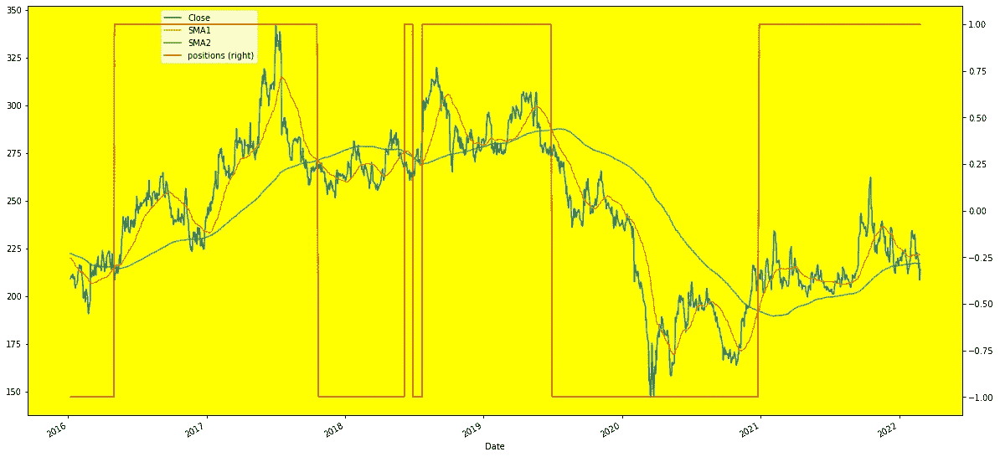

# 为技术分析创建股票数据的可视化

> 原文：<https://medium.com/geekculture/creating-visualization-of-stock-data-for-technical-analysis-f0af74212256?source=collection_archive---------15----------------------->

本文将重点学习从雅虎金融导入特定股票的档案数据，进行必要的数据工程，以满足创建特定股票的简单移动平均线的基本可视化的要求。该图可用于对特定股票进行技术分析，并准备交易策略

现在谈谈环境。我们会在谷歌实验室使用 Jupyter 笔记本。设置环境加载基本库，如 pandas、numpy、Mathplot，分别用于数据框操作、数学函数和图形绘制。此外，导入 yfinance 库。如果在导入之前尚未安装软件包 yfinance，您可能需要安装该软件包。

***导入熊猫为 pd***

**T5！pip 安装 yfinance**

***导入 yfinance 为 yf***

下一步是获取特定股票的正确股票代码标识符。你可以在雅虎财经的搜索引擎上找到。在本文中，我们将使用 NSE 中 ITC 股票的档案数据(股票标识符为 ITC)。NS):-

***ITC= yf.download('ITC。' NS '，start = ' 2015–01–01 '，end= Todays_Date，progress=False)***

下一步是从现有的 ITC 数据帧创建一个新的数据帧。在这个特征工程的过程中，我们将只保留那些对于特定技术分析的简单移动平均线所需要的特征。首先，通过执行下面给出的命令，我们将只保留关闭字段:-

***ITC.tail(5)***

接下来，我们将通过执行下面的命令来计算最小值、最大值、标准差、中值和指数加权移动平均值。请注意，这一计算是在 20 天的时间内进行的。如果执行 ITC_1.head(20 ),可以看到这些值是从第 20 个数据帧开始计算的

***ITC_1= ITC.drop(['开盘'，'高'，'低'，'调整收盘'，'成交量']，axis =1)***

***ITC _ 1 . head(3)***

要绘制图形，我们需要确保所需的库，具体来说是 Mathplotlib.pyplot 已经导入到当前环境中。在所创建的图表中，仅使用来自数据帧 **ITC_1、**的三个值，即“ **min** ”、“ **mean** ”、“ **max** ”。为了确保所创建的图表充分可见，将只使用结束日期(尾部)的最后 200 个值。在图表中，最小值和最大值用绿色显示，而平均值用红色显示

***窗口=20***

***ITC_1['分']= ITC_1['闭']。滚动(窗口=窗口)。*闵()**

***ITC _ 1[' max ']= ITC _ 1[' Close ']。滚动(窗口=窗口)。max()***

***ITC_1['均值']= ITC_1['接近']。滚动(窗口=窗口)。*均值()**

***ITC _ 1[' STD ']= ITC _ 1[' Close ']。滚动(窗口=窗口)。*STD()**

***ITC_1['中值']= ITC_1['接近']。滚动(窗口=窗口)。*中位数()**

***ITC _ 1[' EWMA ']= ITC _ 1[' Close ']。ewm(半衰期=0.5，min_periods=window)。*均值()**

***ITC _ 1 . head(20)***

接下来，我们将分别使用 42 天和 242 天滚动窗口的收盘价来创建简单的移动平均线，我们将使用它来创建图表。这将通过执行下述命令来实现:-

***ITC _ 1[' SMA 1 ']= ITC _ 1[' Close ']。滚动(窗口=42)。*均值()**

***ITC _ 1[' sm a2 ']= ITC _ 1[' Close ']。滚动(窗口=252)。*均值()**

***ITC_1[['Close '，' SMA1 '，' SMA2']]。*尾巴()**

继续使用数据集的三个值，即分别为 42 天和 242 天的简单移动平均值，我们将创建一个描述这三个值的图表。这将通过执行下面提到的命令来实现

> **ITC_1[['Close '，' SMA1 '，' SMA2']]。plot(figsize=(20，6))；**

最后一步是建立头寸，即买入或卖出。我们将在数据框中创建另一个列或字段作为位置，它将是 **1** ，它将指示股票处于上升趋势，而 **-1** ，它将表示股票处于下降趋势，这些反过来可用于准备交易策略。该位置将在图中用红色粗线表示。所有这些都可以通过执行下面给出的命令来实现

***ITC _ 1 . dropna(in place = True)***

***ITC _ 1[' positions ']= NP . where(ITC _ 1[' SMA 1 ']>ITC _ 1[' SMA 2 ']，1，-1)***

***ax = ITC_1[['Close '，' SMA1 '，' SMA2 '，' positions']]。plot(figsize=(20，10)，secondary_y='positions '，)***

***ax.get_legend()。set_bbox_to_anchor((0.25，0.85))；***

***ax.set_facecolor("黄色")；***

Technical Analysis : ITC Stock

我写这篇文章是为了那些刚刚进入数据可视化领域并对股票技术分析有基本了解的人。上面创建的材料专门用于自学和分享关于数据可视化的知识。

参考:-

上面这篇文章的 Jupyter Notebook 中的代码链接是[Creating _ Graph _ for _ Technical _ Analysis _ of _ Specific _ stocks . ipynb](https://github.com/RajeevBhadola/myrepo/blob/master/Creating_Graph_for_Technical_Analysis_of_Specific_Stocks.ipynb)

