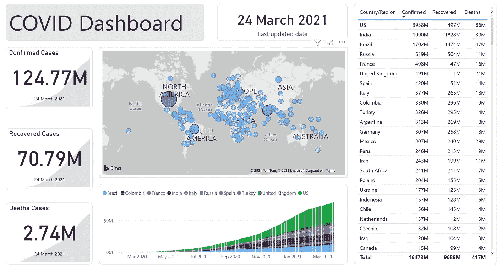
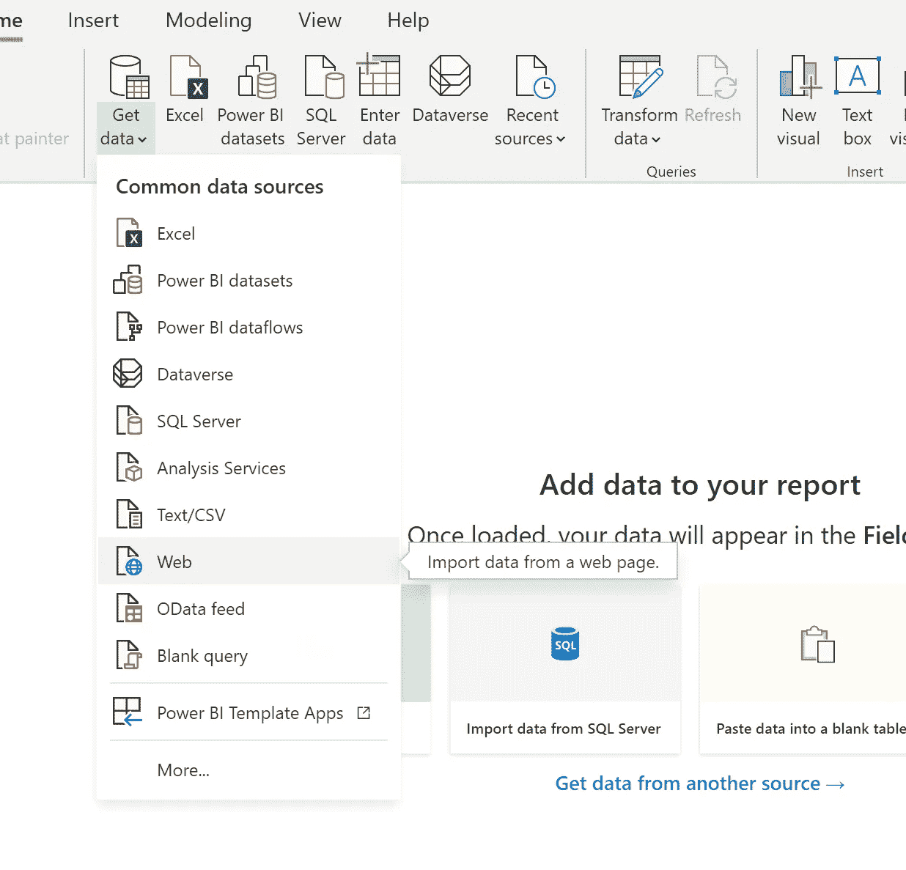
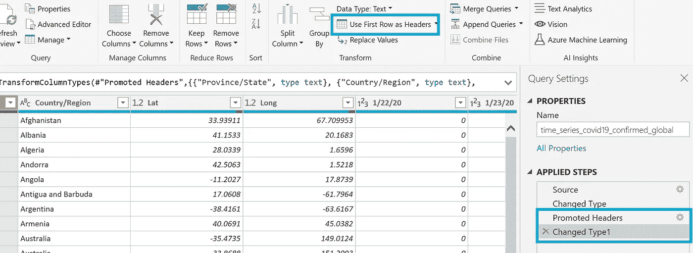
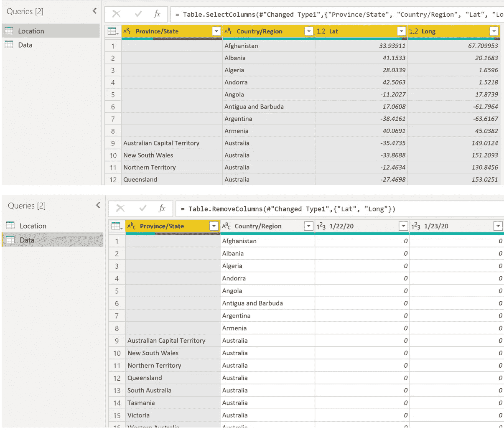
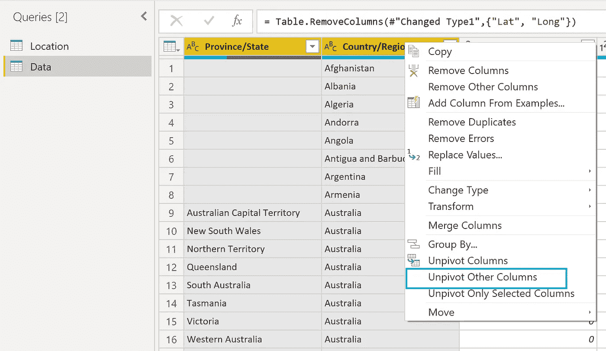
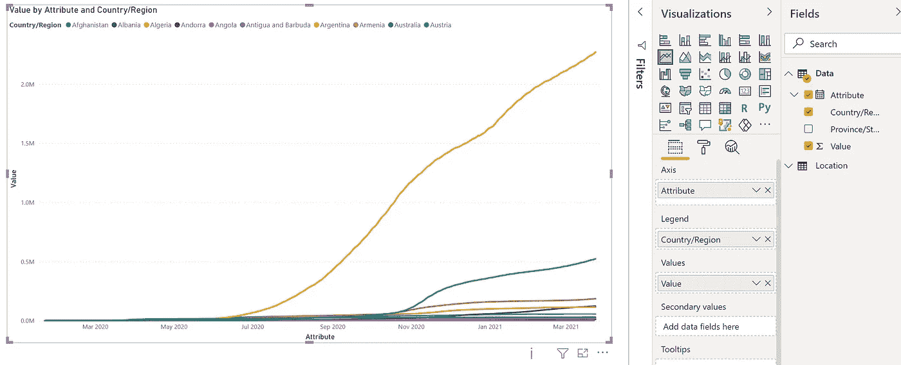

# 在 Power BI 中创建您的第一个定制 COVID 仪表板—分步指南

> 原文：<https://medium.com/geekculture/creating-your-first-customized-covid-dashboard-in-power-bi-a-step-by-step-guide-1d6f41fffaad?source=collection_archive---------12----------------------->

COVID 爆发已经一年多了，情况时好时坏。我们总是希望关注数字，检查事情进展如何:事情正在好转吗？下一次出国旅行是什么时候？隔离什么时候结束？要跟踪趋势并获得定制的可视化，我们可以使用 Power BI 轻松完成。在本文中，我将向您展示如何将 Power BI 仪表板连接到来自 GitHub 的数据，如何在 Power Query Editor 中转换和清理数据，以及如何创建图表/图形。

Dashboard image from the author

# 先决条件:

*   超级商务智能桌面
*   Power BI 帐户(如果要发布仪表板)

# 步骤 1:找到您的数据

我们将用于仪表板的数据来自 Github 中的一个存储库，检查到该存储库的链接，您将能够看到 csv 格式的原始数据。

 [## CSSEGISandData/新冠肺炎

### 新型冠状病毒(新冠肺炎)病例，由 JHU·CSSE 提供

github.com](https://github.com/CSSEGISandData/COVID-19/blob/master/csse_covid_19_data/csse_covid_19_time_series/time_series_covid19_confirmed_global.csv) 

为了能够将您的 Power BI 连接到数据，我们需要单击“ ***Raw*** ”按钮，然后从页面中复制并粘贴 URL，该 URL 应该以“ *raw.github……开头。*”。如果您想看一下，这里是我们将用于仪表板的一个链接:

[https://raw . githubusercontent . com/CSSEGISandData/新冠肺炎/master/csse _ covid _ 19 _ data/csse _ covid _ 19 _ time _ series/time _ series _ covid 19 _ confirmed _ global . CSV](https://raw.githubusercontent.com/CSSEGISandData/COVID-19/master/csse_covid_19_data/csse_covid_19_time_series/time_series_covid19_confirmed_global.csv)

# 步骤 2:将您的 Power BI 连接到数据

Image from the author

Power BI 支持一系列不同的方式来添加数据，如 Excel、csv、SQL 等。对于当前的仪表板，我们将使用来自 GitHub 中网页的数据，我们选择 *Web* from *Get Data。*

然后我们粘贴从第一步得到的 URL，这将自动开始加载数据到 Power BI 文件。

非常欢迎您先加载数据，然后再回来编辑它，或者只需点击“**转换数据**，这将导致“**超级查询编辑器**”窗口，您可以在移动到可视化之前整理数据。

# 第三步:整理你的数据

与 Python 或 R 相比，如果你想开发一个漂亮的仪表板，Power BI 很容易上手，因为你可以基本上不用编码就能清理数据和进行可视化。现在我将快速向您展示如何在编辑器窗口中编辑数据。

开始的一个常见流程是“**使用第一行作为标题**”。无论从哪里加载数据，Power BI 都经常无法将第一行识别为标题。不用编写任何代码，点击顶部的按钮(用蓝色突出显示)，然后它会自动将第一行更改为标题。Power BI 更好的地方是在右边的“**应用步骤**”下，您可以很容易地看到您对数据所做的所有更改，并且您可以随时返回进行进一步的更改。

Image from the author

我认为在数据清理过程中起重要作用的一件关键事情是观察数据集，看看如何转换它以满足你以后的可视化需求。在这里，通过快速浏览数据，您可能会了解到这个数据集包含三种类型的信息:1) **位置** —国家/地区/州/省；2) **经纬度**；以及 3) **按日期**的 Covid 数据。为了简化结构，我将在一个表中获取 Location 和 Lat & Long 数据，然后在第二个表中获取 Location 和 Covid 数据。

为此，复制该表并删除不相关的列。然后您将得到两个表:一个有四列——国家/地区、州/省、纬度和经度，另一个是国家/地区、州/省，所有列都有按日期排列的数据。

Image from the author

我要做的下一件事是取消所有“日期”列的透视。正如你从第五列看到的，每一列都列出了特定日期的数据，这将增加可视化的复杂性和难度。为了使事情变得简单，我们希望取消所有“日期”列。要做到这一点，请选择您想要透视的列，然后右键单击，选择“ **Unpivot Other Columns** ”。

神奇的事情发生了，你得到的数据几乎可以被可视化了！

Image from the author

我们需要做的最后几件事是:如果需要，将列重命名为 date，并通过单击列名旁边的左侧按钮将数据类型从“Text”更改为“Date”。这里的一个提示是，目前的日期数据是以美国日期格式(DD/MM/YYYY)格式化的，如果您的计算机/笔记本电脑系统的日期格式与美国格式不同，请确保选择“使用区域设置”来应用新的日期格式。

点击左上方的“**关闭&应用**”按钮，保存您在编辑器窗口中所做的所有更改，并应用到可视化窗口。

# **第四步:创建图表&图表**

令人兴奋的是，我们可以拖放，并改变一些设置，如果有必要获得我们的可视化！

下面是我使用折线图创建的图表，以“属性”(日期)为轴，以值为值，以国家/地区为图例。

Image from the author

# 结论:

现在轮到你了，用清理过的数据尝试不同类型的可视化，让自己熟悉这些可视化。

总而言之，要创建 Power BI 仪表板，首先要将 Power BI 连接到数据源，然后是我认为最重要的步骤——清理和转换数据，一旦数据准备就绪，就可以创建图表了。

如果有任何问题，请在 Linkedin 上联系我，或者打个招呼🤪！