# 使用 Oracle Cloud、Kubernetes、Traefik 和 Rancher 创建您自己的免费安全的云实验室

> 原文：<https://medium.com/geekculture/creating-your-own-free-and-secure-cloud-lab-using-oracle-cloud-kubernetes-traefik-and-rancher-efadd4c65975?source=collection_archive---------1----------------------->

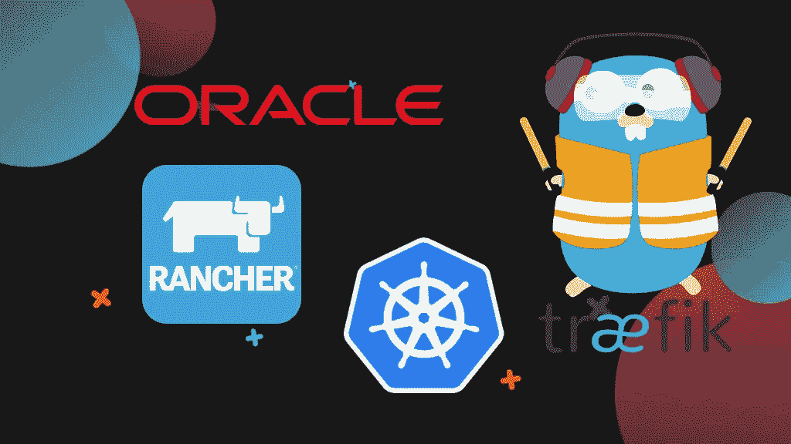

*在我担任* [*小流氓开发*](https://www.hooligan.co.za/) *的首席技术官期间，我努力每周掌握至少 2 项新的技术技能，并鼓励我招募、培训和管理的开发人员也这样做。这篇文章是我关于 Homelabs、Cloudlabs 和微服务系列的一部分——欢迎关注我的更多内容。*

# 介绍

我知道很多开发人员梦想着使用一些最新的工具和基于云的技术，但是经常面临有限的自由层或者非常复杂的设置。有些人没有多余的 PC 或笔记本电脑来创建自己的本地家庭实验室，或者根本负担不起必要的维护和电费。

我最近发现，Oracle 提供了一个非常慷慨的免费层，非常适合创建您自己的“云实验室”——与 AWS 不同，它承诺永远免费**！**

**那么，让我们来看看你如何自己设置一个…**

# **什么是 Homelab/Cloudlab？**

**如果您从未听说过这个术语，Homelab 是一个服务器(或多个服务器设置)的名称，它驻留在您家中或云中(因此有 Cloudlab 这个词),您在云中托管几个应用程序和虚拟化系统，用于测试和开发或家庭和功能使用。**

# **你为什么需要一个？**

**你不知道。不是每个人都必须有一个实验室设置。但是有一个实验室有它的优势。**

**如果您是 Linux 服务器的新手，它为您提供了一个学习和破坏东西的平台。**

**作为一名软件、sysadmin 或 devops 工程师，它让您能够工作并试验在远程环境或低功率笔记本电脑或 PC 上可能难以完成的项目和技术。**

**你想学习 Terraform、Ansible，了解微服务如何通过服务网格、反向代理进行通信，一个实验室就能让你学会！**

**云和家庭实验室是为任何给定项目创建或模拟任何特定环境的绝佳选择，展示它，然后简单地丢弃，而不必投资金钱或每月花费。**

# **先决条件**

## **Oracle 云帐户**:使用**很容易创建一个**

**[https://signup.cloud.oracle.com/?source type = _ ref _ COC-asset-OPC sign in&language = en _ US](https://signup.cloud.oracle.com/?sourceType=_ref_coc-asset-opcSignIn&language=en_US)**

## **安装 OCI Cli**

**[https://docs . Oracle . com/en-us/iaas/Content/API/SDK docs/CLI install . htm](https://docs.oracle.com/en-us/iaas/Content/API/SDKDocs/cliinstall.htm)**

## **安装 Kubectl**

**通过以下链接安装 Kubectl[https://kubernetes.io/docs/tasks/tools/](https://kubernetes.io/docs/tasks/tools/)**

## **安装舵**

**你可以在 linux 和 mac 上运行下面的脚本，或者访问这个网站了解更多细节【https://helm.sh/docs/intro/install/ **

```
curl https://raw.githubusercontent.com/helm/helm/master/scripts/get-helm-3 | bash
```

## **安装 VSCode Kubernetes 扩展**

**【https://marketplace.visualstudio.com/items? itemName = ms-kubernetes-tools . vs code-kubernetes-tools**

## **拥有一个域名**

**你可以使用任何你想要的域名。我使用了 Cloudflare 域，因为它可能是用 Traefik 设置的最简单的域，我们稍后将使用它。**

# **创建 Oracle 云帐户**

**在[oraclecloud.com](http://oraclecloud.com)创建一个账户，除了从你的信用卡中收取一点临时费用以使其生效之外，创建账户是免费的。这个月您还将获得 250 欧元的免费积分。你可以在这里[https://www.oracle.com/za/cloud/free/#always-free](https://www.oracle.com/za/cloud/free/#always-free)看到甲骨文提供的免费云服务的完整列表。**

## **著名的自由层基础设施**

**2 个基于 AMD 的计算虚拟机，每个具有 1/8 OCPU**和 1 GB 内存
4 个基于 Arm 的 Ampere A1 内核和 24 GB 内存，可用作一个虚拟机或最多 4 个虚拟机
2 个块卷存储，总共 200 GB
10 GB 对象存储—标准
NoSQL 数据库和其他选项
灵活的负载平衡器:1 个实例，10 Mbps
灵活的网络负载平衡器**

**我选择了英国地区 uk-london-1**

**[https://cloud.oracle.com/?region=uk-london-1](https://cloud.oracle.com/?region=uk-london-1)**

**当您看到崭新闪亮的 Oracle 云平台时。您最初可能有一个 VCN 设置，如果有，请立即删除您的 [VCN(虚拟云网络)](https://www.oracle.com/cloud/sign-in.html?redirect_uri=https://cloud.oracle.com/networking/vcns)这样做的原因是，我们仍然可以坚持使用我们的免费资源，还可以从头开始设置一个集群，而不是有两个 VCN。**

# **创建您的 Kubernetes 集群**

**在菜单中的开发者服务下，选择 [Kubernetes 集群(OKE)](https://cloud.oracle.com/containers/clusters?region=uk-london-1) 选项，并选择**创建集群****

****

**选择**快速创建**选项并启动工作流程。**

**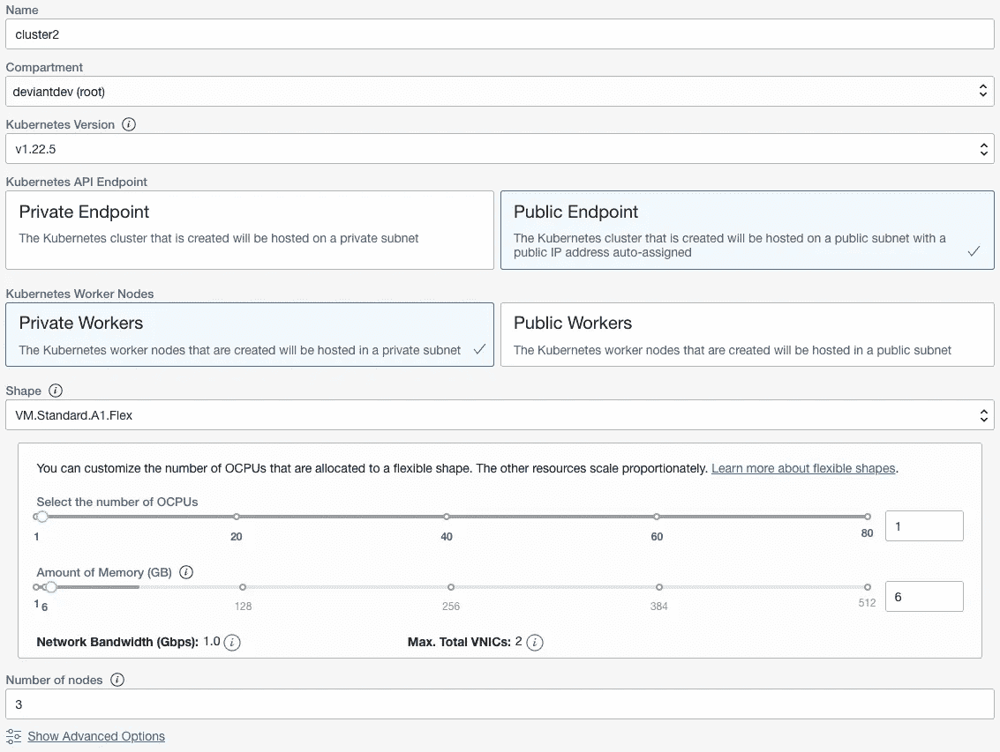**

**您可以随意命名您的集群。**

****确保您选择的形状是 VM。Standard.A1.Flex 形状，否则您将不会在自由层**中。形状只是一种实例类型，对于空闲层，您可以在一个虚拟机上或在 4 个虚拟机之间分配多达 4 个容量高达 24 GB 的 A1 vCPU。**

**我选择了 3 个节点，每个节点有 1OCPU 和 6GB 内存。**

**在**高级选项**下，生成您的 SSH 私有和公共密钥，并将它们保存在安全的地方。**

**单击下一步，检查并创建集群。这可能需要几分钟时间，请耐心等待。**

**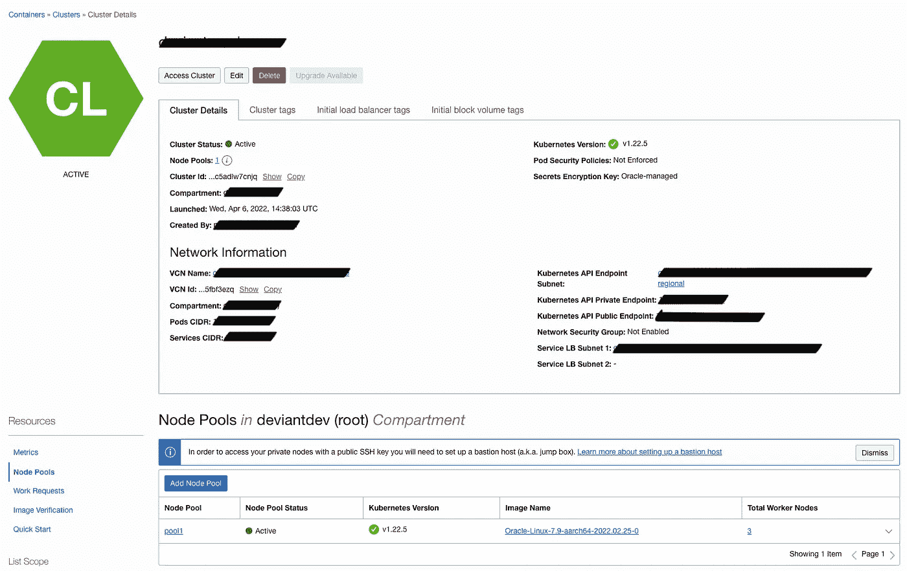**

**Active kubernetes cluster**

**完成后，您应该有一个绿色的活动集群。应该有一个活动节点池，并且该节点池应该有 3 个活动和就绪节点。**

**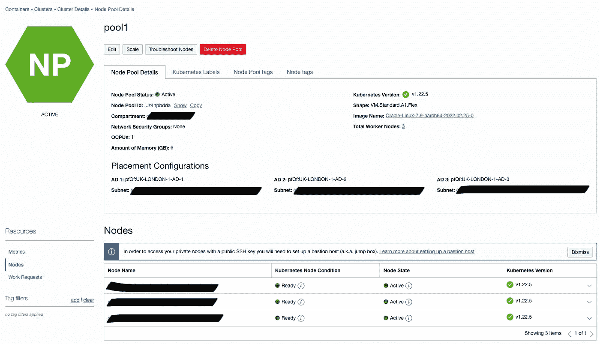**

**Active node pool**

**现在你可能想知道我们究竟如何访问这个集群？这就是 kubectl 派上用场的地方，在集群细节页面上单击 Access Cluster 按钮。这将给我们两个选择。**

****

**Access Cluster**

1.  **云外壳访问(这超出了本文的范围)**
2.  **局部访问**

**选择**本地访问**并按照指示进行操作。确保安装了 OCI Cli 和其他先决条件，并通过粘贴提供给您的 VCN 本地公共端点命令来设置 kubeconfig。**

**现在，您应该能够在命令行中使用 kubectl 或 VSCode 中的 **Visual Studio Code Kubernetes 工具本地连接到您的集群。**我同时使用了终端和 VSCode，但是现在让我们继续使用终端。**

**如果您运行 **kubectl cluster-info** ，您应该会得到类似下面这样的结果。**

```
kubectl cluster-info
```

**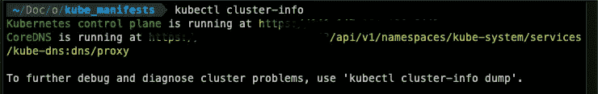**

**kubectl cluster-info output**

**如果 **kubectl cluster-info** 表示无法连接到集群，请执行以下步骤:**

*   **检查群集和节点是否处于活动状态并准备就绪**
*   **检查您的$HOME/。kube/config 文件存在，并且包含 Oracle 中 Access Your Cluster 给我们的命令中的内容。确保运行 VCN 公共端点命令**
*   **再次运行访问您的集群 VCN 公共端点命令**

**现在我们应该可以进行下一步了！**

# **安装 Kubernetes 仪表板**

**我们应该做的第一件事是安装 Kubernetes Dashboard UI。要安装它，请运行以下命令**

```
kubectl apply -f [https://raw.githubusercontent.com/kubernetes/dashboard/v2.5.1/aio/deploy/recommended.yaml](https://raw.githubusercontent.com/kubernetes/dashboard/v2.5.1/aio/deploy/recommended.yaml)
```

**为了访问浏览器的 UI，我们需要运行代理命令**

```
kubectl proxy
```

**这将使用一个 HTTP 代理来公开 Kubernetes API。现在，您可以使用以下 URL 访问仪表板 API。**

**[http://localhost:8001/API/v1/namespaces/kubernetes-dashboard/services/https:kubernetes-dashboard:/proxy/#/workloads？名称空间=默认](http://localhost:8001/api/v1/namespaces/kubernetes-dashboard/services/https:kubernetes-dashboard:/proxy/#/workloads?namespace=default)**

**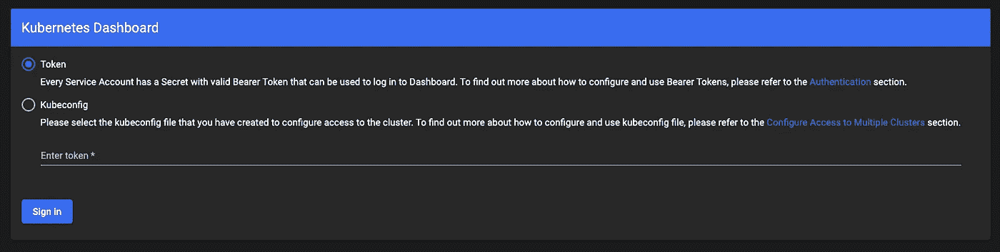**

**Kubernetes dashboard login**

**现在，您应该会看到一个要求您进行身份验证的屏幕。**

## **Kubernetes 仪表板验证**

**有两种方法可以验证我们的 Kubernetes dashboard 帐户；使用令牌或 kubeconfig 方法。出于本教程的目的，我们将使用令牌身份验证方法。**

**令牌身份验证方法要求我们为 Kubernetes 仪表板创建一个新的服务帐户。我们将这个服务帐户绑定到集群管理角色，这将使我们能够访问仪表板上的所有 Kubernetes 资源。然后，我们可以使用服务帐户的不记名令牌来登录仪表板。**

## **创建仪表板服务帐户**

```
kubectl create serviceaccount dashboard-admin-sa
```

**这将在默认名称空间中创建一个名为 dashboard-admin-sa 的服务帐户**

**接下来，将 dashboard-admin-service-account 服务帐户绑定到群集管理角色**

```
kubectl create clusterrolebinding dashboard-admin-sa --clusterrole=cluster-admin --serviceaccount=default:dashboard-admin-sa
```

**当我们创建 dashboard-admin-sa 服务帐户时，Kubernetes 也为它创建了一个秘密。**

**列出机密使用:**

```
kubectl get secrets
```

**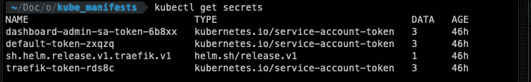**

**Kubernetes Secret**

**我们可以在上面的截图中看到 dashboard-admin-sa 服务帐户机密。你的名字后面会有一个不同的数字，在这个例子中，我的名字是- **6b8xx** 。**

**使用 kubectl describe 获取访问令牌:**

```
kubectl describe secret dashboard-admin-sa-token-6b8xx
```

**复制令牌并将其输入到 Kubernetes 仪表板登录页面上的令牌字段中。**

**我们现在可以访问 Kubernetes 仪表板，并进入默认名称空间的概述页面。**

**Kubernetes 仪表板有四个主要部分:**

*   **串**
*   **工作量**
*   **发现和负载平衡以及**
*   **配置和存储**

**在本教程中，我们不会过多地使用仪表板，因为我们将使用 Rancher。事实上还有很多其他的 Kubernetes GUI 客户端，你可以看看 [Octant](https://octant.dev/) 或者 [Lens](https://k8slens.dev/) 都是非常好的 GUI 管理工具。**

# **安装 Traefik 作为我们的反向代理**

**[Traefik](https://traefik.io/traefik/) 是**一款领先的反向代理和负载平衡器，适用于云原生操作和容器化工作负载**。它作为一个边缘路由器，将您的服务发布到互联网上。Traefik 通过匹配请求属性(如域、URL 和端口)将请求路由到您的容器。我们还将为我们的 let 加密证书使用 Traefik，允许我们为我们将来要创建的所有服务使用通配符 SSL 证书。我在本地的家庭实验室环境中广泛使用了它，发现它相当简单易用。**

**为了安装 Traefik，我们使用 Helm，它是 Kubernetes 的一个包管理器。**

**使用以下命令安装 Traefik，并通过 traefik-values.yml 文件进行其他配置。**

**首先，我们需要将回购添加到 helm，然后我们可以在更新 helm 回购后安装 Traefik。**

```
helm repo add traefik https://helm.traefik.io/traefik 
helm repo update 
helm install traefik traefik/traefik --values=traefik-values.yml
```

****在运行脚本之前，用您的值替换**[](http://example.com)****以及您的 Cloudflare 电子邮件和 api 密钥。**如果您没有使用 Cloudflare，请查看以下关于如何配置其他提供商的链接，[https://doc.traefik.io/traefik/https/acme/](https://doc.traefik.io/traefik/https/acme/)****

****traefik-values.yml****

****安装 Traefik 后，我们可以使用以下命令代理进入仪表板****

```
**kubectl port-forward $(kubectl get pods --selector "[app.kubernetes.io/name=traefik](http://app.kubernetes.io/name=traefik)" --output=name) 9000:9000**
```

****您现在可以通过访问以下 url 浏览 Traefik 的仪表板[http://localhost:9000/dashboard/#/http/routers](http://localhost:9000/dashboard/#/http/routers)****

****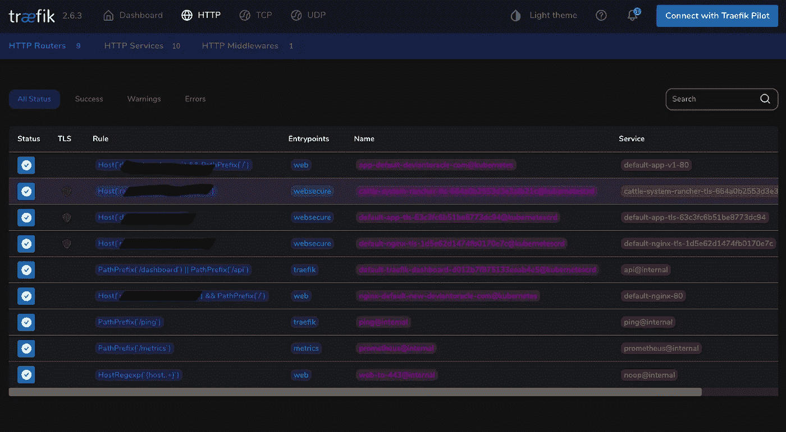****

****Traefik dashboard****

****一旦 Helm 安装了 Traefik，我们需要转到 Oracle 云控制台并进行一些更改。因为我们已经安装了 Traefik，Kubernetes 会自动检测到需要一个负载平衡器，并在 Oracle 中为我们设置一个。****

****让我们转到控制台[https://cloud.oracle.com/load-balancer/load-balancers?中的负载平衡器区域=英国-伦敦-1](https://cloud.oracle.com/load-balancer/load-balancers?region=uk-london-1)****

****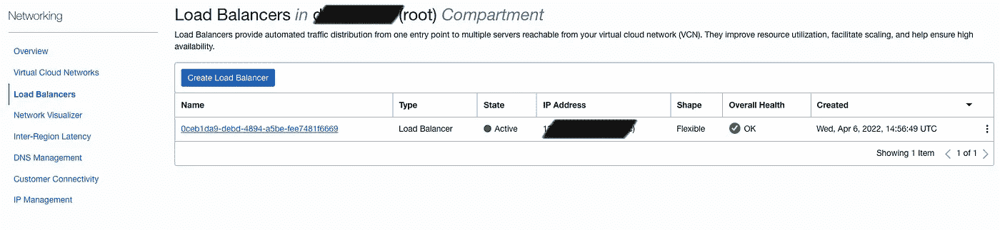****

****Load Balancer console****

****Oracle cloud 有一个永久免费层，为了确保在创建 Kubernetes 集群和配置负载平衡器时始终免费，请确保负载平衡器设置为 10mb/s 网络，而不是 100mb/s****

****通过单击详细视图上的更新形状按钮来更新负载平衡器形状，从而更改这一点。****

****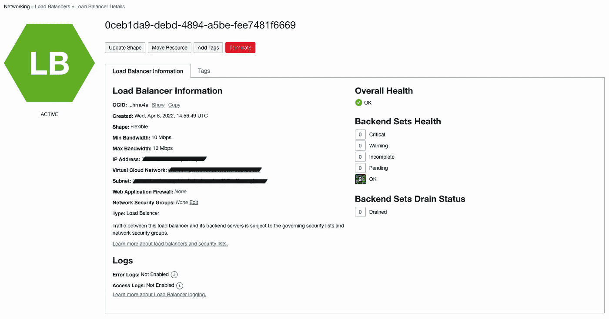****

****Load Balancer detail view****

****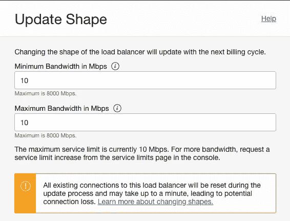****

****Update shape****

****我们现在还应该有一个负载平衡器的公共 IP 地址。浏览到这个 ip 地址应该显示 404 not found 错误，这意味着负载平衡器正在路由到 Traefik。****

# ****设置 Cloudflare****

****我们现在需要将我们的域指向我们新创建的负载平衡器。登录到 Cloudflare，创建一个指向我们的负载平衡器的公共 IP 地址的 A 记录。****

****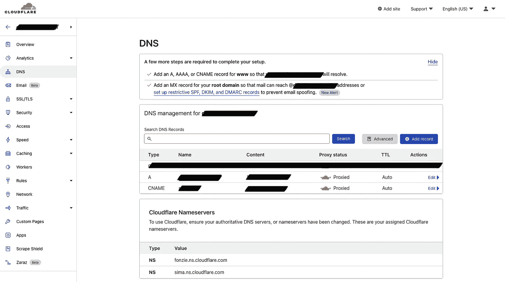****

****Cloudflare DNS****

****你可以建立一个指向牧场主的 CNAME 记录。<your domain="">我们稍后将需要它来访问牧场主界面。</your>****

****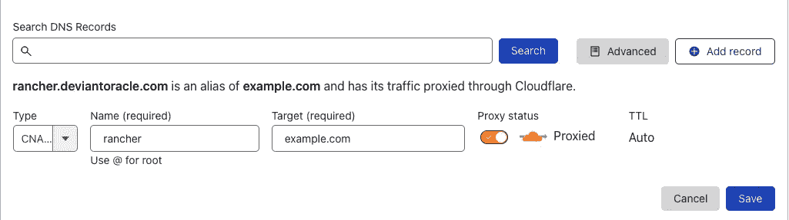****

****Cloudflare CNAME record****

> ****A 记录开始路由可能需要几分钟到 48 小时。对我来说，大约需要 2-5 分钟。****

********

******确保您为您的域打开 SSL/TLS 的完全(严格)模式**，否则当您在接下来的步骤中浏览到您的域时，您可能会得到一个错误，指出有许多重定向。****

# ****Whoami 应用程序****

****现在，为了测试我们的域和 Traefik 是否正常工作和路由，让我们在端口 80 上创建一个 whoami 应用程序，我们将使用我们的域来浏览它。****

****运行以下命令:****

```
**kubectl apply -f whoami.yml**
```

****在与 **whoami.yml** 相同的目录下运行，以部署我们的 whoami 应用程序。**确保用您的域名替换 example.com******

****whoami.yml****

****最后，使用 [w](https://gist.github.com/marcelo-ochoa/58b58b273b33ae44a11c0470d1895635) hoami-tls.yml 检查是否为我们的应用程序生成了 LetsEncrypt 证书****

```
**kubectl apply -f whoami-tls.yml**
```

****在与 **whoami-tls.yml** 相同的目录下运行，以部署我们的入口路由。**确保你用你的域名取代 example.com******

****whoami-tls.yml****

****当您浏览您的域名时，您应该会看到如下内容:****

****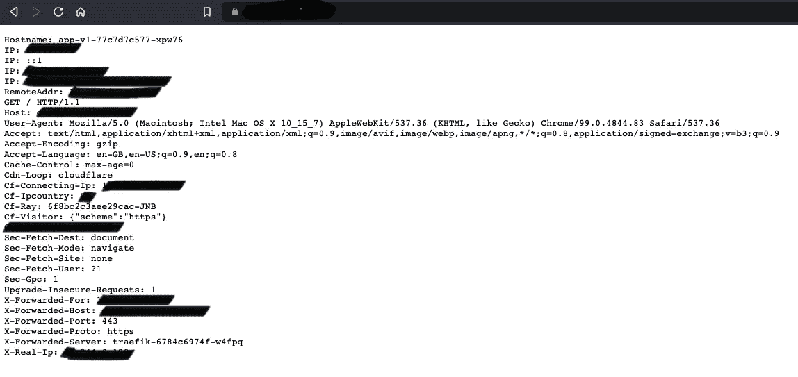****

****Whoami service****

****Traefik 现在正在为我们创建一个证书，因此我们现在有了安全的通配符 SSL 证书来支持我们的服务！****

# ****牧场主 Kubernetes 管理****

****Rancher 是为采用容器的团队提供的一个完整的软件栈。它解决了跨任何基础设施管理多个 Kubernetes 集群的运营和安全挑战，同时为 DevOps 团队提供了运行容器化工作负载的集成工具。****

****虽然我们可以从终端和 Kubernetes 仪表板单独管理 Kubernetes****

****Rancher 是一个直观的界面，为所有集群和集中式策略控制和监控提供单点联系。Rancher 使管理容器和集群变得非常容易。****

****与 Traefik 一样，我们将使用 helm 安装 Rancher，为此我们需要在 helm 中添加 rancher repo****

```
**helm repo add rancher-stable [https://releases.rancher.com/server-charts/stable](https://releases.rancher.com/server-charts/stable)
helm repo update**
```

****如果您遵循 Kubernetes 的 Ranchers 安装指南[的话，您有 3 个 SSL 配置选项，我们将使用的选项是不需要证书管理器的来自文件的证书选项](https://rancher.com/docs/rancher/v2.6/en/installation/install-rancher-on-k8s/)****

****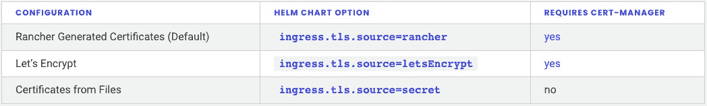****

****Rancher TLS Options****

****用 Helm 安装 rancher 并为 Rancher 创建一个名称空间****

```
**kubectl create namespace cattle-system**
```

******请确保您将主机名更改为您的域**[**rancher.example.com**](http://rancher.example.com)**，并确保您之前在 Cloudflare 中创建了一个 CNAME 条目。******

```
**helm install rancher rancher-latest/rancher \
  --namespace cattle-system \
  --set hostname=rancher.example.com \
  --set bootstrapPassword=admin \
  --set ingress.tls.source=secret**
```

******注意 bootstrapPassword=admin** 这会将 rancher 的初始密码设置为“ **admin** ”，但您需要更改密码。****

****检查部署的首次展示****

```
**kubectl -n cattle-system rollout status deploy/rancher**
```

****您应该看到以下输出，请耐心等待，这可能需要一两分钟的时间****

```
**Waiting for deployment "rancher" rollout to finish: 0 of 3 updated replicas are available...
Waiting for deployment "rancher" rollout to finish: 1 of 3 updated replicas are available...
Waiting for deployment "rancher" rollout to finish: 2 of 3 updated replicas are available...
deployment "rancher" successfully rolled out**
```

****不幸的是，如果你浏览到你的牧场主域名[https://rancher.example.com](https://rancher.example.com)，你会得到一个错误。这是因为没有 Traefik 指向 Rancher 域的 IngressRoute，并且证书无法正确解析。****

****运行以下命令:****

```
**kubectl apply -f rancher.yml**
```

****在与 **rancher.yml** 相同的目录中运行，以部署我们的 IngressRoute。**确保用你的域名替换 example.com******

****rancher-tls.yml****

****如果到目前为止一切都很成功，那么如果你浏览到你的[https://rancher.example.com](https://rancher.mydomain.com)你应该会看到牧场主开始运行了！****

****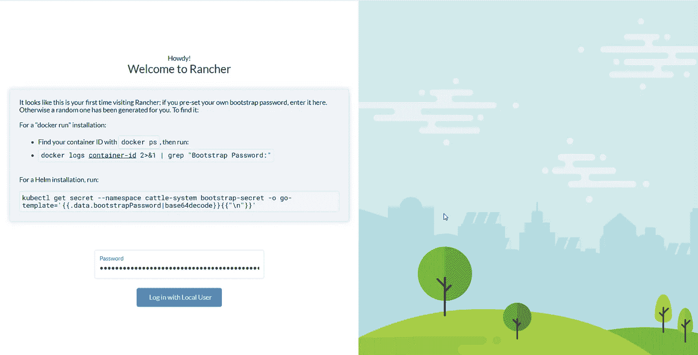****

****Rancher UI****

****一旦您登录并更改了密码，您应该会看到您的仪表板。一定要改成黑暗模式！****

****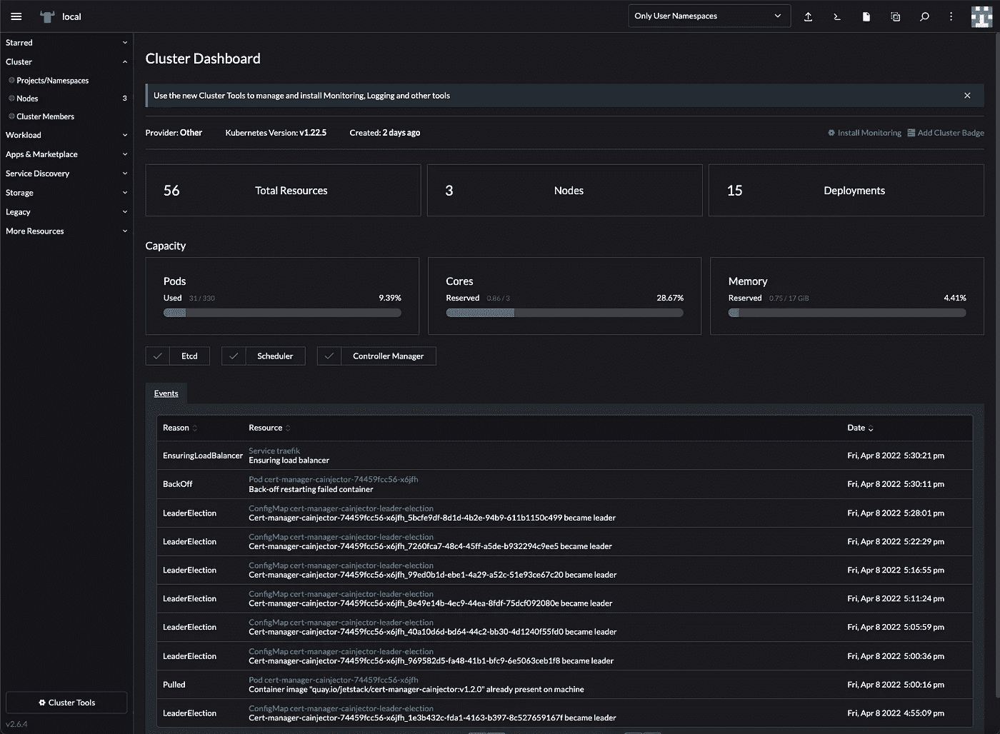****

****Rancher Admin Dashboard****

****现在我们可以开始使用 Rancher 作为我们的 Kubernetes 管理门户，允许我们轻松地运行容器和扩展服务！！****

# ****附加安全性****

****我们在互联网上公开了一些敏感的服务，我们可以使用 Cloudflare 的 **WAF (Web 应用防火墙)提供的一些额外的预防措施。**我们可以在这里添加一些规则，将我们的域名锁定到特定的 IP 地址、国家或所需的 Cookie。****

# ****结论****

****我知道一个相当长的帖子，配置很多！但是你现在已经为你的 Cloudlab 打下了良好的基础，最棒的是，它是完全免费的！****

*****Malcolm McMorran 是* [*流氓开发*](https://www.hooligan.co.za/) *的联合创始人兼首席技术官，这是一家提供按需开发的专业 OTT 软件开发公司。凭借超过 10 年的经验和可靠的跟踪记录，这些流氓已经成为应对复杂 VOD 和 OTT 挑战的最佳人选。*****