# 构造决策树的标准

> 原文：<https://medium.com/geekculture/criterion-used-in-constructing-decision-tree-c89b7339600f?source=collection_archive---------2----------------------->

## 熵、基尼不纯与信息增益

Photo by [Vladislav Babienko](https://unsplash.com/@garri?utm_source=unsplash&utm_medium=referral&utm_content=creditCopyText) on [Unsplash](https://unsplash.com/s/photos/decision-tree?utm_source=unsplash&utm_medium=referral&utm_content=creditCopyText)

决策树是通用机器学习算法，能够执行回归和分类任务，并具有处理复杂和非线性数据集的能力。他们的决定很容易理解。它们是通过基于数据集的一个特征和一组 if-then-else 决策规则在节点处进行分割而形成的。但是它使用什么标准在特定节点上进行分割呢？我们如何量化分裂的质量？为了回答所有这些问题，我们将研究 3 个重要标准，以及它们如何用于构建决策树。这些是

1.  熵
2.  基尼杂质
3.  信息增益

1。 ***熵:*** 熵代表随机的顺序。在决策树中，它通过测量分裂的纯度来帮助模型选择分裂的特征。如果，

1.  熵= 0 意味着它是纯分裂的，即所有实例都只属于一个类。

2.熵=1 意味着完全不纯的分裂，即在节点处两类的相等实例(50%–50%)导致极端无序。

熵(H *i* 由数学公式给出:

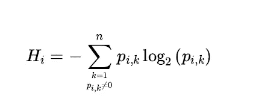

Source: Oreilly ‘s Hands-On machine learning with Scikit-learn, Keras & Tensor flow

其中， *p(i，k )* 是特定节点上正负类 *i* 的概率。

n =特定节点处不同类值的数量。

熵 H 的范围在 0-1 之间变化。

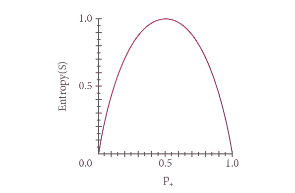

Source : Google

让我们通过在下面的例子中的一个节点进行快速计算来理解它:使用决策树分类器根据花瓣长度和宽度将鸢尾花分类为 3 类，决策树看起来像，

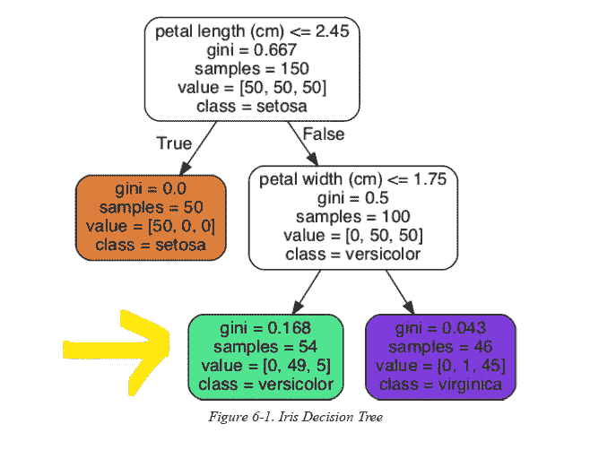

Source: Oreilly ‘s Hands-On machine learning with Scikit-learn, Keras & Tensor flow

对于深度为 2 的左节点，熵(H *i* )将为

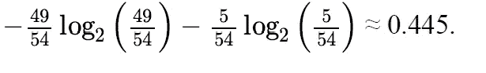

Credits : Oreilly ‘s Hands-On machine learning with Scikit-learn, Keras & Tensor flow

2。 ***基尼杂质:*** 它还计算决策树节点处的分裂纯度。在第 *i* 个节点处的基尼属性(G *i* )的数学方程由下式给出:

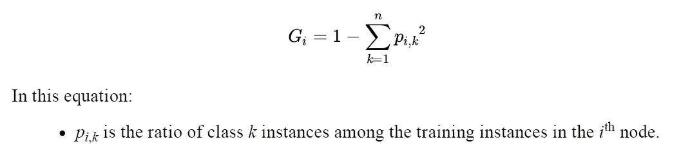

计算深度为 2 的左侧节点的 GI

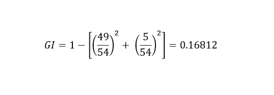

Source: Author

与熵不同，基尼系数在 0-0.5 之间变化。当 Gini 属性为 0 时，节点是纯的，即所有实例都属于同一类。

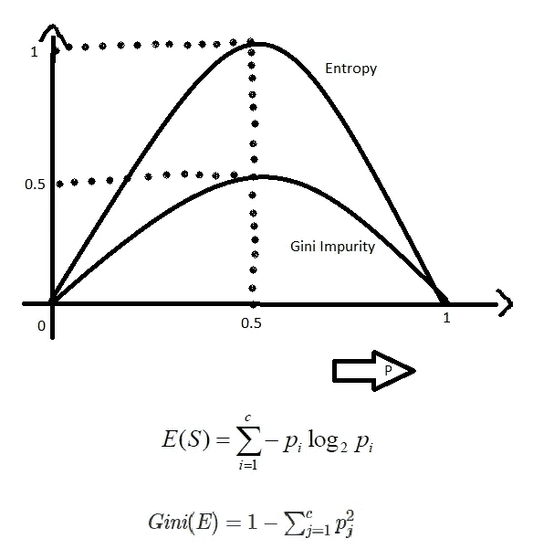

Source: Google

# **那么应该用熵还是基尼杂质呢？**

大多数情况下，它们不会产生太大的差异，它们会导致类似的树，但使用基尼系数的优势在于，与熵相比，基尼系数的计算更有效，因为熵涉及对数计算，需要更多的时间。

由于熵和 Gini 杂质是针对节点处的特定分裂计算的，但是为了构建完全生长的树，算法创建多个树，然后使用在每个节点处产生最大信息增益的特征和阈值来选择树。让我们理解什么是信息增益？

3。信息增益:表示在一个节点分裂时，熵被去除了多少。信息增益越高，移除的熵越多，因此在训练决策树期间，选择具有最大信息增益的最佳分裂。

信息增益的数学公式为:

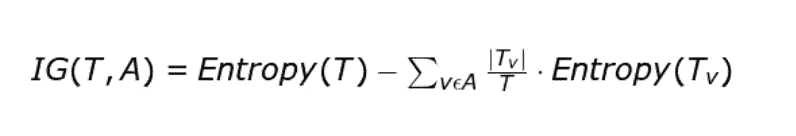

其中， ***IG*** 为信息增益，熵( ***T*** )为分裂前节点熵(父节点)，熵( ***Tv*** )为分裂后熵(子节点)。***T*** 是拆分前的实例总数， ***Tv*** 是拆分后的实例数。

对于上述示例，计算右侧分割的信息增益:

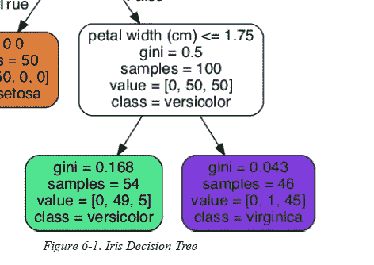

Source: Oreilly ‘s Hands-On machine learning with Scikit-learn, Keras & Tensor flow

父节点的熵:

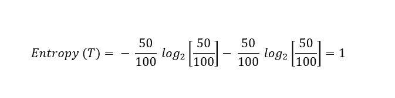

子节点的熵:

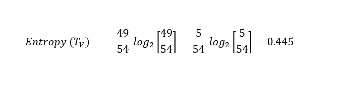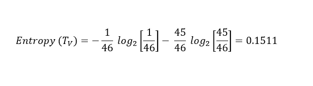

Credits: Author

所以，对于这种情况，**熵(T) =1，T= 100** ， ***熵(Tv) = 0.445 对于 Tv=54*** ， ***熵(Tv) = 0.1511 对于 Tv=46。*** *所以信息增益会，*

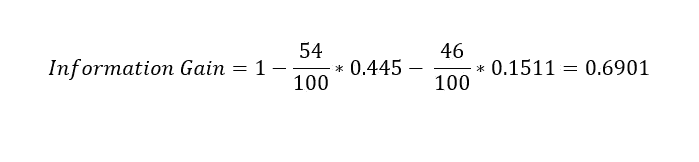

Credits: Author

所以这是关于建造完全成长的树的标准。谢谢你阅读它。快乐的数据驱动学习！！

参考资料:

1.  [https://scikit-learn.org/stable/modules/tree.html](https://scikit-learn.org/stable/modules/tree.html)
2.  O'Reilly Media，Inc .使用 Scikit-Learn、Keras 和 TensorFlow 进行机器学习。