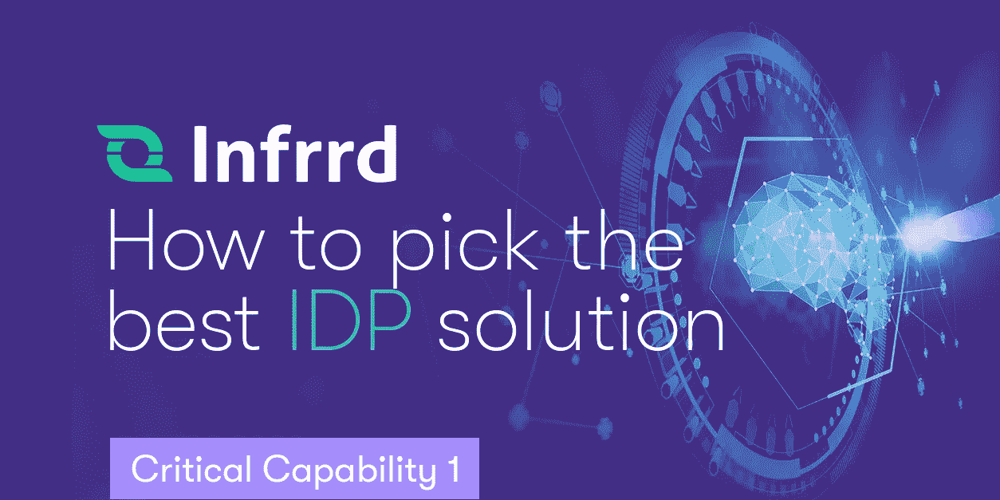

# 关键能力 1: IDP 建立在人工智能原生平台上

> 原文：<https://medium.com/geekculture/critical-capability-1-idp-is-built-on-an-ai-native-platform-9b1b79fe7d8d?source=collection_archive---------22----------------------->

AI 可以解决文档摄取过程中的大问题，但它需要正确的基础才能成功。这就是为什么知道你正在寻找的选项是否植根于人工智能原生平台如此重要。要成功实现和运营 AI，你需要为这些技术搭建一个平台。将一些人工智能技术放在传统的 OCR 平台上会产生你不想要的操作风险。

较老的 OCR 系统通常不是人工智能原生的。因此，他们缺乏充分利用人工智能技术的能力，而这些技术是你克服最顽固的文档处理问题所需要的。

***关键能力 1:AI-原生平台***

*人工智能原生平台允许 IDP 实现人工智能的全部商业价值*

*业务优势—提高准确性、性能、敏捷性和灵活性。*

# 人工智能原生平台利用人工智能的力量

选择人工智能原生平台可以让你驾驭人工智能的力量。人工智能原生平台不会与像 OCR 这样脆弱的遗留系统角力，而是确保解决方案在操作环境中工作，并在其整个生命周期中得到支持。这些平台旨在使用人工智能完成工作。

建立在人工智能原生平台上的 IDP 解决方案将能够利用最广泛的可用人工智能技术来自动化最具挑战性的文档处理工作。

*人工智能原生平台或“人工智能编排平台”允许您从人工智能技术中获得全部商业价值。由于它是专门为人工智能构建的，该平台允许您成功地使用人工智能技术来部署、维护和扩展智能系统，如 IDP。*

# 让技术为您服务

领先的 IDP 解决方案集成并协调多种人工智能技术，有时运行 15 种或更多人工智能模型，包括**机器学习**、**深度学习**、**自然语言处理、**和**计算机视觉**，以提供最高水平的性能和准确性。人工智能原生平台就是为了支持这种人工智能编排而构建的。

这不仅仅是关于最好的技术；而是让这项技术为你所用。操作 AI 并不等同于运行 OCR 这样的软件解决方案。AI-native 平台旨在**部署**、**运营**、**规模**、**维护**商业运营中的 AI 技术。

# 要问的问题

我们建议您深入挖掘提议的供应商和解决方案，以了解他们的架构和操作环境，以及如何协调和支持所使用的人工智能技术。

以下是向解决方案提供商提出的 5 个好问题:

**向供应商提出 5 个问题**

1.  IDP 解决方案是否建立在使用 AI 原生架构的平台上？
2.  该平台是否整合了多种人工智能技术——如机器学习、深度学习、自然语言处理和计算机视觉——来从非结构化文档中准确提取数据？
3.  当你的解决方案投入运行时，会有多少人工智能模型在运行？将使用什么类型的算法？
4.  如何操作和维护解决方案，以确保人工智能组件得到优化？
5.  你正在做什么来支持人工智能的特定需求？

# 获得商业利益

人工智能原生平台将在更广泛的文档集中提供最高的提取准确性。它还有助于确保人工智能技术在企业运营环境中工作，并可以得到维护和优化。您将实现更多的自动化，获得更高的流程性能，并降低处理成本。

例如:帝国公司

Empire company 部署了一个智能文档处理解决方案，目标是从包含嵌套表的发票中自动提取数据。这种程度的文档复杂性要求解决方案使用多种人工智能技术。

不幸的是，Empire 的 IDP 解决方案建立在一个不完全支持其使用的人工智能技术的平台上。虽然它以可接受的准确性部署到生产中，但它从未能够随着时间的推移学习和改进其性能。

这意味着 Empire 无法实现发票流程的自动化，导致客户体验不佳，处理成本飙升。最终，该解决方案被淘汰，该流程恢复为手动数据提取。

# 一个 AI 原生架构是什么样子的？

当你试图将人工智能分层到为传统软件工程方法构建的系统(例如，OCR 系统)中时，问题就出现了。传统系统背负着技术债务，这将导致部署基于人工智能的解决方案的实施和基础设施复杂性。

传统的软件系统可能有缓慢的开发周期、脆弱的过程、单一的平台、严格的点对点接口依赖和重复的数据工作。

相反，您需要具有人工智能原生架构的 IDP 解决方案，这是框架和运营模式中的基本元素。

# AI-native IDP 解决方案会有什么不同？

与为软件构建的解决方案或以人工智能为相邻组件的解决方案相比，人工智能原生解决方案将具有独特的功能。

AI-Native IDP 解决方案的独特功能

复合人工智能。它将使用复合人工智能方法，集成不同的人工智能技术，用单一的 IDP 解决方案来解决问题。

可扩展。它将集成支持可扩展性的数字技术、计算基础设施和流程工作流。

高性能。它将利用 GPU 等计算加速的人工智能平台，提供最先进的人工智能功能和性能。

适应性和弹性。它将不断学习并适应业务环境和流程的变化。

学习提高。它将支持人工智能学习和持续改进。

# 为什么人工智能原生平台是一项关键能力？

运营人工智能对任何人工智能系统都是一个挑战，不仅仅是 IDP。

如果您的组织不能很好地利用 IDP，那么它就不值得花费时间、金钱和精力。

然而，许多企业都在与人工智能作斗争。根据询问和调查，Gartner 估计，近 50%的人工智能项目无法投入生产。

人工智能原生平台有助于人工智能的工作。

这就是为什么我们建议你考虑一个人工智能原生平台作为一个关键能力。

# 关键要点

IDP 解决方案仅提供高精度是不够的。您需要一个能够提供商业价值和最先进的人工智能功能的系统。您需要一个人工智能原生平台，该平台旨在:

**外卖**

将人工智能扩展到生产中，不仅仅是几个模型，而是 IDP 系统使用的一系列模型。

提供生产工作流、技术和服务交付的运营弹性和效率。

具有弹性，接受文档、数据和模型上下文的频繁变化。

帮助最小化风险和技术复杂性，同时最大化团队生产力。

人工智能原生平台可以帮助您获得人工智能技术的全部价值，因此您可以部署它，以可扩展、可管理的方式操作它，并从人工智能中产生真正的价值。它使您的过程转换成为可能。

*这是关于智能文档处理解决方案关键能力的 11 篇系列文章中的第 2 篇。*

下载我们的白皮书，其中解释了针对 IDP 解决方案的[关键能力](https://www.infrrd.ai/whitepaper/idp-critical-capabilities)。

*原发布于*[*https://www . infrrd . ai*](https://www.infrrd.ai/blog/idp-is-built-on-an-ai-native-platform)*。*