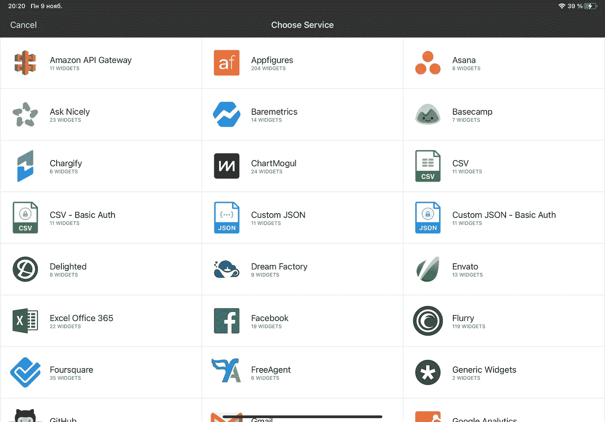
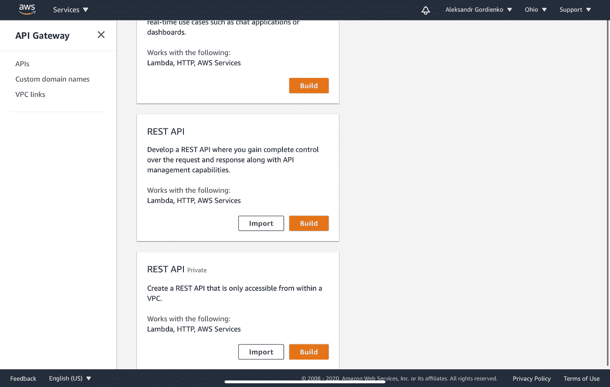
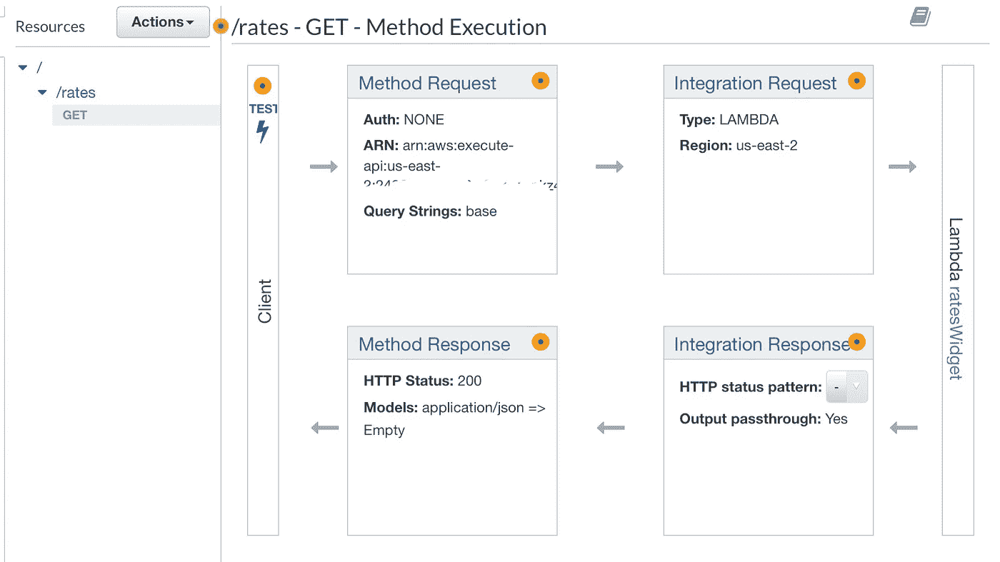
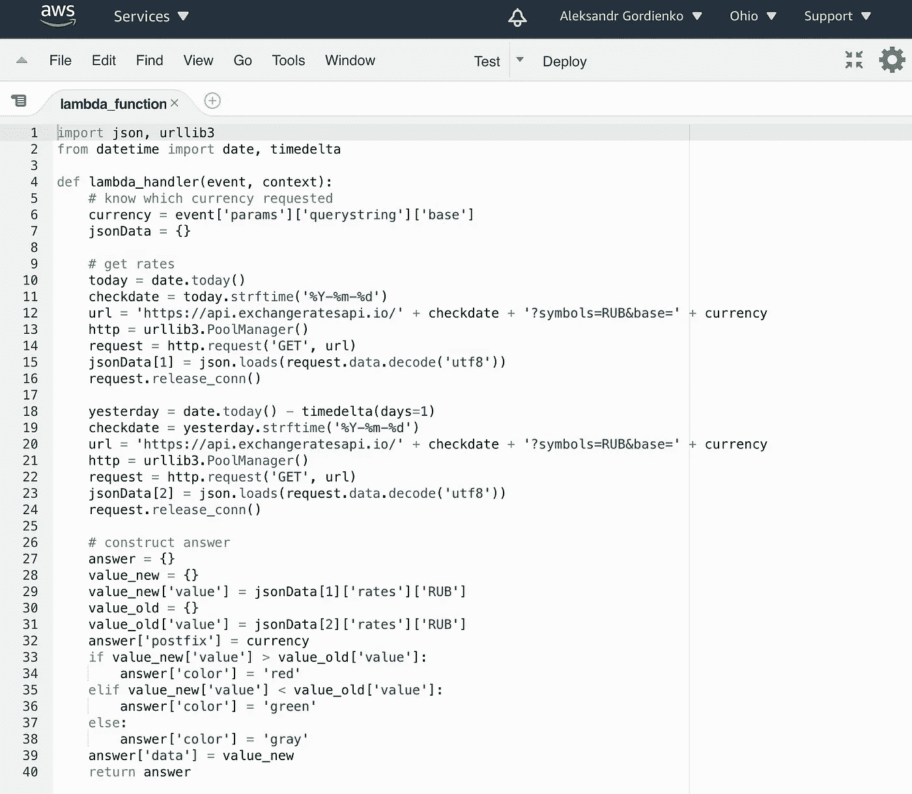
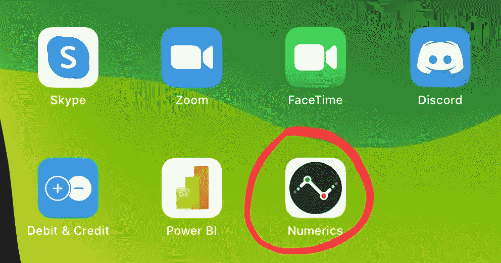
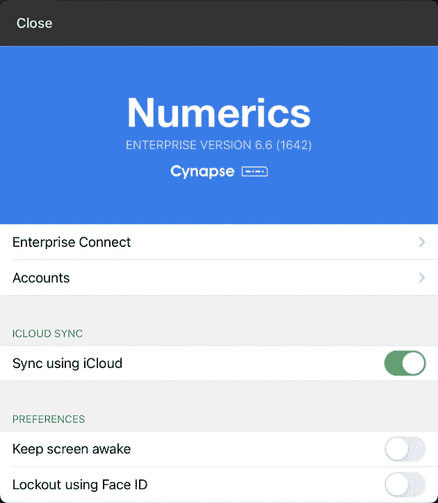
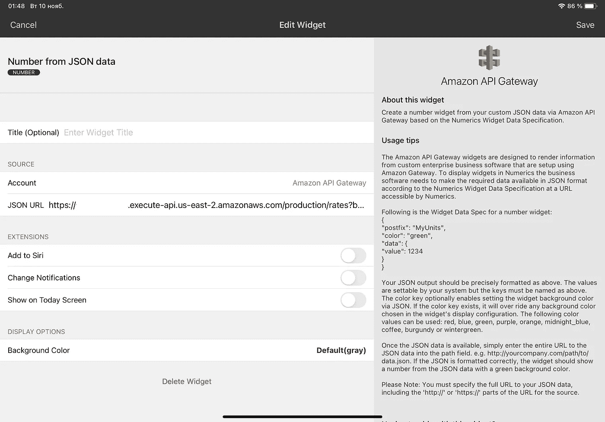
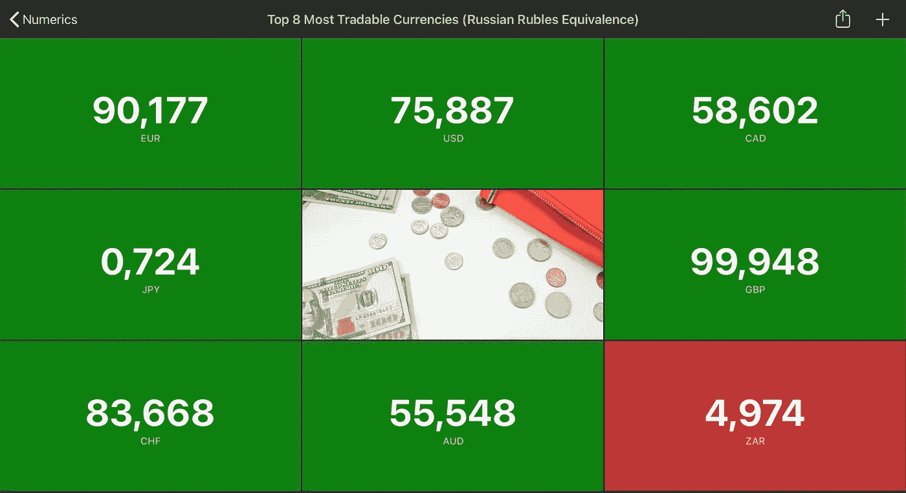
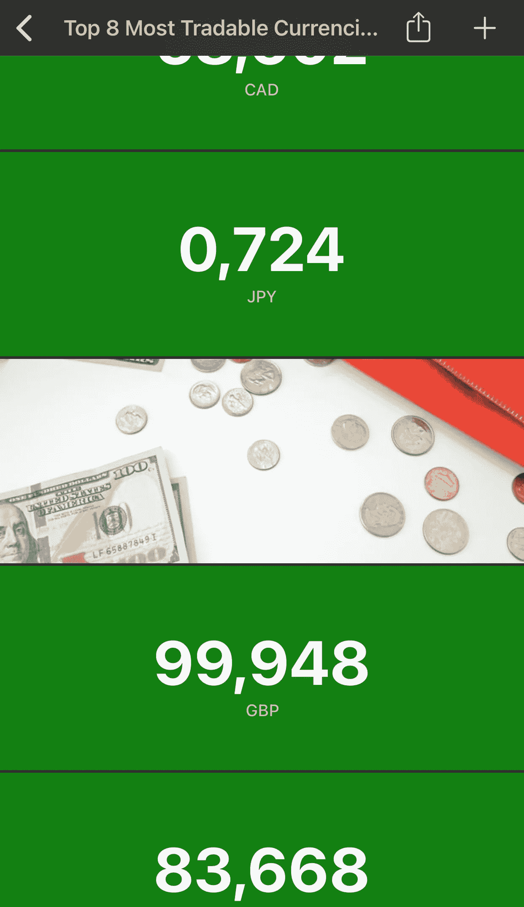

# 关键数据触手可及

> 原文：<https://medium.com/geekculture/critical-data-at-your-fingertips-8a47baf087d5?source=collection_archive---------1----------------------->

您多久会梦想一款原生 iOS 工具，能够以简单快捷的方式可视化您公司的重要数据？

如果你问我，答案是——在我发现 Cynapse 的数字应用程序之前的每一天。但首先要做的是。

先说真正的任务。我收到一个客户的请求，要求我用从 open API 收集的数据创建一个新的仪表板。它必须提供有关 8 大世界可交易货币的价格信息，价格必须以俄罗斯卢布显示。这里托管的源数据:[https://exchange ratesapi . io](https://exchangeratesapi.io)。我们的客户将在不同的 iOS 设备(手表、电视和 iPads)上监控这些指标。他们不想为这样的小项目购买新硬件或租用 VPC。此外，他们希望以最少的后端服务成本快速构建控制面板。

我们建立了一个基于 AWS 服务的后端解决方案，Numerics 是我们的前端(仪表板)。我们使用 AWS API Gateway 进行路由查询，使用 Lambda 函数进行 JSON 转换，以满足 Numerics 小部件规范。[正如你记得的](/swlh/aws-lambda-run-your-code-for-free-1c7fa6714ee9)，如果你的项目符合免费层条件，你可以免费使用许多 AWS 服务。

这里是数字的[官方文档](https://cynapse.com/docs/numerics/)。如您所见，在 Numerics 中，我们有许多方法将数据源连接到我们的仪表板:

我们的客户要求获取定制的 JSON 数据，因此我们可以为此使用定制的 JSON 连接器或 AWS API 网关连接器。由于我们需要一个用于仪表板的私有 API，我们决定使用带有 API 密钥的 AWS API Gateway。要构建相同的解决方案，您应该在 AWS 控制台上转到 API Gateway 并选择“Create API”。向下滚动到 REST API，然后按“Build”:

输入新 API 的名称，离开区域端点。然后，您可以为 API 选择授权类型。它可以是查询头中的一个简单的 API 键，也可以是一个特殊的 Lambda 函数，作为一个授权器。

转至“资源”,通过“活动”按钮创建一个新资源。选择一个友好的名称，作为访问我们功能的网址的一部分，例如“/rates”。切换到新的资源，创建一个新的 GET-method，不要忘记输入 Lambda 函数名，当访问“/rates”API 资源时，您计划调用这个函数。

转到 GET-method 图并点击 Method Request。您必须在此处将 API Key Required 参数设置为“true”，这将保护您的 API 资源不被陌生人频繁执行，这可能会导致额外的金钱支出。您还可以添加一个 URL 查询字符串参数，用于区分来自仪表板的请求，即对于不同的货币，Lambda 函数将返回不同的结果。

添加的参数可以简单地在 Lambda 中作为字典的元素使用。您可以转到“集成请求”并设置映射模板。要映射所有最近创建的方法参数，请为请求正文传递选择“当没有定义模板时(推荐)”。添加带有 application/json 内容类型的映射模板，并生成模板“方法请求直通”或编写您自己的直通模板。

使用操作按钮部署 API。选择要部署的阶段或创建新的阶段。通常有几个最常见的阶段:开发、测试和生产。如果需要，调整它们的参数。

为访问您的 web 服务和使用计划创建一个新的 API 密钥。稍后将需要密钥来配置 Numerics 小部件。

是时候写一些代码了。用自己喜欢的编程语言，也就是 Python。用 Lambda 编写自己的数据转换逻辑。您可以通过访问**事件['params']['querystring']** 字典来读取 URL 查询字符串参数。这里有一个例子:

创建 Lambda 函数后，您就可以轻松地设置一个新的仪表板了。从 App Store 下载应用程序，如果你以前没有。点击“I”按钮(屏幕左上角):

您应该进行订阅，以便能够在仪表板中设置多个仪表板或三个以上的小部件。要连接您的企业订阅，请使用菜单中的第一项—企业连接。最好现在就打开 iCloud sync，这样您就可以在连接到同一个 Apple ID 的所有设备之间共享您的许可证。

下一步是创建一个新的仪表板，使用右上角的“+”按钮并输入任何名称。通过选择连接器列表下的 Amazon API Gateway 来添加您的第一个小部件。在 API Gateway 部分选择“Number from JSON data ”,为新帐户使用您的 API 密钥——它将放在 GET-request to backend 的标题中:

按照客户的要求，我们需要组合 8 种货币的信息，将它们全部添加到仪表板中。为此，我使用了具有不同方法参数的相同 Lambda 函数。此外，我将图像放在仪表板的中心。这是 iPad 上的最终视图:

iPhone 上的同一个仪表盘:

